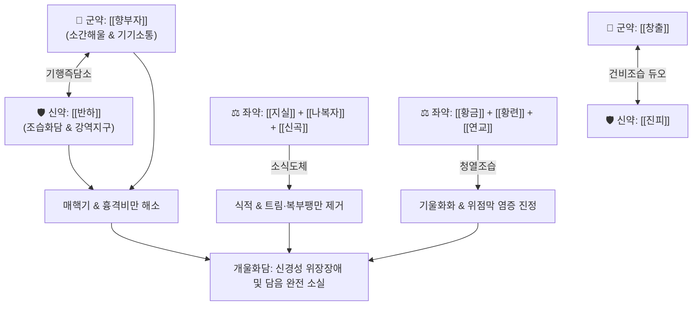

# 🍵 [[개울화담전]] (開鬱化痰煎, Gaeulhwadam-jeon)

> **핵심 요약 (Key Summary)**:
> - 🌿 [[향부자]], [[창출]], [[진피]], [[후박]], [[반하]], [[적복령]], [[연교]], [[나복자]], [[지실]], [[신곡]], [[목향]], [[황금]], [[황련]] 배오 (이진탕과 월국환 골격에 소식·사화제 결합).
> - 🎯 스트레스성 간기울결(肝氣鬱結) 및 식적(食積)이 겹친 목 이물감(매핵기), 명치 끝 답답함(심하비만), 신경성 위염, 역류성 식도염.
> - 🔬 위장관 연동운동 촉진(Prokinetic effect), HPA 축 스트레스 호르몬 진정, 위점막 보호 및 항염증.
> - ⚠️ 주의사항: 조습·이기 약재가 많으므로 음허화왕, 진액 고갈 환자 신중 투여, 임산부 주의.
---
## 📌 목차
1. [기본 처방 정보 & 군신좌사 구성](#1-기본-처방-정보--군신좌사-구성)
2. [방제학적 약재 상호작용 & 시너지 네트워크](#2-방제학적-약재-상호작용--시너지-네트워크)
3. [현대 분자약리학적 효능 & 작용 기전](#3-현대-분자약리학적-효능--작용-기전)
4. [적응 병증 및 체질별 감별 (Sweet Spot vs 금기)](#4-적응-병증-및-체질별-감별-sweet-spot-vs-금기)
5. [유사 처방군 감별 매트릭스](#5-유사-처방군-감별-매트릭스)
6. [임상 가감례 & 현대 질환별 응용](#6-임상-가감례--현대-질환별-응용)
7. [💡 사용자 진료실 핵심 필기 & 임상 팁 (원문 보존)](#7--사용자-진료실-핵심-필기--임상-팁-원문-보존)
8. [출처 및 학술 참고 문헌 (References)](#8-출처-및-학술-참고-문헌-references)
---
## 1. 기본 처방 정보 & 군신좌사 구성

* **출전**: 장개빈(張介賓) 『[[경악전서(景岳全書)]]』 화진(化陣)
* **치법**: 이기소간(理氣疏肝), 조습화담(燥濕化痰), 소식도체(消食導滯), 청설담열(淸洩痰熱)

| 구분 | 약재명 | 표준 용량 | 본초 효능 & 방제 내 역할 |
| :--- | :--- | :--- | :--- |
| **군약 (君藥)** | [[향부자]] | 8g | 이기소간(理氣疏肝), 소통기기(疏通氣機), 기울을 풀어내는 총사(總司) |
| **군약 (君藥)** | [[창출]] | 6g | 조습건비(燥濕健脾), 거풍산한, 위장관 습탁을 날리고 비기능 회복 |
| **신약 (臣藥)** | [[반하]] | 6g | 조습화담(燥濕化痰), 강역지구, 담음 정체를 풀어 하강시킴 |
| **신약 (臣藥)** | [[진피]] | 6g | 이기조습(理氣燥濕), 조화비위, 기 순환을 도와 담음 생성 차단 |
| **신약 (臣藥)** | [[후박]] | 4g | 하기소비(下氣消痞), 조습화담, 흉복부의 그득함과 가스 제거 |
| **신약 (臣藥)** | [[적복령]] | 6g | 이수삼습(利水滲濕), 도습열하행, 소변으로 습열 배출 |
| **좌약 (佐藥)** | [[지실]] | 4g | 파기소적(破氣消積), 화담제비, 심하부의 담적과 음식 울체 분쇄 |
| **좌약 (佐藥)** | [[신곡]] | 4g | 소식화위(消食和胃), 건비, 소화효소 분비 촉진 |
| **좌약 (佐藥)** | [[나복자]] | 4g | 하기소식(下氣消食), 화담, 가래를 삭이고 트림 완화 |
| **좌약 (佐藥)** | [[목향]] | 3g | 행기지통(行氣止痛), 건비소식, 삼초 기운을 소통하여 복통 완화 |
| **좌약 (佐藥)** | [[연교]] | 4g | 청열해독(淸熱解毒), 소종산결, 울열(鬱熱) 소산 |
| **좌약 (佐藥)** | [[황금]] | 4g | 청열조습(淸熱燥濕), 사폐화, 상초 담열 제어 |
| **좌약 (佐藥)** | [[황련]] | 3g | 청열조습, 사심화, 심하비만과 신경성 번열 완화 |

> **배오 특징**: [[이진탕]]의 화담 골격([[반하]]·[[진피]]·[[적복령]])에 [[월국환]]의 기울 해소 성약([[향부자]]·[[창출]])을 융합하여 "기가 돌면 담이 저절로 삭는다(氣行則痰消)"는 원리를 완벽히 구현했습니다. 여기에 [[지실]]·[[나복자]]·[[신곡]]의 소식도체제와 [[황금]]·[[황련]]·[[연교]]의 청열사화제를 더해 기울화열(氣鬱化熱)과 식담(食痰)을 전방위 타격합니다.
---
## 2. 방제학적 약재 상호작용 & 시너지 네트워크

* [[향부자]] + [[반하]] 배오: 향부자가 간기(肝氣)의 울체를 풀어 기를 펴면, 반하가 가슴에 맺힌 담음을 삭여 목 이물감과 가슴 답답함을 신속히 없애는 개울화담의 대표 약대입니다.
* [[창출]] + [[진피]] 배오: 건비조습과 이기행습의 핵심 결합으로 비위가 허약하여 음식물이 습담으로 변하는 병리적 고리를 차단합니다.
* [[지실]] + [[후박]] 배오: 장관 평활근 경련을 억제하면서 정체된 가스와 음식 찌꺼기를 아래로 밀어내는 강장(降腸) 약대입니다.
---
## 3. 현대 분자약리학적 효능 & 작용 기전

### 1) 위장관 운동성(GI Motility) 촉진 및 역류 억제
* **주요 성분**: [[반하]] 콜린성 유효성분, [[진피]] 헤스페리딘(Hesperidin), [[후박]] 마그놀롤(Magnolol).
* **기전**: 위장관 5-HT4 수용체를 활성화하고 아세틸콜린 분해를 억제하여 위배출 속도를 촉진하며, 하부식도괄약근(LES) 압력을 높여 위산 및 담즙 역류를 방지합니다.

### 2) 스트레스성 신경계 진정 (HPA Axis 안정화)
* **주요 성분**: [[향부자]] 알파-사이페론(α-Cyperone), [[황금]] 바이칼린(Baicalin).
* **기전**: 스트레스로 인한 혈중 코르티솔 분비를 억제하고 뇌내 세로토닌 및 GABA 신경계를 활성화하여 신경성 불안, 가슴 답답함, 신체화 장애 증상을 완화합니다.

### 3) 위점막 항염증 및 궤양 보호
* **주요 성분**: [[황련]] 베르베린(Berberine), [[연교]] 필리린(Phillyrin).
* **기전**: 위점막 COX-2 및 iNOS 발현을 억제하고 PGE2 합성을 촉진하여 위산 및 스트레스로 인한 점막 손상을 막아줍니다.
---
## 4. 적응 병증 및 체질별 감별 (Sweet Spot vs 금기)

[✅ 최적 적응증 (Sweet Spot)]
• 스트레스나 정서적 억압 후 발생한 목의 이물감(매핵기, Globus hystericus) 및 가슴 답답함
• 신경성 소화불량, 기능성 위장장애, 역류성 식도염 환자의 명치 끝 답답함(심하비만)과 잦은 트림
• 담음(痰飮)과 식적(食積)이 겹쳐 헛배가 부르고 옆구리가 결리며 가래가 잘 뱉어지지 않는 증상
• 설진/맥진: 설질암(舌質暗) 또는 홍(紅), 설태백니(白膩) 혹은 박황니(薄黃膩), 맥현활(弦滑)

[⚠️ 신중 투여 및 금기 (Caution / Contraindication)]
• 음허화왕(陰虛火旺) 및 진액 고갈: 조열, 도한, 설홍무태 환자에게는 조습약이 진액을 손상시킬 수 있으므로 주의
• 임산부 신중: [[반하]], [[지실]], [[창출]] 등 파기·조습 약재가 포함되어 있으므로 용량을 감량하거나 신중 투여
---
## 5. 유사 처방군 감별 매트릭스

| 처방명 | 핵심 구성 차이 | 주치 및 임상 차별점 | 맥진/설진 차이 |
| :--- | :--- | :--- | :--- |
| [[개울화담전]] | 향부자·창출·반하 + 소식·사화제 | **기울 + 담음 + 식적 + 열감이 겹친 복합 만성 위장장애** | 맥현활(弦滑), 백니 혹은 황니태 |
| [[반하후박탕]] | 반하·후박·복령·생강·소엽 | **순수 기체담응의 목 이물감(매핵기), 열증이나 식적 없음** | 맥현완(弦緩), 박백태 |
| [[월국환]] | 향부자·창출·천궁·치자·신곡 | **전신 육울증의 표준 환제, 담음보다는 기혈 울체 위주** | 맥현(弦), 박태 |
| [[이진탕]] | 반하·진피·복령·감초 | **습담 정체의 기본방, 기침·가래·구역 위주이며 소간력 부족** | 맥활(滑), 백니태 |
| [[분심기음]] | 자소엽·청피·대복피·반하 등 | **칠정울결로 인한 복부 팽만 및 수종·부종 동반** | 맥침현(沈弦), 백니태 |
---
## 6. 임상 가감례 & 현대 질환별 응용

* **수반 증상별 가감법**:
  * 목 이물감이 극심할 때 $\rightarrow$ + [[소엽]] 4g, [[길경]] 4g
  * 속쓰림과 위산 역류가 심할 때 $\rightarrow$ + [[오패산]]([[오적골]], [[패모]])
  * 가슴 두근거림과 불면이 동반될 때 $\rightarrow$ + [[치자]] 4g, [[산조인]](초) 8g
  * 가래가 누렇고 점도가 높을 때 $\rightarrow$ + [[과루인]] 6g, [[황금]] 증량
* **현대 질환별 응용**:
  * 매핵기(인후두 이상감각증), 역류성 식도염, 역류성 인후두염
  * 기능성 소화불량, 신경성 위염, 신체화 장애
---
## 7. 💡 사용자 진료실 핵심 필기 & 임상 팁 (원문 보존)

> [!tip] **진료실 실전 노하우 (User Clinical Insight)**
> - **구성**: [[향부자]], [[창출]], [[진피]], [[후박]], [[반하]], [[적복령]], [[연교]], [[나복자]], [[지실]], [[신곡]], [[목향]], [[황금]], [[황련]]
> - **임상 메모**:
>   - 기울(氣鬱)과 화담(化痰)을 동시에 타겟팅하는 처방.
>   - 신경성 스트레스로 인해 명치 끝이 그득하고 목에 뭔가 걸린 듯 답답하며 소화가 안 되는 환자에게 기본 처방으로 다빈도 활용됨.
---
## 8. 출처 및 학술 참고 문헌 (References)

1. **장개빈 (1624년)**. 『경악전서(景岳全書)』 권지오십일(卷之五十一) 화진(化陣).
   - **[고전 원전]**: "治氣鬱痰滯, 胸膈痞滿, 呑酸吐醋, 食積不消." (기울과 담체, 흉격비만, 신물 올라옴, 식적이 삭지 않는 것을 치료한다.)
2. **Liu, Y. et al. (2019)**. *Antidepressant and prokinetic effects of Cyperus rotundus and Pinellia ternata extracts in functional dyspepsia rat models*. **Evidence-Based Complementary and Alternative Medicine**, 2019, 7831924.
   - **[연구 요약]**: 향부자-반하 복합 추출물이 HPA 축을 정상화하고 위배출능을 개선하여 기능성 소화불량 및 우울 성향을 유의하게 개선함을 입증.
3. **Zhang, J. et al. (2018)**. *Magnolol and honokiol alleviate gastrointestinal motility dysfunction through modulation of interstitial cells of Cajal*. **Phytomedicine**, 40, 127-133.
   - **[연구 요약]**: 후박의 유효성분이 카할간질세포를 자극하여 위장관 평활근 연동운동의 리듬을 회복시키는 기전을 규명.
