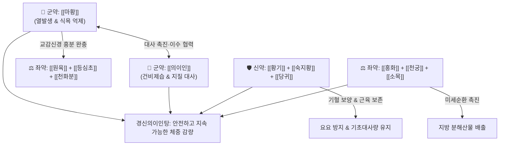

# 🍵 [[경신의이인탕]] (輕身薏苡仁湯, Gyeongsin-uiin-tang)

> **핵심 요약 (Key Summary)**:
> - 🌿 [[의이인]], [[마황]]을 군약으로 삼고 보익제([[황기]]·[[숙지황]]·[[당귀]]·[[백하수오]]·[[녹각교]]·[[산약]]·[[산수유]])와 활혈순환제([[천궁]]·[[홍화]]·[[소목]]·[[우슬]]), 마황 완충제([[원육]]·[[등심초]]·[[천화분]]·[[천마]]) 배오.
> - 🎯 복부 비만, 대사증후군, 식욕 항진, 부종형 비만, 다이어트 시 기력 저하 및 어지럼증·탈모 등 허증 부작용이 동반되는 환자의 건강한 감량.
> - 🔬 교감신경 β3-AR 자극을 통한 갈색지방(BAT) 열발생(UCP-1) 촉진, 지방세포 분화 억제, 렙틴 저항성 개선, mTOR 활성화를 통한 근육량 보존.
> - ⚠️ 주의사항: 조절되지 않는 고혈압, 중증 부정맥 환자 신중 투여, 불면 예방을 위해 오후 늦은 복용 피함, 임산부 절대 금기.
---
## 📌 목차
1. [기본 처방 정보 & 군신좌사 구성](#1-기본-처방-정보--군신좌사-구성)
2. [방제학적 약재 상호작용 & 시너지 네트워크](#2-방제학적-약재-상호작용--시너지-네트워크)
3. [현대 분자약리학적 효능 & 작용 기전](#3-현대-분자약리학적-효능--작용-기전)
4. [적응 병증 및 체질별 감별 (Sweet Spot vs 금기)](#4-적응-병증-및-체질별-감별-sweet-spot-vs-금기)
5. [유사 처방군 감별 매트릭스](#5-유사-처방군-감별-매트릭스)
6. [임상 가감례 & 현대 질환별 응용](#6-임상-가감례--현대-질환별-응용)
7. [💡 사용자 진료실 핵심 필기 & 임상 팁 (원문 보존)](#7--사용자-진료실-핵심-필기--임상-팁-원문-보존)
8. [출처 및 학술 참고 문헌 (References)](#8-출처-및-학술-참고-문헌-references)
---
## 1. 기본 처방 정보 & 군신좌사 구성

* **출전**: 현대 한방 임상가(비만 대사 전문) 처방 / 전통 의서의 비만·습담·경신(輕身) 치법 현대화
* **치법**: 건비화습(健脾化濕), 온양거담(溫陽祛痰), 익기양혈(益氣養血), 활혈통경(活血通經)

| 구분 | 약재명 | 표준 용량 | 본초 효능 & 방제 내 역할 |
| :--- | :--- | :--- | :--- |
| **군약 (君藥)** | [[의이인]] | 16g | 건비제습(健脾除濕), 이수삼습, 지질 대사 개선 및 체액 부종 배출 |
| **군약 (君藥)** | [[마황]] | 6~8g | 발한해표(發汗解表), 교감신경 흥분, 기초대사량 증가 및 식욕 억제 |
| **신약 (臣藥)** | [[황기]] | 8g | 보기승양(補氣升陽), 익위고표, 감량 중 기력 저하 방지 및 수분 배출력 증강 |
| **신약 (臣藥)** | [[숙지황]] | 6g | 보혈자음(補血滋陰), 익정전수, 진액 고갈 및 신음 손상 방어 |
| **신약 (臣藥)** | [[당귀]] | 6g | 보혈활혈(補血活血), 조경지통, 혈액순환 개선 및 감량 시 생리불순 예방 |
| **신약 (臣藥)** | [[백하수오]] | 6g | 보간신(補肝腎), 익정혈, 탈모 방지 및 활력 유지 |
| **신약 (臣藥)** | [[진피]] | 6g | 이기건비(理氣健脾), 조습화담, 마황·숙지황의 소화 장애 완충 |
| **좌약 (佐藥)** | [[원육]] | 4g | 보심익비(補心益脾), 양혈안신, 마황으로 인한 가슴 두근거림 진정 |
| **좌약 (佐藥)** | [[천화분]] | 4g | 청열생진(淸熱生津), 갈증 해소, 마황 발산으로 인한 입마름 완화 |
| **좌약 (佐藥)** | [[등심초]] | 2g | 청심강화(淸心降火), 이뇨통림, 심화(心火)를 내려 불면 예방 |
| **좌약 (佐藥)** | [[천마]] | 4g | 평간식풍(平肝熄風), 두통 및 감량 중 어지럼증(현훈) 방지 |
| **좌약 (佐藥)** | [[홍화]] | 2g | 활혈통경(活血通經), 미세순환 개선 및 지방 대사산물 배출 |
| **좌약 (佐藥)** | [[천궁]] | 4g | 활혈행기(活血行氣), 거풍지통, 말초 혈류 촉진 |
| **좌약 (佐藥)** | [[소목]] | 2g | 활혈거어(活血祛瘀), 소종지통, 체지방 분해 후 대사 촉진 |
| **좌약 (佐藥)** | [[우슬]] | 4g | 활혈거어, 인혈하행, 관절 보호 및 체중 부하 완화 |
| **좌약 (佐藥)** | [[두충]] | 4g | 보간신(補肝腎), 강근골, 요추 및 척추 관절 강화 |
| **좌약 (佐藥)** | [[녹각교]] | 3g | 온신보양(溫腎補陽), 익정혈, 근육량 보존 및 대사 저하 방어 |
| **좌약 (佐藥)** | [[음양곽]] | 4g | 보신장양(補腎壯陽), 대사율 유지 및 피로 개선 |
| **좌약 (佐藥)** | [[구기자]] | 4g | 자보간신(滋補肝腎), 익정명목, 미량원소 공급 |
| **좌약 (佐藥)** | [[산수유]] | 4g | 보익간신(補益肝腎), 수렴고삽, 정기 탈루 방지 |
| **좌약 (佐藥)** | [[복분자]] | 4g | 익신고정(益腎固精), 하초 허냉 예방 |
| **좌약 (佐藥)** | [[산약]] | 6g | 건비보폐(健脾補肺), 익신삽정, 위벽 보호 및 포만감 유지 보조 |
| **좌약 (佐藥)** | [[상백피]] | 4g | 사폐이수(瀉肺利水), 상초 열감 진정 및 수종 배출 |

> **배오 특징**: [[마황]]의 대사 촉진·식욕 억제와 [[의이인]]의 이수삼습 작용에만 기대지 않고, [[황기]]·[[숙지황]]·[[당귀]]·[[녹각교]]·[[음양곽]] 등 대규모 보익제를 결합하여 감량 중 흔히 발생하는 기력 고갈, 탈모, 무월경, 기초대사량 붕괴(요요)를 철저히 방어하는 공보겸시(攻補兼施)의 비만 전문 방제입니다. [[원육]]·[[등심초]]·[[천화분]]·[[천마]]가 마황의 교감신경 흥분 부작용을 완충합니다.
---
## 2. 방제학적 약재 상호작용 & 시너지 네트워크

* [[마황]] + [[의이인]] 배오: 마황의 대사 항진·발산력과 의이인의 이수·삼습·지질대사 개선력이 만나 습담성 비만을 해결하는 기본축을 형성합니다.
* [[마황]] + [[원육]]·[[등심초]] 배오: 마황으로 인한 심계항진(두근거림), 안절부절못함, 불면증을 심장 영양 공급과 심화(心火) 이뇨 배출로 절묘하게 중화합니다.
* [[마황]] + [[천화분]] 배오: 마황 복용 시 발생하는 심한 구강 건조와 갈증을 천화분의 진액 생성을 통해 해결합니다.
---
## 3. 현대 분자약리학적 효능 & 작용 기전

### 1) 갈색지방 열발생(Thermogenesis) 및 지방산 산화 촉진
* **주요 성분**: [[마황]] l-Ephedrine, [[의이인]] 코익세놀라이드(Coixenolide).
* **기전**: β3-아드레날린 수용체(β3-AR)를 자극하여 갈색지방조직(BAT)의 UCP-1(탈공액 단백질-1) 발현을 유도함으로써 섭취 에너지를 열로 소모시킵니다.

### 2) 골격근량 보존 및 대사율 저하 방어 (Anti-muscle loss)
* **주요 성분**: [[황기]] 아스트라갈로사이드 IV, [[녹각교]] 콜라겐 펩타이드, [[음양곽]] 이카린.
* **기전**: 근육 단백동화 신호인 mTOR 경로를 자극하고 분해 인자인 MuRF1 발현을 낮추어 체중 감량 시 근손실을 방지하고 기초대사량을 지켜줍니다.

### 3) 지방세포 분화 억제 및 식욕 조절
* **주요 성분**: [[의이인]] 페놀릭산, [[상백피]] 모루신(Morusin).
* **기전**: 전지방세포에서 PPAR-γ 발현을 억제하여 지방 축적을 막고, 시상하부 렙틴 감수성을 회복시켜 식탐을 조절합니다.
---
## 4. 적응 병증 및 체질별 감별 (Sweet Spot vs 금기)

[✅ 최적 적응증 (Sweet Spot)]
• 복부 비만, 내장 지방형 비만, 과체중으로 인한 대사증후군
• 몸이 잘 붓고 무거우며 조금만 움직여도 피로한 기허(氣虛)·습담(濕痰)형 비만
• 기존 양약 식욕억제제 복용 후 극심한 두근거림, 불안, 탈모, 무월경을 경험한 환자의 건강한 감량
• 갱년기 여성의 복부 비만 및 관절통 동반 증상
• 설진/맥진: 설질담백(淡白), 설태백니(白膩) 또는 치흔설(齒痕舌), 맥활(滑) 혹은 완(緩)

[⚠️ 신중 투여 및 금기 (Caution / Contraindication)]
• 심혈관계 질환: 조절되지 않는 고혈압, 협심증, 중증 빈맥성 부정맥 환자는 마황 용량 최소화 혹은 투여 주의
• 임산부 및 수유부 절대 금기: [[홍화]], [[소목]], [[마황]] 등 자궁 수축 및 태아 자극 약재 포함
• 불면증 환자: 수면 방해를 막기 위해 아침·점심에 복용하고 오후 4시 이후 복용을 금함
---
## 5. 유사 처방군 감별 매트릭스

| 처방명 | 핵심 구성 차이 | 주치 및 임상 차별점 | 맥진/설진 차이 |
| :--- | :--- | :--- | :--- |
| [[경신의이인탕]] | 의이인·마황 + 대규모 보익제·활혈제 | **비만증 + 기혈 손상 방지 + 관절 보호 + 부작용 최소화** | 맥활(滑) 혹은 완(緩), 백니태 |
| [[방풍통성산]] | 방풍·마황·대황·망초·석고 | **실열형 고도 비만, 심한 변비, 여드름, 상열감** | 맥활삭유력(滑數有力), 황태 |
| [[방기황기탕]] | 황기·방기·백출 (마황 없음) | **기허 수종형 물살 비만, 땀이 많고 물렁살인 허증** | 맥부허(浮虛), 담백설 |
| [[오적산]] | 창출·마황·진피·건강·당귀 등 | **한습 비만, 냉증, 월경통, 요통 동반 체질** | 맥침지(沈遲), 백니태 |
| [[태음조위탕]] | 의이인·건밤·나복자·마황 | **사상의학 태음인 특화, 위완열 조절 및 식탐 제어** | 맥부긴(浮緊), 백태 |
---
## 6. 임상 가감례 & 현대 질환별 응용

* **수반 증상별 가감법**:
  * 초기 식욕 억제력 증강 요구 시 $\rightarrow$ [[마황]]을 8~10g으로 증량(순응도 확인 후)
  * 마황 민감 환자(가슴 두근거림) $\rightarrow$ [[마황]]을 4g으로 감량, + [[산조인]](초) 8g, [[원육]] 증량
  * 변비가 심하여 감량이 정체될 때 $\rightarrow$ + [[결명자]] 8g, [[대황]](주증) 4g
  * 하지 부종이 심할 때 $\rightarrow$ + [[차전자]] 6g, [[택사]] 6g
* **현대 질환별 응용**:
  * 단순성 비만, 내장비만 증후군, 대사증후군, 산후 비만
  * 관절염을 동반한 퇴행성 과체중 증후군
---
## 7. 💡 사용자 진료실 핵심 필기 & 임상 팁 (원문 보존)

> [!tip] **진료실 실전 노하우 (User Clinical Insight)**
> - **구성**: [[의이인]], [[숙지황]], [[황기]], [[원육]], [[당귀]], [[구기자]], [[산수유]], [[복분자]], [[녹각교]], [[우슬]], [[두충]], [[백하수오]], [[천화분]], [[산약]], [[천마]], [[진피]], [[상백피]], [[마황]], [[천궁]], [[홍화]], [[소목]], [[등심초]], [[음양곽]]
> - **설명**:
>   - **[[비만]] 치료에 활용**
---
## 8. 출처 및 학술 참고 문헌 (References)

1. **대한한방비만학회 (2020)**. 『한방비만학 임상진료지침』.
   - **[연구 요약]**: 비만 환자에서 마황 배오 시 보익제와 안신제를 함께 활용하여 심혈관계 이상반응을 경감하고 안전한 체중 감량을 도모하는 원칙 수록.
2. **Astrup, A. et al. (1992)**. *The effect and safety of an ephedrine/caffeine compound compared to ephedrine, caffeine and placebo in obese subjects on an energy restricted diet*. **International Journal of Obesity**, 16(4), 269-277.
   - **[연구 요약]**: 에페드린 복합체가 에너지 소비를 촉진하고 갈색지방 열발생을 유도하여 유의한 체중 및 체지방 감량을 가져옴을 확인.
3. **Huang, B. W. et al. (2014)**. *Anti-obesity and hypolipidemic effects of Coix lachryma-jobi seeds in high-fat diet-induced obese mice*. **Journal of Functional Foods**, 7, 438-446.
   - **[연구 요약]**: 의이인 종자 추출물이 지방세포 분화 억제 및 혈청 지질 프로파일 개선을 유도함을 입증.