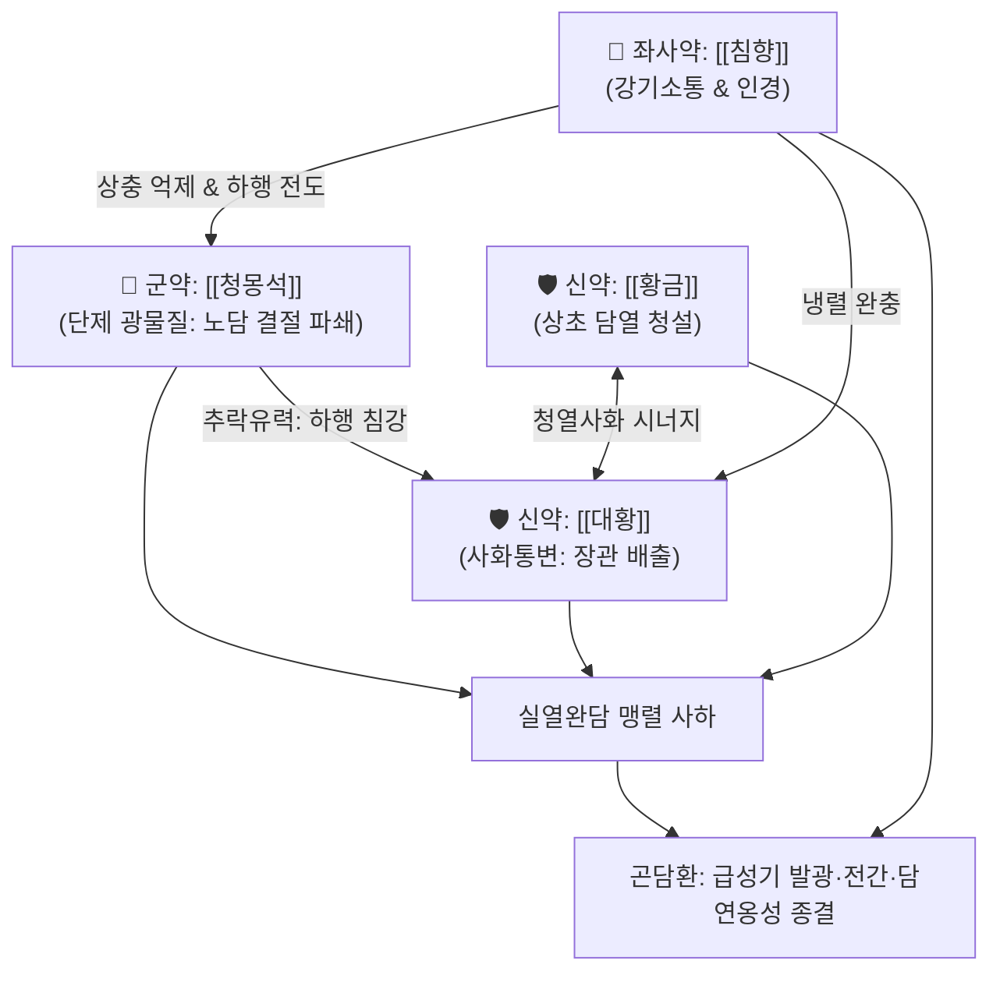

# 🍵 [[곤담환]] (滾痰丸, 몽석곤담환, Meng-Shi-Gun-Dan-Wan)

> **핵심 3줄 요약 (Key Summary)**:
> - 🌿 [[청몽석]](단제), [[대황]](주증), [[황금]], [[침향]] 배오 (맹렬한 광물질로 완담을 격파하고 대황·황금으로 사하하며 침향으로 강기).
> - 🎯 뼛속과 장부에 깊이 엉킨 실열완담(實熱頑痰)으로 인한 조현병·양극성 장애 급성기 흥분 발광, 뇌전증(간질) 대발작, 완고한 천식 및 중풍 급성기 담연옹성(痰涎壅盛).
> - 🔬 대장 아쿠아포린(AQP3) 억제를 통한 장관 내 삼투성 사하 및 점액질 노폐물 체외 배출, BBB 통과를 통한 미세아교세포 신경염증 차단 및 흥분성 글루타메이트 억제, 중추 진정.
> - ⚠️ 주의사항: 맹렬한 공벌제이므로 임산부, 소아, 노약자, 비위허약자 절대 금기, 담탁 배출 및 진정 시 즉시 복용을 중단하고 보익제로 전환.
---
## 📌 목차
1. [기본 처방 정보 & 군신좌사 구성](#1-기본-처방-정보--군신좌사-구성)
2. [방제학적 약재 상호작용 & 시너지 네트워크](#2-방제학적-약재-상호작용--시너지-네트워크)
3. [현대 분자약리학적 효능 & 작용 기전](#3-현대-분자약리학적-효능--작용-기전)
4. [적응 병증 및 체질별 감별 (Sweet Spot vs 금기)](#4-적응-병증-및-체질별-감별-sweet-spot-vs-금기)
5. [유사 처방군 감별 매트릭스](#5-유사-처방군-감별-매트릭스)
6. [임상 가감례 & 현대 질환별 응용](#6-임상-가감례--현대-질환별-응용)
7. [💡 사용자 진료실 핵심 필기 & 임상 팁 (원문 보존)](#7--사용자-진료실-핵심-필기--임상-팁-원문-보존)
8. [출처 및 학술 참고 문헌 (References)](#8-출처-및-학술-참고-문헌-references)
---
## 1. 기본 처방 정보 & 군신좌사 구성

* **출전**: 《양씨가장방(楊氏家藏方)》, 《단계심법(丹溪心法)》 권이(卷二)
* **치법**: 사화축담(瀉火逐痰), 공담파적(攻痰破積), 진경안신(鎭驚安神)
* **제법 및 표준 용법**:
  * [[청몽석]]은 염초(焰硝)와 함께 도가니에 넣고 금빛이 나도록 고온 소성(단제, 煅製)하여 극미세 분말로 수비(水飛)함.
  * [[대황]]은 술에 쪄서(주증) 사하력을 완화하고 청열활혈력을 증대시켜 환을 빚음. 1회 4~8g 미온수로 취침 전 복용.

| 구분 | 약재명 | 표준 용량 | 본초 효능 & 방제 내 역할 |
| :--- | :--- | :--- | :--- |
| **군약 (君藥)** | [[청몽석]] | 40g (단제) | 화담지해(化痰止咳), 무겁고 찬 성질로 완고한 노담 결절을 분쇄하여 아래로 추락시킴 (추락완담) |
| **신약 (臣藥)** | [[대황]] | 80g (주증) | 사하통변(瀉下通便), 청열사화, 장위의 실열을 사하고 대변을 통해 담탁을 맹렬히 배출 |
| **신약 (臣藥)** | [[황금]] | 80g | 청열조습(淸熱燥濕), 사폐화, 상초 폐·담의 화열을 청열하여 담의 발생 근원인 화(火)를 제어 |
| **좌사약 (佐使藥)** | [[침향]] | 20g | 강기지애(降氣止呃), 온중지통, 화열·담음의 상충을 막고 제약의 냉렬한 기운을 하행 전도 |

> **배오 특징**: 무거운 광물질인 [[청몽석]]이 담을 부수어 아래로 끌고 내려가면, [[대황]]이 대장 경로로 이를 쏟아내는 완벽한 상하 배출 체계입니다. "담을 치료하려면 먼저 화를 다스려야 한다(治痰先治火)"는 원리에 입각하여 [[황금]]과 [[대황]]으로 화열을 끄고, 온성의 [[침향]]으로 양기 손상을 완충하며 약력을 인도합니다.
---
## 2. 방제학적 약재 상호작용 & 시너지 네트워크

* [[청몽석]] + [[대황]] 배오: 완고한 점액질 담을 광물질의 무게로 짓눌러 부수고 대황의 사하력으로 창자 밖으로 쓸어내는 사화축담의 절대 약대입니다.
* [[대황]] + [[황금]] 배오: 사심탕(瀉心湯)의 핵심 골격으로, 상초 폐담의 화열과 중하초 위장의 열독을 동시에 청열사하합니다.
* [[청몽석]] + [[침향]] 배오: 광물질의 하추(下墜) 성향과 침향의 강기(降氣) 성향이 만나 가슴과 머리로 치솟은 담연과 화기를 즉각 하초로 끌어내립니다.
---
## 3. 현대 분자약리학적 효능 & 작용 기전

### 1) 장관 내 삼투성 사하 및 완담(점액질 병리 삼출물) 체외 배출
* **주요 성분**: [[대황]] 센노사이드(Sennoside A, B), [[에모딘]](Emodin), [[청몽석]] 알루미늄 규산염 복합 미네랄.
* **기전**: 대장 점막 상피세포의 아쿠아포린-3(AQP3) 발현을 억제하고 장관 내 수분 흡수를 차단하여 연동운동을 맹렬히 항진시키며, 장벽에 엉겨 붙은 점액성 단백질과 노폐물(담탁)을 신속하게 체외로 쏟아냅니다.

### 2) 중추신경계 신경염증 차단 및 항경련(Anticonvulsant)
* **주요 성분**: [[황금]] [[바이칼린]](Baicalin), 바이칼레인.
* **기전**: 혈뇌장벽(BBB)을 통과하여 뇌실질 미세아교세포(Microglia)의 과활성화를 억제하고 흥분성 신경전달물질인 글루타메이트(Glutamate) 수용체의 과흥분을 억제하며 GABA 활성을 강화하여 뇌전증성 발작파를 억제합니다.

### 3) 뇌혈류 안정화 및 진정 작용
* **주요 성분**: [[침향]] 아가로테트롤(Agarotetrol).
* **기전**: 중추성 도파민 과잉 신호를 안정화하고 뇌혈관 연축을 풀어주어 발광 환자의 극심한 공격성, 안면홍조, 혈압 급상승을 가라앉힙니다.
---
## 4. 적응 병증 및 체질별 감별 (Sweet Spot vs 금기)

[✅ 최적 적응증 (Sweet Spot)]
• 조현병, 양극성 장애 급성기의 심한 흥분, 헛소리(섬어), 환청, 공격적 발광
• 뇌전증(간질) 대발작, 급성 경련, 소아 고열 경련 후 혼수
• 중풍(뇌졸중) 급성기에 목에서 가래 끓는 소리(담명)가 요란하고 말을 못 하며 변비가 동반된 경우
• 기관지 천식, 만성 폐쇄성 폐질환(COPD)의 끈적하여 뱉어지지 않는 누런 가래 및 호흡곤란
• 설진/맥진: 설질홍강(紅絳), 설태황후니(黃厚膩, 누렇고 극히 두껍게 낀 기름진 때), 맥침실활삭(沈實滑數) 또는 활삭유력(滑數有力)

[⚠️ 신중 투여 및 금기 (Caution / Contraindication)]
• 임산부 및 수유부 절대 금기: 맹렬한 공하·파담제로 유산 및 태아 손상 위험
• 체력 쇠약자 및 노약자 금기: 정기가 허약하거나 빈혈, 진액 고갈이 있는 환자에게 투여 시 급격한 허탈(Collapse) 유발
• 중단 원칙: 복용 후 흑갈색 점액변이나 대량의 담탁을 쏟아내고 정신이 안정되면 즉시 복용을 멈추고 온성 보익건비제로 기혈을 보양해야 함
---
## 5. 유사 처방군 감별 매트릭스

| 처방명 | 핵심 구성 차이 | 주치 및 임상 차별점 | 맥진/설진 차이 |
| :--- | :--- | :--- | :--- |
| [[곤담환]] | [[청몽석]], [[대황]], [[황금]], [[침향]] | **실열완담, 정신 흥분 발광, 뇌전증, 광물질 사화축담** | 맥침실활삭(沈實滑數), 황후니태 |
| [[대승기탕]] | [[대황]], [[망초]], [[지실]], [[후박]] | **양명부실증, 장관 건조 대변(조시), 변비 위주** | 맥침실유력(沈實有力), 조열태 |
| [[죽력달담환]] | [[죽력]], [[반하]], [[진피]], [[담남성]] | **온건한 거담제, 담열울결과 신경불안, 공벌력 완만** | 맥활(滑), 백황니태 |
| [[주사안신환]] | [[주사]], [[황련]], [[생지황]], [[당귀]] | **진경안신, 심화항성으로 인한 불면과 두근거림** | 맥세삭(細數), 설홍소태 |
| [[도담탕]] | [[반하]], [[담남성]], [[지실]], [[복령]] | **비위 허약으로 정체된 기체습담, 현훈과 두통** | 맥현활(弦滑), 백니태 |
---
## 6. 임상 가감례 & 현대 질환별 응용

* **수반 증상별 가감법**:
  * 조증성 흥분 상태가 극심할 때 $\rightarrow$ 곤담환 1회 6g 투여 후 진정 시 [[온담탕]]으로 전환
  * 중풍 급성기 연하곤란 환자 $\rightarrow$ 비위관(L-tube)을 통해 미온수에 개어 주입하여 급속 사하 유도
* **이상반응 대처법**:
  * 복용 후 극심한 수양성 설사 및 복통 발생 시 $\rightarrow$ 즉시 복용 중단, 따뜻한 쌀죽(미음) 섭취, 생강·대추·인삼을 달인 물로 위기 구호
* **현대 질환 매핑**:
  * 조현병 및 양극성 장애 급성기 흥분, 난치성 뇌전증 발작
  * 뇌졸중 급성기 담연옹성 및 의식혼탁, 중증 만성 폐쇄성 폐질환
---
## 7. 💡 사용자 진료실 핵심 필기 & 임상 팁 (원문 보존)

> [!tip] **진료실 실전 노하우 (User Clinical Insight)**
> - **출전 및 의의**: 《양씨가장방(楊氏家藏方)》 및 《단계심법(丹溪心法)》에 수록되어 뼛속과 장부에 깊이 숨어 백 가지 병을 일으키는 실열완담(實熱頑痰)을 맹렬히 쓸어내리는 사화축담(瀉火逐痰)의 대표 처방.
> - **약재 기전**: [[청몽석]]이 끈적한 노담(老痰)의 결절을 부수고 아래로 끌어내리며, [[대황]]·[[황금]]이 장위의 실열을 사하하고 [[침향]]이 기를 내리고 약력을 전도함.
> - **적응증**: 담열발광(조현병 급성기 흥분·광증), 뇌전증(간질) 발작, 난치성 불면, 완고한 해천(천식), 중풍 급성기 담연옹성 및 변비에 다용됨.
> - **태그**: #처방 #화담거습이수제 #사화축담 #완담축출 #중증정신신경
---
## 8. 출처 및 학술 참고 문헌 (References)

1. **주단계 (1347년)**. 『단계심법(丹溪心法)』 권이(卷二) 거담(祛痰).
   - **[고전 원전]**: "滾痰丸, 治一切老痰怪病, 實熱頑痰, 癲狂驚悸, 咳喘痰鳴." (곤담환은 일체의 노담과 괴이한 병, 실열완담, 전광경계, 해천담명을 치료한다.)
