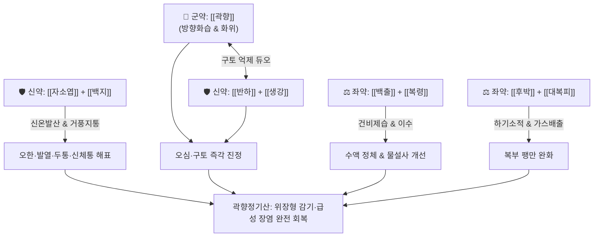

# 🍵 [[곽향정기산]] (藿香正氣散, Huoxiang Zhengqi San / Kakko-shoki-san)

> **핵심 요약 (Key Summary)**:
> - 🌿 [[곽향]], [[자소엽]], [[백지]], [[반하]], [[진피]], [[백출]], [[복령]], [[후박]], [[대복피]], [[길경]], [[생강]], [[대추]], [[감초]] 배오 (평진탕 골격에 불환금정기산 및 해표제 결합).
> - 🎯 여름철 냉방병, 식이부절(야식 증후군, 기름진 음식 과다)로 인한 급만성 위장염, 복통, 설사, 오심·구토, 오한·발열 및 신체통이 동반된 위장형 감기.
> - 🔬 장점막 밀착연접(Tight junction) 복구를 통한 장벽 투과성 개선, 5-HT3 및 도파민 수용체 억제를 통한 진토 효과, 위장관 진경 및 장내 세균총 불균형 억제.
> - ⚠️ 주의사항: 방향성 정유 성분 보존을 위해 오래 달이지 않음, 고열·갈증이 심한 열성 설사에는 청열제를 합방.
---
## 📌 목차
1. [기본 처방 정보 & 군신좌사 구성](#1-기본-처방-정보--군신좌사-구성)
2. [방제학적 약재 상호작용 & 시너지 네트워크](#2-방제학적-약재-상호작용--시너지-네트워크)
3. [현대 분자약리학적 효능 & 작용 기전](#3-현대-분자약리학적-효능--작용-기전)
4. [적응 병증 및 체질별 감별 (Sweet Spot vs 금기)](#4-적응-병증-및-체질별-감별-sweet-spot-vs-금기)
5. [유사 처방군 감별 매트릭스](#5-유사-처방군-감별-매트릭스)
6. [임상 가감례 & 현대 질환별 응용](#6-임상-가감례--현대-질환별-응용)
7. [💡 사용자 진료실 핵심 필기 & 임상 팁 (원문 보존)](#7--사용자-진료실-핵심-필기--임상-팁-원문-보존)
8. [출처 및 학술 참고 문헌 (References)](#8-출처-및-학술-참고-문헌-references)
---
## 1. 기본 처방 정보 & 군신좌사 구성

* **출전**: 《태평혜민화제국방(太平惠民和劑局方)》 권이(卷二)
* **치법**: 해표화습(解表化濕), 이기화중(理氣和中), 방향화탁(芳香化濁), 강역지구(降逆止嘔)

| 구분 | 약재명 | 표준 용량 | 본초 효능 & 방제 내 역할 |
| :--- | :--- | :--- | :--- |
| **군약 (君藥)** | [[곽향]] | 6g | 방향화습(芳香化濕), 화습지구, 외사의 표를 풀고 중초 습탁을 화하며 오심구토 진정 |
| **신약 (臣藥)** | [[자소엽]] | 4g | 신온해표(辛溫解表), 행기화위, 풍한표증을 해소하고 비위 기운을 순행시킴 |
| **신약 (臣藥)** | [[백지]] | 4g | 거풍산한(祛風散寒), 통규지통, 양명경 두통과 미릉골통, 전신 신체통 완화 |
| **신약 (臣藥)** | [[반하]] | 6g | 조습화담(燥濕化痰), 강역지구, 위기상역으로 인한 구토를 멈춤 |
| **신약 (臣藥)** | [[진피]] | 6g | 이기조습(理氣燥濕), 조화비위, 복부 팽만과 소화불량 개선 |
| **좌약 (佐藥)** | [[백출]] | 6g | 보기건비(補氣健脾), 조습이수, 비장 기능 강화로 설사 제어 |
| **좌약 (佐藥)** | [[복령]] | 6g | 이수삼습(利水滲濕), 건비영심, 체내 유류 수액 배출 |
| **좌약 (佐藥)** | [[후박]] | 4g | 하기소적(下氣消積), 보기화습, 장관 내 가스 정체와 팽만감 제거 |
| **좌약 (佐藥)** | [[대복피]] | 4g | 하기이수(下氣利水), 관중소종, 수습을 아래로 이끌어 복부 팽만 완화 |
| **좌약 (佐藥)** | [[길경]] | 4g | 개설폐기(開宣肺氣), 거담배농, 상초 기운을 열어 수액 대사 촉진 |
| **좌약 (佐藥)** | [[생강]] | 4g | 신온해표, 온중지구, 반하 독성 완충 및 해표 보조 |
| **좌약 (佐藥)** | [[대추]] | 4g | 보비익기, 양혈안신, 비위를 보양하고 조열한 약성 완충 |
| **사약 (使藥)** | [[감초]] | 3g | 보비화중, 조화제약, 제약 조화 |

> **배오 특징**: [[평위산]](백출·후박·진피·감초)과 [[이진탕]](반하·진피·복령·감초)의 결합형인 평진탕(平陳湯)에, [[불환금정기산]](곽향·반하·진피·후박·창출·감초)의 핵심을 포괄하고, [[자소엽]]·[[백지]]·[[길경]]·[[대복피]]를 가미하여 피부 겉의 풍한(오한·두통)과 뱃속의 차가운 물(구토·설사)을 동시에 해소하는 표리쌍해(表裏雙解)의 절묘한 구조입니다.
---
## 2. 방제학적 약재 상호작용 & 시너지 네트워크

* [[곽향]] + [[자소엽]] 배오: 곽향의 방향화습력과 자소엽의 신온해표력이 결합하여 찬 에어컨 바람이나 찬 음료로 상한 표리(表裏)의 한습(寒濕)을 단번에 흩트립니다.
* [[반하]] + [[생강]] 배오: 위기상역(胃氣上逆)으로 인한 구토를 멈추는 고전 명약대로, 구토 중추와 미주신경 과흥분을 신속 차단합니다.
* [[후박]] + [[대복피]] 배오: 기운을 아래로 내려 장관 내 가스 팽만을 몰아내고 장관의 뒤틀림을 완화합니다.
---
## 3. 현대 분자약리학적 효능 & 작용 기전

### 1) 위장관 점막 장벽(Tight junction) 복구 및 항염증
* **주요 성분**: [[곽향]] 파출리 알코올(Patchouli alcohol), [[후박]] 마그놀롤(Magnolol).
* **기전**: 대장 점막의 TLR4/NF-κB 경로를 차단하여 염증성 사이토카인(TNF-α, IL-6)을 억제하며, 장점막 상피세포의 밀착연접 단백질(Claudin-1, Occludin) 발현을 촉진하여 세균 독소 침투를 막고 설사를 멎게 합니다.

### 2) 진토(Antiemetic) 및 위장관 연동운동 정상화
* **주요 성분**: [[반하]] 진토 활성 성분, [[생강]] 6-진저롤(6-Gingerol).
* **기전**: 화학수용체 유발대(CTZ) 및 미주신경 말단의 5-HT3 수용체를 길항하여 급성 오심과 구토를 억제하고 장관의 불규칙한 경련성 수축을 안정화합니다.

### 3) 항바이러스 및 식중독 세균 억제
* **주요 성분**: [[자소엽]] 페릴알데히드(Perillaldehyde), [[백지]] 임페라토린(Imperatorin).
* **기전**: 노로바이러스, 로타바이러스 및 병원성 대장균(ETEC), 살모넬라균에 대한 억제 활성을 발휘하여 식중독성 장염 증상을 빠르게 호전시킵니다.
---
## 4. 적응 병증 및 체질별 감별 (Sweet Spot vs 금기)

[✅ 최적 적응증 (Sweet Spot)]
• 찬 음료, 찬 과일, 아이스크림, 야식, 기름진 음식을 먹고 체하여 발생한 급성 위장염, 물설사, 구토
• 여름철 에어컨 노출(냉방병) 후 머리가 무겁고 아프며, 으슬으슬 춥고 전신이 쑤시며 체한 증상(위장형 감기)
• 평소 식이부절로 상하부 위장관이 약하거나, 기름진 야식을 즐기는 비만 체형 환자의 소화불량 및 피부 트러블(여드름)
• 설진/맥진: 설질담백(淡白), 설태백니(白膩, 하얗고 미끈미끈한 태), 맥유완(濡緩) 또는 활(滑)

[⚠️ 신중 투여 및 금기 (Caution / Contraindication)]
• 온병 및 열성 장염: 고열이 심하고 갈증으로 찬물을 들이켜며 냄새가 독한 설사 환자는 단독 투여를 피하고 [[황련]], [[황금]], [[갈근]] 등 청열제 배오
• 음허진고(陰虛津枯): 체액이 극히 부족하여 혀가 붉고 바짝 마른 환자에게는 조습약 신중 투여
---
## 5. 유사 처방군 감별 매트릭스

| 처방명 | 핵심 구성 차이 | 주치 및 임상 차별점 | 맥진/설진 차이 |
| :--- | :--- | :--- | :--- |
| [[곽향정기산]] | 곽향·자소엽·백지 + 평진탕 | **외감풍한 + 내상습체 (오한·두통과 구토·설사 동반)** | 맥유완(濡緩), 백니태 |
| [[평위산]] | 창출·후박·진피·감초 | **순수 내상습체, 표증(감기 증상) 없이 식체와 복부팽만 위주** | 맥완(緩), 백태 |
| [[이진탕]] | 반하·진피·복령·감초 | **상·중초 습담 정체, 기침·가래·오심 위주이며 설사는 드묾** | 맥활(滑), 백니태 |
| [[불환금정기산]] | 곽향·반하·창출·후박·진피·감초 | **곽향정기산의 축약형, 한습 장염에 쓰이나 해표력은 약함** | 맥침완(沈緩), 백니태 |
| [[갈근황련황금탕]] | 갈근·황련·황금·감초 | **급성 열성 장염, 열감 극심, 폭포성 설사, 항문 작열감** | 맥삭(數), 황태 |
---
## 6. 임상 가감례 & 현대 질환별 응용

* **수반 증상별 가감법**:
  * 식적이 뚜렷하여 트림에서 음식 썩은 냄새가 날 때 $\rightarrow$ + [[산사]] 4g, [[신곡]] 4g, [[맥아]] 4g
  * 배가 차갑고 뒤틀리듯 아플 때(한성 복통) $\rightarrow$ + [[육계]] 2g, [[목향]] 3g
  * 구토가 심하여 물도 못 넘길 때 $\rightarrow$ [[생강]]을 8g으로 증량하고 미온수를 숟가락으로 소량씩 복용
  * 피지 분비 과다 및 안면 여드름 동반 $\rightarrow$ + [[황금]] 4g, [[의이인]] 8g
* **현대 질환 매핑**:
  * 급성 위장염, 위장형 감기, 여행자 설사, 식중독
  * 여름철 냉방병, 식이부절성 기능성 소화불량, 야식 증후군
---
## 7. 💡 사용자 진료실 핵심 필기 & 임상 팁 (원문 보존)

> [!tip] **진료실 실전 노하우 (User Clinical Insight)**
> - **구성**:
>   - [[백출]], [[후박]], [[진피]], [[감초]] / [[반하]], [[복령]], [[생강]], [[대추]], [[곽향]] / [[자소엽]], [[대복피]] / [[백지]], [[길경]]
>   - [[불환금정기산]] + [[복령]] + [[자소엽]], [[대복피]], [[백지]], [[길경]]
>   - [[평진탕]]은 위장관 상태 완화,
>   - [[곽향]], [[자소엽]], [[대복피]]는 염증 수치, 설사, 오심구토,
>   - [[백지]], [[길경]]은 오한, 미열, 신체통 완화
> - **적응증**:
>   - **평소 식이부절하여 상하부 위장관이 좋지 못한 사람에게 설사, 오심구토, 장관 감염 증상있고, 염증 수치가 높아 여드름, 오한, 미열, 신체통이 있는 경우에 사용**
>   - 야식 증후군에 활용
>   - 마른 사람도 괜찮고 뚱뚱한 사람도 괜찮지만 기름진 음식 많이 먹는 뚱뚱한 사람에게 주로 사용
> - **태그**: #뚱뚱증
---
## 8. 출처 및 학술 참고 문헌 (References)

1. **송대 태의국 (1151년)**. 『태평혜민화제국방(太平惠民和劑局方)』 권이(卷二) 상한(傷寒).
   - **[고전 원전]**: "治傷寒頭痛, 寒熱, 霍亂吐瀉, 內傷生冷, 外感風寒." (상한 두통, 오한 발열, 곽란토사, 내상생랭, 외감풍한을 치료한다.)
2. **Liu, R. et al. (2020)**. *Huoxiang Zhengqi oral liquid regulates gut microbiota and improves intestinal barrier in damp-heat diarrhea rat models*. **Frontiers in Pharmacology**, 11, 574.
   - **[연구 요약]**: 곽향정기산 추출물이 장내 미생물총을 조절하고 장벽 밀착연접 단백질 발현을 촉진하여 설사 및 염증 반응을 개선함을 규명.
3. **Zhao, L. et al. (2018)**. *Anti-inflammatory and gastroprotective mechanisms of Patchouli alcohol from Pogostemon cablin*. **Phytomedicine**, 43, 1-8.
   - **[연구 요약]**: 곽향의 핵심 정유 성분인 파출리 알코올이 NF-κB 활성 차단을 통해 급성 위점막 손상과 장관 염증을 억제함을 입증.