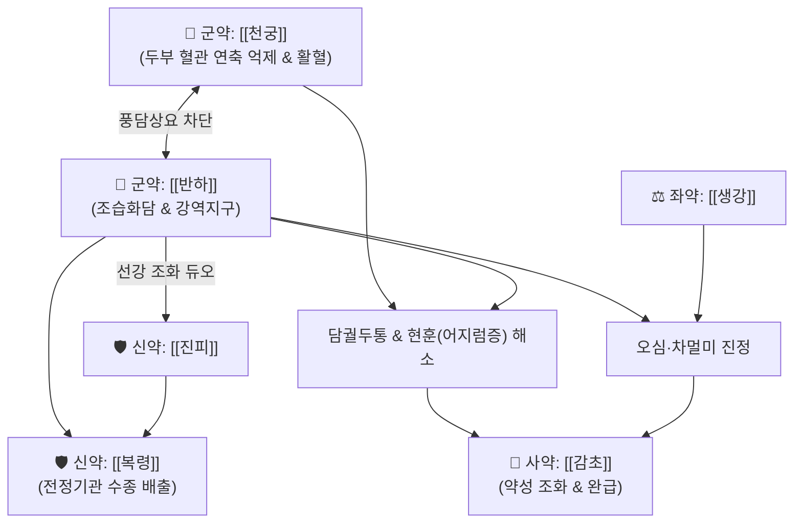

# 🍵 [[궁하탕]] (芎夏湯, Gyungha-tang)

> **핵심 3줄 요약 (Key Summary)**:
> - 🌿 [[천궁]], [[반하]], [[진피]], [[복령]], [[생강]], [[감초]] 배오 ([[이진탕]] 골격에 두부 혈류를 순환시키고 풍사를 흩트리는 [[천궁]]을 가미).
> - 🎯 수(水)와 담음(痰飮)의 경계선 병태, 담궐두통(痰厥頭痛), 편두통, 어지럼증(현훈), 차멀미, 오심·구토, 안면신경마비 전조기 두통.
> - 🔬 삼차신경 혈관 복합체 CGRP 방출 차단을 통한 편두통 완화, 뇌혈류(CBF) 개선 및 혈관 연축 억제, 전정신경계 흥분 진정 및 위장관 운동 정상화.
> - ⚠️ 주의사항: 천궁의 승산력과 반하의 조습성이 있으므로 간양상항 고혈압성 두통이나 음허화왕 두통 환자에게는 단독 사용 금기.
---
## 📌 목차
1. [기본 처방 정보 & 군신좌사 구성](#1-기본-처방-정보--군신좌사-구성)
2. [방제학적 약재 상호작용 & 시너지 네트워크](#2-방제학적-약재-상호작용--시너지-네트워크)
3. [현대 분자약리학적 효능 & 작용 기전](#3-현대-분자약리학적-효능--작용-기전)
4. [적응 병증 및 체질별 감별 (Sweet Spot vs 금기)](#4-적응-병증-및-체질별-감별-sweet-spot-vs-금기)
5. [유사 처방군 감별 매트릭스](#5-유사-처방군-감별-매트릭스)
6. [임상 가감례 & 현대 질환별 응용](#6-임상-가감례--현대-질환별-응용)
7. [💡 사용자 진료실 핵심 필기 & 임상 팁 (원문 보존)](#7--사용자-진료실-핵심-필기--임상-팁-원문-보존)
8. [출처 및 학술 참고 문헌 (References)](#8-출처-및-학술-참고-문헌-references)
---
## 1. 기본 처방 정보 & 군신좌사 구성

* **출전**: 《화제국방(和劑局方)》, 《동의보감(東醫寶鑑)》 외형편(外形篇) 두문(頭門)
* **치법**: 조습화담(燥濕化痰), 활혈행기(活血行氣), 거풍지통(祛風止痛), 강역화위(降逆和胃)

| 구분 | 약재명 | 표준 용량 | 본초 효능 & 방제 내 역할 |
| :--- | :--- | :--- | :--- |
| **군약 (君藥)** | [[천궁]] | 8g | 혈중기약(血中氣藥), 두부 혈관 경련 해소, 뇌혈류 개선 및 풍사 발산 |
| **군약 (君藥)** | [[반하]] | 8g | 조습화담(燥濕化痰), 강역지구, 위장관 담음을 삭이고 뇌로 치솟는 담궐 하강 |
| **신약 (臣藥)** | [[진피]] | 6g | 이기조습(理氣燥濕), 조화비위, 기 순환을 도와 담음 생성 차단 |
| **신약 (臣藥)** | [[복령]] | 6g | 이수삼습(利水滲濕), 건비영심, 체내 잉여 수액 배출 및 전정기관 부종 완화 |
| **좌약 (佐藥)** | [[생강]] | 4g | 온중화담(溫中化痰), 온위지구, 반하 독성 제어 및 구토 진정 |
| **사약 (使藥)** | [[감초]] | 3g | 보비익기, 완급지통, 제약 조화 |

> **배오 특징**: 담음(痰飮)의 기본방인 [[이진탕]](반하·진피·복령·감초·생강)에 두통의 성약인 [[천궁]]을 결합하여, 몸 안의 습담을 삭이는 동시에 머리로 치고 올라간 풍담(風痰)과 혈어(血瘀)를 단번에 뚫어줍니다. 체내 묽은 수액 정체인 수(水)에는 [[오령산]]을 쓰고 걸쭉해진 담음(痰飮)에는 [[이진탕]]을 쓰는데, 궁하탕은 수분이 담음화되면서 두면부 순환장애를 일으키는 중간 지점의 담결(痰結)을 해결하는 특화 방제입니다.
---
## 2. 방제학적 약재 상호작용 & 시너지 네트워크

* [[천궁]] + [[반하]] 배오: 천궁이 머리의 기혈을 순환시키고 혈관성 두통을 진정시키면, 반하가 머리로 치고 올라오는 담음을 아래로 끌어내려 담궐두통을 종결시킵니다.
* [[반하]] + [[진피]] 배오: 이진탕의 기본 약대로 조습화담과 이기건비의 표준 시너지입니다.
* [[천궁]] + [[생강]] 배오: 신온발산력을 높여 머리가 안개 낀 듯 멍하고 무거운 뇌안무(Brain fog) 증상을 신속히 걷어냅니다.
---
## 3. 현대 분자약리학적 효능 & 작용 기전

### 1) 뇌혈류 개선 및 삼차신경 CGRP 억제
* **주요 성분**: [[천궁]] 페룰산(Ferulic acid), 리구스티라이드(Ligustilide).
* **기전**: 혈관 내피세포의 NO 생성을 촉진하여 뇌혈관의 이상 연축을 방지하고 뇌혈류를 증대시킵니다. 편두통의 주원인인 삼차신경 말단의 CGRP 방출을 차단하여 박동성 혈관 통증을 완화합니다.

### 2) 전정신경계 안정화 및 진토 효과
* **주요 성분**: [[반하]] 수용성 다당체, [[생강]] 진저롤(Gingerols).
* **기전**: 내이 림프액 수종을 완화하고 전정신경핵의 흥분성을 억제하여 메니에르 유사 어지럼증, 기립성 현훈, 차멀미를 개선합니다. 연수 CTZ를 안정화하여 오심을 억제합니다.

### 3) 중초 수액 대사 정상화
* **주요 성분**: [[복령]] 파키만(Pachyman), [[진피]] 헤스페리딘.
* **기전**: 비장과 신장의 수분 재흡수/배설 밸런스를 조절하여 위장관 내 진수음(振水音) 및 잉여 조직액 저류를 흡수·배출시킵니다.
---
## 4. 적응 병증 및 체질별 감별 (Sweet Spot vs 금기)

[✅ 최적 적응증 (Sweet Spot)]
• 소화가 잘 안 되면서 머리가 쪼개지듯 아프거나 한쪽이 욱신거리는 담궐두통, 편두통
• 차나 배를 타면 유독 심하게 멀미를 하고 메스꺼우며 어지러운 환자
• 아침에 일어날 때 머리가 무겁고 어지러우며 가래가 끓고 침이 고이는 증상
• 안면신경마비(구안와사) 전조기에 귀 뒤쪽 통증과 편두통, 어지럼증이 나타날 때
• 설진/맥진: 설질담(淡), 설태백니(白膩, 하얗고 미끈미끈한 태), 맥현활(弦滑)

[⚠️ 신중 투여 및 금기 (Caution / Contraindication)]
• 간양상항 두통: 혈압이 매우 높고 얼굴이 붉으며 화가 치밀어 오르는 두통에는 천궁의 승산력이 증상을 악화시킬 수 있으므로 금기 ([[천마구등음]] 적용)
• 음허두통: 진액이 부족하여 눈이 뻑뻑하고 입이 마르는 만성 두통에는 자음제를 배오하여 신중 투여
---
## 5. 유사 처방군 감별 매트릭스

| 처방명 | 핵심 구성 차이 | 주치 및 임상 차별점 | 맥진/설진 차이 |
| :--- | :--- | :--- | :--- |
| [[궁하탕]] | [[이진탕]] + [[천궁]] | **수(水)와 담음의 경계, 편두통, 어지럼증, 차멀미** | 맥현활(弦滑), 백니태 |
| [[오령산]] | 택사·복령·저령·백출·계지 | **순수 수음(水飮) 정체, 갈증과 소변불리, 수양성 설사** | 맥부완(浮緩), 백태 |
| [[이진탕]] | 반하·진피·복령·감초 | **순수 습담 정체, 두통보다는 위장관 구역감과 기침 가래 위주** | 맥활(滑), 백니태 |
| [[반하백출천마탕]] | 반하·백출·천마 등 | **비허생담의 극심한 회전성 어지럼증, 세상이 빙빙 돎** | 맥현완(弦緩), 백태 |
| [[도담탕]] | 반하·담남성·지실 등 | **오래되고 끈끈한 완고한 노담(老痰), 흉협부 담결** | 맥침활(沈滑), 황백니태 |
---
## 6. 임상 가감례 & 현대 질환별 응용

* **수반 증상별 가감법**:
  * 메니에르병 잔여 어지럼증 $\rightarrow$ + [[택사]] 6g, [[천마]] 4g
  * 목덜미와 어깨가 뻣뻣하게 굳는 긴장성 두통 $\rightarrow$ + [[갈근]] 8g, [[백지]] 4g
  * 가슴이 답답하고 불안증이 겹칠 때 $\rightarrow$ + [[담남성]] 4g, [[지실]] 4g ([[도담탕]] 의미 합방)
  * 혈허(血虛)가 겹쳐 어지럽고 피로할 때 $\rightarrow$ + [[당귀]] 6g, [[백작약]] 6g
* **현대 질환 매핑**:
  * 혈관성 편두통, 긴장성 두통, 담궐두통
  * 메니에르병, 전정신경염 잔여 어지럼증, 차멀미(동요병), 구안와사 전조증
---
## 7. 💡 사용자 진료실 핵심 필기 & 임상 팁 (원문 보존)

> [!tip] **진료실 실전 노하우 (User Clinical Insight)**
> - **수와 담음의 스펙트럼 감별**:
>   - **[[궁하탕]]은 수와 담음 사이, 수는 [[오령산]], 담음은 [[이진탕]]을 사용한다.**
>   - **오래되고 끈끈한 담은 [[도담탕]], [[이진탕]] 등을 활용한다.**
---
## 8. 출처 및 학술 참고 문헌 (References)

1. **허준 (1613년)**. 『동의보감(東醫寶鑑)』 외형편(外形篇) 권일(卷一) 두문(頭門).
   - **[고전 원전]**: "治風痰眩暈, 頭痛嘔吐, 芎夏湯主之." (풍담으로 어지럽고 머리가 아프며 구토하는 것을 치료할 때 궁하탕을 주로 쓴다.)
2. **Ran, X. et al. (2011)**. *Ligusticum chuanxiong Hort: A review of its phytochemistry and pharmacology in vascular diseases*. **Journal of Ethnopharmacology**, 134(3), 567-581.
   - **[연구 요약]**: 천궁의 유효성분이 혈관 내피세포 기능을 개선하고 혈관 경련을 억제하여 뇌혈류 장애 및 편두통을 호전시키는 기전 보고.
3. **Chen, Z. et al. (2020)**. *Pharmacological effects of Pinellia ternata on gastrointestinal and central nervous system disorders*. **Phytomedicine**, 68, 153164.
   - **[연구 요약]**: 반하가 전정신경계 과흥분을 진정시키고 중추성 진토 작용을 나타내는 분자 기전 분석.