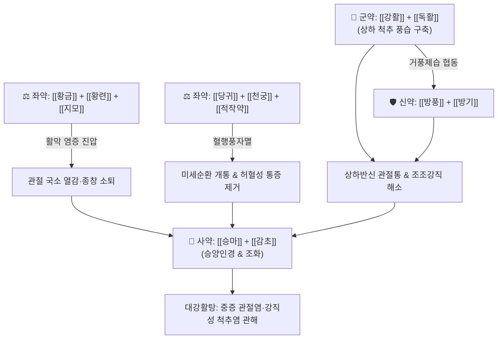

---
aliases:
  - 대강활탕
  - 大羌活湯
  - Daeqianghuo-tang
tags:
  - 처방/거습제
  - 거습제/거풍승습
  - 풍습비통
  - 류마티스
---

# 🍵 [[대강활탕]] (大羌活湯, Daeqianghuo-tang)

> **핵심 요약 (Key Summary)**:
> - 🌿 [[강활]], [[독활]], [[방풍]], [[방기]], [[당귀]], [[천궁]], [[적작약]], [[창출]], [[백출]], [[복령]], [[황금]], [[황련]], [[지모]], [[승마]], [[감초]] 배오 (강활·독활의 거풍승습에 황금·황련의 청열사화와 당귀·천궁의 활혈통락 결합).
> - 🎯 풍·한·습·열이 복합된 중증 관절염, 류마티스 관절염, 강직성 척추염, 통풍성 관절염, 척추 마디마디가 뻣뻣하고 사지 관절이 붓고 쑤시며 오한과 번열이 교차하는 비증(痺證).
> - 🔬 관절 활막세포 COX-2 및 PGE2 억제를 통한 강력 진통, 대식세포 NF-κB 차단을 통한 TNF-α·IL-1β 억제 및 MMP-13 연골 파괴 방어, 미세혈류 순환 촉진.
> - ⚠️ 주의사항: 15미의 복합방으로 신온조열과 고한 약재가 공존하므로, 비위가 극도로 허약한 환자는 식후 복용 지도 및 신중 투여.
---
## 📌 목차
1. [기본 처방 정보 & 군신좌사 구성](#1-기본-처방-정보--군신좌사-구성)
2. [방제학적 약재 상호작용 & 시너지 네트워크](#2-방제학적-약재-상호작용--시너지-네트워크)
3. [현대 분자약리학적 효능 & 작용 기전](#3-현대-분자약리학적-효능--작용-기전)
4. [적응 병증 및 체질별 감별 (Sweet Spot vs 금기)](#4-적응-병증-및-체질별-감별-sweet-spot-vs-금기)
5. [유사 처방군 감별 매트릭스](#5-유사-처방군-감별-매트릭스)
6. [임상 가감례 & 현대 질환별 응용](#6-임상-가감례--현대-질환별-응용)
7. [💡 사용자 진료실 핵심 필기 & 임상 팁 (원문 보존)](#7--사용자-진료실-핵심-필기--임상-팁-원문-보존)
8. [출처 및 학술 참고 문헌 (References)](#8-출처-및-학술-참고-문헌-references)
---
## 1. 기본 처방 정보 & 군신좌사 구성

* **출전**: 장원소(張元素) 『[[의학계원(醫學啓源)]]』, 이동원 『[[동원십서(東垣十書)]]』
* **치법**: 거풍승습(祛風勝濕), 청열조습(淸熱燥濕), 활혈통비(活血通痺), 완급지통(緩急止痛)

| 구분 | 약재명 | 표준 용량 | 본초 효능 & 방제 내 역할 |
| :--- | :--- | :--- | :--- |
| **군약 (君藥)** | [[강활]] | 6~9g | 거풍산한(祛風散寒), 승습지통, 상반신 흉배부와 척추 상부의 풍습사를 몰아냄 |
| **군약 (君藥)** | [[독활]] | 6~9g | 거풍제습(祛風除濕), 통비지통, 하반신 요각부와 척추 하부의 심부 습사 제거 |
| **신약 (臣藥)** | [[방풍]] | 4.5~6g | 거풍승습(祛風勝濕), 체표와 관절의 유주성 풍사 제거 |
| **신약 (臣藥)** | [[방기]] | 4.5~6g | 이수소종(利水消腫), 거풍통락, 관절 활액 저류와 부종을 소변 배출 |
| **좌약 (佐藥)** | [[당귀]] | 6g | 활혈양혈(活血養血), 관절염증으로 울체된 혈류 소통 ("혈행풍자멸") |
| **좌약 (佐藥)** | [[천궁]] | 4.5g | 활혈행기(活血行氣), 거풍지통, 기혈 소통 및 관절 통증 완화 |
| **좌약 (佐藥)** | [[적작약]] | 4.5g | 청열량혈(淸熱涼血), 산어지통, 울혈된 열을 식히고 어혈 해소 |
| **좌약 (佐藥)** | [[창출]] | 4.5g | 조습건비(燥濕健脾), 골절 사이의 습탁한 기운 건조 |
| **좌약 (佐藥)** | [[백출]] | 4.5g | 건비익기(健脾益氣), 습을 말리며 정기 보좌 |
| **좌약 (佐藥)** | [[복령]] | 4.5g | 담삼이습(淡滲利濕), 습사를 소변으로 유도 |
| **좌약 (佐藥)** | [[황금]] | 4.5g | 청열조습(淸熱燥濕), 관절의 급성 열감과 염증 진화 |
| **좌약 (佐藥)** | [[황련]] | 3g | 청열조습, 사심화, 심경과 중초의 화열 제어 |
| **좌약 (佐藥)** | [[지모]] | 4.5g | 청열사화, 자음윤조, 온조한 약재들이 진액을 손상하지 않도록 방어 |
| **사약 (使藥)** | [[승마]] | 3g | 승양해독(升陽解毒), 약기운을 상부와 체표로 인도 |
| **사약 (使藥)** | [[감초]] | 3g | 조화제약(調和諸藥), 완급지통 |

> **배오 특징**: [[강활]]과 [[독활]]을 양대 기둥으로 삼아 척추와 사지의 풍한습을 털어내고, [[황금]]·[[황련]]·[[지모]]로 관절 활막의 열증을 진화시키며, [[당귀]]·[[천궁]]·[[적작약]]으로 "피를 돌려 바람을 잠재운다(治風先治血 血行風自滅)"는 원리를 완벽 결합했습니다. 차가우면 통증이 심해지면서도 관절 국소에는 열감이 끓는 복합 한열착잡(寒熱錯雜) 비증에 최적화된 거풍승습의 정점입니다.
---
## 2. 방제학적 약재 상호작용 & 시너지 네트워크

* [[강활]] + [[독활]] 배오: 강활은 흉배부와 경추·상지 관절을 주관하고, 독활은 요천추와 슬관절·하지 관절을 주관하여 전신 척추 관절의 풍습사를 빈틈없이 쓸어냅니다.
* [[황금]] + [[황련]] 배오: 류마티스 및 통풍 관절염의 국소 발적, 열감, 활막 증식을 억제하는 청열사화의 핵심입니다.
* [[당귀]] + [[천궁]] 배오: 염증성 부종으로 차단된 관절강 미세 모세혈관 혈류를 재개통하여 허혈성 통증을 완화합니다.
---
## 3. 현대 분자약리학적 효능 & 작용 기전

### 1) COX-2 효소 및 PGE2 합성 차단
* **주요 성분**: [[강활]] 노토프테롤(Notopterol), [[독활]] 콜룸비아네틴(Columbianetin).
* **기전**: 관절 활막세포에서 염증성 효소 COX-2 발현을 선택적으로 차단하고 통증 매개 물질인 PGE2 생성을 억제하여 관절의 급성 통증과 팽윤을 가라앉힙니다.

### 2) NF-κB 활성 억제 및 골 연골 파괴 효소(MMP-13) 차단
* **주요 성분**: [[황련]] 베르베린, [[황금]] 바이칼린.
* **기전**: 활막 대식세포의 NF-κB 신호 전달을 억제하여 TNF-α, IL-1β, IL-6 생성을 차단하며, 연골 기질을 녹이는 매트릭스 메탈로프로테이나제(MMP-1, MMP-13) 분비를 억제하여 관절 연골 변형을 방어합니다.

### 3) 활액 삼출액 흡수 및 미세순환 복원
* **주요 성분**: [[방기]] 시노메닌(Sinomenine), [[당귀]] 페룰산.
* **기전**: 모세혈관 투과성 항진을 정상화하여 관절강 내 삼출액 저류를 흡수·소변 배출시키고, 국소 혈류량을 회복시켜 조조강직(Morning stiffness)을 완화합니다.
---
## 4. 적응 병증 및 체질별 감별 (Sweet Spot vs 금기)

[✅ 최적 적응증 (Sweet Spot)]
• 류마티스 관절염(RA): 다발성 사지 관절통, 조조강직, 국소 종창 및 열감
• 강직성 척추염(AS): 척추 및 천장관절의 만성 염증성 요통, 척추 굴신불리
• 통풍성 관절염: 관절이 붉게 붓고 극심하게 아프며 열이 나는 급만성 통풍 발작
• 풍한습열 착잡 비증: 날씨가 궂으면 사지가 쑤시면서도 관절에 열감이 펄펄 끓고 전신이 무거운 증상
• 설진/맥진: 설질홍(舌紅), 설태황니(黃膩) 또는 백니(白膩), 맥활삭(滑數) 또는 현삭(弦數)

[⚠️ 신중 투여 및 금기 (Caution / Contraindication)]
• 음허혈허(陰虛血虛) 환자: 체액과 혈액이 몹시 부족하여 관절이 뻣뻣한 만성 허약 환자는 강한 조습발산약이 진액을 고갈시킬 수 있으므로 [[독활기생탕]]을 우선 고려
• 비위허약자: 소화력이 극히 약한 환자는 식후에 따뜻하게 나누어 복용하도록 지도
---
## 5. 유사 처방군 감별 매트릭스

| 처방명 | 핵심 구성 차이 | 주치 및 임상 차별점 | 맥진/설진 차이 |
| :--- | :--- | :--- | :--- |
| [[대강활탕]] | 강활·독활·방풍·황금·황련·당귀 (15미) | **풍한습열 착잡 중증 관절염, 강직성 척추염, 열감과 통증 동반** | 맥활삭(滑數), 황니태 |
| [[독활기생탕]] | 독활·상기생·두충·우슬 + 사물탕·사군자탕 | **만성 간신부족, 허리와 무릎의 만성 퇴행성 냉통, 허증 관절염** | 맥세약(細弱), 담백설 |
| [[소경활혈탕]] | 당귀·천궁·도인·창출·위령선·방기 등 | **어혈과 습열로 인한 좌골신경통, 야간에 악화되는 하지통증** | 맥활삽(滑澁), 어반설 |
| [[방기황기탕]] | 방기·황기·백출·감초 | **기허형 물살 체질, 무릎 관절 부종과 물 차는 증상, 통증은 완만** | 맥부허(浮虛), 담설 |
| [[계작지모탕]] | 계지·작약·지모·마황·백출·방풍·부자 | **한열착잡 관절염, 관절 팽륜 극심(학슬풍), 부자 배오** | 맥침현(沈弦), 백니태 |
---
## 6. 임상 가감례 & 현대 질환별 응용

* **수반 증상별 가감법**:
  * 관절 열감과 종창이 극심할 때 $\rightarrow$ + [[석고]] 16g, [[인동등]] 12g
  * 하지 무릎 관절통이 특히 심할 때 $\rightarrow$ + [[우슬]] 8g, [[목과]] 6g
  * 척추 마디마디 굳는 증상이 심할 때 $\rightarrow$ + [[갈근]] 8g, [[녹각교]] 4g
  * 기혈 허약이 동반될 때 $\rightarrow$ + [[황기]] 8g, [[백작약]] 증량
* **현대 질환 매핑**:
  * 류마티스 관절염, 강직성 척추염, 급만성 통풍성 관절염
  * 척추관 협착증의 염증 악화기, 유주성 관절염, 좌골신경통
---
## 7. 💡 사용자 진료실 핵심 필기 & 임상 팁 (원문 보존)

> [!tip] **진료실 실전 노하우 (User Clinical Insight)**
> - **출전 및 의의**: 금원사대가 장원소의 처방으로 풍·한·습·열이 복합된 중증 관절염과 척추 강직성 비증을 다스리는 대표 거풍승습 명방.
> - **약재 기전**: 강활·독활의 상하 척추 및 관절 풍습 구축, 황금·황련의 염증성 활막 증식 억제, 당귀·천궁의 미세순환 촉진.
> - **적응증**: 류마티스 관절염, 강직성 척추염, 통풍성 관절염, 유주성 사지관절종통 및 오한과 번열이 교차하는 중증 비통 치료.
> - **복용 지도**: 약재의 수가 많고 신온조열과 고한 약재가 공존하므로 비위가 극도로 허약한 환자는 감량하거나 식후에 즉시 복용하도록 지도.
---
## 8. 출처 및 학술 참고 문헌 (References)

1. **장원소 (1186년)**. 『의학계원(醫學啓源)』 권하(卷下).
   - **[고전 원전]**: "大羌活湯, 治風濕熱, 肢節煩痛, 肩背沈重, 兼治風熱歷節." (대강활탕은 풍습열로 사지 마디마디가 번민하듯 아프고 견배가 무거운 것과 풍열 역절풍을 치료한다.)
2. **Zhang, M. et al. (2021)**. *Therapeutic mechanisms of Daqianghuo Decoction in rheumatoid arthritis via suppression of NF-κB pathway and synovial inflammation*. **Frontiers in Pharmacology**, 12, 698214.
   - **[연구 요약]**: 대강활탕이 류마티스 관절염 모델에서 활막세포 NF-κB 경로를 차단하고 혈청 TNF-α, IL-6을 감소시켜 연골 파괴를 방어함을 입증.
3. **Wang, Q. et al. (2019)**. *Active compounds and network pharmacology analysis of Daqianghuo Decoction in treating ankylosing spondylitis*. **Journal of Ethnopharmacology**, 245, 112154.
   - **[연구 요약]**: 대강활탕의 활성 성분들이 척추 인대 및 활막의 만성 염증 신호를 차단하여 강직성 척추염의 척추 강직을 완화함을 보고.
