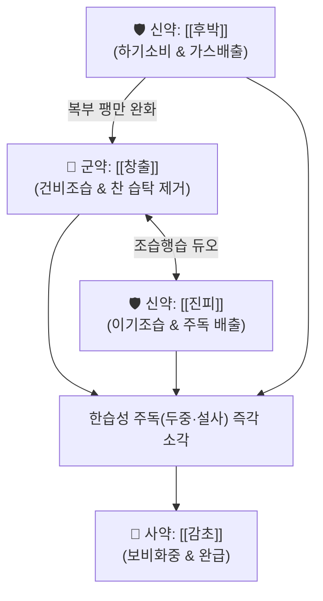

# 🍵 [[대금음자]] (對金飮子, Daegeum-eumja)

> **핵심 요약 (Key Summary)**:
> - 🌿 [[진피]], [[후박]], [[창출]], [[감초]] 배오 ([[평위산]] 골격에 주상(酒傷)·한습(寒濕)으로 인한 담음을 말리고 위장을 덥히는 기본 방제).
> - 🎯 차가운 술(맥주 등)을 과음하여 머리가 멍하게 아프고(두중), 구토, 설사, 오한 등 몸이 냉해진 한습성(寒濕性) 주독(酒毒) 및 식체.
> - 🔬 알코올 흡수 지연 및 위점막 혈류 개선, 위장관 평활근 경련 완화, 장내 수분 흡수 정상화 및 가스 배출.
> - ⚠️ 주의사항: 성질이 온조(溫燥)하여 오래 복용하면 비위 진액을 말릴 수 있으므로 단기 복용 원칙(오래 쓰면 안 됨).
---
## 📌 목차
1. [기본 처방 정보 & 군신좌사 구성](#1-기본-처방-정보--군신좌사-구성)
2. [방제학적 약재 상호작용 & 시너지 네트워크](#2-방제학적-약재-상호작용--시너지-네트워크)
3. [현대 분자약리학적 효능 & 작용 기전](#3-현대-분자약리학적-효능--작용-기전)
4. [적응 병증 및 체질별 감별 (Sweet Spot vs 금기)](#4-적응-병증-및-체질별-감별-sweet-spot-vs-금기)
5. [유사 처방군 감별 매트릭스](#5-유사-처방군-감별-매트릭스)
6. [임상 가감례 & 현대 질환별 응용](#6-임상-가감례--현대-질환별-응용)
7. [💡 사용자 진료실 핵심 필기 & 임상 팁 (원문 보존)](#7--사용자-진료실-핵심-필기--임상-팁-원문-보존)
8. [출처 및 학술 참고 문헌 (References)](#8-출처-및-학술-참고-문헌-references)
---
## 1. 기본 처방 정보 & 군신좌사 구성

* **출전**: 《태평혜민화제국방(太平惠民和劑局方)》 권삼(卷三)
* **치법**: 조습건비(燥濕健脾), 행기온중(行氣溫中), 소식해주(消食解酒), 화담지사(化痰止瀉)
* **표준 용법**: 1일 1첩에 생강 3쪽, 대추 2알을 넣고 전탕하여 따뜻하게 복용

| 구분 | 약재명 | 표준 용량 | 본초 효능 & 방제 내 역할 |
| :--- | :--- | :--- | :--- |
| **군약 (君藥)** | [[창출]] | 8~12g | 조습건비(燥濕健脾), 거풍산한, 비위의 차가운 습탁(寒濕)을 강력히 말리고 비기능 회복 |
| **신약 (臣藥)** | [[후박]] | 6~8g | 하기소비(下氣消痞), 조습화담, 위장의 팽만감과 헛배부름, 가스 정체 해소 |
| **신약 (臣藥)** | [[진피]] | 6~8g | 이기조습(理氣燥濕), 화위지구, 기 순환을 도와 주독과 담음 정체 배출 |
| **사약 (使藥)** | [[감초]] | 3~4g | 보비익기, 완급지통, 제약 조화 및 온조한 약성 완충 |

> **배오 특징**: 기본적으로 [[평위산]](창출·후박·진피·감초)과 약재 구성이 동일하나, 《화제국방》에서 '대금음자(對金飮子)'라는 독자적인 처방명을 부여하여 **차가운 술이나 찬 음료로 인해 비위가 차가워지고 담음(痰飮)이 엉켜 설사·두통을 유발하는 한습성 주상(酒傷)**에 특화시켰습니다. 창출의 조습력과 후박·진피의 행기력으로 위장에 고인 찬 수분을 날려버립니다.
---
## 2. 방제학적 약재 상호작용 & 시너지 네트워크

* [[창출]] + [[진피]] 배오: 찬 맥주나 냉음료 과음으로 위장관에 고인 냉습(冷濕)을 창출이 말리고, 진피가 기를 돌려 주독을 배출시키는 핵심 약대입니다.
* [[후박]] + [[감초]] 배오: 장관 평활근의 경련을 가라앉히면서 헛배부름과 복통을 완화합니다.
---
## 3. 현대 분자약리학적 효능 & 작용 기전

### 1) 위장관 점막 혈류 개선 및 알코올 흡수 지연
* **주요 성분**: [[진피]] 헤스페리딘, [[후박]] 마그놀롤.
* **기전**: 차가운 알코올로 인해 혈관이 수축된 위점막에 혈류를 공급하고, 위점막 점액 분비를 촉진하여 급성 알코올성 위염 손상을 완화합니다.

### 2) 위장관 연동운동 정상화 및 삼출성 설사 억제
* **주요 성분**: [[창출]] 아트락틸로딘(Atractylodin), [[후박]] 호노키올.
* **기전**: 장관 평활근의 과도한 수축과 경련을 억제하여 복통을 줄이고, 대장 점막의 수분 재흡수를 도와 찬 술 섭취 후 발생하는 묽은 물설사를 멎게 합니다.
---
## 4. 적응 병증 및 체질별 감별 (Sweet Spot vs 금기)

[✅ 최적 적응증 (Sweet Spot)]
• 맥주, 막걸리, 냉음료 등 차가운 술이나 음식을 많이 마셔서 머리가 무겁고 멍하게 아픈(두중감) 증상
• 찬 술을 마신 후 뱃속에서 꾸룩꾸룩 소리가 나며 물설사를 하고 몸이 으슬으슬 차가워지는 한증(寒證) 주독
• 급성 식체로 인한 구역감, 헛배부름, 트림
• 설진/맥진: 설질담백(淡白), 설태백니(白膩, 하얗고 두껍게 낀 미끈한 태), 맥침완(沈緩) 또는 유(濡)

[⚠️ 신중 투여 및 금기 (Caution / Contraindication)]
• 열성 주독(酒毒): 도수가 높은 독주(양주·고량주)를 마시고 얼굴이 붉게 달아오르며 갈증이 심한 환자에게는 [[갈화해성탕]]이나 [[황련해독탕]]을 써야 하며 대금음자는 금기
• 장기 복용 금기: 성질이 온조(溫燥)하여 오래 복용하면 비위의 진액을 말리므로 단기 복용에 한함 (원장님 필기: "오래 쓰면 안 된다")
---
## 5. 유사 처방군 감별 매트릭스

| 처방명 | 핵심 구성 차이 | 주치 및 임상 차별점 | 맥진/설진 차이 |
| :--- | :--- | :--- | :--- |
| [[대금음자]] | 창출·후박·진피·감초 (평위산 동형) | **차가운 술(맥주) 과음, 두통, 물설사, 몸이 찬 한습 상태** | 맥침완(沈緩), 백니태 |
| [[갈화해성탕]] | 갈화·지구자·사인·백두구·청피 등 | **일반적 주상(숙취), 구토와 갈증, 열성 주독 해소** | 맥부완(浮緩), 백황니태 |
| [[간담습열방]] | 갈화·인진호·지구자 + 황련·봉출·삼릉 | **만성 알코올성 간염, 간경화, 간수치 급상승, 고도 습열** | 맥현활삭(弦滑數), 황니태 |
| [[반하사심탕]] | 반하·황금·황련·인삼·건강·감초 | **한열착잡 심하비만, 구역질과 설사가 교차하는 만성 위장염** | 맥활삭(滑數), 황백태 |
---
## 6. 임상 가감례 & 현대 질환별 응용

* **수반 증상별 가감법**:
  * 구토와 숙취가 심할 때 $\rightarrow$ + [[갈화]] 6g, [[반하]] 6g
  * 뱃속이 얼음장처럼 차갑고 설사가 심할 때 $\rightarrow$ + [[건강]] 4g, [[육계]] 2g
  * 소변이 시원치 않고 몸이 부을 때 $\rightarrow$ + [[복령]] 6g, [[택사]] 6g
* **현대 질환 매핑**:
  * 맥주 과음 후의 알코올성 설사, 숙취성 두통(두중감)
  * 냉방병을 동반한 급성 소화불량, 한습성 급성 장염
---
## 7. 💡 사용자 진료실 핵심 필기 & 임상 팁 (원문 보존)

> [!tip] **진료실 실전 노하우 (User Clinical Insight)**
> - **구성**: [[진피]], [[후박]], [[창출]], [[감초]]
> - **적응증**:
>   - **담음을 없애고 술 깨는 처방**
>   - **맥주와 같은 차가운 술을 많이 먹어서 머리도 멍하게 아프고 설사도 하고 몸이 한증의 상태를 보일 때 활용**
> - **참고 및 주의사항**:
>   - **오래 쓰면 안 된다.**
---
## 8. 출처 및 학술 참고 문헌 (References)

1. **송대 태의국 (1151년)**. 『태평혜민화제국방(太平惠民和劑局方)』 권삼(卷三) 치비위(治脾胃).
   - **[고전 원전]**: "對金飮子, 治酒食所傷, 腹脇膨脹, 嘔逆泄瀉, 頭重惡寒." (대금음자는 술과 음식에 상하여 복협이 팽창하고 구역질과 설사를 하며 머리가 무겁고 오한이 나는 것을 치료한다.)
2. **Kim, Y. S. et al. (2017)**. *Gastroprotective effects of Pyeongwi-san and its modified formulas against alcohol-induced gastric mucosal injury in rats*. **Journal of Korean Medicine**, 38(3), 85-94.
   - **[연구 요약]**: 평위산 및 대금음자 구성 추출물이 에탄올 유발 급성 위점막 손상에서 항산화 효소를 증가시키고 위벽 손상 면적을 현저히 감소시킴을 확인.