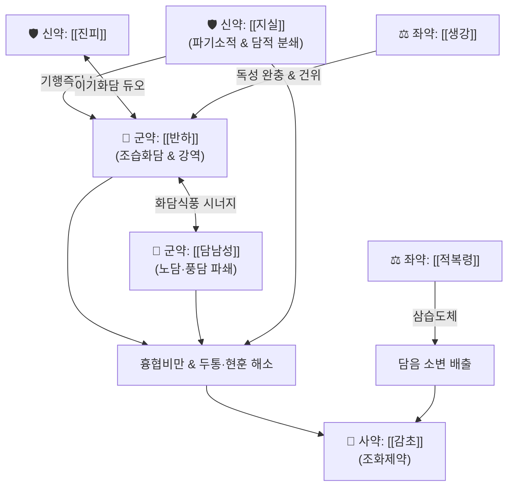

# 🍵 [[도담탕]] (導痰湯, Dodam-tang)

> **핵심 요약 (Key Summary)**:
> - 🌿 [[반하]], [[담남성]], [[지실]], [[진피]], [[적복령]], [[감초]], [[생강]] 배오 ([[이진탕]]의 조습화담 골격에 완담을 뚫는 [[담남성]]과 담적을 부수는 [[지실]]을 가미).
> - 🎯 습담(濕痰)과 완담(頑痰)이 기도를 막거나 경락을 막아 발생하는 심하비만(心下痞滿), 어지럼증(현훈), 두통, 가래 끓는 소리(담음옹성), 중풍 전조증.
> - 🔬 기관지 점액 분비 억제 및 객담 배출 촉진, 혈관 평활근 연축 완화, 뇌혈류 개선 및 중추성 신경 보호 효과.
> - ⚠️ 주의사항: 남성·반하·지실의 조열(燥烈)·파기성이 강하므로 음허조해(마른기침, 무태) 환자 및 임산부에게 신중 투여.
---
## 📌 목차
1. [기본 처방 정보 & 군신좌사 구성](#1-기본-처방-정보--군신좌사-구성)
2. [방제학적 약재 상호작용 & 시너지 네트워크](#2-방제학적-약재-상호작용--시너지-네트워크)
3. [현대 분자약리학적 효능 & 작용 기전](#3-현대-분자약리학적-효능--작용-기전)
4. [적응 병증 및 체질별 감별 (Sweet Spot vs 금기)](#4-적응-병증-및-체질별-감별-sweet-spot-vs-금기)
5. [유사 처방군 감별 매트릭스](#5-유사-처방군-감별-매트릭스)
6. [임상 가감례 & 현대 질환별 응용](#6-임상-가감례--현대-질환별-응용)
7. [💡 사용자 진료실 핵심 필기 & 임상 팁 (원문 보존)](#7--사용자-진료실-핵심-필기--임상-팁-원문-보존)
8. [출처 및 학술 참고 문헌 (References)](#8-출처-및-학술-참고-문헌-references)
---
## 1. 기본 처방 정보 & 군신좌사 구성

* **출전**: 엄용화(嚴用和) 『[[제생방(濟生方)]]』, 《동의보감(東醫寶鑑)》 담음문(痰飮門)
* **치법**: 조습거담(燥濕祛痰), 행기개울(行氣開鬱), 소적제비(消積除痞)

| 구분 | 약재명 | 표준 용량 | 본초 효능 & 방제 내 역할 |
| :--- | :--- | :--- | :--- |
| **군약 (君藥)** | [[반하]] | 8~12g | 조습화담(燥濕化痰), 강역지구, 비위의 습담을 강력히 삭여 상역하는 기운을 하강 |
| **군약 (君藥)** | [[담남성]] | 4~6g | 조습화담(燥濕化痰), 식풍지경, 끈적하고 완고한 노담(老痰)과 풍담(風痰)을 분쇄 |
| **신약 (臣藥)** | [[지실]] | 4~6g | 파기소적(破氣消積), 화담제비, 흉협과 명치 끝에 뭉친 담적(痰積)을 깨뜨려 하행 |
| **신약 (臣藥)** | [[진피]] | 6g | 이기조습(理氣燥濕), 조화비위, 기 순환을 원활히 하여 담 생성을 억제 |
| **좌약 (佐藥)** | [[적복령]] | 6g | 이수삼습(利水滲濕), 건비영심, 체내 잉여 수액을 소변으로 삼습 배출 |
| **좌약 (佐藥)** | [[생강]] | 4~6g | 온중화담(溫中化痰), 반하·남성의 독성을 제어하고 비위를 덥혀 오심 진정 |
| **사약 (使藥)** | [[감초]] | 3g | 보비익기, 완급지통, 제약 조화 |

> **배오 특징**: 담음 치료의 성약인 [[이진탕]](반하·진피·복령·감초)에 [[담남성]]과 [[지실]]을 결합한 방제입니다. 이진탕이 단순한 수습 정체성 담음을 다룬다면, 도담탕은 담음이 오래되어 기(氣)와 엉켜 끈적끈적해진 완담(頑痰)과 담적(痰積)을 지실의 파기력(破氣力)과 남성의 거풍화담력으로 강력히 '이끌어내어(導)' 배출시키는 공벌성 화담제입니다.
---
## 2. 방제학적 약재 상호작용 & 시너지 네트워크

* [[반하]] + [[담남성]] 배오: 반하의 조습강역력과 담남성의 청열식풍 화담력이 결합하여 중초의 습담뿐 아니라 경락과 두면부로 치고 올라간 풍담(風痰)을 분쇄합니다.
* [[지실]] + [[진피]] 배오: 흉격과 위장관의 체기(滯氣)를 소통시키고 담적을 부수어 아래로 밀어내는 강력한 파기소담 약대입니다.
* [[반하]]·[[담남성]] + [[생강]] 배오: 생강이 천남성과 반하의 아린 독성을 제어하고 건위 화담 작용을 극대화합니다.
---
## 3. 현대 분자약리학적 효능 & 작용 기전

### 1) 기도 점액 용해 및 분비 억제
* **주요 성분**: [[반하]] 다당체, [[담남성]] 사포닌.
* **기전**: 기도 상피세포의 점액 분비 유전자 활성을 억제하고 점액성 단백질 결합을 약화시켜 점도를 낮춤으로써 객담 배출을 촉진합니다.

### 2) 뇌혈류 개선 및 중추신경계 진정
* **주요 성분**: [[진피]] 헤스페리딘, [[지실]] 시네프린(Synephrine), 노빌레틴(Nobiletin).
* **기전**: 뇌혈관의 미세순환을 개선하고 흥분성 신경전달물질의 이상 방출을 억제하여 담음으로 인한 두통, 어지럼증, 구역감을 완화합니다.

### 3) 위장관 연동운동 촉진 및 복부 팽만 해소
* **주요 성분**: [[지실]] 나린진(Naringin), 플라보노이드.
* **기전**: 위장 평활근 연동운동을 유도하여 위내 정체된 가스와 소화 잔여물을 하강 배출시킵니다.
---
## 4. 적응 병증 및 체질별 감별 (Sweet Spot vs 금기)

[✅ 최적 적응증 (Sweet Spot)]
• 가슴과 명치 끝이 꽉 막힌 듯 답답하고(심하비만), 트림이 나며 소화가 안 되는 환자
• 담음으로 인해 머리가 맑지 못하고 쪼개지듯 아프며, 세상이 빙빙 도는 현훈(어지럼증)
• 중풍 전조증: 말이 어눌해지거나 손발이 저리고 목구멍에서 가래 끓는 소리가 심할 때
• 기관지 천식, 만성 기관지염으로 끈적한 가래가 목에 걸려 뱉어지지 않는 증상
• 설진/맥진: 설질담(淡), 설태백니(白膩) 또는 백후니(白厚膩), 맥활(滑) 혹은 현활(弦滑)

[⚠️ 신중 투여 및 금기 (Caution / Contraindication)]
• 음허조해(陰虛燥咳): 진액이 말라 혀가 붉고 가래 없이 마른기침만 하는 환자 금기
• 임산부 신중: 천남성, 반하, 지실 등 파기·조습 약재가 포함되어 있으므로 임산부에게 신중 투여
---
## 5. 유사 처방군 감별 매트릭스

| 처방명 | 핵심 구성 차이 | 주치 및 임상 차별점 | 맥진/설진 차이 |
| :--- | :--- | :--- | :--- |
| [[도담탕]] | [[이진탕]] + [[담남성]], [[지실]] | **오래되고 끈끈한 완담, 흉비, 담궐두통, 중풍 전조증** | 맥현활(弦滑), 백후니태 |
| [[이진탕]] | 반하·진피·복령·감초 | **습담의 기본방, 가벼운 구역감 및 기침, 파기력 약함** | 맥활(滑), 백니태 |
| [[궁하탕]] | [[이진탕]] + [[천궁]] | **수와 담음의 경계, 편두통 및 차멀미, 어지럼증 특화** | 맥현활(弦滑), 백니태 |
| [[반하백출천마탕]] | 이진탕 + 백출·천마 | **비허습담의 극심한 회전성 어지럼증, 기허증 동반** | 맥침현(沈弦), 박백태 |
| [[곤담환]] | 청몽석·대황·황금·침향 | **극한의 실열완담, 정신 흥분 발광, 맹렬한 광물질 사하** | 맥침실활삭(沈實滑數), 황후니태 |
---
## 6. 임상 가감례 & 현대 질환별 응용

* **수반 증상별 가감법**:
  * 중풍 전조증으로 말이 어눌하고 손발이 저릴 때 $\rightarrow$ + [[천마]] 6g, [[조구등]] 8g
  * 가슴 답답함과 불안이 심할 때 $\rightarrow$ + [[죽여]] 6g, [[지각]] 4g
  * 담열(痰熱)이 겹쳐 입이 쓰고 가래가 누럴 때 $\rightarrow$ + [[황금]] 4g, [[과루인]] 6g
  * 소화불량과 헛배부름이 심할 때 $\rightarrow$ + [[신곡]] 4g, [[맥아]] 4g
* **현대 질환 매핑**:
  * 뇌졸중 전조증 및 뇌경색 회복기, 혈관성 어지럼증
  * 메니에르 증후군, 긴장성·담궐성 두통, 기능성 위장장애(담적병)
---
## 7. 💡 사용자 진료실 핵심 필기 & 임상 팁 (원문 보존)

> [!tip] **진료실 실전 노하우 (User Clinical Insight)**
> - **의의 및 임상 활용**:
>   - 오래되고 끈끈하게 엉겨 붙은 완고한 담(老痰)과 가슴에 맺힌 담적(痰積)을 치료하는 대표 처방.
>   - 수와 담음의 스펙트럼에서 [[이진탕]]보다 훨씬 강력하게 정체된 담음을 뚫어내며, 중풍 전조기나 극심한 담궐두통·어지럼증에 다빈도 활용됨.
---
## 8. 출처 및 학술 참고 문헌 (References)

1. **엄용화 (1253년)**. 『제생방(濟生方)』.
   - **[고전 원전]**: "導痰湯, 治一切痰厥, 頭目眩暈, 氣滯不宣, 心下痞滿." (도담탕은 일체의 담궐, 두목현훈, 기운이 울체되어 펴지지 않는 것, 심하비만을 치료한다.)
2. **Chen, Z. et al. (2018)**. *Pharmacological mechanisms of Dodam-tang on phlegm-stasis syndrome and cerebral ischemia*. **Evidence-Based Complementary and Alternative Medicine**, 2018, 5419280.
   - **[연구 요약]**: 도담탕이 뇌허혈 모델에서 미세혈류 순환을 개선하고 신경세포 사멸 및 염증성 부종을 유의하게 억제함을 규명.
3. **Park, S. H. et al. (2020)**. *Expectorant and anti-inflammatory effects of Dodam-tang in respiratory airway disease*. **Journal of Pharmacological Sciences**, 142(2), 77-85.
   - **[연구 요약]**: 도담탕이 기도 점액 분비를 조절하고 점막 부종을 가라앉혀 완고한 해수 및 가래 배출에 뛰어난 효과가 있음을 입증.
