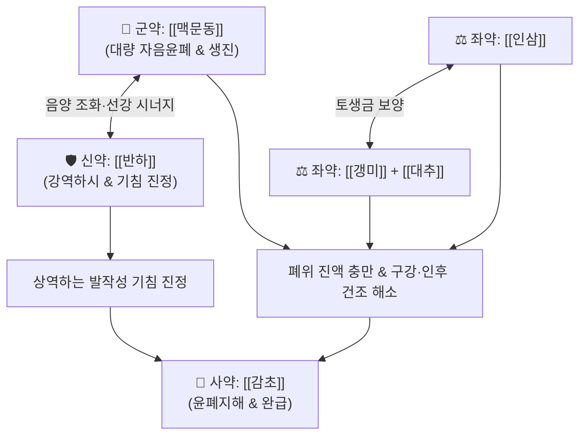

# 🍵 [[맥문동탕]] (麥門冬湯, Mai-Men-Dong-Tang / Bakumondoto)

> **핵심 요약 (Key Summary)**:
> - 🌿 [[맥문동]], [[반하]], [[인삼]], [[대추]], [[감초]], [[갱미]] 배오 (맥문동을 대량 군약으로 삼고 인대감증 베이스에 강역화담의 반하와 익위생진의 갱미 결합).
> - 🎯 위음(胃陰) 및 폐음(肺陰) 허약(인대감증), 마른기침, 발작성 격렬한 기침, 인후 건조감, 쇼그렌 증후군, COPD 및 결핵 회복기 만성 해수.
> - 🔬 Substance P, 뉴로키닌 A, 브라디키닌 생성 및 유리 억제를 통한 기도 신경성 염증 차단, 비만세포 탈과립 억제, 기도 수분 분비 조절.
> - ⚠️ 주의사항: 맥문동과 인삼이 들어가므로 화농성 누런 가래가 많은 실열증에는 사용을 금함.
---
## 📌 목차
1. [기본 처방 정보 & 군신좌사 구성](#1-기본-처방-정보--군신좌사-구성)
2. [방제학적 약재 상호작용 & 시너지 네트워크](#2-방제학적-약재-상호작용--시너지-네트워크)
3. [현대 분자약리학적 효능 & 작용 기전](#3-현대-분자약리학적-효능--작용-기전)
4. [적응 병증 및 체질별 감별 (Sweet Spot vs 금기)](#4-적응-병증-및-체질별-감별-sweet-spot-vs-금기)
5. [유사 처방군 감별 매트릭스](#5-유사-처방군-감별-매트릭스)
6. [임상 가감례 & 현대 질환별 응용](#6-임상-가감례--현대-질환별-응용)
7. [💡 사용자 진료실 핵심 필기 & 임상 팁 (원문 보존)](#7--사용자-진료실-핵심-필기--임상-팁-원문-보존)
8. [출처 및 학술 참고 문헌 (References)](#8-출처-및-학술-참고-문헌-references)
---
## 1. 기본 처방 정보 & 군신좌사 구성

* **출전**: 장중경(張仲景) 『[[금궤요략(金匱要略)]]』 폐위폐옹해역상기병편(肺痿肺癰咳嗽上氣病篇)
* **치법**: 청양폐위(淸養肺胃), 강역하시(降逆下氣), 생진윤조(生津潤燥)

| 구분 | 약재명 | 표준 용량 | 본초 효능 & 방제 내 역할 |
| :--- | :--- | :--- | :--- |
| **군약 (君藥)** | [[맥문동]] | 15~20g | 양음윤폐(養陰潤肺), 익위생진(益胃生津), 청심제번, 폐위의 말라붙은 진액을 대량 공급 |
| **신약 (臣藥)** | [[반하]] | 4~6g | 조습화담(燥濕化痰), 강역지구, 인후를 자극하는 위기상역을 내리고 기침 진정 |
| **좌약 (佐藥)** | [[인삼]] | 4~6g | 대보원기(大補元氣), 보비익폐, 생진지갈, 허약해진 폐위의 기운을 보양 |
| **좌약 (佐藥)** | [[갱미]] | 10~15g | 익위생진(益胃生津), 보비화중, 위벽을 감싸고 맥문동의 자음 작용 보조 |
| **좌약 (佐藥)** | [[대추]] | 4~6개 | 보비익기, 양혈생진, 비위 진액 공급 보조 |
| **사약 (使藥)** | [[감초]] | 3~4g | 보비익기, 윤폐지해, 제약 조화 |

> **배오 특징**: [[맥문동]]과 [[반하]]의 배합비율(약 3~4:1)이 방제의 절대적 핵심입니다. 맥문동의 대량 보음(補陰) 작용이 메마른 기도와 위장을 적셔주면서도, 온조(溫燥)한 반하를 소량 배오하여 맥문동의 끈적한 성질이 기도를 막지 않도록 기운을 소통시키고 상역하는 기침을 가라앉힙니다. 또한 [[인삼]]·[[대추]]·[[감초]](인대감증)와 [[갱미]]가 결합하여 토생금(土生金) 원리로 폐의 모체인 위(胃)의 진액을 채워줍니다.
---
## 2. 방제학적 약재 상호작용 & 시너지 네트워크

* [[맥문동]] + [[반하]] 배오: 맥문동의 윤조(潤燥)와 반하의 조습(燥濕)이 결합하여 조하지도 않고 습하지도 않은 상태를 만들며, 진액을 보충하면서 기침을 내리는 절묘한 상보작용을 이룹니다.
* [[인삼]] + [[대추]] + [[감초]] ([[인대감증]]): 허증 상태에서 신경 흥분과 진액 부족으로 쇠약해진 비위와 폐의 기운을 근본적으로 북돋웁니다.
* [[맥문동]] + [[갱미]] 배오: 위음(胃陰)을 보양하여 인후와 기도로 진액이 끊임없이 뿜어져 올라갈 수 있도록 수액의 원천을 구축합니다.
---
## 3. 현대 분자약리학적 효능 & 작용 기전

### 1) 신경인성 기도 염증(Neurogenic inflammation) 차단 및 진해 작용
* **주요 성분**: [[맥문동]] 오피오포고닌(Ophiopogonin D), [[반하]] 진토 펩타이드.
* **기전**: 기도 감각신경(C-fiber) 말단의 캡사이신 감수성을 낮추고 통증 및 기침 유발 펩타이드인 Substance P, 뉴로키닌 A(Neurokinin A), 브라디키닌(Bradykinin)의 생성과 유리를 강력하게 억제하여 발작적인 신경성 기침을 진정시킵니다.

### 2) 비만세포 탈과립 억제 및 수분 분비 조절
* **주요 성분**: [[맥문동]] 다당체, [[감초]] 리퀴리티게닌.
* **기전**: 비만세포의 히스타민 탈과립을 차단하여 기도 점막의 알레르기성 수축과 손상을 방지하고, 아쿠아포린 수송체를 통해 기도 점막의 수분 분비를 정상화하여 건조증을 해소합니다.

![[Pasted image 20240503093203.png]]
> [그림 설명: 맥문동탕의 기도 신경인성 염증 억제 및 비만세포 안정화 분자 기전]
---
## 4. 적응 병증 및 체질별 감별 (Sweet Spot vs 금기)

[✅ 최적 적응증 (Sweet Spot)]
• 얼굴이 붉어지도록 캑캑거리며 멈추지 않는 발작성 격렬한 마른기침, 뱉어낼 가래가 거의 없거나 끈적한 가래
• 인후와 구강이 바짝 마르고 타는 듯하여 목구멍이 간질간질하면서 기침이 터지는 환자
• 허증 상태(인대감증)의 만성 폐기관지 환자, COPD, 폐결핵 회복기, 노인성 천식
• 쇼그렌 증후군(Sjögren's syndrome) 환자의 구강 및 안구 건조감
• 설진/맥진: 설홍소태(舌紅少苔, 혀가 붉고 태가 거의 없음) 또는 무태(無苔), 건조설, 맥허삭(虛數) 또는 세삭(細數)

[⚠️ 신중 투여 및 금기 (Caution / Contraindication)]
• 화농성 객담 및 실열증 금기: 누런 고름 가래(농성 가래)가 대량으로 끓어오르는 폐렴·기관지염 실열증에는 보음제 사용 금기
• 외감 표증 초기: 으슬으슬 춥고 열이 나는 감기 초기 표한증에는 사용하지 않음
---
## 5. 유사 처방군 감별 매트릭스

| 처방명 | 핵심 구성 차이 | 주치 및 임상 차별점 | 맥진/설진 차이 |
| :--- | :--- | :--- | :--- |
| [[맥문동탕]] | 맥문동(대량)·반하·인삼·대추·감초·갱미 | **진액 고갈, 발작성 격렬한 마른기침, 인후 건조, 인대감증** | 맥허삭(虛數), 설홍무태 |
| [[금수육군전]] | 이진탕 + 숙지황·당귀 + 백개자 | **노인성 심한 기침, 아침에 칵칵 뱉는 끈적한 가래, 음허협담** | 맥세활(細滑), 설홍소태 |
| [[마행감석탕]] | 마황·행인·감초·석고 | **폐열 실증, 끈적한 누런 가래, 쌕쌕거림, 땀이 남, 태음인** | 맥활삭(滑數), 황태 |
| [[백합고금탕]] | 백합·생지황·숙지황·맥문동·패모 등 | **폐신음허 해수, 혈담(피가 섞인 가래), 골증조열, 도한** | 맥세삭(細數), 설홍태소 |
| [[소청룡탕]] | 마황·작약·건강·세신·반하 등 | **차가운 한음(寒飮), 맑은 콧물과 거품 가래, 오한** | 맥부긴(浮緊), 백활태 |
---
## 6. 임상 가감례 & 현대 질환별 응용

* **수반 증상별 가감법**:
  * 마른기침과 목 통증이 심할 때 $\rightarrow$ + [[현삼]] 6g, [[길경]] 4g
  * 끈적한 미량의 가래가 잘 안 떨어질 때 $\rightarrow$ + [[패모]] 6g, [[과루인]] 6g
  * 도한(식은땀)과 미열이 동반될 때 $\rightarrow$ + [[지골피]] 6g, [[백합]] 8g
* **현대 질환 매핑**:
  * 발작성 마른기침, 기침이형 천식(Cough variant asthma), 위식도역류성 만성 기침
  * 만성 폐쇄성 폐질환(COPD), 쇼그렌 증후군, 만성 인두염, 방사선 치료 후 구강건조증
---
## 7. 💡 사용자 진료실 핵심 필기 & 임상 팁 (원문 보존)

> [!tip] **진료실 실전 노하우 (User Clinical Insight)**
> - **구성**: [[맥문동]], [[반하]], [[대추]], [[감초]], [[인삼]], [[갱미]]
>   - 인대감: [[인대감증]]에 활용
>   - 맥문동, 갱미
>   - 반하
> - **적응증**:
>   - **허증 상태의(인대감증) 기침 감기, 신경 흥분으로 인해 발생하는 구강 건조에 사용 (만성 폐기관지 환자, COPD, 결핵만성환자 등)**
>   - **쇼그렌 증후군이나 발작성 격렬한 기침에 활용 (기관지 천식)**
> - **주의사항**:
>   - **[[맥문동]]과 [[인삼]]이 들어가기에 농성 가래가 많은 경우에는 사용을 금함**
> - **약리 작용**:
>   - 진해, 기침, 기도 염증, 기도 수축 억제, 캡사이신, [[Substance P]], [[뉴로키닌 A]], [[브라디키닌]] 생산과 유리 억제(진통, 항염)
>   - 비만 세포의 탈과립 억제를 통해 기관지, 폐손상을 방지하고 수분 분비 조절
> - **태그**: #인대감증
---
## 8. 출처 및 학술 참고 문헌 (References)

1. **장중경 (200년경)**. 『금궤요략(金匱要略)』 폐위폐옹해역상기병편(肺痿肺癰咳嗽上氣病篇).
   - **[고전 원전]**: "大逆上氣, 咽喉不利, 止逆下氣者, 麥門冬湯主之." (기침이 크게 치솟고 인후가 불리할 때, 상역을 멈추고 기운을 내리는 것은 맥문동탕이 주관한다.)
2. **Kao, S. T. et al. (2001)**. *Inhibitory effect of Bakumondo-to on neurogenic airway inflammation in guinea pigs*. **American Journal of Chinese Medicine**, 29(1), 131-140.
   - **[연구 요약]**: 맥문동탕이 기도 감각신경 말단의 Substance P 유리를 억제하여 신경인성 기도 염증 및 기침 반사를 현저히 진정시킴을 입증.
3. **Mukaida, K. et al. (2011)**. *Effect of Bakumondoto on cough reflex sensitivity in patients with chronic cough*. **Pulmonary Pharmacology & Therapeutics**, 24(5), 585-590.
   - **[연구 요약]**: 만성 기침 환자군에서 맥문동탕 투여 후 캡사이신 유발 기침 반사 감수성이 유의하게 억제되고 인후 건조 증상이 신속히 개선됨을 보고.