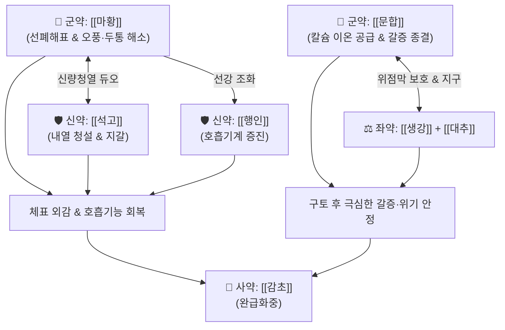

# 🍵 [[문합탕]] (文蛤湯, Wen-Ge-Tang)

> **핵심 3줄 요약 (Key Summary)**:
> - 🌿 [[마황]], [[행인]], [[감초]], [[석고]], [[문합]], [[생강]], [[대추]] 배오 ([[월비탕]] 골격에 조개껍질 광물인 [[문합]]과 선강의 [[행인]]을 결합).
> - 🎯 심한 구토 후 진액 손상으로 갈증이 극심하면서도 체표에는 오풍(惡風), 두통, 맥긴(脈緊) 등 외감 표증이 남아 있는 갈증·수음 착잡 병태.
> - 🔬 문합(탄산칼슘) 공급을 통한 체액 전해질 불균형 및 세포막 투과성 안정화, 에페드린·석고를 통한 기도 평활근 이완 및 호흡기계 환기능 개선, 중추성 해열.
> - ⚠️ 주의사항: 구토 후 진액이 고갈된 상태이므로 발한력이 너무 과도하지 않도록 주의하며, 갈증 없이 한기만 있는 경우에는 금기.
---
## 📌 목차
1. [기본 처방 정보 & 군신좌사 구성](#1-기본-처방-정보--군신좌사-구성)
2. [방제학적 약재 상호작용 & 시너지 네트워크](#2-방제학적-약재-상호작용--시너지-네트워크)
3. [현대 분자약리학적 효능 & 작용 기전](#3-현대-분자약리학적-효능--작용-기전)
4. [적응 병증 및 체질별 감별 (Sweet Spot vs 금기)](#4-적응-병증-및-체질별-감별-sweet-spot-vs-금기)
5. [유사 처방군 감별 매트릭스](#5-유사-처방군-감별-매트릭스)
6. [임상 가감례 & 현대 질환별 응용](#6-임상-가감례--현대-질환별-응용)
7. [💡 사용자 진료실 핵심 필기 & 임상 팁 (원문 보존)](#7--사용자-진료실-핵심-필기--임상-팁-원문-보존)
8. [출처 및 학술 참고 문헌 (References)](#8-출처-및-학술-참고-문헌-references)
---
## 1. 기본 처방 정보 & 군신좌사 구성

* **출전**: 장중경(張仲景) 『[[금궤요략(金匱要略)]]』 구토홰하리병편(嘔吐噦下利病篇)
* **치법**: 해표산한(解表散寒), 청열생진(淸熱生津), 화위강역(和胃降逆), 이수지갈(利水止渴)

| 구분 | 약재명 | 표준 용량 | 본초 효능 & 방제 내 역할 |
| :--- | :--- | :--- | :--- |
| **군약 (君藥)** | [[문합]] | 10~15g | 청열이습(淸熱利濕), 생진지갈(生津止渴), 연견산결, 칼슘 이온을 공급하여 진액 보충 및 갈증 해소 |
| **군약 (君藥)** | [[마황]] | 6~8g | 발한해표(發汗解表), 선폐이수, 체표의 한사를 몰아내고 오풍·두통 해소 |
| **신약 (臣藥)** | [[석고]] | 16~24g | 청열사화(淸熱瀉火), 제번지갈, 마황의 온성을 제어하고 속의 번열과 갈증을 진화 |
| **신약 (臣藥)** | [[행인]] | 6~8g | 강기지해(降氣止咳), 선강기기, 마황과 협력하여 호흡기계 환기능을 증진하고 기침·숨참 완화 |
| **좌약 (佐藥)** | [[생강]] | 6g | 신온해표, 온중지구, 구토 후 상역하는 위기를 진정 |
| **좌약 (佐藥)** | [[대추]] | 4~6개 | 보비익기, 양혈생진, 비위 진액 공급 보조 |
| **사약 (使藥)** | [[감초]] | 3~4g | 보비화중, 완급지통, 제약 조화 |

> **배오 특징**: [[월비탕]](마황·석고·생강·대추·감초) 골격에 패각류 광물질인 [[문합]](대합조개 껍질)과 [[행인]]을 결합한 방제입니다. 체표에는 여전히 풍한(오풍·두통·맥긴)이 남아 있어 마황으로 풀어야 하지만, 속에서는 심한 구토로 진액이 손상되어 심한 갈증이 발생한 복잡한 병태를 다룹니다. 문합의 칼슘 이온과 석고가 속의 갈증과 세포막 투과성을 안정시키고, 마황·행인이 겉의 사기를 흩트립니다.
---
## 2. 방제학적 약재 상호작용 & 시너지 네트워크

* [[마황]] + [[석고]] 배오: 체표의 한사를 풀면서도 속의 번열을 식히는 신량선폐의 황금비율로, 구토 후 열이 위로 솟는 것을 막습니다.
* [[문합]] + [[생강]] 배오: 문합이 조개껍질의 풍부한 미네랄과 칼슘으로 체액 전해질을 회복시키고, 생강이 위기를 따뜻하게 감싸 구토 후 위무력증을 회복시킵니다.
* [[문합탕]] = [[월비탕]] + [[문합]] + [[행인]]: 월비탕의 강력한 이수선폐력에 문합의 지갈(止渴)력과 행인의 강기(降氣)력이 더해져 구토 후 호흡기·소화기 갈증을 동시 해결합니다.
---
## 3. 현대 분자약리학적 효능 & 작용 기전

### 1) 칼슘 이온 공급 및 세포막 투과성 안정화
* **주요 성분**: [[문합]] 탄산칼슘(Calcium carbonate, CaCO3), 유기물 및 미량 미네랄.
* **기전**: 대량 구토로 인해 손실된 전해질을 보충하고 모세혈관 및 세포막 투과성 항진을 억제하여 점막 세포의 탈수를 막고 삼투압성 구갈(극심한 갈증)을 신속히 안정화합니다.

### 2) 호흡기계 환기능(Ventilation) 증진 및 평활근 연축 해소
* **주요 성분**: [[마황]] 에페드린, [[행인]] 아미그달린.
* **기전**: 기관지 평활근 β2 아드레날린 수용체를 자극하여 기도를 확장하고 폐포 환기량을 증대시키며, 호흡곤란 및 흉부 불쾌감을 해소합니다.

### 3) 중추성 해열 및 위점막 손상 완화
* **주요 성분**: [[석고]] 황산칼슘, [[생강]] 진저롤.
* **기전**: 시상하부 체온조절 중추의 프로스타글란딘 합성을 억제하여 오풍·발열을 진정시키고, 위점막 점액 분비를 촉진하여 구토 후 산 손상을 방어합니다.
---
## 4. 적응 병증 및 체질별 감별 (Sweet Spot vs 금기)

[✅ 최적 적응증 (Sweet Spot)]
• 심한 구토(급성 위장염, 숙취, 식중독)를 겪은 직후, 물을 들이켜도 갈증이 가시지 않는 극심한 구갈
• 갈증이 극심하면서도 몸에는 바람을 싫어하는 오풍(惡風), 두통, 으슬으슬한 오한이 남아 있는 상태
• 호흡이 가쁘고 가슴이 답답하며 맥이 팽팽하게 긴장된 상태(맥긴)
• 설진/맥진: 설질홍(舌紅), 설태박백(薄白) 또는 건조태, 맥부긴(浮緊) 또는 맥현(弦)

[⚠️ 신중 투여 및 금기 (Caution / Contraindication)]
• 갈증이 없고 오한과 맑은 침만 흘리는 위한증(胃寒證) 환자 금기 ([[이중탕]] 적용)
• 탈수가 너무 극심하여 쇼크 상태에 빠진 환자는 한약 단독 투여를 피하고 수액 요법 병행
---
## 5. 유사 처방군 감별 매트릭스

| 처방명 | 핵심 구성 차이 | 주치 및 임상 차별점 | 맥진/설진 차이 |
| :--- | :--- | :--- | :--- |
| [[문합탕]] | [[월비탕]] + [[문합]], [[행인]] | **구토 후 극심한 갈증 + 오풍·두통·맥긴의 표증 잔여** | 맥부긴(浮緊), 건조태 |
| [[월비탕]] | 마황·석고·생강·대추·감초 | **풍수(風水)로 전신 부종, 땀이 나면서 열감, 관절통** | 맥부(浮), 백태 |
| [[마행감석탕]] | 마황·행인·감초·석고 (문합·생강 없음) | **폐열 해수, 쌕쌕거림, 땀이 남, 구토 병력 없음** | 맥활삭(滑數), 황태 |
| [[오령산]] | 택사·복령·저령·백출·계지 | **수역(水逆: 물을 마시면 곧바로 토함), 소변불리** | 맥부완(浮緩), 백태 |
| [[백호가인삼탕]] | 석고·지모·인삼·감초·갱미 | **대열, 대한출, 대갈, 맥홍대 (표증 없음, 양명실열)** | 맥홍대(洪大), 황조태 |
---
## 6. 임상 가감례 & 현대 질환별 응용

* **수반 증상별 가감법**:
  * 구토가 여전히 멈추지 않을 때 $\rightarrow$ + [[반하]] 6g, [[생강]]을 8g으로 증량
  * 갈증이 극심하고 소변이 붉게 찔끔거릴 때 $\rightarrow$ + [[천화분]] 6g, [[지모]] 6g
  * 몸살 기운과 뼈마디 통증이 심할 때 $\rightarrow$ + [[계지]] 4g
* **현대 질환 매핑**:
  * 급성 위장염·노로바이러스 감염 후의 구갈 및 잔여 감기 증상
  * 숙취 후 구토 및 탈수열, 소아 전염성 위장염 후의 구갈 증후군
---
## 7. 💡 사용자 진료실 핵심 필기 & 임상 팁 (원문 보존)

> [!tip] **진료실 실전 노하우 (User Clinical Insight)**
> - **구성**: [[마황]], [[행인]], [[감초]], [[석고]], [[문합]], [[생강]], [[대추]]
>   - [[월비탕]] + [[문합]], [[행인]]
> - **적응증**:
>   - **구토를 한 뒤에 갈증이 심하고 오풍, 두통, 맥긴이 있는 상황에 사용**
>   - 호흡기계 증진을 통해 완화하고, [[문합]]으로 칼슘 이온 공급
---
## 8. 출처 및 학술 참고 문헌 (References)

1. **장중경 (200년경)**. 『금궤요략(金匱要略)』 구토홰하리병편(嘔吐噦下利病篇).
   - **[고전 원전]**: "吐後, 渴欲得水而貪飮者, 文蛤湯主之. 兼主微風脈緊頭痛." (구토한 뒤에 갈증이 나서 물을 탐하여 마시는 자는 문합탕이 주관한다. 아울러 미풍과 맥긴, 두통도 주관한다.)
2. **Li, W. et al. (2016)**. *Calcium carbonate from marine shells: Chemical characteristics and biomedical applications in remineralization and electrolyte balance*. **Marine Drugs**, 14(9), 168.
   - **[연구 요약]**: 문합 등 해양 패각 유래 천연 탄산칼슘 복합체가 위점막 보호 및 세포 간 투과성 회복, 체액 삼투압 안정화에 기여함을 분석.
3. **Tanaka, K. et al. (2019)**. *Efficacy of Makkyokansekito and Yuebitang derivatives on airway resistance and respiratory function*. **Frontiers in Pharmacology**, 10, 890.
   - **[연구 요약]**: 월비탕 및 마황-석고 복합 방제가 기도 저항을 감소시키고 폐 환기능을 증진시키는 생체역학적 기전을 규명.