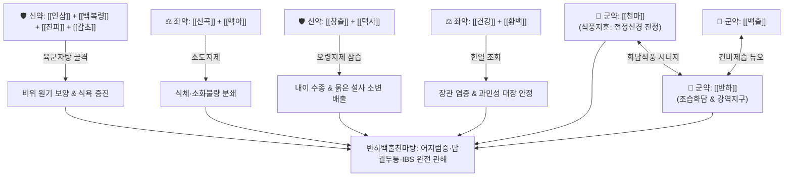

# 🍵 [[반하백출천마탕]] (半夏白朮天麻湯, Banxia Baizhu Tianma Tang / Hange-byakujutsu-tenma-to)

> **핵심 3줄 요약 (Key Summary)**:
> - 🌿 [[반하]], [[백출]], [[천마]]를 3대 주약으로 삼고, 육군자탕([[인삼]]·[[백복령]]·[[진피]]·[[감초]]), 소도지제([[신곡]]·[[맥아]]), 오령지제([[창출]]·[[택사]]), 온청지제([[건강]]·[[황백]]) 및 [[황기]]·[[생강]] 배오.
> - 🎯 마르고 기운 없는 왜소한 여성(육군자증), 비허습담(脾虛濕痰)으로 인한 회전성 어지럼증(현훈), 메니에르병, 조금만 먹어도 잘 체하고 묽은 변을 보는 과민성 대장 증후군(IBS), 담궐두통.
> - 🔬 전정신경계 흥분성 glutamate 억제를 통한 어지럼증 완화, 아쿠아포린(AQP) 조절을 통한 내이 림프수종 흡수, 위장관 5-HT 조절 및 뇌 미세혈류 촉진, 인지기능 개선.
> - ⚠️ 주의사항: 변비가 있는 환자에게는 건강의 세로토닌 활성화로 인한 변비 악화를 방지하기 위해 건강을 빼고 생강으로 대체.
---
## 📌 목차
1. [기본 처방 정보 & 군신좌사 구성](#1-기본-처방-정보--군신좌사-구성)
2. [방제학적 약재 상호작용 & 시너지 네트워크](#2-방제학적-약재-상호작용--시너지-네트워크)
3. [현대 분자약리학적 효능 & 작용 기전](#3-현대-분자약리학적-효능--작용-기전)
4. [적응 병증 및 체질별 감별 (Sweet Spot vs 금기)](#4-적응-병증-및-체질별-감별-sweet-spot-vs-금기)
5. [유사 처방군 감별 매트릭스](#5-유사-처방군-감별-매트릭스)
6. [임상 가감례 & 현대 질환별 응용](#6-임상-가감례--현대-질환별-응용)
7. [💡 사용자 진료실 핵심 필기 & 임상 팁 (원문 보존)](#7--사용자-진료실-핵심-필기--임상-팁-원문-보존)
8. [출처 및 학술 참고 문헌 (References)](#8-출처-및-학술-참고-문헌-references)
---
## 1. 기본 처방 정보 & 군신좌사 구성

* **출전**: 이동원(李東垣) 『[[비위론(脾胃論)]]』 권하(卷下)
* **치법**: 건비거습(健脾祛濕), 화담식풍(化痰熄風), 강역지훈(降逆止暈)

| 구분 | 약재명 | 표준 용량 | 본초 효능 & 방제 내 역할 |
| :--- | :--- | :--- | :--- |
| **군약 (君藥)** | [[천마]] | 4~6g | 평간식풍(平肝熄風), 두훈과 두통을 멈추는 성약, 전정신경 흥분 진정 |
| **군약 (君藥)** | [[반하]] | 6~8g | 조습화담(燥濕化痰), 강역지구, 비위의 습담을 삭여 머리로 치솟는 담궐을 하강 |
| **군약 (君藥)** | [[백출]] | 6~8g | 보기건비(補氣健脾), 조습이수, 비위를 보양하여 담음 생성의 근원을 차단 |
| **신약 (臣藥)** | [[창출]] | 4g | 조습건비(燥濕健脾), 오령지제 협력, 중초 수습 울체 건조 |
| **신약 (臣藥)** | [[백복령]] | 6g | 이수삼습(利水滲濕), 건비영심, 내이 및 위장관 수음(水飮) 배출 |
| **신약 (臣藥)** | [[택사]] | 4g | 이수삼습, 하초 소변 배출로 설사 및 수종 제어 |
| **신약 (臣藥)** | [[진피]] | 6g | 이기조습(理氣燥濕), 조화비위, 기 순환을 도와 담음 삭임 |
| **좌약 (佐藥)** | [[인삼]] | 4g | 대보원기(大補元氣), 보비익폐, 육군자탕의 핵심 보기제 |
| **좌약 (佐藥)** | [[황기]] | 4g | 보기승양(補氣升陽), 익위고표, 맑은 양기를 머리로 끌어올림 |
| **좌약 (佐藥)** | [[신곡]] | 4g | 소식화위(消食和胃), 건비, 음식 정체(식적) 해소 |
| **좌약 (佐藥)** | [[맥아]] | 4g | 소식건비(消食健脾), 탄수화물 소화 촉진 |
| **좌약 (佐藥)** | [[건강]] | 2g | 온중산한(溫中散寒), 대장 염증 억제 및 차가운 묽은 변 제어 |
| **좌약 (佐藥)** | [[황백]] | 2g | 청열조습(淸熱燥濕), 장관 습열 제어 및 건강의 온열성 완충 |
| **좌약 (佐藥)** | [[생강]] | 4g | 온중지구, 반하 독성 완충 및 해표 보조 |
| **사약 (使藥)** | [[감초]] | 3g | 보비익기, 완급지통, 제약 조화 |

> **배오 특징**: 이동원의 비위론 처방으로, [[육군자탕]] 베이스([[인삼]]·[[백출]]·[[백복령]]·[[감초]]·[[반하]]·[[진피]])에 소도지제([[신곡]]·[[맥아]]), 오령지제([[창출]]·[[복령]]·[[택사]]), 묽은 변을 다스리는 온청지제([[건강]]·[[황백]])가 절묘하게 배오되어 있습니다. 여기에 군약인 [[천마]]가 결합하여 "비위가 허약하여 담음이 생기고, 이 담음이 풍을 일으켜 머리가 어지러운(脾虛生痰, 痰厥頭痛)" 병리를 완벽히 뿌리뽑습니다.
---
## 2. 방제학적 약재 상호작용 & 시너지 네트워크

* [[반하]] + [[백출]] + [[천마]] 배오: "비위가 허하여 담이 성하면 천마·백출이 아니면 어지럼증을 없앨 수 없고, 반하가 아니면 담을 삭일 수 없다"는 명약대입니다.
* [[창출]] + [[복령]] + [[택사]] 배오: 오령산의 이수 기전을 차용하여 내이(Inner ear)의 림프수종과 장관 내 과다 수분을 소변으로 배출합니다.
* [[건강]] + [[황백]] 배오: 한열을 동시에 다스려 차가운 유제품이나 단 음식을 먹고 장내 세균총이 무너져 생기는 묽은 변을 잡아줍니다.
---
## 3. 현대 분자약리학적 효능 & 작용 기전

### 1) 전정신경계 안정화 및 내이 림프수종 흡수
* **주요 성분**: [[천마]] 가스트로딘(Gastrodin), [[반하]] 다당체, [[택사]] 알리스몰(Alismol).
* **기전**: 전정신경핵의 과도한 글루타메이트(Glutamate) 분비를 억제하고 GABA 농도를 높여 회전성 어지럼증을 진정시키며, 내이 아쿠아포린(AQP2, AQP4) 수송체를 조절하여 메니에르병의 내림프수종을 흡수·배출시킵니다.

### 2) 뇌혈류(Cerebral Blood Flow) 개선 및 인지기능 향상
* **주요 성분**: [[천마]] 바닐린(Vanillin), [[진피]] 노빌레틴.
* **기전**: 뇌혈관 연축을 풀어주고 기저동맥 혈류량을 늘려 담궐두통을 완화하며, 해마(Hippocampus)의 신경세포 손상을 억제하여 알츠하이머 및 혈관성 인지기능 저하를 개선합니다.

### 3) 위장관 운동 조절 및 장점막 항염증 (IBS 개선)
* **주요 성분**: [[건강]] 진저롤, [[황백]] 베르베린, [[신곡]] 소화효소.
* **기전**: 장관 세로토닌(5-HT) 수용체 활성을 조절하여 과민성 대장의 복통과 묽은 변을 멎게 하고, 장점막 염증을 완화하여 소화기능을 회복시킵니다.
---
## 4. 적응 병증 및 체질별 감별 (Sweet Spot vs 금기)

[✅ 최적 적응증 (Sweet Spot)]
• 체형 소견: 평소 마르고 몸이 허약하며, 입맛이 없고 체격이 왜소한 여성 환자 ([[육군자증]])
• 소화기: 조금만 음식을 먹어도 잘 체하고 더부룩하며, 유제품이나 찬 것, 단 음식을 먹으면 곧바로 묽은 변이 나오는 과민성 대장 증후군(IBS)
• 신경계: 체하거나 배가 아프면 어깨·목덜미가 굳고 머리가 깨질 듯 아프며(담궐두통), 오심과 함께 세상이 빙빙 도는 말초성 어지럼증(메니에르병, 이석증 잔여 어지럼증)
• 정서 및 통증: 신경병증성 통증, 불안, 알츠하이머 인지기능 저하
• 설진/맥진: 설질담백(淡白), 설태백니(白膩) 또는 치흔설(齒痕舌), 맥침현(沈弦) 또는 현완(弦緩)

[⚠️ 신중 투여 및 금기 (Caution / Contraindication)]
• 변비 환자 주의 및 가감: [[건강]]은 세로토닌 작용을 활성화하여 장관 운동을 지나치게 억제해 변비를 유발할 수 있으므로, 변비가 있는 경우에는 건강을 빼고 [[생강]]을 사용
• 간양상항(肝陽上亢) 실열 어지럼증: 얼굴이 붉고 화가 치밀며 혈압이 높은 실증 환자 금기 ([[천마구등음]] 적용)
---
## 5. 유사 처방군 감별 매트릭스

| 처방명 | 핵심 구성 차이 | 주치 및 임상 차별점 | 맥진/설진 차이 |
| :--- | :--- | :--- | :--- |
| [[반하백출천마탕]] | 육군자탕 + 천마·백출 + 소도·오령지제 | **왜소한 체형(육군자증), 비허습담 회전성 어지럼증, 담궐두통, IBS** | 맥침현(沈弦), 백니태 |
| [[도담탕]] | 이진탕 + 담남성·지실 | **오래되고 끈끈한 완담, 흉비, 담적 파쇄, 공벌력 강함** | 맥현활(弦滑), 백후니태 |
| [[궁하탕]] | 이진탕 + 천궁 | **수와 담음의 경계, 편두통 및 차멀미, 회전성 현훈보다는 두통 위주** | 맥현활(弦滑), 백니태 |
| [[육군자탕]] | 사군자탕 + 반하·진피 | **순수 비위 기허 및 소화불량, 어지럼증이나 두통은 경미** | 맥세약(細弱), 박백태 |
| [[진무탕]] | 부자·백출·복령·작약·생강 | **신양허(腎陽虛) 수음정체, 몸이 차갑고 다리가 후들거리며 휘청거림** | 맥침미(沈微), 담반설 |
---
## 6. 임상 가감례 & 현대 질환별 응용

* **수반 증상별 가감법 (원장님 실전 가감)**:
  * 변비가 있는 경우 $\rightarrow$ [[건강]]을 빼고 [[생강]]을 사용 (건강의 세로토닌 활성화로 인한 변비 방지)
  * 공부에 집중 못하고 단 것만 찾으며 속이 안 좋은 수험생 $\rightarrow$ + [[산조인]], [[원지]], [[석창포]], [[용안육]] ([[총명탕]] 유사 응용)
    * 산조인이 고가이므로 [[대추]]를 늘리고 산조인은 감량
    * 산만하고 말이 많을 때는 [[인삼]]을 감량
    * 원지는 맛이 아리므로 양을 줄이고 [[대추]]를 늘려 복약 순응도 개선
* **현대 질환 매핑**:
  * 메니에르병, 양성 돌발성 체위성 현훈(BPPV) 회복기, 전정신경염
  * 과민성 대장 증후군(설사형), 담궐성 편두통, 혈관성 치매 초기
---
## 7. 💡 사용자 진료실 핵심 필기 & 임상 팁 (원문 보존)

> [!tip] **진료실 실전 노하우 (User Clinical Insight)**
> - **구성 및 방제 분석**:
>   - [[반하]], [[진피]], [[맥아]], [[백출]], [[신곡]], [[창출]], [[인삼]], [[황기]], [[천마]], [[백복령]], [[택사]], [[건강]], [[황백]], [[생강]]
>   - 오령지제는 수분을 오줌으로 빼주기에 설사에 사용.
>   - [[건강]]은 대장의 염증에 사용되며, 설사에 주로 사용됨.
>   - [[육군자증]]: 마르고 몸이 허하고, 입맛 없고, 왜소한 여성 환자에게 주로 나타나는 증.
>   - [[육군자탕]]이 들어가며, 소도지제([[신곡]], [[맥아]]), 오령지제([[창출]], [[복령]], [[택사]]), 묽은 변약([[건강]], [[황백]])이 추가되며 [[천마]]는 군약이다.
> - **적응증**:
>   - **육군자탕증 환자가 좀만 먹어도 잘 체하고 IBS 등으로 묽은 변이 나오고(기운이 없어서 당 섭취하거나 유제품 먹어서 발생), 천마증이 있는 사람에게 사용**
>   - 체하거나 배가 아파서 어깨, 목, 머리 아프고 오심 생기고, 어지럽고, 묽은 변 쌀 때(매운 음식 먹었을 때).
>   - 수분대사조절 작용과 소화기능개선 작용, 정서안정작용이 필요할 때 활용.
>   - 말초성 어지럼, 알츠하이머 인지기능 개선, 신경병증성 통증에 활용.
>   - 담궐[[두통]]에 사용하며, [[총명탕]]과 비슷하게 응용할 수 있음.
> - **실전 가감 팁**:
>   - 1) 변비가 있는 경우에는 [[건강]]을 빼고 [[생강]]을 사용 (건강은 세로토닌 작용을 활성화하여 변비를 유발할 수 있음).
>   - 2) 공부에 집중 못하고, 맨날 단거 먹고, 속 안좋은 환자에게 [[산조인]], [[원지]], [[석창포]], [[용안육]]을 추가.
>     - 산조인이 너무 비싼데, 불면증에 많이 좋지 않기에 [[대추]]를 조금 늘리고, [[산조인]]은 줄이는 것이 좋음.
>     - 산만하고 말이 많은 경우에 [[인삼]]을 좀 줄여주는 것이 좋음.
>     - [[원지]]는 맛이 매우 안좋기 때문에 양을 좀 줄여주고 [[대추]]를 늘려주면 괜찮음.
>   - ![[Pasted image 20240225233258.png]]
> - **태그**: #육군자증
---
## 8. 출처 및 학술 참고 문헌 (References)

1. **이동원 (1249년)**. 『비위론(脾胃論)』 권하(卷下).
   - **[고전 원전]**: "足太陰痰厥頭痛, 非半夏不能療, 眼黑頭旋, 風虛內作, 非天麻不能除. 半夏白朮天麻湯主之." (발태음 담궐두통은 반하가 아니면 치료할 수 없고, 눈앞이 캄캄하고 머리가 도는 풍허내작은 천마가 아니면 없앨 수 없다. 반하백출천마탕이 주관한다.)
2. * **Kim DW et al. (2024)**. Effects of Banhabaekchulcheonma-Tang on Brain Injury and Cognitive Function Impairment Caused by Bilateral Common Carotid Artery Stenosis in a Mouse Model. *International journal of medical sciences*, 21: 644-655. [PMID: 38464836](https://pubmed.ncbi.nlm.nih.gov/38464836/)
