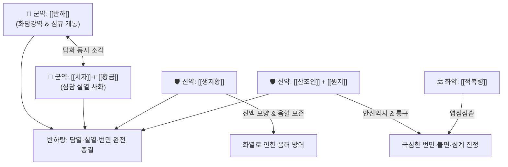

# 🍵 [[반하탕]] (半夏湯, Banxia-tang)

> **핵심 요약 (Key Summary)**:
> - 🌿 [[반하]], [[생지황]], [[산조인]], [[치자]], [[황금]], [[원지]], [[적복령]], [[생강]], [[기장쌀]](미) 배오 (담열을 삭이는 [[반하]]에 청열자음의 [[생지황]]·[[치자]]·[[황금]]과 진경안신의 [[산조인]]·[[원지]] 결합).
> - 🎯 담화(痰火)와 실열(實熱)이 심·담(心膽)을 어지럽혀 발생하는 극심한 번민(煩悶), 불면, 가슴 두근거림(심계), 헛소리, 담열로 인한 신경쇠약 및 조울증.
> - 🔬 GABA 수용체 조절을 통한 중추성 진정 및 수면 유도, 뇌 미세아교세포 항염증 및 스트레스성 시상하부-부신축(HPA) 과활성 억제, 위점막 보호.
> - ⚠️ 주의사항: 심담의 실열담화에 쓰는 처방이므로 비위가 허한하여 설사하는 환자나 심담양허의 순수 허증 불면에는 금기.
---
## 📌 목차
1. [기본 처방 정보 & 군신좌사 구성](#1-기본-처방-정보--군신좌사-구성)
2. [방제학적 약재 상호작용 & 시너지 네트워크]
## 7. 임상 응용 및 원장님 임상 노트 (Clinical Application & Notes)

### 🌿 원장님 본초 구성 분석 노트
* **구성 분석**:
  * [[반하]], [[진피]] / [[복령]], [[지실]] / [[생강]], [[대추]], [[감초]], [[죽여]]
  * [[생대감]]: 환자의 기초 컨디션이 좋지 않음 (#생대감증)
  * [[이진탕]] + [[죽여]]: 위장관 기능에 문제가 생기고 혈당 조절 및 대사가 원활하지 않은 상태
  * [[지실]]([[시네프린]]): 기분이 다운되어 있고 무기력한 상태를 리프팅함

### 🎯 적응증 및 실전 진료실 활용
* 생대감증 상태에 속도 안 좋고, 기분도 안 좋고, [[두통]], 현훈, 오심구토, 우울, 불면, 기분 저하가 있는 상태에 사용함.
* **월경전증후군(PMS)**: 생리 전에 기분이 급격히 다운되고 잠도 안 오며 소화가 안 될 때 특효.

### 🧠 어지러움(현훈)의 병태생리 고찰
* **세반고리관과 림프액**:
  * 세반고리관은 림프액으로 차 있으며, 이는 주변 상피세포에서 만들어 공급하는 것임.
  * 체액이 부족하고 허하면 세반고리관에 문제가 발생하여 현훈이나 어지럼증이 유발됨.
  * 혈압이 높고 얼굴이 붓는 현훈·어지러움에는 오령산을 사용하기도 함.
  * 염증이 생기거나 퇴행성으로 문제가 나타날 수 있음.

![[Pasted image 20240228143314.png]]
> [도해] 내이 세반고리관의 구조 및 림프액 순환계

* **경동맥 압력수용기와 구토 중추**:
  * 혈압 정도를 측정하는 경동맥의 압력수용기 정보에 의해서도 어지럼증이 나타남.
  * 위장관의 구토 중추(CTZ/NTS)에 의해서도 어지럼증이 유발될 수 있음.

![[Pasted image 20240228143327.png]]
> [도해] 경동맥동 압력수용기 및 위장관-자율신경-구토 중추 피드백 루프(#2-방제학적-약재-상호작용--시너지-네트워크)
3. [현대 분자약리학적 효능 & 작용 기전](#3-현대-분자약리학적-효능--작용-기전)
4. [적응 병증 및 체질별 감별 (Sweet Spot vs 금기)](#4-적응-병증-및-체질별-감별-sweet-spot-vs-금기)
5. [유사 처방군 감별 매트릭스](#5-유사-처방군-감별-매트릭스)
6. [임상 가감례 & 현대 질환별 응용](#6-임상-가감례--현대-질환별-응용)
7. [💡 사용자 진료실 핵심 필기 & 임상 팁 (원문 보존)](#7--사용자-진료실-핵심-필기--임상-팁-원문-보존)
8. [출처 및 학술 참고 문헌 (References)](#8-출처-및-학술-참고-문헌-references)
---
## 1. 기본 처방 정보 & 군신좌사 구성

* **출전**: 손사막(孫思邈) 『[[비급천금요방(備急千金要方)]]』 담음문(痰飮門)
* **치법**: 청담사화(淸膽瀉火), 화담영심(化痰寧心), 자음안신(滋陰安神)

| 구분 | 약재명 | 표준 용량 | 본초 효능 & 방제 내 역할 |
| :--- | :--- | :--- | :--- |
| **군약 (君藥)** | [[반하]] | 8~12g | 조습화담(燥濕化痰), 강역지구, 담음이 심규(心竅)를 막는 것을 하강시켜 제거 |
| **군약 (君藥)** | [[치자]] | 6~8g | 청열사화(淸熱瀉火), 양혈해독, 심담의 번열과 실화를 소변으로 배출 |
| **신약 (臣藥)** | [[황금]] | 6~8g | 청열조습(淸熱燥濕), 사화해독, 상초와 담경의 습열을 청열 |
| **신약 (臣藥)** | [[생지황]] | 8~12g | 청열생진(淸熱生津), 양혈자음, 화열로 손상된 진액을 보충하고 심혈 보양 |
| **신약 (臣藥)** | [[산조인]] | 8~12g (초) | 양심안신(養心安神), 염한, 심담의 허번과 불면을 진정시키는 성약 |
| **좌약 (佐藥)** | [[원지]] | 4~6g | 안신익지(安神益智), 거담개규, 심규에 엉킨 담연을 통규 배출 |
| **좌약 (佐藥)** | [[적복령]] | 6~8g | 이수삼습(利水滲濕), 영심안신, 수습을 배출하여 심신 안정 보좌 |
| **좌약 (佐藥)** | [[기장쌀]] | 10~15g | 익기화중(益氣和中), 비위 보호, 온담제와 자음제의 소화 흡수 보조 |
| **사약 (使藥)** | [[생강]] | 4g | 온중지구, 반하 독성 완충 및 위기 화평 |

> **배오 특징**: 담(痰)의 성약인 [[반하]]와 화(火)의 성약인 [[치자]]·[[황금]]을 융합하여 담화(痰火)를 동시 타격합니다. 여기에 화열로 타들어가는 음혈을 지키기 위해 [[생지황]]의 자음 작용을 더하고, [[산조인]]·[[원지]]·[[적복령]]의 강력한 안신통규(安神通竅) 약대를 결합하여 심담의 실열(實熱)과 극심한 번민(煩悶), 불면을 다스리는 청열화담안신(淸熱化痰安神)의 대표 명방입니다.
---
## 2. 방제학적 약재 상호작용 & 시너지 네트워크

* [[반하]] + [[치자]]·[[황금]] 배오: 반하가 가슴과 머리에 엉킨 담음을 삭이고, 치자와 황금이 담화(痰火)의 화열을 깨끗이 씻어내어 심신을 맑게 합니다.
* [[산조인]] + [[생지황]] 배오: 심열(心熱)을 식히면서 음혈(陰血)을 공급하여 가슴이 두근거리고 잠을 이루지 못하는 허번불면(虛煩不眠)을 종결시킵니다.
* [[원지]] + [[반하]] 배오: 심규(心竅)를 막아 헛소리를 하거나 건망, 불안을 유발하는 끈적한 담연을 뚫어냅니다.
---
## 3. 현대 분자약리학적 효능 & 작용 기전

### 1) 중추신경계 GABA 수용체 조절 및 수면 유도
* **주요 성분**: [[산조인]] 쥬주보사이드(Jujuboside A, B), [[원지]] 테누이폴린(Tenuifolin).
* **기전**: 대뇌 피질 및 해마의 GABAA 수용체 결합력을 높여 신경세포 과흥분을 억제하고 깊은 서파 수면(Slow-wave sleep)을 유도하여 번민과 불면증을 해소합니다.

### 2) 뇌 미세아교세포 항염증 및 스트레스 축(HPA Axis) 안정화
* **주요 성분**: [[치자]] 제니포사이드(Geniposide), [[황금]] 바이칼린.
* **기전**: 혈뇌장벽(BBB)을 통과하여 신경세포 염증 유발 인자인 iNOS 및 COX-2를 차단하고 혈중 코르티솔 분비를 정상화하여 신경성 화병과 불안 증상을 완화합니다.

### 3) 위점막 보호 및 위장관 운동 안정화
* **주요 성분**: [[생지황]] 레마닌(Rehmannin), [[기장쌀]] 복합 전분.
* **기전**: 차가운 약재들로 인한 위점막 손상을 막고 위벽을 감싸 소화 흡수를 돕습니다.
---
## 4. 적응 병증 및 체질별 감별 (Sweet Spot vs 금기)

[✅ 최적 적응증 (Sweet Spot)]
• 담(痰)과 실열(實熱)이 겹쳐 가슴이 답답하고 화가 치밀어 잠을 전혀 못 자는 환자 (담의 실열과 번민)
• 가슴 두근거림(심계), 불안, 초조, 헛소리(섬어) 및 감정 통제가 안 되는 조울증성 흥분 상태
• 얼굴이 붉고 입안이 쓰며(구고), 가래가 누렇고 점도가 높은 신경쇠약 환자
• 설진/맥진: 설질홍(舌紅), 설태황니(黃膩, 누렇고 끈적한 태), 맥활삭(滑數) 또는 현삭(弦數)

[⚠️ 신중 투여 및 금기 (Caution / Contraindication)]
• 비위허한(脾胃虛寒) 환자 금기: 평소 배가 차갑고 소화가 안 되며 묽은 변을 보는 환자에게 치자·황금·생지황의 한량약 투여 시 설사 유발
• 심담허겁(心膽虛怯) 순수 허증: 열증이나 담음 없이 단순히 무서움을 잘 타고 기운 없는 환자는 [[온담탕]]이나 [[귀비탕]] 적용
---
## 5. 유사 처방군 감별 매트릭스

| 처방명 | 핵심 구성 차이 | 주치 및 임상 차별점 | 맥진/설진 차이 |
| :--- | :--- | :--- | :--- |
| [[반하탕]] | 반하·치자·황금·생지황·산조인·원지 | **담의 실열(實熱)과 번민, 심한 불면, 화열과 담음 동시 협공** | 맥활삭(滑數), 황니태 |
| [[산조인탕]] | 산조인·지모·복령·천궁·감초 | **간혈부족(虛煩)으로 인한 불면, 도한, 실열담음은 없음** | 맥세삭(細數), 설홍소태 |
| [[온담탕]] | 반하·진피·복령·죽여·지실 | **심담허겁(가슴 두근거림, 잘 놀람), 담열이 경미한 허실착잡** | 맥현활(弦滑), 백황니태 |
| [[황련해독탕]] | 황련·황금·황백·치자 | **전신 삼초 실화(實火), 고열, 출혈, 불면이나 거담 작용은 없음** | 맥활삭유력(滑數有力), 황조태 |
| [[곤담환]] | 청몽석·대황·황금·침향 | **극한의 실열완담, 난치성 전간·발광, 대변을 통한 맹렬 사하** | 맥침실활삭(沈實滑數), 황후니태 |
---
## 6. 임상 가감례 & 현대 질환별 응용

* **수반 증상별 가감법**:
  * 번열이 극심하고 입이 마를 때 $\rightarrow$ + [[석고]] 15g, [[지모]] 6g
  * 가슴 두근거림과 공포감이 심할 때 $\rightarrow$ + [[용골]] 12g, [[모려]] 12g
  * 소화불량 및 오심이 동반될 때 $\rightarrow$ + [[진피]] 6g, [[백출]] 6g
* **현대 질환 매핑**:
  * 조울증(조증기), 급성 스트레스성 불면증, 화병(火病)
  * 자율신경 실조증, 갱년기 번열 및 수면장애
---
## 7. 💡 사용자 진료실 핵심 필기 & 임상 팁 (원문 보존)

> [!tip] **진료실 실전 노하우 (User Clinical Insight)**
> - **구성**: [[생지황]], [[산조인]], [[반하]], [[치자]], [[생강]], [[원지]], [[적복령]], [[황금]], [[기장쌀]]
> - **적응증**:
>   - **담의 실열과 번민에 활용**
---
## 8. 출처 및 학술 참고 문헌 (References)

1. **손사막 (652년)**. 『비급천금요방(備急千金要方)』 권십이(卷十二) 담음(痰飮).
   - **[고전 원전]**: "半夏湯, 治心膽痰熱, 虛煩不眠, 驚悸怔忡." (반하탕은 심담의 담열, 허번불면, 경계정충을 치료한다.)
* **Fan F et al. (2025)**. Modulatory Effects of Jujuboside A on Amino Acid Neurotransmitter Profiles in Tic Disorder. *Brain and behavior*. [PMID: 41220182](https://pubmed.ncbi.nlm.nih.gov/41220182/)
