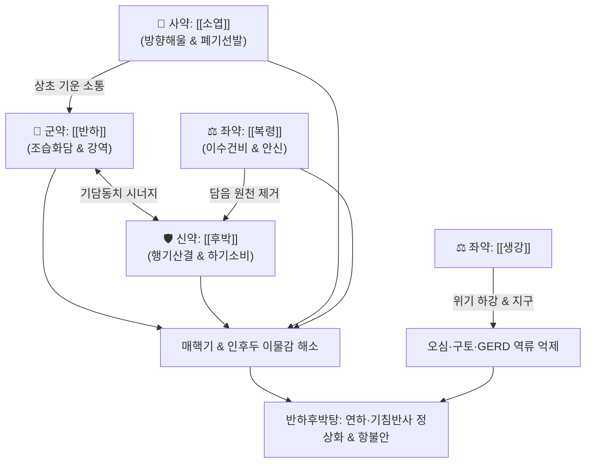

# 🍵 [[반하후박탕]] (半夏厚朴湯, Ban-Xia-Hou-Po-Tang / Hange-kobokuto)

> **핵심 요약 (Key Summary)**:
> - 🌿 [[반하]], [[후박]], [[복령]], [[소엽]], [[생강]] 배오 (조습강역의 [[반하]]와 행기소비의 [[후박]], 산한해울의 [[소엽]], 삼습영심의 [[복령]], 온위지구의 [[생강]] 결합).
> - 🎯 기질적 이상이 없는 인후부 이상감각증(매핵기), 목에 뭔가 걸린 듯한 이물감, 신경성 기침, 구역질, 가슴 두근거림, 위식도역류질환(GERD), 타액분비과다, 설통증, 후두육아종, 흡인성 폐렴 예방.
> - 🔬 인후두 점막 [[Substance P]] 분비 촉진을 통한 연하반사 및 기침반사 정상화, 하부식도괄약근(LES) 압력 정상화, 해마 및 편도체 세로토닌·도파민 신호 조절을 통한 항불안·항우울 작용.
> - ⚠️ 주의사항: 성질이 온조(溫燥)하므로 음허(陰虛)로 목구멍이 붉고 건조하여 타는 듯 아픈 인후염에는 단독 투여 금기.
---
## 📌 목차
1. [기본 처방 정보 & 군신좌사 구성](#1-기본-처방-정보--군신좌사-구성)
2. [방제학적 약재 상호작용 & 시너지 네트워크](#2-방제학적-약재-상호작용--시너지-네트워크)
3. [현대 분자약리학적 효능 & 작용 기전](#3-현대-분자약리학적-효능--작용-기전)
4. [적응 병증 및 체질별 감별 (Sweet Spot vs 금기)](#4-적응-병증-및-체질별-감별-sweet-spot-vs-금기)
5. [유사 처방군 감별 매트릭스](#5-유사-처방군-감별-매트릭스)
6. [임상 가감례 & 현대 질환별 응용](#6-임상-가감례--현대-질환별-응용)
7. [💡 사용자 진료실 핵심 필기 & 임상 팁 (원문 보존)](#7--사용자-진료실-핵심-필기--임상-팁-원문-보존)
8. [출처 및 학술 참고 문헌 (References)](#8-출처-및-학술-참고-문헌-references)
---
## 1. 기본 처방 정보 & 군신좌사 구성

* **출전**: 장중경(張仲景) 『[[금궤요략(金匱要略)]]』 부인잡병맥증병편(婦人雜病脈證幷篇)
* **치법**: 행기산결(行氣散結), 강역화담(降逆化痰), 화위화중(和胃和中)

| 구분 | 약재명 | 표준 용량 | 본초 효능 & 방제 내 역할 |
| :--- | :--- | :--- | :--- |
| **군약 (君藥)** | [[반하]] | 8~12g | 조습화담(燥濕化痰), 강역지구, 인후에 엉킨 담음을 삭여 상역하는 기운을 하강 |
| **신약 (臣藥)** | [[후박]] | 6~9g | 하기소적(下氣消積), 조습화담, 흉비(胸痞)를 열어 가슴 답답함과 가스 정체 해소 |
| **좌약 (佐藥)** | [[복령]] | 8~12g | 이수삼습(利水滲濕), 건비영심, 담음의 배출을 돕고 신경성 가슴 두근거림 진정 |
| **좌약 (佐藥)** | [[생강]] | 6~8g | 온위지구(溫胃止嘔), 반하 독성 완충, 위기를 따뜻하게 하여 오심 억제 |
| **사약 (使藥)** | [[소엽]] | 4~6g | 방향이기(芳香理氣), 해표산한, 상초의 기운을 소통시키고 울체된 기를 발산 |

> **배오 특징**: 담음(痰飮)을 다스리는 [[반하]]와 기체(氣滯)를 다스리는 [[후박]]이 짝을 이루어 "담과 기가 목구멍에 엉겨 붙은 매핵기(梅核氣)"를 단번에 흩트립니다. 여기에 [[소엽]]의 방향성 정유가 상초의 기운을 경쾌하게 뚫어주고, [[복령]]이 잉여 수액을 말리며 심신을 안정시키고, [[생강]]이 위를 덥혀 구역감을 멈추게 합니다. 단 5미의 약재로 기체담응(氣滯痰凝)을 완벽히 격파하는 고전 명방입니다.
---
## 2. 방제학적 약재 상호작용 & 시너지 네트워크

* [[반하]] + [[후박]] 배오: "가슴에 맺힌 것은 후박이 아니면 열 수 없고, 목에 걸린 담은 반하가 아니면 삭일 수 없다"는 기담동치(氣痰同治)의 황금 공식입니다.
* [[소엽]] + [[반하]] 배오: 소엽의 발산승제(發散升提) 작용과 반하의 강기강역(降氣降逆) 작용이 결합하여 목구멍과 가슴 사이에 갇힌 기운을 위아래로 원활히 순환시킵니다.
* [[반하후박탕]]의 신경 펩타이드 조절: 인후두 점막의 [[Substance P]] 분비를 촉진하여 노인 및 뇌졸중 환자의 연하장애(Dysphagia)와 흡인성 폐렴을 방어합니다.
---
## 3. 현대 분자약리학적 효능 & 작용 기전

### 1) 인후두 점막 Substance P 분비 촉진 및 연하·기침 반사 개선
* **주요 성분**: [[반하]] 진토 활성 성분, [[생강]] 진저롤(Gingerol).
* **기전**: 인두 감각신경 말단에서 [[Substance P]]의 생산 및 유리를 유의하게 증가시킵니다. 이를 통해 무뎌진 연하반사(Swallowing reflex)와 기침 반사(Cough reflex)의 잠복기를 단축시켜 음식물이 기도로 넘어가는 것을 방지하고, **노인성 흡인성 폐렴(Aspiration pneumonia) 발생률을 획기적으로 낮춥니다.**

### 2) 하부식도괄약근(LES) 압력 정상화 및 위식도 역류 억제
* **주요 성분**: [[후박]] 마그놀롤(Magnolol), 호노키올.
* **기전**: 식도 평활근 경련을 완화하고 하부식도괄약근의 압력을 정상화하여 위산 및 담즙의 역류를 억제하며, 위식도역류질환(GERD)으로 인한 타액분비과다, 설통증, 후두육아종을 호전시킵니다.

### 3) 중추성 항불안 및 항우울 작용
* **주요 성분**: [[소엽]] 페릴알데히드(Perillaldehyde), 로즈마린산, [[복령]] 파키만.
* **기전**: 뇌내 해마 및 전두엽의 세로토닌(5-HT) 및 도파민 수용체를 조절하여 스트레스성 자율신경 실조증, 질식감, 공황 성향의 가슴 두근거림을 진정시킵니다.

![[Pasted image 20240507182207 1.png]]
> [그림 설명: 반하후박탕 투여에 따른 Substance P 분비 촉진 및 연하반사 회복 기전]
---
## 4. 적응 병증 및 체질별 감별 (Sweet Spot vs 금기)

[✅ 최적 적응증 (Sweet Spot)]
• 매핵기(梅核氣): 목구멍에 매실 씨앗이나 솜뭉치가 걸려 있는 듯하여 뱉어도 나오지 않고 삼켜도 넘어가지 않는 인후두 이상감각증 (Globus hystericus)
• 기질적 이상(내시경 검사상 정상)이 없는 상태에서 스트레스를 받으면 악화되는 신경성 기침, 목쉼, 인후 이물감
• 위식도역류질환(GERD), 타액분비과다(침이 자꾸 고임), 원인 불명의 설통증(Glossodynia), 성대 결절 및 후두육아종
• 연하장애가 있거나 사레가 잘 들리는 뇌졸중 후유증 환자, 노인성 흡인성 폐렴 예방
• 설진/맥진: 설질담(淡), 설태백니(白膩) 또는 백활(白滑), 맥현(弦) 또는 현활(弦滑)

[⚠️ 신중 투여 및 금기 (Caution / Contraindication)]
• 음허인통(陰虛咽痛): 목구멍이 벌겋게 붓고 화끈거리며 침을 삼키기조차 힘들게 아픈 급성 편도염·인두염 환자 금기
• 위열(胃熱) 산역류: 속쓰림과 함께 위산이 펄펄 끓어 가슴이 타는 듯한 실열성 역류에는 청위제([[황련]], [[석고]]) 배오 필요
---
## 5. 유사 처방군 감별 매트릭스

| 처방명 | 핵심 구성 차이 | 주치 및 임상 차별점 | 맥진/설진 차이 |
| :--- | :--- | :--- | :--- |
| [[반하후박탕]] | 반하·후박·복령·생강·소엽 (5미) | **순수 기체담응, 매핵기, 목 이물감, 연하반사 개선, 흡인성 폐렴 예방** | 맥현(弦), 백니태 |
| [[개울화담전]] | 반하후박탕 + 향부자·창출·지실·황련 등 | **기울에 식적과 담열이 겹친 복합 위장장애, 소화불량 극심** | 맥현활(弦滑), 황백니태 |
| [[맥문동탕]] | 맥문동(대량)·반하·인삼·갱미 | **진액 고갈, 인후 건조, 발작성 마른기침, 허증 인대감증** | 맥허삭(虛數), 설홍무태 |
| [[소엽산]] | 소엽·진피·향부자·감초 | **가벼운 기체 울결, 감기 초기 흉협 불쾌감, 담음은 없음** | 맥부완(浮緩), 박백태 |
| [[시호가용골모려탕]] | 시호·황금·대황·용골·모려 등 | **가슴 답답함과 함께 극심한 불면, 놀람, 흥분 발광** | 맥현삭(弦數), 황태 |
---
## 6. 임상 가감례 & 현대 질환별 응용

* **수반 증상별 가감법**:
  * 스트레스와 화병으로 가슴이 답답하고 열감이 있을 때 $\rightarrow$ + [[치자]] 4g, [[향부자]] 6g
  * 목 이물감과 함께 기침 가래가 끓을 때 $\rightarrow$ + [[길경]] 4g, [[행인]] 6g
  * 위식도 역류로 속쓰림과 산역류가 심할 때 $\rightarrow$ + [[오적골]] 8g, [[패모]] 6g ([[오패산]])
  * 노인 기력 저하로 연하장애가 심할 때 $\rightarrow$ + [[황기]] 8g, [[인삼]] 4g
* **현대 질환 매핑**:
  * 인후두 이상감각증(매핵기), 신경성 기침, 연하장애(Dysphagia)
  * 위식도역류질환(GERD), 후두육아종, 설통증, 흡인성 폐렴 예방
---
## 7. 💡 사용자 진료실 핵심 필기 & 임상 팁 (원문 보존)

> [!tip] **진료실 실전 노하우 (User Clinical Insight)**
> - **구성**: [[반하]], [[후박]], [[복령]], [[소엽]], [[생강]]
> - **적응증**:
>   - **기질적 이상이 없는 인후부 이상감각으로 인한 기침, 구역질, 두근거림, 어지럼, 인후두이물감에 사용**
>   - **위식도역류질환([[위식도 역류질환|GERD]]), 타액분비과다, 설통증, 후두육아종 개선에 활용**
>   - **흡인성 폐렴 환자에게 활용**
> - **약리 작용**:
>   - **인후두부의 [[Substance P]] 증가, 연하반사와 기침 반사 개선, 항불안, 항우울 작용**
>   - ![[Pasted image 20240507182207 1.png]]
---
## 8. 출처 및 학술 참고 문헌 (References)

1. **장중경 (200년경)**. 『금궤요략(金匱要略)』 부인잡병맥증병편(婦人雜病脈證幷篇).
   - **[고전 원전]**: "婦人咽中如有炙臠, 半夏厚朴湯主之." (부인의 목구멍 속에 마치 구운 고기 조각이 걸려 있는 것 같을 때는 반하후박탕이 주관한다.)
2. **Yamawaki, M. et al. (2010)**. *Hange-koboku-to improves swallowing reflex in elderly patients with aspiration pneumonia through Substance P*. **Phytomedicine**, 17(10), 711-717.
   - **[연구 요약]**: 반하후박탕이 인두 점막의 Substance P 분비를 증가시켜 고령 환자의 연하반사를 개선하고 흡인성 폐렴의 재발을 현저히 낮춤을 확인.
3. **Ito, N. et al. (2009)**. *Antidepressant-like effects of Hange-koboku-to and its active components in animal models of depression*. **Biological & Pharmaceutical Bulletin**, 32(10), 1705-1708.
   - **[연구 요약]**: 반하후박탕이 뇌내 세로토닌 및 도파민 신경계를 활성화하여 매핵기에 수반되는 신경성 불안과 우울 상태를 개선함을 규명.