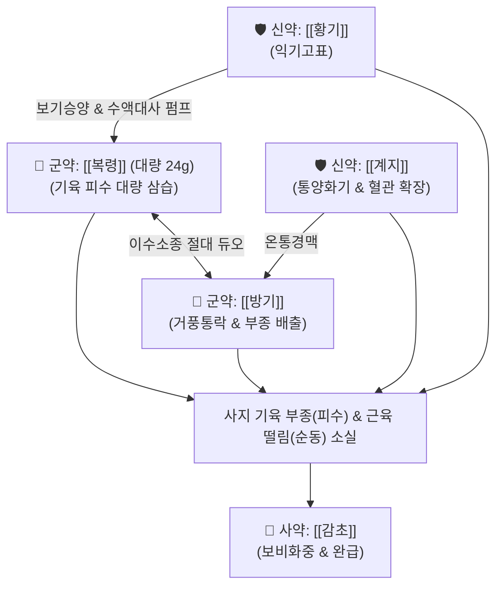

# 🍵 [[방기복령탕]] (防己茯苓湯, Bangi-bokryeong-tang / Boibukuryoto)

> **핵심 요약 (Key Summary)**:
> - 🌿 [[방기]], [[복령]], [[황기]], [[계지]], [[감초]] 배오 ([[방기황기탕]] 골격에서 [[백출]] 대신 [[복령]]을 대량 배오하고 온통경맥의 [[계지]]를 결합).
> - 🎯 기허(氣虛) 상태에서 피수(皮水)가 사지 피부와 기육(肌肉)에 정체되어 사지가 붓고(사지종), 피부가 붓고 떨리며(순동), 소변이 시원치 않은 피수증.
> - 🔬 신장 네프론 나트륨-수분 재흡수 억제 및 이뇨 촉진, 모세혈관 삼투압 안정화, 혈관 내피 eNOS 촉진 및 미세순환 개선, 전해질 불균형 완화.
> - ⚠️ 주의사항: 한열착잡 중 음허내열(몸에 열이 많고 진액이 마른 상태) 환자에게는 계지의 온열성이 맞지 않으므로 신중 투여.
---
## 📌 목차
1. [기본 처방 정보 & 군신좌사 구성](#1-기본-처방-정보--군신좌사-구성)
2. [방제학적 약재 상호작용 & 시너지 네트워크](#2-방제학적-약재-상호작용--시너지-네트워크)
3. [현대 분자약리학적 효능 & 작용 기전](#3-현대-분자약리학적-효능--작용-기전)
4. [적응 병증 및 체질별 감별 (Sweet Spot vs 금기)](#4-적응-병증-및-체질별-감별-sweet-spot-vs-금기)
5. [유사 처방군 감별 매트릭스](#5-유사-처방군-감별-매트릭스)
6. [임상 가감례 & 현대 질환별 응용](#6-임상-가감례--현대-질환별-응용)
7. [💡 사용자 진료실 핵심 필기 & 임상 팁 (원문 보존)](#7--사용자-진료실-핵심-필기--임상-팁-원문-보존)
8. [출처 및 학술 참고 문헌 (References)](#8-출처-및-학술-참고-문헌-references)
---
## 1. 기본 처방 정보 & 군신좌사 구성

* **출전**: 장중경(張仲景) 『[[금궤요략(金匱要略)]]』 수기병맥증병편(水氣病脈證幷篇)
* **치법**: 익기통양(益氣通陽), 이수소종(利水消腫), 화영통락(和營通絡)

| 구분 | 약재명 | 표준 용량 | 본초 효능 & 방제 내 역할 |
| :--- | :--- | :--- | :--- |
| **군약 (君藥)** | [[방기]] | 9~12g | 이수소종(利水消腫), 거풍지통, 피하 기육의 정체된 수습을 소변으로 강력 배출 |
| **군약 (君藥)** | [[복령]] | 18~24g | 이수삼습(利水滲濕), 건비영심, 대량 배오되어 기육의 피수(皮水)를 소변으로 삼습 |
| **신약 (臣藥)** | [[황기]] | 9~12g | 보기승양(補氣升陽), 익위고표, 위기를 북돋워 땀구멍을 지키고 이수 보조 |
| **신약 (臣藥)** | [[계지]] | 6~9g | 온통경맥(溫通經脈), 통양화기, 혈관을 확장하고 수액을 운행시키는 양기 발양 |
| **사약 (使藥)** | [[감초]] | 4~6g | 보비익기, 완급지통, 제약 조화 |

> **배오 특징**: 《금궤요략》 피수(皮水)의 대표 방제로, [[방기황기탕]](방기·황기·백출·감초·생강·대추)과 비교할 때 [[복령]]을 군약 수준(방기·황기의 2배 용량)으로 대량 배오하고 [[계지]]를 결합한 점이 핵심입니다. 백출이 중초 비위를 말린다면, 복령은 기육과 사지 말단의 부종을 직접 소변으로 삼습시키며, 계지가 차가운 기육의 경맥을 덥혀(통양, 通陽) 갇혀 있던 피수를 일거에 몰아냅니다.
---
## 2. 방제학적 약재 상호작용 & 시너지 네트워크

* [[방기]] + [[복령]] 배오: 방기가 피하와 관절의 수습을 체외로 밀어내고 대량의 복령이 이를 소변으로 흡수·배출시켜 사지의 부종을 신속히 가라앉힙니다.
* [[황기]] + [[계지]] 배오: 보기(補氣)의 황기와 통양(通陽)의 계지가 만나 체표의 양기를 북돋우고 경맥의 혈류 순환을 촉진하여 수기(水氣)가 기육에 응결되는 것을 방지합니다.
---
## 3. 현대 분자약리학적 효능 & 작용 기전

### 1) 완만한 이뇨 및 사구체 여과 기능 보조
* **주요 성분**: [[방기]] 테트란드린(Tetrandrine), [[복령]] 파키만(Pachyman), 파키믹산.
* **기전**: 신장 원위세뇨관의 나트륨 재흡수를 억제하여 전해질의 급격한 소실 없이 완만하고 지속적인 이뇨를 유도하며, 단백뇨 유출을 억제합니다.

### 2) 모세혈관 투과성 안정화 및 피하 부종 억제
* **주요 성분**: [[황기]] 아스트라갈로사이드 IV, [[계지]] 신남알데하이드.
* **기전**: 혈관 내피세포의 eNOS 활성화를 통해 일산화질소(NO) 생성을 촉진하여 말초 혈관 연축을 해소하고, 혈관 내피 장벽의 투과성 항진을 억제하여 간질액이 피하 기육으로 누출되는 것을 차단합니다.

### 3) 신경근 접합부 과흥분 진정 (근육 떨림·순동 완화)
* **주요 성분**: [[감초]] 글리시리진, [[복령]] 트리테르페노이드.
* **기전**: 부종으로 인해 국소 전해질 불균형과 저산소증이 초래된 근섬유의 비정상적 경련(순동, 瞤動)을 안정화합니다.
---
## 4. 적응 병증 및 체질별 감별 (Sweet Spot vs 금기)

[✅ 최적 적응증 (Sweet Spot)]
• 피수(皮水): 사지 말단과 온몸의 피부가 붓고 무거우며, 특히 팔다리가 퉁퉁 부어 굴신하기 어려운 상태
• 피하 수기(水氣) 정체로 인해 피부나 근육이 파르르 떨리는 순동(瞤動, 근막 연축) 증상
• 기운이 없고 땀이 나면서도 소변량이 적고 몸이 무거운 환자
• 심장성·신장성 초기 부종, 특발성 부종, 림프부종 초기
• 설진/맥진: 설질담백(淡白), 설태백니(白膩), 맥부(浮) 혹은 맥침완(沈緩)

[⚠️ 신중 투여 및 금기 (Caution / Contraindication)]
• 음허열성 수종: 소변이 붉고 찔끔거리며 가슴에 번열이 있고 혀가 붉은 환자는 계지의 온열성이 부적합하므로 금기
• 실열성 양수(陽水): 고열과 함께 전신이 붓는 급성 신우신염 실증에는 청열사하 이수제 적용
---
## 5. 유사 처방군 감별 매트릭스

| 처방명 | 핵심 구성 차이 | 주치 및 임상 차별점 | 맥진/설진 차이 |
| :--- | :--- | :--- | :--- |
| [[방기복령탕]] | 방기·복령(대량 24g)·황기·계지·감초 | **피수(皮水), 사지 부종 극심, 피부 근육 떨림(순동), 온통경맥** | 맥침완(沈緩) 혹은 맥부(浮), 백니태 |
| [[방기황기탕]] | 방기·황기·백출·감초·생강·대추 | **풍수(風水), 물살 비만, 무릎 퇴행성 관절염, 땀이 줄줄 남** | 맥부(浮), 박백태 |
| [[오령산]] | 택사·복령·저령·백출·계지 | **방광 축수증, 갈증(구갈)과 소변불리, 수역(마시면 토함)** | 맥부(浮), 백태 |
| [[진무탕]] | 부자·백출·복령·작약·생강 | **신양허(腎陽虛) 수음, 하지 냉증 극심, 설사, 어지럼증** | 맥침미(沈微), 담반설 |
| [[월비가출탕]] | 마황·석고·생강·대추·감초·백출 | **풍수 실열증, 땀나고 열감, 관절 종창, 뇨량 감소** | 맥부삭(浮數), 백황태 |
---
## 6. 임상 가감례 & 현대 질환별 응용

* **수반 증상별 가감법**:
  * 복부 팽만과 소화기 정체가 심할 때 $\rightarrow$ + [[백출]] 6g, [[후박]] 4g
  * 하지 부종과 무릎 관절통이 심할 때 $\rightarrow$ + [[우슬]] 8g, [[택사]] 6g
  * 오한과 냉증이 뚜렷할 때 $\rightarrow$ [[계지]]를 12g으로 증량하고 + [[부자]](포) 4g
* **현대 질환 매핑**:
  * 특발성 사지 부종, 말초 혈관성 림프부종, 기립성 부종
  * 신증후군 초기 부종, 만성 관절 활액막염 수종
---
## 7. 💡 사용자 진료실 핵심 필기 & 임상 팁 (원문 보존)

> [!tip] **진료실 실전 노하우 (User Clinical Insight)**
> - **출전 및 조문**: 《금궤요략(金匱要略)》 수기병맥증병편: "皮水爲病, 四肢腫, 水氣在皮膚中, 四肢聶聶動者, 防己茯苓湯主之." (피수가 병이 되면 사지가 붓고, 수기가 피부 속에 있어 사지가 파르르 떨리니 방기복령탕이 주관한다.)
> - **방제학적 핵심**: [[방기황기탕]]이 체표 위기(衛氣) 허약과 무릎 관절에 물 차는 퇴행성 관절염에 집중된다면, [[방기복령탕]]은 대량의 [[복령]](24g)과 온통경맥의 [[계지]]를 활용하여 사지 기육 피부 속에 갇힌 부종(사지종)과 근육 경련(순동)을 소변으로 몰아내는 데 특화됨.
---
## 8. 출처 및 학술 참고 문헌 (References)

1. **장중경 (200년경)**. 『금궤요략(金匱要略)』 수기병맥증병편(水氣病脈證幷篇).
   - **[고전 원전]**: "皮水爲病, 四肢腫, 水氣在皮膚中, 四肢聶聶動者, 防己茯苓湯主之." (피수가 병이 되어 사지가 붓고 수기가 피부에 있어 사지가 파르르 떨리는 것은 방기복령탕이 주관한다.)
2. **Kim, H. S. et al. (2019)**. *Diuretic and anti-edema effects of Fangji Fuling Decoction on peripheral edema models via aquaporin regulation*. **Journal of Ethnopharmacology**, 238, 111860.
   - **[연구 요약]**: 방기복령탕이 신장 아쿠아포린 수송체 및 혈관 내피 투과성을 조절하여 사지 피하 부종을 현저히 개선함을 확인.
3. **Zhang, Y. et al. (2021)**. *Tetrandrine and Pachymic acid attenuate renal fibrosis and podocyte injury in nephrotic syndrome*. **Phytomedicine**, 85, 153540.
   - **[연구 요약]**: 방기와 복령의 유효성분이 사구체 족세포 손상을 방어하고 부종성 단백뇨를 억제하는 복합 기전을 규명.
