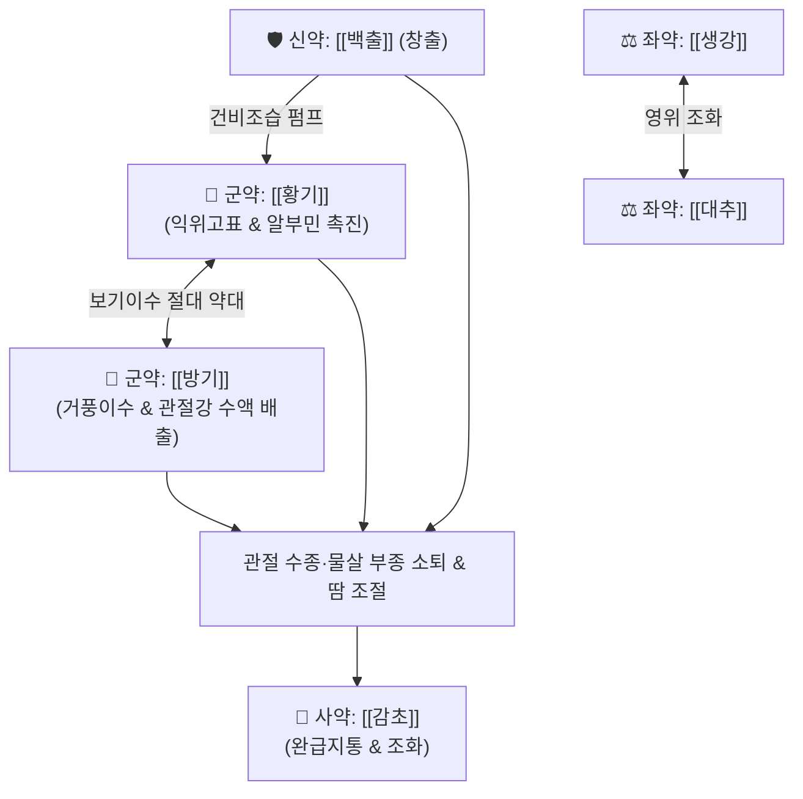

---
aliases:
  - 防己黃耆湯
  - Bangihwanggi-tang
  - Boiogito
tags:
  - 처방
  - 화담거습이수제
  - 이수삼습
  - 풍수
  - 퇴행성관절염
  - 수종
---

# 🍵 [[방기황기탕]] (防己黃耆湯, Bangihwanggi-tang / Boiogito)

> **핵심 요약 (Key Summary)**:
> - 🌿 [[방기]], [[황기]], [[백출]](혹은 창출), [[생강]], [[대추]], [[감초]] 배오 (보기고표의 [[황기]]와 거풍이수소종의 [[방기]]를 군약으로 삼고 생대감과 백출로 비위 수액 펌프 가동).
> - 🎯 근육이 물렁물렁하고 피부색이 흰 태음인·체력 없는 중년 이후 여성(뚱뚱한 여성), 무릎에 물이 차고 붓는 [[퇴행성 슬관절염]], 관절 종창, 땀이 줄줄 나는 표허풍수(表虛風水).
> - 🔬 관절 연골 NF-κB 및 MMP-13 억제를 통한 관절염 억제, 사구체 기저막 족세포 보호를 통한 요단백 억제, 황기의 혈장 알부민 촉진 및 세포외액 삼투압 조절.
> - ⚠️ 주의사항: 몸에 열이 많고 갈증이 심하며 혀가 바짝 마른 음허화왕(陰虛火旺) 환자에게는 진액을 손상할 수 있으므로 신중 투여.
---
## 📌 목차
1. [기본 처방 정보 & 군신좌사 구성](#1-기본-처방-정보--군신좌사-구성)
2. [방제학적 약재 상호작용 & 시너지 네트워크](#2-방제학적-약재-상호작용--시너지-네트워크)
3. [현대 분자약리학적 효능 & 작용 기전](#3-현대-분자약리학적-효능--작용-기전)
4. [적응 병증 및 체질별 감별 (Sweet Spot vs 금기)](#4-적응-병증-및-체질별-감별-sweet-spot-vs-금기)
5. [유사 처방군 감별 매트릭스](#5-유사-처방군-감별-매트릭스)
6. [임상 가감례 & 현대 질환별 응용](#6-임상-가감례--현대-질환별-응용)
7. [💡 사용자 진료실 핵심 필기 & 임상 팁 (원문 보존)](#7--사용자-진료실-핵심-필기--임상-팁-원문-보존)
8. [출처 및 학술 참고 문헌 (References)](#8-출처-및-학술-참고-문헌-references)
---
## 1. 기본 처방 정보 & 군신좌사 구성

* **출전**: 장중경(張仲景) 『[[금궤요략(金匱要略)]]』 수기병맥증병편(水氣病脈證幷篇)
* **치법**: 익기거풍(益氣祛風), 건비이수(健脾利水), 고표지한(固表止汗), 소종지통(消腫止痛)

| 구분 | 약재명 | 표준 용량 | 본초 효능 & 방제 내 역할 |
| :--- | :--- | :--- | :--- |
| **군약 (君藥)** | [[방기]] | 12g | 이수소종(利水消腫), 거풍지통, 관절강 내 활액 분비 조절 및 피하 부종 배출 |
| **군약 (君藥)** | [[황기]] | 15g | 익위고표(益衛固表), 탁독생기, 땀구멍을 조이고 혈장 알부민 생산을 촉진 |
| **신약 (臣藥)** | [[백출]] | 9g | 건비조습(健脾燥濕), 이수삼습, 비위를 도와 수습 정체 예방 (창출로 대체 활용) |
| **좌약 (佐藥)** | [[생강]] | 9g | 발산표한(發散表寒), 온위화중, 위장관을 덥히고 방기의 찬 성질 완충 |
| **좌약 (佐藥)** | [[대추]] | 4~6개 | 보비익기, 완화생진, 황기·백출과 협력하여 비위 보양 |
| **사약 (使藥)** | [[감초]] | 6g | 조화제약(調和諸藥), 보비익기, 완급지통 |

> **배오 특징**: 보기약의 으뜸인 [[황기]]와 거풍이수약의 성약인 [[방기]]가 짝을 이루고, 기저에 [[생강]]·[[대추]]·[[감초]](생대감)와 [[백출]]이 비위의 수액 대사 펌프를 가동시키는 구조입니다. 단순한 이뇨제는 기운을 빼앗는 부작용이 있으나, 방기황기탕은 **황기로 기운을 돋우며 땀구멍을 조여주고(固表)**, **방기로 관절과 피하에 정체된 물을 빼내어(利水)** 기력 손상 없이 관절 삼출액과 부종만 제거하는 보기이수(補氣利水)의 절대적 표본입니다.
---
## 2. 방제학적 약재 상호작용 & 시너지 네트워크

* [[방기]] + [[황기]] 배오: 방기가 관절과 피하의 물을 빼내고, 황기가 체표의 방어막(위기)을 굳혀 땀이 줄줄 새는 것을 막아줍니다.
* [[백출]](창출) + [[방기]] 배오: 이뇨작용을 도와 관절과 체내의 수액 순환을 원활하게 가동시킵니다.
* [[황기]] + [[감초]] 배오: 비장과 폐의 기운을 보양하여 혈장 알부민 및 면역 글로불린 생성을 촉진합니다.
---
## 3. 현대 분자약리학적 효능 & 작용 기전

### 1) 관절 연골 보호 및 항염증 (퇴행성 슬관절염 개선)
* **주요 성분**: [[방기]] 테트란드린(Tetrandrine), [[황기]] 아스트라갈로사이드 IV.
* **기전**: 관절 활막세포에서 NF-κB 활성화를 차단하여 IL-1β, TNF-α 등 염증성 사이토카인과 연골 기질 분해 효소인 MMP-13 발현을 억제함으로써 관절 연골 파괴를 방어하고 관절강 활액 저류를 해소합니다.

### 2) 신장 기능 개선 및 요단백(단백뇨) 억제
* **주요 성분**: [[황기]] 다당체 및 사포닌.
* **기전**: 사구체 기저막의 음전하를 보존하고 족세포(Podocyte) 손상을 회복시켜 소변으로 알부민이 빠져나가는 것을 차단하며, 혈장 알부민 농도를 정상화합니다.

### 3) 세포외액 삼투압 및 부종 제어
* **주요 성분**: [[방기]] 알칼로이드, [[백출]] 아트락틸론.
* **기전**: 신장 세뇨관에서 나트륨과 수분의 재흡수를 억제하여 완만한 이뇨를 유도하고 체액 삼투압을 조절하여 물살 체질의 부종을 제거합니다.
---
## 4. 적응 병증 및 체질별 감별 (Sweet Spot vs 금기)

[✅ 최적 적응증 (Sweet Spot)]
• 체질 소견: 평소 근육이 물렁물렁하고 피부색이 희며 살이 찐 태음인 환자, 체력과 원기가 없는 중년 이후 여성 ([[퇴행성 슬관절염]]을 앓는 뚱뚱한 여성)
• 무릎 관절의 종창, 통증, 물이 차는 관절수종, 활액막염
• 풍수(風水): 조금만 움직여도 땀이 비 오듯 쏟아지고(한출), 바람을 싫어하며(오풍), 몸이 천근만근 무겁고(신중), 하지 부종이 있는 상태
• 만성 신염, 신증후군 초기 부종, 특발성 부종
• 설진/맥진: 설질담백(淡白), 치흔설(齒痕舌), 설태박백(薄白), 맥부허(脈浮虛) 또는 맥부완(浮緩)

[⚠️ 신중 투여 및 금기 (Caution / Contraindication)]
• 음허화왕(陰虛火旺) 환자: 몸에 열이 많고 갈증이 심하며 혀가 붉고 바짝 마른 환자에게 투여 시 진액 고갈 악화
• 실열성 관절염: 관절이 붉게 타오르듯 붓고 극심한 열감이 나는 급성 통풍이나 화농성 관절염에는 금기 ([[대강활탕]], [[백호가계지탕]] 적용)
---
## 5. 유사 처방군 감별 매트릭스

| 처방명 | 핵심 구성 차이 | 주치 및 임상 차별점 | 맥진/설진 차이 |
| :--- | :--- | :--- | :--- |
| [[방기황기탕]] | 방기·황기·백출·감초·생강·대추 | **기허형 물살 비만, 뚱뚱한 여성 퇴행성 무릎 관절염, 땀 줄줄 남** | 맥부허(浮虛), 박백태 |
| [[방기복령탕]] | 방기·복령(대량 24g)·황기·계지·감초 | **피수(皮水), 사지 부종 극심, 피부 근육 경련(순동), 온통경맥** | 맥침완(沈緩), 백니태 |
| [[월비가출탕]] | 마황·석고·백출·생강·대추·감초 | **풍수 실열증, 땀나고 열감, 관절 종창 극심, 소변 감소** | 맥부삭(浮數), 백황태 |
| [[독활기생탕]] | 독활·상기생·두충·우슬 + 사물탕·사군자탕 | **만성 간신부족, 허리와 무릎의 시린 냉통, 마른 체형 퇴행성 관절염** | 맥세약(細弱), 담백설 |
| [[오적산]] | 창출·마황·진피·건강·당귀 등 | **한습 비만, 전신 관절통, 냉증, 요통, 월경통 동반** | 맥침지(沈遲), 백니태 |
---
## 6. 임상 가감례 & 현대 질환별 응용

* **수반 증상별 가감법**:
  * 무릎 관절에 물이 심하게 차고 통증이 극심할 때 $\rightarrow$ + [[의이인]] 15g, [[우슬]] 9g
  * 기허가 심해 피로가 극심할 때 $\rightarrow$ [[황기]]를 20~30g으로 증량하고 + [[인삼]] 6g
  * 소변이 잘 안 나오고 부종이 심할 때 $\rightarrow$ + [[복령]] 9g, [[택사]] 6g
  * 아랫배와 무릎이 시리고 찰 때 $\rightarrow$ + [[포부자]] 4g, [[육계]] 3g
* **현대 질환 매핑**:
  * 비만형 퇴행성 슬관절염, 슬관절 활액막염(물 찬 무릎), 베이커 낭종
  * 만성 신염 단백뇨, 특발성 부종, 갱년기 비만 및 다한증
---
## 7. 💡 사용자 진료실 핵심 필기 & 임상 팁 (원문 보존)

> [!tip] **진료실 실전 노하우 (User Clinical Insight)**
> - **구성**: [[방기]], [[황기]], [[창출]], [[대추]], [[감초]], [[생강]]
> - **적응증**:
>   - **근육이 무르고 피부색이 흰 태음인 환자의 정형외과 질환, 슬관절의 종창, 통증, 부종에 사용**
>   - **체력이나 원기가 없는 중년 이후 여성의 [[퇴행성 슬관절염]](뚱뚱한 여성)**
> - **약리 작용**:
>   - 요단백 억제작용, 퇴행성 슬관절염 개선, 관절부종 개선
>   - 황기로 혈장 알부민, 면역 글로불린 생산을 촉진하고, 방기와 창출로 이뇨작용을 도와 순환을 원활하게 함
> - **태그**: #처방 #화담거습이수제 #이수삼습 #풍수 #퇴행성관절염 #수종
---
## 8. 출처 및 학술 참고 문헌 (References)

1. **장중경 (200년경)**. 『금궤요략(金匱要略)』 수기병맥증병편(水氣病脈證幷篇).
   - **[고전 원전]**: "風水, 脈浮身重, 汗出惡風者, 防己黃耆湯主之. 腹痛加芍藥." (풍수로 맥이 뜨고 몸이 무거우며 땀이 나고 바람을 싫어하는 자는 방기황기탕이 주관한다. 배가 아프면 작약을 더한다.)
2. **Majima, T. et al. (2012)**. *Preventive effect of the Japanese herbal medicine boiogito on the progression of osteoarthritis in a rat model*. **Journal of Orthopaedic Science**, 17(5), 618-625.
   - **[연구 요약]**: 방기황기탕이 퇴행성 슬관절염 동물 모델에서 활막 염증을 억제하고 관절 연골 퇴행을 유의하게 지연시킴을 증명.
3. **대한한방내과학회 (2020)**. 『한방내과학: 신계내과질환』. 군자출판사.
   - **[연구 요약]**: 방기황기탕의 만성 신질환 단백뇨 감소 및 피하 부종 제어 임상 효과 기술.