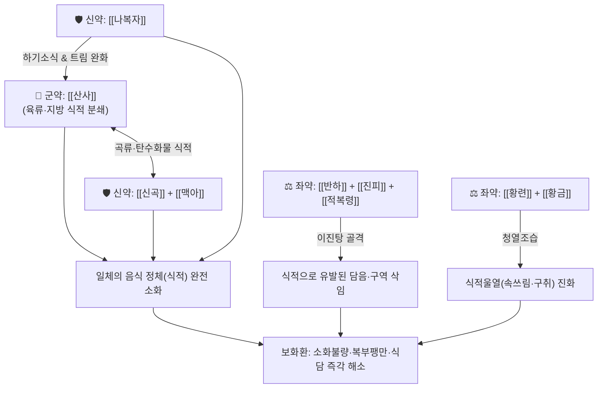

# 🍵 [[보화환]] (保和丸, Baohe-wan)

> **핵심 요약 (Key Summary)**:
> - 🌿 [[산사]], [[신곡]], [[반하]], [[적복령]], [[진피]], [[나복자]], [[후박]], [[지실]], [[백출]], [[맥아]], [[향부자]], [[황련]], [[황금]] 배오 (육축·곡식·주류 식적을 소화하는 소식제에 이진탕의 화담제와 황금·황련의 청열사화제 결합).
> - 🎯 일체의 음식에 상하여 발생한 식적(食積) 및 식담(食痰), 급만성 소화불량, 명치 끝 답답함, 신트림(애부), 신물 올라옴, 설사 또는 변비.
> - 🔬 펩신 및 위산 분비 촉진, 췌장 아밀라아제·리파아제 활성화를 통한 지방 및 탄수화물 분해 촉진, 위장관 평활근 연동운동 정상화 및 위점막 항염증.
> - ⚠️ 주의사항: 식적으로 인한 실증 소화장애를 깎아내는 소도지제(消導之劑)이므로, 비위가 극도로 허약하여 입맛이 없는 기허 환자에게는 보비제를 주약으로 배오하여 신중 투여.
---
## 📌 목차
1. [기본 처방 정보 & 군신좌사 구성](#1-기본-처방-정보--군신좌사-구성)
2. [방제학적 약재 상호작용 & 시너지 네트워크](#2-방제학적-약재-상호작용--시너지-네트워크)
3. [현대 분자약리학적 효능 & 작용 기전](#3-현대-분자약리학적-효능--작용-기전)
4. [적응 병증 및 체질별 감별 (Sweet Spot vs 금기)](#4-적응-병증-및-체질별-감별-sweet-spot-vs-금기)
5. [유사 처방군 감별 매트릭스](#5-유사-처방군-감별-매트릭스)
6. [임상 가감례 & 현대 질환별 응용](#6-임상-가감례--현대-질환별-응용)
7. [💡 사용자 진료실 핵심 필기 & 임상 팁 (원문 보존)](#7--사용자-진료실-핵심-필기--임상-팁-원문-보존)
8. [출처 및 학술 참고 문헌 (References)](#8-출처-및-학술-참고-문헌-references)
---
## 1. 기본 처방 정보 & 군신좌사 구성

* **출전**: 주단계(朱丹溪) 『[[단계심법(丹溪心法)]]』 권삼(卷三) 식적(食積)
* **치법**: 소식화체(消食化滯), 행기조위(行氣和胃), 화담청열(化痰淸熱)

| 구분 | 약재명 | 표준 용량 | 본초 효능 & 방제 내 역할 |
| :--- | :--- | :--- | :--- |
| **군약 (君藥)** | [[산사]] | 8~12g | 소식화적(消食化積), 활혈산어, 고기나 기름진 육류 음식의 식적을 삭임 |
| **신약 (臣藥)** | [[신곡]] | 6~8g | 소식화위(消食和胃), 건비, 발효 음식 및 진 밥, 주류로 인한 체기 해소 |
| **신약 (臣藥)** | [[맥아]] | 6~8g | 소식건비(消食健脾), 행기소적, 밀가루 및 탄수화물 식적을 삭임 |
| **신약 (臣藥)** | [[나복자]] | 6~8g | 하기소식(下氣消食), 화담, 가래를 삭이고 기운을 내려 헛배부름과 트림 완화 |
| **좌약 (佐藥)** | [[반하]] | 6g | 조습화담(燥濕化痰), 강역지구, 음식 정체로 발생한 습담을 삭여 구역감 진정 |
| **좌약 (佐藥)** | [[진피]] | 6g | 이기조습(理氣燥濕), 조화비위, 기 순환을 도와 음식 울체 배출 |
| **좌약 (佐藥)** | [[적복령]] | 6g | 이수삼습(利水滲濕), 건비영심, 장관 내 잉여 수습 배출 |
| **좌약 (佐藥)** | [[후박]] | 4g | 하기소비(下氣消痞), 조습화담, 흉복부 가스 팽만 제거 |
| **좌약 (佐藥)** | [[지실]] | 4g | 파기소적(破氣消積), 담적 분쇄, 심하부 비만 해소 |
| **좌약 (佐藥)** | [[향부자]] | 4g | 이기소간(理氣疏肝), 간기울결 완화 및 스트레스성 체기 해소 |
| **좌약 (佐藥)** | [[백출]] | 6g | 건비조습(健脾燥濕), 비장 보호 및 소식제 연용으로 인한 비기 손상 방어 |
| **좌약 (佐藥)** | [[황련]] | 3g | 청열조습(淸熱燥濕), 사심화, 식적으로 뭉쳐 열로 변한 울열(鬱熱) 진화 |
| **좌약 (佐藥)** | [[황금]] | 4g | 청열조습, 사폐화, 위장관 습열 소각 |

> **배오 특징**: 《단계심법》의 대표적인 종합 한방 소화제입니다. [[산사]](육류 식적), [[신곡]](주류·곡류 식적), [[맥아]](밀가루 식적), [[나복자]](가스 팽만 및 하기)의 **4대 소식 약재**를 총망라하고, 음식이 체하여 생기는 담음을 [[이진탕]](반하·진피·복령)으로 삭이며, 체기가 열로 변하는 것에 대비해 [[황련]]·[[황금]]을 배오했습니다. 또한 [[지실]]·[[후박]]·[[향부자]]의 이기파기제와 [[백출]]의 건비제를 더해 소화기 전반을 신속히 관통시킵니다.
---
## 2. 방제학적 약재 상호작용 & 시너지 네트워크

* [[산사]] + [[신곡]] + [[맥아]]: 고기, 밥, 밀가루, 술 등 현대인의 복합적인 과식으로 인한 식적을 종류 불문하고 분쇄하는 천연 소화효소 복합체입니다.
* [[반하]] + [[나복자]] 배오: 반하가 위로 치솟는 구역질과 담음을 가라앉히고 나복자가 위장관 가스를 아래로 밀어내어 상하 기운의 흐름을 소통시킵니다.
* [[황련]] + [[황금]] 배오: 음식이 위장에 오래 머물러 썩으면서 발생하는 악취(구취), 속쓰림, 가슴 답답함의 식적열(食積熱)을 진정시킵니다.
---
## 3. 현대 분자약리학적 효능 & 작용 기전

### 1) 천연 소화 효소 활성화 및 영양소 분해 촉진
* **주요 성분**: [[산사]] 우르솔산(Ursolic acid), [[신곡]]·[[맥아]] 아밀라아제, 프로테아제.
* **기전**: 췌장의 리파아제(Lipase) 및 아밀라아제 분비를 촉진하여 단백질과 지방 분해 속도를 높이고, 위액 분비를 자극하여 소화관 체류 시간을 단축시킵니다.

### 2) 위장관 평활근 연동운동 정상화 및 복부 가스 배출
* **주요 성분**: [[지실]] 시네프린, [[후박]] 마그놀롤, [[나복자]] 시나핀(Sinapine).
* **기전**: 장관 평활근의 아세틸콜린 수용체를 자극하여 불규칙한 위장 연동운동을 정상화하고 위배출능을 개선하여 복부 팽만감과 트림을 신속히 없앱니다.

### 3) 위점막 보호 및 장내 세균총 환경 개선
* **주요 성분**: [[황련]] 베르베린, [[진피]] 헤스페리딘.
* **기전**: 음식물 부패로 유발되는 장내 유해균 증식과 내독소(LPS) 방출을 억제하고 위점막 염증을 완화합니다.
---
## 4. 적응 병증 및 체질별 감별 (Sweet Spot vs 금기)

[✅ 최적 적응증 (Sweet Spot)]
• 과식, 폭식, 야식, 기름진 육류나 밀가루 음식을 먹고 체하여 명치 끝이 꽉 막힌 듯 아프고 더부룩한 증상
• 신트림(애부)이 올라오고 입에서 음식 썩은 냄새(구취)가 나며, 속이 메스껍고 구토할 것 같은 상태
• 식적설사: 배가 살살 아프면서 냄새가 고약한 묽은 변을 보거나, 반대로 변비가 생겨 가스만 차는 증상
• 설진/맥진: 설태황니(黃膩, 누렇고 두껍게 낀 기름진 때) 또는 백후니(白厚膩), 맥활(滑) 혹은 현활(弦滑)

[⚠️ 신중 투여 및 금기 (Caution / Contraindication)]
• 비위허약(脾胃虛弱) 환자 신중 투여: 평소 체력이 약하고 밥맛이 없어 조금만 먹어도 배부른 순수 기허 환자에게 장복시키면 비기를 깎아내릴 수 있으므로 주의 ([[사군자탕]], [[향사육군자탕]] 적용)
• 임산부 신중: 파기소적 약재([[지실]], [[후박]])가 포함되어 있으므로 단기 투여에 한함
---
## 5. 유사 처방군 감별 매트릭스

| 처방명 | 핵심 구성 차이 | 주치 및 임상 차별점 | 맥진/설진 차이 |
| :--- | :--- | :--- | :--- |
| [[보화환]] | 산사·신곡·맥아·나복자 + 이진탕 + 황련·황금 | **일체의 과식·육류·곡류 식적, 신트림, 팽만감, 천연 한방 소화제** | 맥활(滑), 황후니태 |
| [[평위산]] | 창출·후박·진피·감초 | **습체비위, 찬 음식이나 물마시고 체한 증상, 소화효소제 없음** | 맥완(緩), 백태 |
| [[향사양위탕]] | 백출·복령·향부자·사인·목향 등 | **비위가 허약하여 음식을 잘 소화 못 시키는 허증성 체기** | 맥세약(細弱), 박백태 |
| [[대금음자]] | 창출·후박·진피·감초 (차가운 술 특화) | **맥주 등 찬 술 마시고 머리 아프고 설사하는 한습 주독** | 맥침완(沈緩), 백니태 |
| [[목향순기산]] | 오약·목향·향부자·지각·청피 등 | **기울(氣鬱)로 기운이 막혀 배가 빵빵하게 가스 차는 기체 위주** | 맥현(弦), 박태 |
---
## 6. 임상 가감례 & 현대 질환별 응용

* **수반 증상별 가감법**:
  * 속쓰림과 위산 역류가 심할 때 $\rightarrow$ + [[오적골]] 8g, [[패모]] 6g
  * 육류 과식으로 인한 체기가 극심할 때 $\rightarrow$ [[산사]]를 15g으로 증량
  * 헛배부름과 복통이 심할 때 $\rightarrow$ + [[목향]] 4g, [[사인]] 4g
  * 변비가 뚜렷하여 대변이 통하지 않을 때 $\rightarrow$ + [[대황]] 4g
* **현대 질환 매핑**:
  * 급성 소화불량, 기능성 위장장애, 과식성 위염
  * 급성 위장관염(식체성 설사), 식도역류증, 고지혈증 및 복부비만 보조
---
## 7. 💡 사용자 진료실 핵심 필기 & 임상 팁 (원문 보존)

> [!tip] **진료실 실전 노하우 (User Clinical Insight)**
> - **구성**: [[산사]], [[반하]], [[나복자]], [[황련]], [[진피]], [[신곡]], [[맥아]], [[백출]], [[적복령]], [[후박]], [[지실]], [[향부자]], [[황금]]
> - **설명 및 임상 팁**:
>   - **소화제**
>   - 임상에서 과식, 육류 섭취 후 체기, 명치 끝 더부룩함에 가장 기본적이면서도 강력하게 듣는 대표 한방 소화제.
---
## 8. 출처 및 학술 참고 문헌 (References)

1. **주단계 (1347년)**. 『단계심법(丹溪心法)』 권삼(卷三) 식적(食積).
   - **[고전 원전]**: "保和丸, 治一切食積, 腹脇膨脹, 呑酸吐醋, 痞悶不舒." (보화환은 일체의 식적, 복협팽창, 탄산토초, 비만불서를 치료한다.)
2. **Li, W. et al. (2018)**. *Baohe Wan improves digestive enzyme activities and gastrointestinal motility in functional dyspepsia rats*. **World Journal of Gastroenterology**, 24(31), 3505-3514.
   - **[연구 요약]**: 보화환 추출물이 췌장 리파아제 및 펩신 활성을 촉진하고 위배출 속도를 유의하게 향상시킴을 규명.
3. **Zhang, F. et al. (2020)**. *Anti-inflammatory and mucosal protective effects of Baohe Wan on gastric mucosal injury*. **Journal of Ethnopharmacology**, 260, 113035.
   - **[연구 요약]**: 보화환이 위점막 혈류를 촉진하고 점액 분비를 증가시켜 음식물 정체로 인한 위벽 손상을 방어함을 보고.