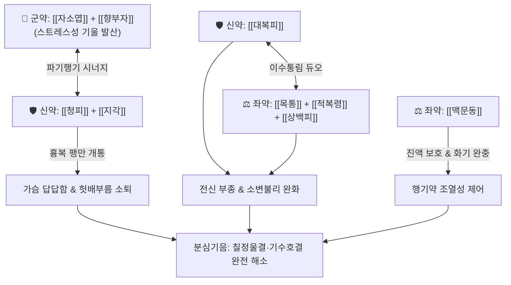

# 🍵 [[분신기음]] (分心氣飮, Bunsin-gi-eum)

> **핵심 3줄 요약 (Key Summary)**:
> - 🌿 [[자소엽]], [[청피]], [[대복피]], [[상백피]], [[목통]], [[지각]], [[적복령]], [[초과]], [[반하]], [[곽향]], [[향부자]], [[맥문동]], [[생강]], [[대추]], [[감초]] 배오 (칠정울결로 인한 기체·수종을 이기소도 및 이수통림으로 상하 소통).
> - 🎯 정서적 스트레스(칠정상, 억울, 화병)로 인해 가슴과 배가 팽만하고, 소변이 시원치 않으며 얼굴과 사지에 부종이 발생하는 기수(氣水) 호결 병태.
> - 🔬 시상하부-뇌하수체-부신축(HPA) 코르티솔 분비 억제, 위장관 평활근 경련 완화, 신장 나트륨 이뇨 촉진 및 삼출성 부종 흡수, 자율신경 실조증 안정화.
> - ⚠️ 주의사항: 행기(行氣)·파기(破氣) 및 이수 약재가 다수 포함되어 기를 소모할 수 있으므로, 중증 기혈 허약자나 임산부에게는 신중 투여.
---
## 📌 목차
1. [기본 처방 정보 & 군신좌사 구성](#1-기본-처방-정보--군신좌사-구성)
2. [방제학적 약재 상호작용 & 시너지 네트워크](#2-방제학적-약재-상호작용--시너지-네트워크)
3. [현대 분자약리학적 효능 & 작용 기전](#3-현대-분자약리학적-효능--작용-기전)
4. [적응 병증 및 체질별 감별 (Sweet Spot vs 금기)](#4-적응-병증-및-체질별-감별-sweet-spot-vs-금기)
5. [유사 처방군 감별 매트릭스](#5-유사-처방군-감별-매트릭스)
6. [임상 가감례 & 현대 질환별 응용](#6-임상-가감례--현대-질환별-응용)
7. [💡 사용자 진료실 핵심 필기 & 임상 팁 (원문 보존)](#7--사용자-진료실-핵심-필기--임상-팁-원문-보존)
8. [출처 및 학술 참고 문헌 (References)](#8-출처-및-학술-참고-문헌-references)
---
## 1. 기본 처방 정보 & 군신좌사 구성

* **출전**: 엄용화(嚴用和) 『[[제생방(濟生方)]]』, 《동의보감(東醫寶鑑)》 기문(氣門)
* **치법**: 행기개울(行氣開鬱), 소비소종(消痞消腫), 통리삼초(通利三焦), 온비화습(溫脾化濕)

| 구분 | 약재명 | 표준 용량 | 본초 효능 & 방제 내 역할 |
| :--- | :--- | :--- | :--- |
| **군약 (君藥)** | [[자소엽]] | 6g | 신온해표(辛溫解表), 행기화중, 상초 폐기를 열고 울체된 기운을 흩트림 |
| **군약 (君藥)** | [[향부자]] | 6g | 이기소간(理氣疏肝), 칠정으로 맺힌 기기(氣機)의 울결을 풀어내는 총사 |
| **신약 (臣藥)** | [[청피]] | 4g | 소간파기(疏肝破氣), 산결소적, 간담의 맺힌 기운을 뚫어 흉협통 해소 |
| **신약 (臣藥)** | [[지각]] | 4g | 하기관중(下氣寬中), 흉협과 명치 끝의 그득한 가스 팽만 제거 |
| **신약 (臣藥)** | [[대복피]] | 6g | 하기이수(下氣利水), 복부 팽만 완화 및 수습을 아래로 이끌어 배출 |
| **좌약 (佐藥)** | [[상백피]] | 4g | 사폐이수(瀉肺利水), 상초 수액의 통로를 열어 얼굴과 상체 부종 완화 |
| **좌약 (佐藥)** | [[목통]] | 4g | 이뇨통림(利尿通淋), 심화(心火)를 내리고 소변으로 수습 배출 |
| **좌약 (佐藥)** | [[적복령]] | 6g | 이수삼습(利水滲濕), 건비영심, 잉여 수액을 소변 배출하고 가슴 두근거림 진정 |
| **좌약 (佐藥)** | [[반하]] | 4g | 조습화담(燥濕化痰), 강역지구, 기침과 오심 진정 |
| **좌약 (佐藥)** | [[곽향]] | 4g | 방향화습(芳香化濕), 비위 습탁 제거 |
| **좌약 (佐藥)** | [[초과]] | 2g | 온비조습(溫脾燥濕), 비위의 차가운 담탁을 날리고 식욕 증진 |
| **좌약 (佐藥)** | [[맥문동]] | 4g | 양음윤폐(養陰潤肺), 행기약재들의 조열성(燥熱性)을 완충하고 진액 보존 |
| **사약 (使藥)** | [[생강]] | 4g | 온위지구, 소화기 보호 |
| **사약 (使藥)** | [[대추]] | 4g | 보비익기, 완화약성 |
| **사약 (使藥)** | [[감초]] | 3g | 보비화중, 조화제약 |

> **배오 특징**: 《제생방》과 《동의보감》에 수록되어 칠정(七情: 스트레스, 분노, 슬픔 등)으로 인해 기(氣)가 가슴과 복부에 뭉쳐 부종과 소변불리를 일으키는 **기수(氣水) 호결증**을 치료하는 대표 방제입니다. [[자소엽]]·[[향부자]]·[[청피]]·[[지각]]의 행기파기제와 [[대복피]]·[[상백피]]·[[목통]]·[[적복령]]의 이수통림제를 배오하여, 기가 통하면 물도 통한다는 '기행즉수행(氣行則水行)'의 원리를 극명하게 보여줍니다. 조열한 행기제 사이에서 [[맥문동]]이 음액 손상을 막아줍니다.
---
## 2. 방제학적 약재 상호작용 & 시너지 네트워크

* [[향부자]]·[[청피]] + [[대복피]]·[[목통]] 배오: 기(氣)가 막혀서 물(水)이 정체된 병리를 행기제와 이수제로 동시에 뚫어주어, 가슴 답답함과 소변 불리를 동시에 해결합니다.
* [[자소엽]] + [[맥문동]] 배오: 자소엽의 신온승산(辛溫升散) 작용에 맥문동의 감한윤폐(甘寒潤肺) 작용을 짝지어, 기운을 펴면서도 진액이 말라붙지 않도록 음양의 조화를 이룹니다.
---
## 3. 현대 분자약리학적 효능 & 작용 기전

### 1) 스트레스성 시상하부-부신축(HPA Axis) 안정화 및 항불안
* **주요 성분**: [[향부자]] 알파-사이페론, [[자소엽]] 로즈마린산, [[복령]] 파키만.
* **기전**: 스트레스로 인한 혈중 코르티솔 분비를 억제하고 뇌내 가바(GABA) 신경계를 활성화하여 신경성 가슴 답답함, 한숨, 공황 성향의 질식감을 진정시킵니다.

### 2) 위장관 평활근 이완 및 복강 내압 정상화
* **주요 성분**: [[지각]] 나린진, [[청피]] 헤스페리딘, [[대복피]] 아레콜린 복합체.
* **기전**: 자율신경 실조로 인한 위장관 평활근 경련을 억제하고 복부 가스 배출을 도와 복부 팽만감과 신트림을 완화합니다.

### 3) 신장 나트륨 배설 촉진 및 간질액 부종 흡수
* **주요 성분**: [[목통]] 헤데라게닌, [[상백피]] 모루신, [[적복령]] 트리테르펜.
* **기전**: 신장 세뇨관의 나트륨 배설을 촉진하여 혈관 외 간질에 저류된 부종액을 혈관계로 재흡수시켜 소변으로 배출합니다.
---
## 4. 적응 병증 및 체질별 감별 (Sweet Spot vs 금기)

[✅ 최적 적응증 (Sweet Spot)]
• 심한 정서적 충격이나 만성 스트레스(화병) 후 가슴이 답답하고 한숨을 자주 쉬며 옆구리가 결리는 환자
• 헛배가 부르고(복부 팽만), 소화가 안 되며, 소변이 찔끔거리고 얼굴과 손발이 붓는 기수(氣水) 호결증
• 신경성 부종, 생리 전 긴장 증후군(PMS)으로 인한 체중 증가 및 부종, 복부 팽만
• 설진/맥진: 설질암(舌質暗), 설태백니(白膩) 또는 박황태, 맥침현(沈弦) 또는 현완(弦緩)

[⚠️ 신중 투여 및 금기 (Caution / Contraindication)]
• 음허진고(陰虛津枯): 몸에 진액이 극히 부족하여 바짝 마르고 열이 나는 환자에게 행기약 연용 주의
• 임산부 신중: 청피, 지각, 대복피 등 파기·하기 약재가 다수 포함되어 있으므로 임산부 투여 주의
---
## 5. 유사 처방군 감별 매트릭스

| 처방명 | 핵심 구성 차이 | 주치 및 임상 차별점 | 맥진/설진 차이 |
| :--- | :--- | :--- | :--- |
| [[분신기음]] | 자소엽·향부자·청피·대복피·목통·상백피 | **칠정울결 + 복부팽만 + 부종 + 소변불리 (기수호결)** | 맥침현(沈弦), 백니태 |
| [[개울화담전]] | 향부자·창출·반하 + 지실·황련·신곡 | **정서적 기울 + 식적 + 담열, 소화불량과 매핵기 위주, 부종 없음** | 맥현활(弦滑), 황백니태 |
| [[반하후박탕]] | 반하·후박·복령·생강·소엽 (5미) | **순수 기체담응 매핵기, 목 이물감 위주, 복부 수종이나 소변 이상 없음** | 맥현(弦), 박백태 |
| [[오적산]] | 창출·마황·진피·건강·당귀 등 (17미) | **외감풍한 + 내상생랭, 한습성 요통과 관절통, 몸이 차가움** | 맥침지(沈遲), 백니태 |
| [[오령산]] | 택사·복령·저령·백출·계지 | **순수 수음(水飮) 정체, 갈증과 소변불리, 기체(스트레스) 울결 없음** | 맥부완(浮緩), 백태 |
---
## 6. 임상 가감례 & 현대 질환별 응용

* **수반 증상별 가감법**:
  * 화병(火病)으로 가슴 답답함과 열감이 극심할 때 $\rightarrow$ + [[치자]] 4g, [[황련]] 3g
  * 소변이 몹시 붉고 찔끔거리며 잘 안 나올 때 $\rightarrow$ + [[차전자]] 6g, [[택사]] 6g
  * 하지 부종과 무거움이 심할 때 $\rightarrow$ + [[방기]] 6g, [[의이인]] 12g
  * 기혈 허약이 동반될 때 $\rightarrow$ + [[황기]] 8g, [[백출]] 6g
* **현대 질환 매핑**:
  * 스트레스성 특발성 부종, 월경전 증후군(PMS)성 부종 및 유방 팽만통
  * 기능성 복부 팽만증, 과민성 장증후군(가스형), 화병(火病)
---
## 7. 💡 사용자 진료실 핵심 필기 & 임상 팁 (원문 보존)

> [!tip] **진료실 실전 노하우 (User Clinical Insight)**
> - **출전 및 의의**: 《제생방》 및 《동의보감》 기문(氣門) 수재. "治七情所傷, 氣不宣通, 脇肋脹滿, 漸成水腫, 小便不利." (칠정에 상하여 기운이 통하지 못하고 협륵이 팽만하여 점차 수종이 되고 소변이 잘 나오지 않는 것을 치료한다.)
> - **임상 포인트**: 스트레스로 기(氣)가 막히면 물(水)도 함께 정체되어 붓는다는 병리를 다루는 처방으로, 단순 이뇨제로 빠지지 않는 신경성 부종과 복부 가스 팽만에 탁효를 발휘함.
---
## 8. 출처 및 학술 참고 문헌 (References)

1. **엄용화 (1253년)**. 『제생방(濟生方)』.
   - **[고전 원전]**: "分心氣飮, 治男子婦人, 七情鬱結, 氣不升降, 心腹膨脹, 上氣喘急, 散聚往來." (분신기음은 남녀의 칠정울결로 기운이 오르내리지 못하고 가슴과 배가 팽창하며 숨이 찬 것을 치료한다.)
2. * **Kim SH et al. (2012)**. The effect of Bunsimgi-eum on Hwa-byung: randomized, double blind, placebo controlled trial. *Journal of ethnopharmacology*, 144: 402-7. [PMID: 23026303](https://pubmed.ncbi.nlm.nih.gov/23026303/)
