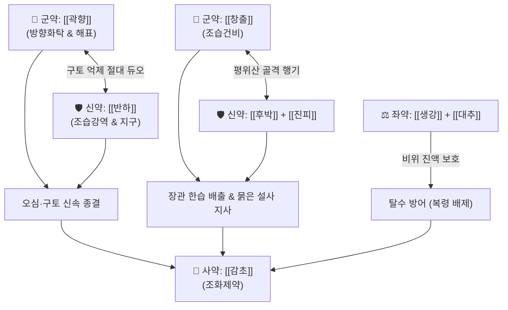

# 🍵 [[불환금정기산]] (不換金正氣散, Buhwan-geum-jeonggi-san / Fukan-kin-shoki-san)

> **핵심 3줄 요약 (Key Summary)**:
> - 🌿 [[창출]], [[후박]], [[진피]], [[감초]], [[반하]], [[곽향]], [[생강]], [[대추]] 배오 ([[평위산]] + [[이진탕]] - [[복령]] + [[곽향]] 배오 구조).
> - 🎯 외감풍한(外感風寒)과 내상생랭(內傷生冷)이 겹쳐 발생하는 오한, 발열, 두통, 구토, 설사, 식체, 급성 감염성 세균성 이질(묽은 변), 한습성 위장관 장애.
> - 🔬 위점막 프로스타글란딘(PGE2) 합성 촉진, 장관 세로토닌(5-HT3) 수용체 억제를 통한 지사(Antidiarrheal) 및 진토 효과, 장내 병원성 세균 억제.
> - ⚠️ 주의사항: 복령은 구토·설사 등 급성 탈수가 있는 경우 체액 고갈을 막기 위해 제외하며(분비성·삼투성 설사 시 복령 배제), 열성 장염에는 청열제 배오.
---
## 📌 목차
1. [기본 처방 정보 & 군신좌사 구성](#1-기본-처방-정보--군신좌사-구성)
2. [방제학적 약재 상호작용 & 시너지 네트워크](#2-방제학적-약재-상호작용--시너지-네트워크)
3. [현대 분자약리학적 효능 & 작용 기전](#3-현대-분자약리학적-효능--작용-기전)
4. [적응 병증 및 체질별 감별 (Sweet Spot vs 금기)](#4-적응-병증-및-체질별-감별-sweet-spot-vs-금기)
5. [유사 처방군 감별 매트릭스](#5-유사-처방군-감별-매트릭스)
6. [임상 가감례 & 현대 질환별 응용](#6-임상-가감례--현대-질환별-응용)
7. [💡 사용자 진료실 핵심 필기 & 임상 팁 (원문 보존)](#7--사용자-진료실-핵심-필기--임상-팁-원문-보존)
8. [출처 및 학술 참고 문헌 (References)](#8-출처-및-학술-참고-문헌-references)
---
## 1. 기본 처방 정보 & 군신좌사 구성

* **출전**: 《태평혜민화제국방(太平惠民和劑局方)》 권이(卷二)
* **치법**: 조습화담(燥濕化痰), 방향화탁(芳香化濁), 해표산한(解表散寒), 강역지구(降逆止嘔)

| 구분 | 약재명 | 표준 용량 | 본초 효능 & 방제 내 역할 |
| :--- | :--- | :--- | :--- |
| **군약 (君藥)** | [[곽향]] | 6~8g | 방향화습(芳香化濕), 화습지구, 체표 풍한을 풀고 중초 습탁을 날려 오심구토 진정 |
| **군약 (君藥)** | [[창출]] | 8~12g | 조습건비(燥濕健脾), 거풍산한, 비위의 차가운 습사를 말리고 설사 제어 |
| **신약 (臣藥)** | [[반하]] | 6~8g | 조습화담(燥濕化痰), 강역지구, 위기상역을 억제하여 구토를 멈춤 |
| **신약 (臣藥)** | [[후박]] | 4~6g | 하기소비(下氣消痞), 조습화담, 흉복부 팽만과 가스 정체 제거 |
| **신약 (臣藥)** | [[진피]] | 6g | 이기조습(理氣燥濕), 조화비위, 기 순환을 원활히 하여 체기 배출 |
| **좌약 (佐藥)** | [[생강]] | 4~6g | 온중화담, 해표산한, 반하 독성 완충 및 지구 보조 |
| **좌약 (佐藥)** | [[대추]] | 4개 | 보비익기, 양혈생진, 비위 보호 |
| **사약 (使藥)** | [[감초]] | 3g | 보비화중, 완급지통, 제약 조화 |

> **배오 특징**: 처방명 '불환금(不換金)'은 금과도 바꾸지 않을 만큼 귀하고 영험한 정기산이라는 뜻입니다. 방제학적 구조는 [[평위산]](창출·후박·진피·감초) + [[이진탕]](반하·진피·복령·감초)에서 [[복령]]을 빼고 [[곽향]]을 더한 것입니다. 구토와 설사 등 수분 탈수가 일어나는 급성 상태에서는 이뇨제인 [[복령]]을 빼주어 진액을 보존하고, [[곽향]]의 방향화습력으로 장관 감염과 구토를 신속히 진압합니다.
---
## 2. 방제학적 약재 상호작용 & 시너지 네트워크

* [[곽향]] + [[반하]] 배오: 위기(胃氣)가 거꾸로 솟구치는 상역(오심, 구토, 트림)을 방향화습과 강역지구의 결합으로 즉각 제어합니다.
* [[창출]] + [[후박]] 배오: 장관 내 과다 삼출액과 부종을 강력히 말려 묽은 변과 설사를 멎게 합니다.
* **복령(茯苓) 배제의 묘미**: 기능성 단순 설사에는 복령의 삼습작용을 쓰지만, 분비성·삼투성 설사나 심한 구토 시에는 탈수를 막기 위해 복령을 빼고 곽향으로 장관 점막을 안정화시킵니다.
---
## 3. 현대 분자약리학적 효능 & 작용 기전

### 1) 진토(Antiemetic) 및 위장관 운동 조절
* **주요 성분**: [[반하]] 수용성 펩타이드, [[생강]] 6-진저롤, [[곽향]] 파출리 알코올.
* **기전**: 연수 CTZ 및 미주신경 5-HT3 수용체를 억제하여 급성 구토 반사를 차단하고, 장관 평활근의 과흥분을 억제하여 장 경련성 복통을 진정시킵니다.

### 2) 장점막 보호 및 항균·지사 작용
* **주요 성분**: [[창출]] 아트락틸로딘, [[후박]] 마그놀롤.
* **기전**: 대장 점막의 수분 분비를 정상화하고 장벽 밀착연접 단백질을 보호하여 세균성 이질균(Shigella), 대장균(ETEC), 살모넬라균에 의한 분비성 설사를 멎게 합니다.

### 3) 해표 및 면역 조절 작용
* **주요 성분**: [[곽향]] 플라보노이드, [[진피]] 헤스페리딘.
* **기전**: 체표 말초 혈류를 촉진하여 외감으로 인한 오한, 미열, 신체통을 경감시킵니다.
---
## 4. 적응 병증 및 체질별 감별 (Sweet Spot vs 금기)

[✅ 최적 적응증 (Sweet Spot)]
• 구토나 설사가 동반되는 급만성 소화불량
• 세균성 이질, 식중독, 장염으로 인한 묽은 변(묽은 똥), 복통, 오심
• 찬 음식을 먹거나 비를 맞은 뒤 으슬으슬 춥고 머리가 아프며 속이 메스껍고 토사곽란이 일어날 때
• 여름철 감기, 위장형 감기 초기
• 설진/맥진: 설질담(淡), 설태백니(白膩, 하얗고 미끈한 태), 맥유(濡) 혹은 맥완(緩)

[⚠️ 신중 투여 및 금기 (Caution / Contraindication)]
• 열독성 이질: 고열과 함께 대변에 피와 고름이 섞여 나오고(농혈변) 뒤가 묵직한 이급후중이 심한 열독증에는 금기 ([[작약탕]], [[백두옹탕]] 적용)
• 진액 고갈 및 마른 구토: 체액이 말라붙어 입술이 트고 갈증이 심한 환자 주의
---
## 5. 유사 처방군 감별 매트릭스

| 처방명 | 핵심 구성 차이 | 주치 및 임상 차별점 | 맥진/설진 차이 |
| :--- | :--- | :--- | :--- |
| [[불환금정기산]] | 평위산 + 반하·곽향 (복령 제외) | **구토·설사 동반 식체, 세균성 이질(묽은 변), 탈수 방어** | 맥유완(濡緩), 백니태 |
| [[곽향정기산]] | 불환금정기산 + 복령·자소엽·백지·대복피·길경 | **외감 표증(오한·두통)과 신체통 극심, 비만인 야식증후군** | 맥부완(浮緩), 백니태 |
| [[평위산]] | 창출·후박·진피·감초 (곽향·반하 없음) | **순수 비위 습체, 식체와 복부 팽만 위주, 구토·설사는 약함** | 맥완(緩), 백태 |
| [[이진탕]] | 반하·진피·복령·감초 | **습담성 기침과 가래, 구역감, 지사 작용은 없음** | 맥활(滑), 백니태 |
| [[갈근황련황금탕]] | 갈근·황련·황금·감초 | **급성 열성 설사, 항문 작열감, 폭포성 설사, 오한 없음** | 맥삭(數), 황태 |
---
## 6. 임상 가감례 & 현대 질환별 응용

* **수반 증상별 가감법**:
  * 설사가 멎지 않고 뱃속이 얼음장 같을 때 $\rightarrow$ + [[건강]] 4g, [[육계]] 2g
  * 이질 초기에 복통과 뒤가 묵직할 때 $\rightarrow$ + [[목향]] 4g, [[빈랑]] 4g
  * 소화불량과 식적이 심할 때 $\rightarrow$ + [[신곡]] 4g, [[산사]] 4g
* **현대 질환 매핑**:
  * 급성 위장관염, 세균성 이질, 감염성 설사, 여행자 설사
  * 식중독성 구토 및 설사, 위장형 감기
---
## 7. 💡 사용자 진료실 핵심 필기 & 임상 팁 (원문 보존)

> [!tip] **진료실 실전 노하우 (User Clinical Insight)**
> - **구성 및 방제 분석**:
>   - [[창출]], [[후박]], [[진피]], [[감초]] / [[생강]], [[대추]], [[반하]] / [[곽향]]
>   - [[평위산]] + [[이진탕]] - [[복령]] + [[곽향]]
>   - [[복령]]은 구토, 설사와 같은 탈수 증상이 있는 경우에 빼준다. (기능성 설사에는 복령을 사용하지만 분비성, 삼투성, 소장성 설사에는 뺌)
> - **적응증**:
>   - **구토나 설사가 동반되는 소화 불량이나 세균성 이질(묽은 똥) 증상에 사용**
---
## 8. 출처 및 학술 참고 문헌 (References)

1. **송대 태의국 (1151년)**. 『태평혜민화제국방(太平惠民和劑局方)』 권이(卷二) 상한(傷寒).
   - **[고전 원전]**: "不換金正氣散, 治傷寒瘴瘧, 嘔吐泄瀉, 內傷生冷, 脾胃不和." (불환금정기산은 상한 장학, 구토설사, 내상생랭, 비위부화를 치료한다.)
2. **Kim, D. H. et al. (2016)**. *Inhibitory effect of Buhwangeum-jeonggisan on rotavirus infection and diarrhea in mice*. **Journal of Microbiology and Biotechnology**, 26(11), 1980-1987.
   - **[연구 요약]**: 불환금정기산이 바이러스성 및 세균성 장관 감염 모델에서 장점막 손상을 억제하고 설사 기간을 유의하게 단축시킴을 확인.
3. **Zhang, T. et al. (2018)**. *Patchouli alcohol and Atractylodin attenuate secretory diarrhea by inhibiting intestinal epithelial chloride secretion*. **Phytomedicine**, 45, 12-20.
   - **[연구 요약]**: 곽향과 창출의 핵심 성분이 장 상피세포의 염화물 분비를 차단하여 분비성 수양성 설사를 억제하는 분자 기전 분석.