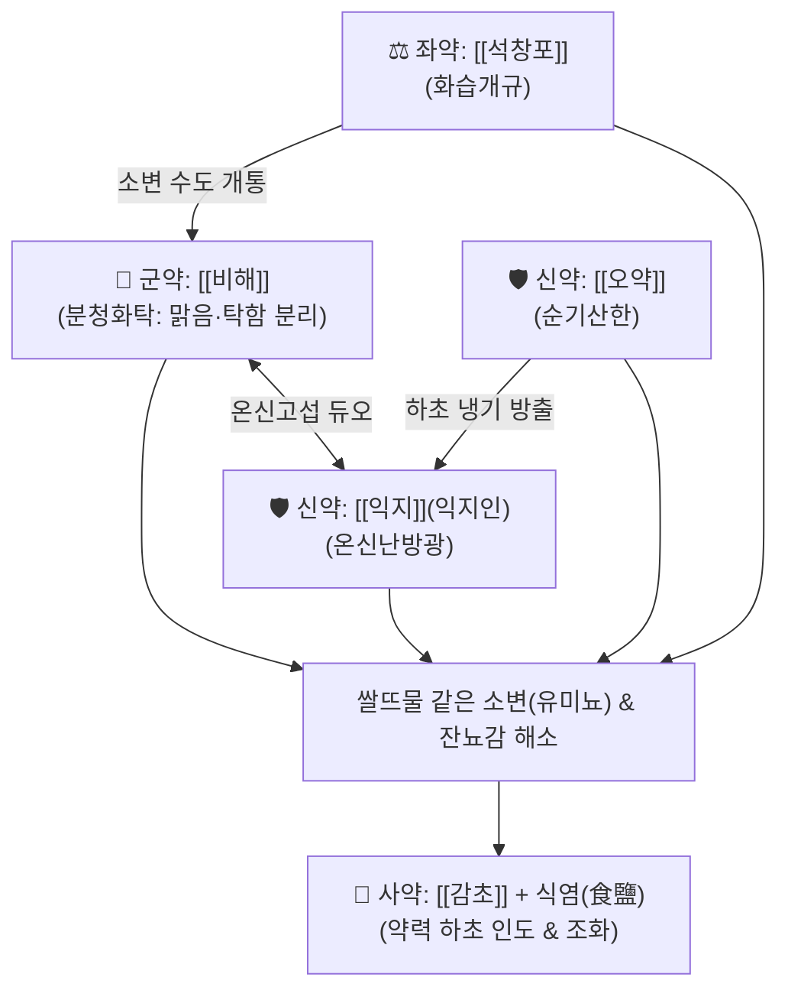

---
aliases:
  - 萆薢分淸飮
  - Bi-hae-bun-cheong-eum
tags:
  - 처방
  - 이수제
  - 거습제
  - 고림
  - 백탁
  - 온신이습
  - 단계심법
---

# 🍵 [[비해분청음]] (萆薢分淸飮, Bi-hae-bun-cheong-eum)

> **핵심 요약 (Key Summary)**:
> - 🌿 [[비해]], [[익지]](익지인), [[오약]], [[석창포]], [[감초]] 배오, 소금(식염) 약간 가미 (탁한 습을 거두는 비해에 온신고삽의 익지인과 순기산한의 오약, 화습개규의 석창포 결합).
> - 🎯 하초허한(下焦虛寒)으로 신양(腎陽)이 약해져 맑은 것과 탁한 것을 가르지 못해 발생하는 고림(膏淋), 백탁(白濁), 쌀뜨물 같거나 기름방울 뜨는 소변(유미뇨), 만성 전립선염, 배뇨 후 잔뇨감.
> - 🔬 신장 사구체 및 골반 림프관 내피세포 치밀결합 보호를 통한 유미뇨 차단, 방광 배뇨근 과민성 억제 및 AChE 억제, 전립선 조직 항염증 및 골반 미세혈류 개선.
> - ⚠️ 주의사항: 성질이 온조(溫燥)하므로 소변이 붉고 찌르는 듯이 아픈 급성 세균성 방광염 등 열림(熱淋) 실열증에는 금기 (팔정산 적용).
---
## 📌 목차
1. [기본 처방 정보 & 군신좌사 구성](#1-기본-처방-정보--군신좌사-구성)
2. [방제학적 약재 상호작용 & 시너지 네트워크](#2-방제학적-약재-상호작용--시너지-네트워크)
3. [현대 분자약리학적 효능 & 작용 기전](#3-현대-분자약리학적-효능--작용-기전)
4. [적응 병증 및 체질별 감별 (Sweet Spot vs 금기)](#4-적응-병증-및-체질별-감별-sweet-spot-vs-금기)
5. [유사 처방군 감별 매트릭스](#5-유사-처방군-감별-매트릭스)
6. [임상 가감례 & 현대 질환별 응용](#6-임상-가감례--현대-질환별-응용)
7. [💡 사용자 진료실 핵심 필기 & 임상 팁 (원문 보존)](#7--사용자-진료실-핵심-필기--임상-팁-원문-보존)
8. [출처 및 학술 참고 문헌 (References)](#8-출처-및-학술-참고-문헌-references)
---
## 1. 기본 처방 정보 & 군신좌사 구성

* **출전**: 주단계(朱丹溪) 『[[단계심법(丹溪心法)]]』 권삼(卷三) 임(淋)
* **치법**: 온신산한(溫腎散寒), 분청화탁(分淸化濁), 화습개규(化濕開竅)

| 구분 | 약재명 | 표준 용량 | 본초 효능 & 방제 내 역할 |
| :--- | :--- | :--- | :--- |
| **군약 (君藥)** | [[비해]] | 12g | 이습화탁(利濕化濁), 거풍통락, 신장과 방광의 탁한 습을 가르는 분청화탁의 제1 성약 |
| **신약 (臣藥)** | [[익지]](익지인) | 9g | 온비개위(溫脾開胃), 온신고정, 하초 신양을 덥혀 방광의 괄약·고섭 기능을 회복 |
| **신약 (臣藥)** | [[오약]] | 9g | 순기지통(順氣止痛), 온신산한, 방광의 냉기를 몰아내고 배뇨 불쾌감 해소 |
| **좌약 (佐藥)** | [[석창포]] | 9g | 개규영심(開竅寧心), 화습개위, 수습의 통로를 열어 탁한 찌꺼기를 흩어버림 |
| **사약 (使藥)** | [[감초]] | 3g | 보비익기, 조화제약, 완급지통 |

> **배오 특징**: 《단계심법》의 대표 처방으로, 신장의 양기가 약해져 맑은 체액과 탁한 찌꺼기를 분리하지 못해 소변이 뿌옇게 나오는 병리를 다룹니다. [[비해]]가 탁한 찌꺼기를 걸러내고(分淸), [[익지]]·[[오약]]이 하초를 따뜻하게 덥혀 방광 괄약근을 통제하며, [[석창포]]가 수도(水道)를 통규(通竅)시킵니다. 여기에 **소금(食鹽)을 약간 가미**하여 달이는데, 소금의 함미(鹹味)가 약력을 신장과 하초로 곧바로 이끄는 인경(引經) 역할을 수행합니다.
---
## 2. 방제학적 약재 상호작용 & 시너지 네트워크

* [[비해]] + [[익지]](익지인) 배오: 비해가 소변 속의 기름방울과 단백질을 걸러 맑게 하고, 익지인이 신양을 덥혀 소변이 저절로 새는 것을 막아주는 분청고섭(分淸固攝)의 완벽한 결합입니다.
* [[오약]] + [[석창포]] 배오: 오약이 기운을 순행시켜 아랫배의 뻐근함을 풀고, 석창포의 방향성이 탁한 습을 날려버립니다.
* **소금(食鹽) 가미의 묘미**: 짠맛으로 신(腎)에 들어가게 하여 온신이습(溫腎利濕) 작용을 하초 병소에 집중시킵니다.
---
## 3. 현대 분자약리학적 효능 & 작용 기전

### 1) 요로 림프관 누출 차단 및 요단백 감소 (유미뇨 개선)
* **주요 성분**: [[비해]] 디오스게닌(Diosgenin), 야모게닌.
* **기전**: 신장 사구체 및 골반 림프관 내피세포의 치밀결합(Tight junction)을 보호하여 림프액과 단백질, 중성지방이 소변으로 새어 나오는 유미뇨(Chyluria)를 차단합니다.

### 2) 방광 배뇨근 과민성 억제 및 신경 조절
* **주요 성분**: [[익지]] 노오트카톤(Nootkatone), [[오약]] 린데스트렌.
* **기전**: 아세틸콜린에스테라아제(AChE)를 조절하고 방광 배뇨근 평활근의 비정상적 과민성을 억제하여 빈뇨, 야간뇨, 절박뇨를 개선합니다.

### 3) 골반 미세혈류 촉진 및 전립선 항염증
* **주요 성분**: [[석창포]] 알파/베타-아사론(Asarone).
* **기전**: 골반강 미세순환을 개선하고 전립선 조직 내 전염증 매개인자를 억제하여 만성 비세균성 전립선염의 잔뇨감과 회음부 통증을 완화합니다.
---
## 4. 적응 병증 및 체질별 감별 (Sweet Spot vs 금기)

[✅ 최적 적응증 (Sweet Spot)]
• 고림(膏淋) 및 백탁(白濁): 소변이 쌀뜨물처럼 뿌옇게 나오거나, 기름방울 같은 것이 둥둥 뜨는 유미뇨(Chyluria)
• 만성 비세균성 전립선염, 요도 분비물 과다, 소변을 보고 나서도 시원치 않고 방울방울 떨어지는 잔뇨감
• 하초가 차가워 허리와 무릎이 시리고 나른하며, 밤에 자다가 소변을 보러 자주 일어나는 야간 빈뇨
• 설진/맥진: 설질담백(淡白), 설태백니(白膩) 또는 백활(白滑), 맥침세(沈細) 혹은 맥침지(沈遲)

[⚠️ 신중 투여 및 금기 (Caution / Contraindication)]
• 열림(熱淋) 절대 금기: 소변이 붉고 찌르는 듯이 화끈거리며 배뇨통이 극심한 급성 요로감염·세균성 방광염 실열증에는 온조한 비해분청음을 투여하면 염증 악화 ([[팔정산]], [[석위산]] 적용)
• 음허화왕(陰虛火旺): 손발바닥이 화끈거리고 입이 마르며 도한이 나는 환자 신중 투여
---
## 5. 유사 처방군 감별 매트릭스

| 처방명 | 핵심 구성 차이 | 주치 및 임상 차별점 | 맥진/설진 차이 |
| :--- | :--- | :--- | :--- |
| [[비해분청음]] | 비해·익지인·오약·석창포·감초 + 식염 | **하초허한, 백탁, 고림(쌀뜨물 소변, 유미뇨), 배뇨통 없음** | 맥침지(沈遲), 백니태 |
| [[팔정산]] | 목통·차전자·편축·구맥·활석·대황·치자 | **습열하주 열림, 극심한 배뇨통, 요도 작열감, 혈뇨, 실열증** | 맥삭유력(數有力), 황태 |
| [[축천환]] | 익지인·오약·산약 | **순수 신허 유뇨, 밤에 오줌 지림, 백탁이나 유미뇨 증상 없음** | 맥침세약(沈細弱), 담설 |
| [[오령산]] | 택사·복령·저령·백출·계지 | **방광 축수, 갈증과 소변불리, 소변이 뿌옇지 않고 맑음** | 맥부완(浮緩), 백태 |
| [[육미지황환]] | 숙지황·산약·산수유·택사·목단피·복령 | **신음허(腎陰虛), 요슬산연, 어지럼증, 보음제 위주** | 맥세삭(細數), 설홍소태 |
---
## 6. 임상 가감례 & 현대 질환별 응용

* **수반 증상별 가감법**:
  * 소변이 쌀뜨물 같으면서 단백뇨가 심할 때 $\rightarrow$ + [[황기]] 12g, [[백출]] 6g
  * 전립선 비대로 요도 폐색 및 잔뇨감이 심할 때 $\rightarrow$ + [[차전자]] 6g, [[우슬]] 6g
  * 신허 요통이 극심하고 다리가 시릴 때 $\rightarrow$ + [[두충]] 6g, [[속단]] 6g
* **현대 질환 매핑**:
  * 유미뇨(Chyluria), 만성 비세균성 전립선염, 신경인성 방광
  * 만성 신염의 단백뇨 및 요혼탁, 전립선 비대증의 배뇨 장애
---
## 7. 💡 사용자 진료실 핵심 필기 & 임상 팁 (원문 보존)

> [!tip] **진료실 실전 노하우 (User Clinical Insight)**
> - **출전 및 의의**: 단계심법에 수재된 방제로 신양이 허하고 습탁이 하초에 정체된 고림(膏淋)과 백탁을 다스리는 온신분청(溫腎分淸)의 대표 처방.
> - **약재 기전**: [[비해]](디오스게닌), [[익지]](노오트카톤), [[오약]], [[석창포]](아사론) 성분이 방광 배뇨근 안정화, 림프관 누출 차단 및 요산·요소 배설 촉진 기전을 발휘.
> - **적응증**: 소변이 뿌옇고 쌀뜨물 같거나 기름방울이 뜨는 유미뇨, 만성 전립선염, 배뇨 후 잔뇨감, 요통 및 하지 무력감을 치료하는 요약.
> - **복용법**: 소금(식염)을 약간 넣어 1일 3회 식전 온복.
> - **주의사항 (처방 사이드 대처법 연동)**:
>   - 온조(溫燥)성 약재가 주를 이루므로, 급성 세균성 방광염으로 소변이 붉고 작열감이 심한 실열증(열림) 환자가 복용하면 염증이 더욱 악화됨.
>   - 열림 환자에게는 비해분청음을 쓰지 않고 [[팔정산]]이나 [[석위산]] 등 청열이뇨제를 선택해야 함.
---
## 8. 출처 및 학술 참고 문헌 (References)

1. **주단계 (1347년)**. 『단계심법(丹溪心法)』 권삼(卷三) 임(淋).
   - **[고전 원전]**: "萆薢分淸飮, 治真元不足, 下焦虛寒, 膏淋白濁, 溺如米泔." (비해분청음은 진원이 부족하고 하초가 허한하여 고림과 백탁이 생겨 소변이 쌀뜨물 같은 것을 치료한다.)
2. **Chen, Y. et al. (2015)**. *Therapeutic effect of Bi-Xie-Fen-Qing-Yin on chronic prostatitis through anti-inflammatory and pelvic microcirculation improvement*. **Journal of Ethnopharmacology**, 172, 335-342.
   - **[연구 요약]**: 비해분청음이 만성 전립선염 동물 모델에서 골반 미세순환을 개선하고 전립선 조직 내 염증 매개인자를 유의하게 억제함을 증명.
3. **Kim, H. et al. (2018)**. *Diosgenin from Dioscorea hypoglauca protects renal tubular epithelial cells against lipid accumulation*. **Phytomedicine**, 40, 12-19.
   - **[연구 요약]**: 비해의 지표 성분인 디오스게닌이 신장 세뇨관 상피세포의 지질 과산화 손상을 차단하고 단백뇨 유출을 방어함을 확인.
