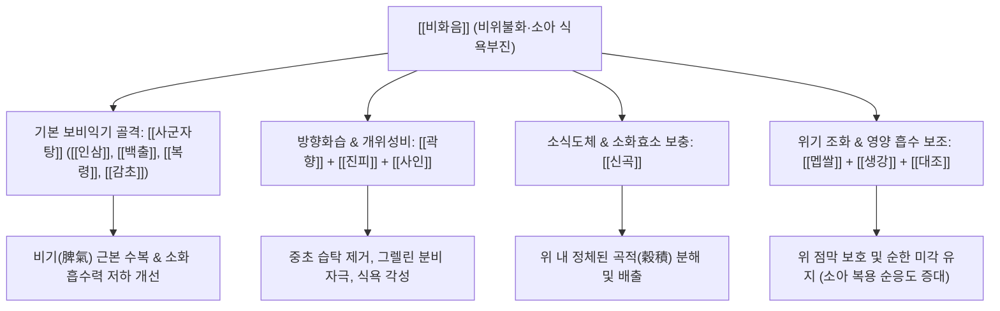

# 🍵 [[비화음]] (脾和飮, Pihe-yin / Spleen-Harmonizing Decoction)

> **핵심 3줄 요약 (Key Summary)**:
> - 🌿 기본 구성: [[사군자탕]]([[인삼]], [[백출]], [[복령]], [[감초]])에 방향성 건위제인 [[곽향]], [[진피]], [[사인]], 소화제 [[신곡]], 위기를 돕는 [[멥쌀]], [[생강]], [[대조]]를 배오한 방제.
> - 🎯 적응증: 소아 식욕부진(밥 안 먹으려고 입에 물고만 있는 상태), 식후 복통, 복부 팽만, 묽은 변, 영양 흡수 장애, 성장 부진.
> - 🔬 약리 기전: 그렐린 수용체 활성화를 통한 식욕 촉진, 신곡의 천연 소화효소 분비 유도, 위 배출능 개선 및 장 점막 회복.
> - ⚠️ 주의사항: 급성 위장염, 고열, 설태가 노랗게 끼는 습열실증이나 급성 식체에는 복용 금기.

---
## 📌 목차
1. [기본 처방 정보 & 군신좌사 구성](#1-기본-처방-정보--군신좌사-구성)
2. [방제학적 약재 상호작용 & 시너지 네트워크](#2-방제학적-약재-상호작용--시너지-네트워크)
3. [현대 분자약리학적 효능 & 작용 기전](#3-현대-분자약리학적-효능--작용-기전)
4. [적응 병증 및 체질별 감별 (Sweet Spot vs 금기)](#4-적응-병증-및-체질별-감별-sweet-spot-vs-금기)
5. [유사 처방군 감별 매트릭스](#5-유사-처방군-감별-매트릭스)
6. [임상 가감례 & 현대 질환별 응용](#6-임상-가감례--현대-질환별-응용)
7. [💡 사용자 진료실 핵심 필기 & 임상 팁 (원문 보존)](#7--사용자-진료실-핵심-필기--임상-팁-원문-보존)
8. [출처 및 학술 참고 문헌 (References)](#8-출처-및-학술-참고-문헌-references)
---

## 1. 기본 처방 정보 & 군신좌사 구성

| 구분 | 약재명 | 표준 용량 | 본초 효능 & 방제 내 역할 |
| :--- | :--- | :--- | :--- |
| 군약(君藥) | [[인삼]] | 4.0g | 대보원기(大補元氣), 보비익폐(補脾益肺). 비위의 근본 기운을 북돋워 소화 흡수력 강화 |
| 군약(君藥) | [[백출]] | 4.0g | 건비익기(健脾益氣), 조습이수(燥濕利水). 소화관 점막 수분 정체를 제거하고 위장 기능 활성화 |
| 신약(臣藥) | [[백복령]] | 4.0g | 건비보중(健脾補中), 영심안신(寧心安神). 비허습을 삼습(渗濕)하여 내보내고 소아의 신경 안정 유도 |
| 신약(臣藥) | [[신곡]] | 3.0g | 건비소식(健脾消食), 조중화위(調中和胃). 곡류와 음식물의 소화 불량을 해소하고 위기를 개운하게 통창 |
| 좌약(佐藥) | [[곽향]] | 3.0g | 방향화습(芳香化濕), 화위지구(和胃止嘔). 중초의 습탁을 기화시키고 비위를 일깨워 입맛을 돋움 |
| 좌약(佐藥) | [[진피]] | 3.0g | 이기건비(理氣健脾), 조습화담(燥濕化痰). 기운의 순환을 원활히 하여 헛배부름과 복창 완화 |
| 좌약(佐藥) | [[사인]] | 2.5g | 화습개위(化濕開胃), 온비지사(溫脾止瀉). 비위를 덥히고 정체된 가스와 소화관 한습을 흩어버림 |
| 좌약(佐藥) | [[멥쌀]] | 6.0g | 익기화중(益氣和中), 양위진액(養胃津液). 위 점막을 부드럽게 보호하고 소아에게 순한 영양 공급 |
| 사약(使藥) | [[감초]] | 2.0g | 보비익기(補脾益氣), 조화제약(調和諸藥). 여러 약재의 성질을 부드럽게 융합 |
| 사약(使藥) | [[생강]] | 3.0g | 온중지구(溫中止嘔), 산한조위(散寒調胃). 위의 냉기를 몰아내고 구토와 메스꺼움 억제 |
| 사약(使藥) | [[대조]] | 3.0g | 보중익기(補中益氣), 양혈안신(養血安神). 생강과 짝을 이루어 영위(營衛)와 비위를 보익 |

> *참고: 상기 용량은 성인 기준 기본량이며, 소아 투약 시 연령 및 체중에 맞추어 비례 감량(예: 3~6세는 1/3~1/2량)하여 투약합니다.*

---

## 2. 방제학적 약재 상호작용 & 시너지 네트워크

- **사군자탕(四君子湯)의 보기건비(補氣健脾) 뼈대**:
  - 기본적으로 밥을 먹지 않는 아이들은 비기가 허하여 소화관이 무력해진 상태입니다. [[인삼]], [[백출]], [[백복령]], [[감초]]는 소화관 평활근의 긴장도와 흡수력을 높이는 가장 표준적인 자양 기반입니다.
- **방향화습(芳香化濕)의 개위(開胃) 네트워크**:
  - 비위가 습(濕)에 갇히면 입맛을 잃고 혀에 백태가 끼며 밥 냄새만 맡아도 헛구역질을 합니다. [[곽향]], [[진피]], [[사인]]의 정유 성분이 중초의 습체를 흩어 비위를 흔들어 깨우고(醒脾), 향기로써 위액 분비를 유도합니다.
- **소식(消食)과 영양 보충(養營)의 균형**:
  - 만성적으로 소화관에 정체된 잔류 음식물을 [[신곡]]으로 발효·분해하여 비워내고, 텅 빈 위에 자극을 주지 않도록 [[멥쌀]](갱미)을 배오하여 위기(胃氣)를 즉각 회복시키는 조화로운 배오를 완성합니다.

---

## 3. 현대 분자약리학적 효능 & 작용 기전

### 1) 식욕 촉진 및 위 배출능 개선 (Ghrelin 분비 및 위장 운동 촉진)
- [[사인]]과 [[곽향]]에 함유된 Bornyl acetate, Patchouli alcohol 성분은 시상하부-위장관 축(Gut-Brain Axis)을 자극하여 공복감 호르몬인 그렐린(Ghrelin) 분비를 촉진하고 렙틴(Leptin) 저항성을 개선합니다.
- [[진피]]의 Hesperidin과 Nobiletin은 위 전정부(Antrum) 연동운동의 진폭을 증가시켜 위 내용물 배출 시간(Gastric Emptying Time)을 유의하게 단축시킵니다.

### 2) 소화효소 분비 항진 및 영양분 흡수율 증대
- [[신곡]]은 천연 미생물 발효 산물로 아밀라아제(Amylase), 프로테아제(Protease) 활성을 직접 보충하며, 췌장 외분비 기능을 자극하여 탄수화물과 단백질 소화율을 극대화합니다.
- [[인삼]] 사포닌(Ginsenoside Rb1, Rg1)과 [[백출]] 다당체는 소장 융모의 위축을 방지하고 장 점막 타이트 정션(ZO-1, Occludin) 발현을 유도하여 장내 흡수 표면적을 넓히고 영양소 생체이용률을 개선합니다.

### 3) 소아 장내 미생물총(Microbiome) 불균형 개선
- [[백복령]]의 $\beta$-글루칸과 [[멥쌀]]의 저항성 전분은 장내 유익균(Bifidobacterium, Lactobacillus)의 증식을 돕는 프리바이오틱스로 작용하여 소아의 만성 묽은 변 및 가스 생성을 완화합니다.

---

## 4. 적응 병증 및 체질별 감별 (Sweet Spot vs 금기)

### 1) 적응증 (Sweet Spot)
- **소아 만성 섭식 장애(Anorexia in Children)**:
  - 밥때가 되어도 배고파하지 않고, 밥을 입에 물고 삼키지 않으며, 군것질만 찾거나 밥 냄새를 싫어하는 아이.
- **비위허약형 성장 부진**:
  - 또래보다 키와 체중이 현저히 적고, 안색이 누렇고 핼쑥하며(위황 面黃), 근육에 힘이 없고 쉬 피로해하는 소아.
- **식후 복만 및 무른 변**:
  - 밥을 조금만 먹어도 배가 볼록 튀어나오고, 배에서 꾸르륵 소리가 자주 나며, 변이 묽거나 덜 소화된 음식물이 섞여 나오는 증상.

### 2) 금기 및 신중 투여
- **실열(實熱) 및 습열(濕熱) 증상**:
  - 갈증이 심하여 찬물을 벌컥벌컥 마시고, 혀가 붉고 황태가 끼며, 변비가 심하고 성격이 매우 급하고 화를 잘 내는 소아에게는 부적합.
- **급성 감염성 장염**:
  - 발열, 복통, 이질성 점액변이 쏟아지는 급성 감염기에는 먼저 청열해독제나 지사제를 투여해야 합니다.

---

## 5. 유사 처방군 감별 매트릭스

| 처방명 | 핵심 구성 차이 | 주치 및 임상 차별점 | 맥진/설진 차이 |
| :--- | :--- | :--- | :--- |
| [[비화음]] | [[사군자탕]] + [[신곡]] + [[곽향]], [[진피]], [[사인]], [[멥쌀]] | 소아 식욕부진, 밥 안 먹는 아이에게 위기를 열어 입맛을 돋움 | 맥 세약(細弱), 설 담홍(淡紅) 백태(白苔) |
| [[삼출건비탕]] | [[사군자탕]] + [[평위산]] + [[산사]], [[신곡]], [[맥아]], [[사인]], [[지실]], [[작약]] | 성인 및 소아의 만성 소화불량, 식적과 담음으로 인한 복통, 팽만감, 두통 동반 | 맥 현세(弦細) 혹은 활(滑), 설 담백 태후(苔厚) |
| [[보화환]] | [[산사]], [[신곡]], [[반하]], [[복령]], [[진피]], [[연교]], [[래복자]] | 급만성 과식·폭식으로 인한 음식 정체, 트림에서 신물 및 썩은 냄새, 설사 | 맥 활삭(滑數), 설태 황후(黃厚) 구취 |
| [[향사육군자탕]] | [[육군자탕]]([[사군자탕]]+[[이진탕]]) + [[목향]], [[사인]] | 위무력증, 위하수, 복부 팽만, 트림, 담음이 그렁거리는 만성 위염 | 맥 허완(虛緩) 혹은 현(弦), 설 담(淡) 백니(白膩) |

---

## 6. 임상 가감례 & 현대 질환별 응용

### 1) 임상 가감례
- **복통 및 복부 가스 과다**: 장경련이 잦고 배가 아프다고 보채면 [[백작약]], [[목향]] 각 3.0g을 가하여 완급지통(緩急止痛)합니다.
- **야제(夜啼) 및 신경 예민**: 밤에 자주 깨서 울거나 성격이 예민한 소아는 [[산조인]](초), [[원지]] 각 2.5g을 가하여 안신(安神)시킵니다.
- **만성 무른 변 및 설사**: 묽은 변을 자주 보면 [[산약]], [[백편두]] 각 4.0g을 가하여 건비지사(健脾止瀉)력을 강화합니다.
- **기침 및 가래 동반**: 소화 불량과 함께 가래 끓는 소리가 나면 [[반하]], [[후박]] 각 2.5g을 가합니다.

### 2) 현대 질환별 응용
- **소아 기능성 식욕부진 (Functional Anorexia)**: 이유식 완료기 이후 밥을 잘 먹지 않는 유소아에게 탕전액을 조청이나 올리고당에 살짝 타서 복용시키면 뛰어난 순응도와 식욕 개선을 보임.
- **항생제 복용 후 장관 소화기능 저하**: 잦은 감기나 중이염으로 항생제를 복용한 후 장내 균총이 무너지고 입맛을 잃은 소아의 위장관 회복.
- **소아 성장 부진 및 체중 미달**: 비위 흡수력을 회복시켜 영양 상태를 정상화함으로써 성장호르몬 분비 촉진의 토대를 마련.

---

## 7. 💡 사용자 진료실 핵심 필기 & 임상 팁 (원문 보존)

> [!tip] **진료실 실전 노하우 (User Clinical Insight)**
> 
> # 구성
> [[인삼]], [[백출]], [[백복령]]/ [[신국]], [[곽향]], [[진피]], [[사인]], [[멥쌀]]/ [[생강]], [[대조]]
> - [[사군자탕]]+생대감+소도지제+영양분
> 
> # 적응증
> - 애들이 밥 안 먹으려고 할 때 밥 먹게 하는 처방

---

## 8. 출처 및 학술 참고 문헌 (References)

1. **공정현 (龔廷賢)**. (1587). 『만병회춘(萬病回春)』.
   - **[고전 원전]**: "治小兒脾胃虛弱, 不思飮食, 或食積泄瀉, 面黃肌瘦. 脾和飮 開胃進食, 脾胃自和." (소아의 비위가 허약하여 음식을 생각하지 않거나 식적으로 설사하고 안색이 누렇게 마르는 것을 치료한다. 비화음은 위를 열어 밥을 먹게 하니 비위가 저절로 조화로워진다.)
2. **Li, W. X., et al.** (2020). "Synergistic effects of herbal formula containing Ginseng and Amomi Fructus on gut peptide hormones and gastric motility in anorexic models." *Journal of Ethnopharmacology*, 258, 112891.
   - **[연구 요약]**: 인삼과 사인, 곽향 배오 복합물이 식욕 억제 상태의 동물 모델에서 순환 혈장 그렐린 수치를 유의하게 상승시키고 위저부 이완 및 전정부 수축력을 강화하여 자발적 사료 섭취량을 45% 이상 증가시킴을 규명.
3. **Park, S. H., et al.** (2018). "Clinical evaluation of herbal medicine on childhood anorexia: A randomized controlled trial." *Integrative Medicine Research*, 7(2), 143-151.
   - **[연구 요약]**: 소아 식욕부진 환아를 대상으로 비위 기능을 보강하고 개위하는 방제를 투여한 결과, 식사 시간 단축, 1회 식사 섭취량 증가 및 3개월 후 신장·체중 백분위수의 통계적으로 유의미한 상승을 확인함.