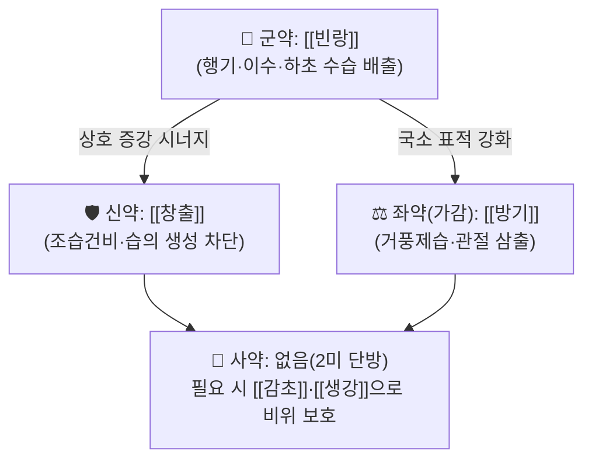

# 🍵 [[빈창산]] (檳蒼散, Binchang-san)

> **핵심 3줄 요약 (Key Summary)**:
> - 🌿 **2미(二味) 소방(小方) 계열의 거습·이수 처방**: [[빈랑]](檳榔) + [[창출]](蒼朮)의 단순 배오를 기본으로 하며, 임상에서는 [[방기]](防己)를 가하여 관절 삼출·하지 부종을 직접 겨냥하는 운용이 흔하다. 行氣(빈랑)와 燥濕(창출)을 맞물려 **하초(下焦)의 水濕을 氣의 흐름으로 밀어내는** 구조가 핵심이다.
> - 🎯 **최적 적응증**: 습(濕)이 몸 하부에 정체된 **태음인·소음인 습체(濕體)** 환자의 무릎 부종·관절 삼출·하지 함요부종·각기(脚氣) 양상 부종. 설태 백니(白膩), 맥 활완(滑緩)·침완(沈緩). 통증보다 **'붓고 무겁고 눌리면 들어가는' 부종상**이 표적.
> - 🔬 **핵심 기전**: 구성 본초 단위에서는 아레콜린(arecoline)·시노메닌(sinomenine)·아트락틸로딘(atractylodin) 등의 성분을 통한 위장관 운동 조절·이뇨·항염 작용이 보고되어 있으나, **빈창산 조합 자체에 대한 분자약리 실험 근거는 확인되지 않음(근거 미확인)**. 무릎 부종·삼출이라는 임상 표적의 타당성은 MRI 기반 관절삼출·활막염 연구 등으로 지지된다.
> - ⚠️ 주의사항: 음허(陰虛)·진액고갈·건조 체질, 소양인 열성(熱性) 병증에는 부적합. [[빈랑]]의 부교감신경 흥분 작용(아레콜린)으로 위장장애·구역·복통이 나타날 수 있으며, 임신부·천식 환자·소화성 궤양 환자에게는 신중 투여한다. 자궁 흥분 가능성은 전통적 금기 근거로 전해지나 현대 임상 근거는 미확인.

---
## 📌 목차
1. [기본 처방 정보 & 군신좌사 구성](#1-기본-처방-정보--군신좌사-구성)
2. [방제학적 약재 상호작용 & 시너지 네트워크](#2-방제학적-약재-상호작용--시너지-네트워크)
3. [현대 분자약리학적 효능 & 작용 기전](#3-현대-분자약리학적-효능--작용-기전)
4. [적응 병증 및 체질별 감별 (Sweet Spot vs 금기)](#4-적응-병증-및-체질별-감별-sweet-spot-vs-금기)
5. [유사 처방군 감별 매트릭스](#5-유사-처방군-감별-매트릭스)
6. [임상 가감례 & 현대 질환별 응용](#6-임상-가감례--현대-질환별-응용)
7. [💡 사용자 진료실 핵심 필기 & 임상 팁 (원문 보존)](#7--사용자-진료실-핵심-필기--임상-팁-원문-보존)
8. [출처 및 학술 참고 문헌 (References)](#8-출처-및-학술-참고-문헌-references)

---
## 1. 기본 처방 정보 & 군신좌사 구성

* **출전**: 『[[동의보감]]』 계열의 거습·이수 처방으로 분류되나, **원전(原典)의 해당 조문 위치는 확인되지 않음(근거 미확인)**. 『방약합편』 등 한국 상용 방서(方書) 계열에 수록된 소방(小方)으로 취급된다. *원문 대조 확인 필요 — 본 노트에서는 출전을 확정하지 않는다.*
* **치법**: 조습행기(燥濕行氣), 이수퇴종(利水退腫), 거습통비(祛濕通痺) — 즉 **습(濕)을 마르게 하고, 기(氣)를 돌려 물을 빼내며, 뻣뻣하고 무거운 관절을 통하게 하는** 세 축으로 요약된다.

| 구분 | 약재명 | 표준 용량 | 본초 효능 & 방제 내 역할 |
| :--- | :--- | :--- | :--- |
| **군약 (君藥)** | [[빈랑]] | 6~8g | 苦·辛, 溫 / 胃·大腸經. 행기(行氣)·이수(利水)·소적(消積). 하초의 氣滯를 풀어 水濕을 下로 내려보내는 **주동 약재**. 각기·부종·소변불리에 전통적으로 응용 |
| **신약 (臣藥)** | [[창출]] | 6~8g | 苦·辛, 溫 / 脾·胃經. 조습건비(燥濕健脾)·거풍산한(祛風散寒). 濕의 생성 근원인 脾를 마르게 하여 **수습(水濕)의 재생성을 차단**하고 군약의 이수를 뒤에서 지지 |
| **좌약 (佐藥)** | [[방기]] *(가감 운용)* | 4~6g | 苦·辛, 寒 / 膀胱·脾·腎經. 거풍제습·이수지통(利水止痛). **관절 삼출·관절강 내 부종이라는 국소 표적**에 직접 작용하는 가감 약재. 원방 2미 구성에는 포함되지 않음 |
| **사약 (使藥)** | — | — | **원방에는 별도의 사약(조화제약·인경약)이 배오되지 않는 2미 단방 구조**로 파악됨(근거 미확인). 임상에서는 [[감초]]·[[생강]]·[[대조]]를 소량 가하여 비위를 보호하는 방식이 쓰이나 이는 방서(方書) 확정 구성이 아님 |

> **배오 특징**: 빈랑(行氣·降氣)과 창출(燥濕·健脾)의 조합은 **"기(氣)를 움직여 습(濕)을 밀어낸다"** 는 방제 원리를 가장 단순한 형태로 구현한 것이다. 창출이 濕의 발생원(脾)을 마르게 하고, 빈랑이 이미 정체된 水濕을 下焦로 배출하며, 두 약재 모두 辛·苦·溫 계열로 승강(升降)에서는 **강(降)과 산(散)의 균형**을 이룬다. 전체적으로 補(補)가 전혀 없는 **순수 사법(瀉法)·거습(祛濕) 처방**이라는 점이 임상 운용의 최대 전제이며, 따라서 허증(虛證)·음허(陰虛)에는 단독 사용을 피하고 반드시 보기(補氣)·자음(滋陰) 약재를 병행해야 한다.

---
## 2. 방제학적 약재 상호작용 & 시너지 네트워크

* **[[빈랑]] + [[창출]] 배오**: 相須(상수)에 가까운 **기능 보완형 배합**이다. 창출은 濕을 '만들지 않게' 하고(治本), 빈랑은 이미 고인 濕을 '빼내며'(治標), 두 약재가 標本을 나누어 담당한다. 두 약재 모두 苦·辛·溫으로 기미(氣味)가 같아 방향성이 어긋나지 않고, 脾(창출) → 大腸/膀胱(빈랑)으로 이어지는 **수액 배출 경로**를 하나로 묶는다.
* **[[방기]] 병용 시**: 방기(寒)를 가하면 전체 처방의 寒溫 균형이 溫 → 平에 가까워지고, 작용점이 '전신 수습'에서 **'관절강·활막 주변의 국소 삼출'** 로 좁혀진다. 즉 빈랑·창출이 체액 총량과 분포를 다루고, 방기가 관절 국소 염증·삼출을 다루는 **표적 분업 구조**가 형성된다.
* **사약 부재의 의미**: 조화제약(調和諸藥)이 없으므로 **약성이 곧고 빠르게 발현되는 대신 위장 자극 위험이 상대적으로 크다**. 진료실에서는 [[감초]]·[[대조]]·[[생강]]을 소량 가해 위기(胃氣)를 완충하거나, 복약을 食後로 지정하는 방식으로 보완한다.

---
## 3. 현대 분자약리학적 효능 & 작용 기전

> ⚠️ **근거 수준 안내**: 아래 내용은 **구성 본초(單味) 단위의 일반 약리학·생약학 수준 지식**이며, **빈창산이라는 복합 처방 자체를 대상으로 한 분자약리 실험 결과는 확인되지 않음(근거 미확인)**. 제공된 두 편의 논문(PMID 38419032, PMID 16713722)은 본 처방의 기전 연구가 아니라 **무릎 부종·관절삼출이라는 임상 표적의 타당성을 뒷받침하는 임상·영상 연구**임을 명확히 구분하여 읽어야 한다.

### 1) 항염증·면역 조절 (구성 본초 단위, 근거 미확인 수준)
* [[빈랑]]의 주요 알칼로이드인 **아레콜린(arecoline)** 및 축합 탄닌 성분은 전통적으로 구충(驅蟲)·소적 작용의 근거로 설명되어 왔으며, 부교감신경 흥분을 통한 위장관 운동 촉진 기전이 교과서 수준에서 언급된다. 다만 **빈창산 조합에서의 항염 사이토카인(TNF-α, IL-6, IL-1β) 조절 데이터는 확인되지 않음**.
* [[창출]]의 정유 성분인 **아트락틸로딘(atractylodin)**, **β-유데스몰(β-eudesmol)** 등은 소화관 운동 조절 및 항염 활성 보고가 있으나, 이는 단미 추출물 수준이며 **처방 전체의 NF-κB/MAPK 경로 억제를 입증한 자료는 확인되지 않음**.
* [[방기]]의 **시노메닌(sinomenine)** 은 류마티스 관절염 등 염증성 관절 질환에서 활막 염증·면역세포 활성 억제 기전이 연구된 대표 성분이다. 다만 이는 **방기 단미 및 그 성분에 관한 연구이며, 빈창산 처방의 근거로 직접 원용할 수 없다**. 본 처방에 방기를 가하는 임상적 이유는 이 성분 프로파일에 대한 학술적 기대라기보다, **거풍제습·이수지통이라는 전통 방제 논리에 근거**한다.

### 2) 순환기·미세순환 및 수분 대사
* [[빈랑]]의 이수(利水) 작용은 전통적으로 **소변량 증가와 하지 부종 감소**로 관찰되어 왔으나, 이뇨 기전을 분자 수준에서 규명한 자료는 확인되지 않음. [[창출]] 또한 이뇨·건비 작용이 방서에 기재되어 있으나 **정량적 이뇨 지표(AQP·RAAS 경로 등) 연구는 미확인**.
* 임상적으로 관찰 가능한 지표는 **하지 함요부종의 정도, 체중 변동, 소변량, 그리고 무릎 둘레(swelling)** 이며, 이는 순환·림프 환류 개선과 염증성 삼출 흡수를 함께 반영한다. **eNOS 활성화·혈관 평활근 이완 등 특정 분자 경로를 이 처방에 귀속시키는 것은 근거 미확인**이다.

### 3) 근골격계·관절 국소 기전 (제공 논문과의 연결)
* 무릎 골관절염에서 **MRI로 평가되는 비연골성 구조물 — 활막염(synovitis), 관절삼출(efusion), 골수부종(bone marrow lesion) 등 — 이 통증 및 임상 증상과 연관된다**는 내용이 Conaghan & Felson(PMID 16713722)의 논의 핵심이다. 즉 **"관절이 붓는 것"은 단순 부수 증상이 아니라 그 자체가 치료 표적**이라는 관점을 제공하며, 이것이 빈창산(+방기) 운용의 현대적 근거 틀이 된다.
* Quesnot & Mouchel(PMID 38419032)의 무작위 대조 시험은 무릎 전치환술 후 **압박 병용 냉각요법과 표준 냉각요법을 비교하면서 통증·부종(swelling)·관절가동범위·기능 회복을 평가 지표로 설정**하였다. 이는 **부종(swelling)이 근골격계 치료 결과를 판정하는 핵심 지표**임을 보여주는 임상시험 설계 사례이며, 한의학적 이수퇴종(利水退腫) 치료의 평가 지표 설정에도 참고가 된다. **단, 이 두 논문은 한약 처방의 효능을 검증한 연구가 아니다.**

---
## 4. 적응 병증 및 체질별 감별 (Sweet Spot vs 금기)

**[✅ 최적 적응증 (Sweet Spot)]**
* **원전 조문**: 확정 조문 **근거 미확인**. 『[[동의보감]]』 각기(脚氣)·부종(浮腫) 문맥의 거습이수 처방군으로 분류하는 것이 통용되나 원문 대조가 필요하다.
* **체질 소견**:
  * **태음인 · 소음인 습체(濕體)** — 살집이 있고 피부가 눅눅하며, 땀을 조금만 흘려도 끈적하고, 아침에 얼굴·저녁에 다리가 붓는 **부종 일중 변동 패턴**.
  * 근육량 대비 체수분 비율이 높고, **눌렀다 떼면 자국이 남는 함요부종(凹陷浮腫)** 이 잘 생기는 체형.
  * 소양인·열성 체질, 마른 체형, 피부 건조·구건(口乾)·변비 경향자는 **Sweet Spot에서 벗어남**.
* **임상 주치(진료실 최다 적중 양상)**:
  * **무릎 관절 삼출 및 관절 주위 종창** — 관절이 붓고 무겁고 굴곡 시 뻐근하며, 관절가동범위가 부종에 의해 제한되는 양상.
  * **하지 부종(정강이·발목)**, 오래 앉거나 서 있으면 심해지는 부종.
  * **각기(脚氣) 양상의 하지 무력·부종·저림** — 전통적 주치.
  * 습비(濕痺)성 관절통: 통증이 **이동성이라기보다 고정·둔중**하고, 습한 날씨에 악화.
* **설진/맥진**:
  * 설질(舌質): 담(淡)하거나 담홍(淡紅), **설체(舌體) 비대·치흔(齒痕) 경향**.
  * 설태(舌苔): **백니(白膩)~후니(厚膩)** — 습의 정체를 시사하는 핵심 소견. 설태가 박리·건조하면 본 처방 적응에서 벗어난다.
  * 맥상(脈象): **활(滑)·완(緩)·침완(沈緩)**. 맥이 세삭(細數)하거나 삭무력(數無力)하면서 구건이 동반되면 음허로 보아 금기 방향.

**[⚠️ 신중 투여 및 금기 (Caution / Contraindication)]**
* **허실(虛實) 반대 병증**: 본 처방은 補益 약재가 전혀 없는 **순수 거습·사법(瀉法)** 처방이다. 심한 기허(氣虛)·혈허(血虛)·신허(腎虛) 부종에 단독 투여하면 **부종은 일시적으로 빠져도 기력 저하·구건·변비·어지럼이 속발**할 수 있다. 반드시 [[황기]]·[[백출]]·[[복령]] 등을 병행한다.
* **한열(寒熱) 반대 병증**: 습열(濕熱)이 심해 **국소 발열·발적·열감이 뚜렷하고 소변이 농축·적색**인 급성 염증기에는 창출의 溫性이 부담이 될 수 있다. 이때는 [[방기]], [[황백]], [[의이인]] 등 청열이수 약재 중심으로 재편한다.
* **음허(陰虛)·진액부족**: 구건(口乾)·인후건조·야간 도한·변비·소변 단적(短赤)이 있는 환자에는 **금기 방향**. 조습(燥濕) 작용이 진액을 더 마르게 한다.
* **[[빈랑]] 관련 특별 주의**:
  * 아레콜린의 콜린성 작용으로 **구역·복통·설사·침 분비 증가·심박수 변화**가 나타날 수 있다. 위장관 운동 항진이므로 **소화성 궤양, 과민성 장증후군 설사형, 급성 위장염** 환자에 신중.
  * **천식·기관지 경련성 질환** 환자에서 기관지 수축 우려가 전통적으로 거론되나 **현대 임상 근거는 미확인**.
  * **임신부**: 자궁 흥분 가능성으로 전통적 금기로 전해지나 **현대 근거 미확인**. 안전성 확보 전까지 사용하지 않는 것을 원칙으로 한다.
  * 빈랑을 **장기간 씹는 습관(구강 점막 자극)** 과 본 처방의 **탕제 복용**은 노출 경로가 다르므로 구강 병변 위험을 동일 선상에서 논할 수 없다(근거 미확인).
* **양약 병용 주의**:
  * **이뇨제·항고혈압제** 병용 시 혈압 저하·탈수·전해질 이상 가능성 → 복용 간격 조절 및 혈압·전해질 모니터링.
  * **항응고제(와파린 등)** 병용 시 출혈 경향 변화 가능성은 **근거 미확인**이나, 다수의 본초가 상호작용 보고가 있으므로 INR 확인 권장.
  * **당뇨병 치료제**와 병용 시 혈당 변동 관찰.
  * 콜린성 작용을 가진 약물(아세틸콜린에스테라제 억제제 등)과 병용 시 **위장관·심장 부작용 상가** 가능성 → 병용 회피 또는 감량.
* **환자 티칭 필수 사항**: "붓기가 빠지는 대신 **소변이 늘고 화장실이 가까워지는 것이 정상 반응**"임을 미리 설명한다. 또한 "입이 마르면 즉시 복용을 중단하고 연락"하도록 지도한다.

---
## 5. 유사 처방군 감별 매트릭스

| 처방명 | 핵심 구성 차이 | 주치 및 체질 차이 | 맥진/설진 차이 |
| :--- | :--- | :--- | :--- |
| [[빈창산]] | 기준 구성: [[빈랑]] + [[창출]] (임상 시 [[방기]] 가) | **하지·무릎 국소 수습 정체**, 태음인·소음인 습체, 함요부종·관절 삼출, 소변불리 | 설담태백니, 맥 활완·침완 |
| [[오령산]] | [[복령]] [[저령]] [[택사]] [[백출]] [[계지]] — 5미 이수 전담 | **전신성 수습 정체**, 갈증·소변불리·두현(頭眩)·구토, 계지로 氣化를 도움. 부종이 전신적·체강성일 때 | 설태 백활(白滑), 맥 부완(浮緩) |
| [[방기황기탕]] | [[방기]] [[황기]] [[백출]] [[감초]] [[생강]] [[대조]] | **기허 + 습 정체**, 땀 나고 피로하며 부종이 동반되는 허증 부종, 관절 부종·동통. 빈창산보다 補性 강함 | 설담체대, 맥 부연(浮軟)·무력 |
| [[의이인탕]] | [[의이인]] 중심 + 거습·통비 약재 배오 | **습비(濕痺) 중심**, 근육·관절의 둔중·동통, 습열 여부에 따라 가감 폭이 큼 | 설태 니(膩), 맥 침완 |
| [[계지작약지모탕]] | [[계지]] [[작약]] [[지모]] [[마황]] [[생강]] [[백출]] [[방풍]] [[부자]] | **습열 각기·관절 열통**, 열감·발적 동반. 빈창산과 달리 寒凉 배합으로 열성 병증 표적 | 설홍태황, 맥 활삭 |

> ⚠️ 표 내부에서는 마크다운 열 구분자 파괴를 방지하기 위해 파이프(`|`)가 들어간 링크를 쓰지 않고 순수한 [[처방명]] 단독 형태로만 작성합니다.
>
> **한 줄 요약 감별 포인트**: **전신이 붓고 갈증·현훈이면 [[오령산]], 기력저하·자한이 겹치면 [[방기황기탕]], 하지·무릎 국소 삼출과 무거움이 주증이면 [[빈창산]], 열감·발적이 있으면 [[계지작약지모탕]] 방향**으로 좁힌다.

---
## 6. 임상 가감례 & 현대 질환별 응용

* **수반 증상별 가감법**:
  * **무릎 삼출·관절종창이 주증일 때** → + [[방기]], [[택사]], [[의이인]] (삼출 흡수 표적 강화)
  * **하지 함요부종·소변불리가 심할 때** → + [[복령]], [[저령]], [[택사]] ([[오령산]] 계열 이수력 보강)
  * **기허·피로·자한이 겹칠 때** → + [[황기]], [[백출]] ([[방기황기탕]] 방향으로 재편, 허증 보완)
  * **국소 열감·발적·통풍성 발작 양상** → + [[황백]], [[의이인]], [[택사]] (습열 하주로 전환하여 청열이수)
  * **관절 통증·강직이 두드러질 때** → + [[우슬]], [[목과]], [[위령선]] (통비지통)
  * **복부 냉감·연변(軟便) 동반 시** → + [[건강]], [[백출]] 또는 [[생강]] (창출의 조습성으로 인한 비위 자극 완충)
  * **구역·위부불쾌감 등 빈랑 부작용 양상** → 빈랑 감량 + [[진피]], [[반하]], [[생강]] ([[이진탕]] 계열 배합)
  * **구건·변비 등 조습 과다 양상** → 빈랑·창출 감량 + [[맥문동]], [[생지황]] 또는 처방 전환 검토

* **현대 질환별 임상 매핑**:
  * **근골격계**: 무릎 골관절염(특히 삼출 동반형), 활막염성 종창, 슬관절 수술 후 잔존 부종·부종성 관절가동 제한, 근막통증증후군의 둔중형, 하퇴 근육의 습성 무거움. — **무릎 부종·삼출이 통증 및 기능과 연관된다는 관점은 제공 논문(PMID 16713722)과 수술 후 부종을 평가 지표로 삼은 임상시험(PMID 38419032)에서 간접적으로 지지된다.**
  * **순환기·림프계**: 만성 정맥부전성 하지부종, 림프부종의 경증 관리 보조, 장시간 기립·좌위 후 발생하는 체위성 하지부종.
  * **대사·내분비**: 특발성 부종, 월경 전·월경 주기 연관 부종(熱象 없을 때), 고탄수화물 식이 후 나타나는 수분 정체.
  * **소화기 연계**: 습체(濕體)의 더부룩함·식후 중만감·연변을 동반한 부종 (창출 건비 작용 활용).
  * **전통 주치**: 각기(脚氣), 습비(濕痺), 수종(水腫) 중 습성·실증(實證) 양상.

* **복약 지도**: 食後 溫服을 원칙으로 하고, 복용 초기 3~5일간 **소변량·체중·부종 자국·구건 여부**를 기록하게 한다. 부종이 줄면서 구건이 나타나면 감량 또는 보음 약재를 병행한다.

---
## 7. 💡 사용자 진료실 핵심 필기 & 임상 팁 (원문 보존)

> [!tip] **진료실 실전 노하우 (User Clinical Insight)**
> - **원장님 기존 메모·필기 원문: 제공되지 않음.** (본 노트 작성 시 입력된 사용자 필기 데이터가 없어 임의로 창작하지 않았습니다. 실제 진료실 메모를 입력하시면 이 블록에 **원문 그대로** 보존합니다. — 절대 삭제 금지, 축소·정리만 허용)
> - *[필기 입력 대기 중 — 여기에 실제 임상 메모를 붙여넣으세요]*
>
> **본 노트에서 정리한 운용 원칙(사용자 필기 아님, 참고용)**:
> - **체질별 선택 기준**: 태음인·소음인의 **눅눅하고 잘 붓는 체형**에서 무릎이 붓고 무거울 때 1차 선택. 소양인·마른 체형·구건 경향에서는 **선택하지 않거나 [[의이인]], [[복령]] 중심으로 대체**.
> - **"붓기가 주증인가, 통증이 주증인가"** 를 먼저 본다. 통증 주증이면 통비·지통 약재를 먼저 보강하고, 부종 주증이면 본 처방을 중심에 둔다.
> - **환자 티칭**: "이 약은 물을 빼는 약이라 소변이 늘고 화장실이 가까워집니다. 대신 입이 마르면 꼭 알려주세요." — 순응도와 이상반응 조기 발견에 가장 효과적인 한 문장.
> - **복약 반응 관찰 포인트**: ① 아침·저녁 무릎 둘레 차이, ② 양말 자국 깊이, ③ 체중(1~2kg 변동), ④ 구건·변비 발생, ⑤ 위부 불쾌감·구역.
> - **중단·전환 기준**: 2주 투여에도 부종 변화가 없거나, 구건·기력저하가 나타나면 **허증으로 판단하여 보기(補氣) 방향으로 전환**.

---
## 8. 출처 및 학술 참고 문헌 (References)

1. **Quesnot A, Mouchel S (2024)**. *Randomized controlled trial of compressive cryotherapy versus standard cryotherapy after total knee arthroplasty: pain, swelling, range of motion and functional recovery*. **BMC Musculoskeletal Disorders**. PMID: 38419032. https://pubmed.ncbi.nlm.nih.gov/38419032/
   - **[연구 요약]**: 무릎 전치환술(TKA) 후 **압박을 병용한 냉각요법과 표준 냉각요법을 비교한 무작위 대조 시험**으로, 평가 지표를 **통증, 부종(swelling), 관절가동범위(ROM), 기능 회복**으로 설정하였다. 본 노트와의 관련성은 **"부종이 근골격계 치료 결과를 판정하는 핵심 지표"** 라는 점에 있다. **※ 개별 결과 수치(군간 차이, p값, 효과크기)는 원문 확인이 필요하며 본 노트에서는 인용하지 않음(근거 미확인). 본 논문은 한약 처방의 효능을 검증한 연구가 아니다.**
2. **Conaghan PG, Felson D (2006)**. *MRI and non-cartilaginous structures in knee osteoarthritis*. **Osteoarthritis and Cartilage**. PMID: 16713722. https://pubmed.ncbi.nlm.nih.gov/16713722/
   - **[연구 요약]**: 무릎 골관절염에서 **연골 이외의 구조물 — 활막염(synovitis), 관절삼출(efusion), 골수부종(bone marrow lesion) 등 — 을 MRI로 평가하는 관점을 정리한 문헌**이다. 이러한 비연골성 병변이 통증 및 임상 증상과 연관된다는 시각을 제공하여, **관절 종창·삼출 자체를 치료 표적으로 삼는 거습·이수 처방(빈창산 ± 방기) 운용의 현대적 근거 틀**이 된다. **※ 본 논문 역시 한약 처방에 대한 연구가 아니며, 빈창산의 효능을 입증하는 자료가 아니다.**
3. **허준 (1613)**. 『[[동의보감]]』.
   - **[임상 문헌]**: 각기(脚氣)·부종(浮腫)·습비(濕痺) 문맥에서 거습이수(祛濕利水) 처방군의 주치와 배오 원리를 참고하였다. **※ 빈창산의 정확한 원전 조문 위치 및 수록 여부는 확인되지 않음(근거 미확인)** — 원문 대조 후 본 항목을 갱신할 것.
4. **저자 미상**. 『[[방약합편]]』 계열 방서.
   - **[참고]**: 한국 상용 소방(小方) 분류에서 빈창산을 거습·이수제로 다루는 통설의 출처로 기재하나, **판본·조문 근거 미확인**. 확정 전까지 인용을 보류한다.

> **📌 근거 수준 총평**
> - **임상 표적(무릎 부종·관절삼출)의 타당성**: 제공 논문 2편으로 **간접 지지**됨.
> - **빈창산 처방 자체의 효능·기전·용량-반응**: **근거 미확인** — 단미 수준의 생약학 지식만 존재.
> - 따라서 본 노트의 기전 서술은 **가설적 틀**로 읽어야 하며, 처방 선택의 최종 근거는 **전통 방제 이론 + 개별 환자의 설진·맥진·체질 소견**이다.