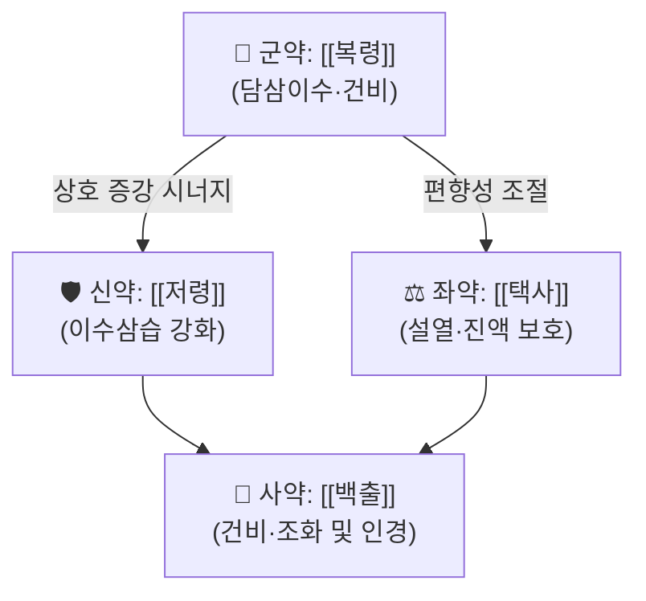

# 🍵 [[사령탕]] (四苓湯, Siling Tang)

> **핵심 3줄 요약 (Key Summary)**:
> - 🌿 [[오령산]]에서 [[계지]]를 제거한 4味 배오 — [[복령]]·[[저령]]·[[택사]]·[[백출]]로 구성된 순수 이수삼습(利水滲濕)·분리수습(分利水濕) 처방이며, 표(表)를 풀지 않고 오직 수습(水濕)을 소변으로 내리는 데 집중한다.
> - 🎯 임상 최적 적응증은 **습(濕)이 中·下焦에 정체되어 소변불리(小便不利)·설사(泄瀉)·부종(浮腫)·구갈(口渴)이 동반되는 실증(實證) 경향 환자**. 태음인·비만 혹은 습담 체형에서 복부 팽만감, 물소리(腸鳴), 묽은 변, 몸이 무거운 증상이 겹칠 때 적중률이 높다.
> - 🔬 핵심 분자약리 기전은 **AKT/IKKβ/NF-κB 신호 억제를 통한 항염증·항섬유화 효과**(아데닌 유도 신섬유화 랫트 모델)로 보고되었으며, 임상적으로는 이뇨·수분전해질 재분배 및 위장관 수분 이동 정상화가 핵심 작용으로 이해된다.
> - ⚠️ 주의사항: 음허(陰虛)·진액부족·무습성(無濕性) 소변불리에는 투여하지 않으며, 임부·신기능 저하자·이뇨제 병용 환자는 탈수 및 전해질 이상(저칼륨·저나트륨)을 반드시 관찰해야 한다.
---
## 📌 목차
1. [기본 처방 정보 & 군신좌사 구성](#1-기본-처방-정보--군신좌사-구성)
2. [방제학적 약재 상호작용 & 시너지 네트워크](#2-방제학적-약재-상호작용--시너지-네트워크)
3. [현대 분자약리학적 효능 & 작용 기전](#3-현대-분자약리학적-효능--작용-기전)
4. [적응 병증 및 체질별 감별 (Sweet Spot vs 금기)](#4-적응-병증-및-체질별-감별-sweet-spot-vs-금기)
5. [유사 처방군 감별 매트릭스](#5-유사-처방군-감별-매트릭스)
6. [임상 가감례 & 현대 질환별 응용](#6-임상-가감례--현대-질환별-응용)
7. [💡 사용자 진료실 핵심 필기 & 임상 팁 (원문 보존)](#7--사용자-진료실-핵심-필기--임상-팁-원문-보존)
8. [출처 및 학술 참고 문헌 (References)](#8-출처-및-학술-참고-문헌-references)
---
## 1. 기본 처방 정보 & 군신좌사 구성

* **출전**: 명(明)·청(淸)대 방서 계열로 전하며, 통상 **『[[단계심법]]』(丹溪心法) 계열**의 처방으로 소개된다. 『[[동의보감]]』 등 한국 의서에도 습사(濕瀉)·소변불리 항목에서 유사 구성이 수록되어 있다. 다만 전거(典據) 문헌에 따라 四苓散·四苓湯의 명칭과 출전 표기가 엇갈리므로 **출전 이설(異說)이 있음**을 전제로 확인할 필요가 있다(근거 확인 필요).
* **구성 원리**: [[오령산]] = [[복령]]·[[저령]]·[[택사]]·[[백출]] + [[계지]]. 사령탕은 여기서 **[[계지]](해표·온양화기)를 제거**한 방으로, 표를 해(解)하지 않고 **오로지 수습을 분리(分利)하여 소변으로 배출**하는 데 특화된 처방이다.
* **치법**: 이수삼습(利水滲濕), 분리수습(分利水濕), 건비이수(健脾利水) — 승강(升降)을 조절해 水邪를 下焦(방광)로 인도한다.
* **제형(製劑)**: 散劑로 쓰면 **사령산(四苓散)**, 湯劑로 쓰면 **사령탕(四苓湯)**으로 불린다. 임상에서는 湯劑 투여가 일반적이며, 급성 설사·수종에는 산제를 頻服하기도 한다.

| 구분 | 약재명 | 표준 용량 | 본초 효능 & 방제 내 역할 |
| :--- | :--- | :--- | :--- |
| **군약 (君藥)** | [[복령]] | 8~12g | 담삼(淡滲)이수·건비녕심(健脾寧心). 君臣을 아우르는 중심 약으로, 수습을 흩어 소변으로 내리면서 비(脾)의 운화 기능을 되살리는 본 처방의 축이다. |
| **신약 (臣藥)** | [[저령]] | 6~9g | 이수삼습(利水滲濕) 작용이 복령보다 강하고 性이 偏於涼하여, 습열(濕熱)이 겸한 소변불리·임탁(淋濁)을 직접 공략한다. 복령의 담삼 작용을 하초(下焦)까지 밀어주는 역할. |
| **좌약 (佐藥)** | [[택사]] | 6~12g | 감한(甘寒)하여 이수삼습·설열(泄熱). 신(腎)과 방광의 수습을 배출하고 습열로 인한 구갈·두중(頭重)을 완화하며, 군신약의 조습성(燥性) 편향을 눌러 진액 손상을 줄인다. |
| **使藥 (兼佐)** | [[백출]] | 6~9g | 건비조습(健脾燥濕)·보기(補氣). 4味 중 유일한 보익(補益) 약재로, 水를 내리면서 동시에 비위(脾胃)를 보호하고 藥力을 中焦로 인도한다. 본 초는 사약(使藥)과 좌약(佐藥)의 기능을 겸한다. |

> **배오 특징**: 전방(全方)이 **瀉에 치우치되 補를 완전히 버리지 않은** 구조이다. [[복령]]·[[저령]]·[[택사]] 3味가 하초로 수습을 끌어내리는 分利 축을 이루고, [[백출]] 1味가 中焦를 지켜 分利에 따른 비위 허탈을 방지한다. [[계지]]가 없으므로 온양화기(溫陽化氣)·해표(解表) 작용은 전무하며, 그 결과 **表證이 없는 순수 內濕·水停證의 기본 처방**으로 쓰인다. 약성의 승강(升降)은 대체로 下降 방향(下焦 배출)으로 일관되며, 淡味의 滲泄 작용이 주체가 되어 水의 배출 통로를 소변으로 통일시킨다.
---
## 2. 방제학적 약재 상호작용 & 시너지 네트워크

* **[[복령]] + [[저령]] 배오 (相須·相使)**: 복령은 담삼(淡滲)으로 완만하게, 저령은 性이 凉하고 이수력이 강하게 작용하여, 두 약이 겹치면 **소변 배출량 증가와 하초 습열 제거**가 상승적으로 나타난다. 임상적으로는 요량 증가와 함께 부종·체중(體重)의 겉도는 무거움이 줄어드는 반응이 대표적이다.
* **[[복령]] + [[택사]] 배오**: 복령이 中焦의 수습을, 택사가 下焦 신·방광의 수습을 담당하여 상·하초 수습 배출을 이원화한다. 택사의 寒性이 복령·백출의 溫燥性을 완충하여 **구갈(口渴)을 악화시키지 않으면서 이수**하는 균형점을 만든다.
* **[[택사]] + [[백출]] 배오 (佐使)**: 이수약의 과다한 배출 작용에 대해 백출이 건비(健脾)로 津液 생성을 지지하고, 택사가 濕熱을 배출하여 補而不滯·利而不傷의 균형을 만든다. 즉 **내리는 힘(降)과 지키는 힘(守)의 상호 억제적 배합**이다.
* **계지 제거의 방제학적 의미**: [[오령산]]의 [[계지]]는 표(表)를 풀고 陽을 온화시켜 水의 기화(氣化)를 돕는 역할을 한다. 이를 제거함으로써 사령탕은 ①表證이 이미 해소되었거나 애초에 없는 경우, ②濕熱이 겸하여 溫藥이 부담이 되는 경우, ③단순 습사(濕瀉)·수습내정(水濕內停)에 대한 **순수 분리수습 처방**으로 특화된다. 따라서 **표증이 남아 있으면 [[오령산]], 표증이 없고 습만 남았으면 사령탕**이라는 이분법이 성립한다.
---
## 3. 현대 분자약리학적 효능 & 작용 기전

### 1) 항염증·항섬유화 — AKT/IKKβ/NF-κB 경로 억제
* **Zeng L, Lin Y 등(2024, Phytomedicine, PMID 39550923)**은 아데닌(adenine)으로 유도한 랫트 **신장 섬유화 모델**에서 四苓湯(Siling decoction)이 **AKT/IKKβ/NF-κB 신호경로를 억제**하여 신섬유화를 개선한다고 보고하였다. 즉 ①AKT 및 IKKβ의 인산화 억제 → ②NF-κB 전사활성 하향 → ③염증성 사이토카인(TNF-α, IL-6, IL-1β 등) 발현 감소 → ④세포외기질(ECM) 축적 및 α-SMA 등 섬유화 지표 감소로 이어지는 개념적 흐름으로 이해된다.
* 이는 전통적 치법 중 **“邪를 소변으로 내보내 內熱과 濕을 제거한다(清熱利濕)”**는 개념이 현대적으로는 **만성 염증성 신손상의 진행 억제**로 해석될 수 있음을 보여준다.
* ⚠️ 다만 개별 사이토카인의 정량적 억제율(%, 농도별 용량반응), 조직병리 점수 등 **세부 수치는 현재 확인된 자료 범위에서 근거 미확인**이며, 원문(PubMed 39550923) 확인 후 보완이 필요하다.

### 2) 이뇨·수분전해질 및 부종 개선
* [[저령]]·[[택사]]의 주요 성분은 스테롤·트리테르페노이드·다당체 계열로 알려져 있으며, 이들이 **신세뇨관에서의 수분·전해질 재흡수를 조절하여 요량을 증가**시키는 방향으로 작용한다는 것이 전통 해석의 약리학적 대응이다.
* [[복령]]의 다당체는 **삼투성 이뇨(淡滲)** 및 면역조절 작용이 보고되어 왔으나, 사령탕 자체의 이뇨 지표(요량·Na⁺/K⁺ 배설량)에 대한 임상적 정량 데이터는 이 노트의 확인 범위에서 **근거 미확인**이다.

### 3) 소화기·위장관 수분 이동 및 설사 조절
* 임상적으로 사령탕이 사용되는 대표 상황은 **습사(濕瀉)** — 즉 삼투성·분비성 설사 양상으로, 장관 내 수분 이동을 정상화하고 소변으로 배출 통로를 돌리는 개념이다. 전통적으로 “**利小便而實大便**”이라고 요약되는 기전으로, 소변 배출을 늘려 대변의 수분을 줄이는 방향성이다.
* 위장관 염증 및 장내 수분 흡수 조절에 대한 분자 수준 근거는 현재 **직접적인 사령탕 연구로는 근거 미확인**이며, 동일 카테고리 처방군(거습·이수제) 연구에서 간접적으로 지지되는 수준이다.

### 4) 기타 — 신장·대사 질환 관련 시사점
* 상기 PMID 39550923 연구의 아데닌 유도 모델은 **만성 신장병(CKD)·요독·신섬유화** 맥락을 함의하므로, 사령탕의 현대적 병용 활용(예: CKD 보조, 신성 부종) 가능성이 시사된다. 단 이는 모델 동물 연구 결과이며 **인간 임상 근거는 확립되지 않았다(근거 미확인)**.
---
## 4. 적응 병증 및 체질별 감별 (Sweet Spot vs 금기)

**[✅ 최적 적응증 (Sweet Spot)]**

* **원전·전통 주치**: 수습내정(水濕內停)으로 인한 ①소변불리(小便不利), ②습사(濕瀉)·설사, ③수종(水腫)·부종, ④구갈이면서 물을 많이 마시고도 소변이 적은 상태, ⑤두중(頭重)·신중(身重) 및 복부 팽만. 오령산의 表證 해표(解表)·온양화기 역할을 제거한 만큼, **표증이 없고 습이 주된 병기**라는 점이 핵심 전제이다.
* **체질 소견**:
  * **태음인(太陰人) 실증 경향** — 피부가 다소 두껍고 윤택하며, 체형이 충실하거나 부종 경향. 식욕·소화는 비교적 좋으나 몸이 무겁고 하체가 붓는 유형에서 적중률이 높다.
  * **습담(濕痰) 체형** — 복부 비만, 舌苔厚膩, 아침 얼굴 부기, 소변 량 감소 동시에 대변은 무르고 점액성인 경우.
  * **소음인은 신중** — 기력 저하·手足冷·軟便이 주된 양상이면 본 처방 단독보다 [[이중탕]]·[[부자이중탕]] 등 온양 처방과의 감별이 우선한다.
  * **소양인** — 熱이 겹쳐 설태가 黃膩하고 소변이 赤短하면 [[인진사령탕]] 또는 [[팔정산]] 계열로 이동해야 한다.
* **임상 주치 (진료실 최빈 적중 양상)**: 식이 변화·과음·기후 습함 이후 발생한 **물 같은 설사 + 소변량 감소** 조합, 여름철 냉방병성 부종·몸 무거움, 여성의 월경 전 부종, 그리고 신장 질환자에서 관찰되는 하지 부종·소변 감소 등.
* **설진/맥진**: 舌質은 대개 淡紅~淡, **舌苔는 白膩 또는 厚膩(습열 겸하면 黃膩)**. 脈은 **濡緩·沈緩 또는 濡細**, 습열이 겸하면 脈이 數해질 수 있다. 脈이 浮하고 表證이 남아 있으면 [[오령산]]으로 전환한다.
* **복진 소견**: 心下痞滿, 胃內停水(진탕음), 복부 전반의 부드러운 팽만과 장명(腸鳴) 증가가 관찰되는 경우가 많다.

**[⚠️ 신중 투여 및 금기 (Caution / Contraindication)]**

* **음허(陰虛)·진액부족 상태**: 口乾咽燥, 潮熱, 盜汗, 舌紅少苔, 小便短赤(실제로는 탈수성 소변 감소)인 경우 이수삼습제는 **津液을 더 소모시켜 惡化**시킬 수 있으므로 금기 또는 극히 신중.
* **허한성(虛寒性) 소변불리**: 陽虛로 인한 무력성 요폐(尿閉)·신양허(腎陽虛) 수종은 온양화기 처방([[진무탕]]·[[오령산]]·[[제생신기환]] 등)이 우선이며, 사령탕 단독 투여는 효과가 미약하거나 오히려 기력을 떨어뜨릴 수 있다.
* **금기 환자군**: 임부(이수에 따른 陽氣耗損 및 유산 위험 가능성 — 근거 미확인이나 보수적 접근 권장), 심한 탈수·저혈압 환자, 전해질 이상(저Na⁺·저K⁺) 기저 환자, 만성 신장병 말기로 전해질 조절이 취약한 환자.
* **양약 병용 주의**: 루프이뇨제(푸로세미드 등)·티아지드계·ACE억제제/ARB 병용 시 **탈수·저혈압·저나트륨혈증·저칼륨혈증** 위험이 가중될 수 있으므로 감량 및 요량·체중·전해질 모니터링이 필요하다. 리튬 제제와 병용 시 이뇨로 인한 리튬 농도 상승 위험도 고려한다.
* **복약 반응 관찰 포인트**: ①요량 증가와 함께 부종·체중 감소, ②대변이 정상화(利小便而實大便), ③구갈·복부 팽만 완화가 관찰되면 정상 반응이다. 반대로 **구강 건조, 어지럼, 근경련, 심계항진**이 나타나면 탈수·전해질 소실 신호일 수 있으므로 즉시 감량/중단하고 평가한다.
---
## 5. 유사 처방군 감별 매트릭스

| 처방명 | 핵심 구성 차이 | 주치 및 체질 차이 | 맥진/설진 차이 |
| :--- | :--- | :--- | :--- |
| [[사령탕]] | 기준 구성 (복령·저령·택사·백출) | **표증 없이 습만 내정된 소변불리·습사·부종**. 태음인 실증·습담 체형 | 맥 濡緩/沈緩, 설태 白膩 |
| [[오령산]] | 사령탕 + [[계지]] | 표증(表證)이 남아 있거나 陽氣不化로 水가 머문 경우. 발열·두통·구갈·소변불리 동반 | 맥 浮緩~浮數, 설태 白滑 |
| [[인진사령탕]] | 사령탕 + [[인진]] (+[[치자]]·[[대황]] 등) | **습열(濕熱)로 인한 황달·소변황적·간담도 질환**. 소양인·습열 실증 | 맥 滑數/弦數, 설태 黃膩 |
| [[위령탕]] | [[오령산]] + [[평위산]] | 습으로 인한 위장 증상(痞滿·구역·설사)이 **위(胃) 중심**으로 뚜렷. 한습·식체 겸 | 맥 緩弱, 설태 白厚膩 |
| [[팔정산]] | [[목통]]·[[차전자]]·[[편축]]·[[구맥]] 등 청열이수 중심 | **습열 임증(淋證)·방광습열** — 배뇨통, 尿赤, 尿道灼熱. 熱이 주, 濕이 종 | 맥 數, 설태 黃 |
| [[저령탕]] | [[저령]]·[[복령]]·[[택사]] 등 + 淸熱 배오 | 임증(淋證)으로 요도 자극 증상이 주증인 경우 | 맥 數/弦, 설태 黃膩 |
| [[사군자탕]] | 인삼·백출·복령·감초 | 습이 없는 **기허(氣虛)·비위허약** — 식욕부진, 무력감, 연변. 이수력 없음 | 맥 虛弱, 설 淡紅·苔薄白 |

> ⚠️ 표 내부에서는 마크다운 열 구분자 파괴를 방지하기 위해 파이프(`|`)가 들어간 링크를 쓰지 않고 순수한 [[처방명]] 단독 형태로만 작성합니다.
---
## 6. 임상 가감례 & 현대 질환별 응용

* **수반 증상별 가감법**:
  * 습열이 뚜렷하고 소변이 黃赤하며 설태가 黃膩할 때 $\rightarrow$ + [[인진]], [[치자]] (**[[인진사령탕]]** 방향으로 전환)
  * 설사·복통이 심하고 변에 점액이 섞일 때 $\rightarrow$ + [[황련]], [[황금]] 또는 [[목향]]·[[사인]] 계열 배오
  * 배뇨통·요도 작열감 동반 시 $\rightarrow$ + [[목통]], [[차전자]] (**[[팔정산]]** 방향)
  * 부종이 전신적이고 피부가 부풀 때 $\rightarrow$ + [[오피산]]류(상백피·진피·생강피·복령피·대복피) 배오
  * 구역·구토·위 정체감 동반 시 $\rightarrow$ + [[곽향]], [[반하]]·[[진피]] ([[곽향정기산]]·[[이진탕]] 합방 고려)
  * 기력 저하·허증이 겹칠 때 $\rightarrow$ + [[인삼]], [[황기]] 혹은 [[사군자탕]] 합방(공격과 보익의 균형)
  * 복통·寒象 동반 시 $\rightarrow$ + [[건강]], [[오수유]](단, 온열약 추가는 습열 배제 후)
  * 코막힘·후비루 등 상기도 습담 동반 시 $\rightarrow$ + [[신이]], [[창이자]] 계열(비염 처방군과 합방)
* **현대 질환별 임상 매핑**:
  * **비뇨·신장**: 급성·만성 부종, 신성 부종의 보조, 요로감염 초기의 소변불리, CKD의 습열·습담 병기 보조(단, 전해질·신기능 모니터링 필수).
  * **소화기**: 급성 장염·삼투성 설사, 과민성장증후군 설사형 중 습담 양상, 여름철 식중독 후 잔여 수습, 만성 위염의 胃內停水감.
  * **순환·림프**: 여성 월경 전 부종, 하지 정맥성 부종의 보조, 특발성 부종, 항공·장거리 이동 후 부종.
  * **피부**: 습열형 여드름·두드러기·습진에서 이수삼습 목적의 보조 배오(주로 [[인진사령탕]] 방향).
  * **기타**: 메니에르병·이명 등 內耳 수분 정체 개념, 두중·현훈의 水濕 상충 양상에서 이수 목적으로 응용되나 **직접 임상 근거는 미확인**.
---
## 7. 💡 사용자 진료실 핵심 필기 & 임상 팁 (원문 보존)

> [!tip] **진료실 실전 노하우 (User Clinical Insight)**
> - ⚠️ **제공된 사용자 원문 메모/필기가 없습니다.** 본 항목은 원장님의 실제 필기를 100% 보존하는 자리이므로, 필기 원문을 확보한 후 이 블록에 그대로 옮겨 넣어 주십시오(임의 창작 금지).
> - 아래 내용은 **원문이 아닌 일반 임상 참고 사항**으로, 원문 확보 시 대체 또는 병기하십시오.
> - 처방 선택 기준(일반 원칙): **표증 유무**로 [[오령산]]과 사령탕을 가르고, **열상(熱象)·황달 유무**로 [[인진사령탕]]을 가르며, **淋證(배뇨통·작열)**이 있으면 [[팔정산]] 계열로 이동한다. 태음인·습담 실증에서 적중률이 높고, 소음인 허한성 부종에서는 온양 처방을 먼저 검토한다.
> - 환자 티칭 포인트: “소변을 통해 습을 빼는 처방”이라는 설명이 복약 순응도에 도움이 된다. 복약 중 **물을 지나치게 많이 마시지 않도록** 안내하고(과음은 오히려 水停 악화), 야간 요량 증가로 수면이 깨질 수 있음을 미리 알린다.
> - 복약 반응 관찰 포인트: 요량·체중·부종(하지·안검) 변화, 대변 성상 정상화, 구갈 및 어지럼·근경련(탈수 신호) 체크. 이뇨제·강압제 병용 환자는 전해질 검사 주기를 짧게 가져간다.
> - 가감 실전: 습열이 겹치면 곧바로 [[인진]]을 가하고, 허증이 바닥에 깔려 있으면 [[백출]] 비중을 올리거나 [[사군자탕]]을 합방한다.
---
## 8. 출처 및 학술 참고 문헌 (References)

1. **Zeng L, Lin Y, et al. (2024)**. *Siling decoction ameliorates adenine-induced renal fibrosis in rats by the AKT/IKKβ/NFκB signaling pathway*. **Phytomedicine**. PMID: 39550923.
   - 🔗 https://pubmed.ncbi.nlm.nih.gov/39550923/
   - **[연구 요약]**: 아데닌 유도 랫트 **신장 섬유화 모델**에서 四苓湯이 **AKT/IKKβ/NF-κB 신호경로 억제**를 매개로 신섬유화를 개선함을 보고한 연구. 본 노트의 항염증·항섬유화 기전(3-1항)의 **직접 근거**에 해당한다. 세부 정량 수치(억제율·용량반응)는 원문 확인 필요.

2. **Luo Y, Huang P, et al. (2024)**. *Integrating network pharmacology and experimental models to investigate the mechanisms of XCHD and YCSLS in preventing HUA progression via TLR4/MYD88/NF-κB signaling*. **Heliyon**. PMID: 39027534.
   - 🔗 https://pubmed.ncbi.nlm.nih.gov/39027534/
   - **[참고 요약]**: 복합 처방(XCHD·YCSLS)이 **TLR4/MYD88/NF-κB 경로**를 통해 고요산혈증(HUA) 진행을 억제한다는 네트워크약리+실험 연구. **사령탕 자체에 대한 연구는 아니며**, 이수·거습 처방군이 NF-κB 계열 염증 경로를 공통 표적으로 삼는다는 **간접 참고**로만 인용한다(직접 근거 아님).

3. **Liang X, Tang S, et al. (2022)**. *Shoutai Wan Improves Embryo Survival by Regulating Aerobic Glycolysis of Trophoblast Cells in a Mouse Model of Recurrent Spontaneous Abortion*. **Evid Based Complement Alternat Med**. PMID: 36212974.
   - 🔗 https://pubmed.ncbi.nlm.nih.gov/36212974/
   - **[참고 요약]**: 처방(수태환)이 영양막세포의 **호기성 해당과정(aerobic glycolysis)** 조절을 통해 배아 생존을 개선한다는 연구. 본 처방과 직접 관련은 없으며, **처방-대사경로 연구 방법론의 예시**로만 참고 열거한다.

4. **Liang X, Tang S, et al. (2023)**. *Effect of 2-deoxyglucose-mediated inhibition of glycolysis on migration and invasion of HTR-8/SVneo trophoblast cells*. **J Reprod Immunol**. PMID: 37487312.
   - 🔗 https://pubmed.ncbi.nlm.nih.gov/37487312/
   - **[참고 요약]**: 해당과정 억제가 영양막세포의 이동·침습에 미치는 영향에 대한 세포 수준 연구. 사령탕과 **직접 관련 없음(참고 열거)**.

5. **Xiu Z, Tang S, et al. (2023)**. *Zigui-Yichong-Fang protects against cyclophosphamide-induced premature ovarian insufficiency via the SIRT1/Foxo3a pathway*. **J Ethnopharmacol**. PMID: 37150421.
   - 🔗 https://pubmed.ncbi.nlm.nih.gov/37150421/
   - **[참고 요약]**: 복합 처방이 **SIRT1/Foxo3a 경로**를 통해 조기난소부전을 보호한다는 연구. 사령탕과 **직접 관련 없음(참고 열거)**.

6. **Liu X, Li R, et al. (2024)**. *Toxicity mechanism of acrolein on energy metabolism disorder and apoptosis in human ovarian granulosa cells*. **Toxicology**. PMID: 38866128.
   - 🔗 https://pubmed.ncbi.nlm.nih.gov/38866128/
   - **[참고 요약]**: 아크롤레인이 난소과립세포의 에너지 대사 장애와 세포자멸사를 유발한다는 독성기전 연구. 사령탕과 **직접 관련 없음(참고 열거)**.

7. **朱震亨 (元代)**. 『[[단계심법]]』(丹溪心法).
   - **[고전 원전]**: 四苓散·四苓湯 계열 처방의 전거로 통상 인용되는 문헌. 다만 사령탕의 출전에 대해서는 문헌 간 이설이 있으므로(『의학입문』·『동의보감』 등 수록 양상 포함) **원전 대조 확인 필요**.

8. **허준 (1613)**. 『[[동의보감]]』.
   - **[임상 문헌]**: 습사(濕瀉)·수종·소변불리 항목에서 오령산 계열 및 그 가감 처방의 임상 운용 원문. 사령탕의 국내 임상 적용 맥락을 확인하는 데 참조한다.

> **정리 메모**: 본 노트에서 **직접 근거는 1번(PMID 39550923)뿐**이며, 나머지 문헌은 사령탕과 직접 관련이 없어 참고 열거로만 사용하였다. 사령탕의 인체 임상시험(RCT)·용량-반응·전해질 지표에 대한 정량 근거는 **현재 근거 미확인** 상태로, 추후 검색 시 본 항목을 갱신할 것.

<!-- 보관 태그(1회용·링크오류, 필요시 복원): 분리수습, 저령, 택사, 오령산, 인진사령탕 -->
