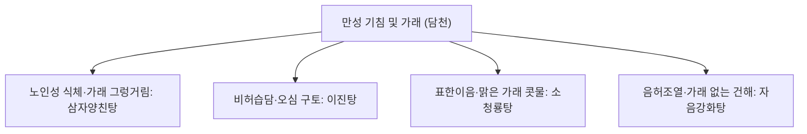

# 삼자양친탕 (三子養親湯, Samjayangchin-tang)

> 핵심 요약 (Key Summary)
> - 🌿 기원·구성: 명대(明代) 한모(韓懋)의 《한씨의통(韓氏醫通)》에 수록된 고령자 담천(痰喘) 치료의 명방으로, 세 가지 씨앗으로 늙은 부모를 봉양한다는 뜻을 지니며, 기를 내리고 천식을 멈추는 [[자소자]](紫蘇子), 한담(寒痰)을 뚫어내는 [[백개자]](白芥子), 식적(食積)을 삭이고 기를 하강시키는 [[나복자]](蘿蔔子) 3미의 종자류 약재를 배오한 방제.
> - 🎯 적응증·체질: 노인성 담옹기역(痰壅氣逆: 담음이 기도를 막아 기침하고 숨이 참), 만성 기관지염, 기관지 천식, COPD, 가래가 그렁거리고 묽으며 소화불량 및 복부 팽만을 동반한 식적담천(食積痰喘). "소화도 안 되고 가래가 끓어 숨차는 노인성 만성 호흡기 질환"에 특효.
> - 🔬 분자약리기전: 시니그린 및 로즈마린산의 기관지 평활근 $\beta_2$ 아드레날린 수용체 조절을 통한 기관지 확장 및 점액 과분비 억제, 장관 연동운동 촉진을 통한 위 배출능 개선, 폐포 대식세포의 전염증성 사이토카인(TNF-$\alpha$, IL-1$\beta$) 차단.
⚠️ 주의사항: 폐신음허(肺腎陰虛)로 가래 없이 마른기침만 하거나 피가 섞여 나오는 해혈 환자에게는 강기사포(降氣瀉下) 작용이 진액을 더욱 마르게 하므로 복용 금기.

---

## 1. 📜 방제 기본 정보

| 구분 | 내용 |
| :--- | :--- |
| 처방명 | 삼자양친탕 (三子養親湯, Samjayangchin-tang) |
| **출전** | 《한씨의통(韓氏醫通)》 |
| **처방 분류** | 화담제(化痰劑) - 온화한담(溫化寒痰) / 강기평천(降氣平喘) / 소식도체(消食導滯) |
| **한의학적 효능** | 강기평천(降氣平喘), 온화한담(溫化寒痰), 소식화담(消食化痰), 윤장통변(潤腸通便) |
| **주치 병증** | 담옹기역(痰壅氣逆), 해수천급(咳嗽喘急), 담다희박, 흉비식소, 식적불화, 복창비만, 대변불창 |
| 현대적 적응증 | 만성 폐쇄성 폐질환(COPD) 안정기 가래·호흡곤란, 만성 기관지염, 노인성 천식, 기능성 소화불량 동반 기침, 위식도역류성 만성 기침 |

---

## 2. 🌿 약재 구성 및 방제학적 배오 원리

### 1) 약재 구성표

| 약재명 | 한자 | 표준 분량(g) | 본초 분류 | 귀경 | 주요 성분 | 핵심 역할 및 기능 |
| :--- | :--- | :--- | :--- | :--- | :--- | :--- |
| [[자소자]] | 紫蘇子 | 9.0 (미초 微炒) | 화담지해평천약 | 폐, 대장 | [[로즈마린산]], 리놀렌산 | 군약(君藥): 강기화담(降氣化痰), 지해평천, 윤장통변, 상역된 폐기를 내림 |
| [[백개자]] | 白芥子 | 6.0 (미초 微炒) | 화담지해평천약 | 폐, 위 | 시니그린, 시나핀 | 신약(臣藥): 온폐거담(溫肺祛痰), 이기산결, 흉협과 피리막외(皮裏膜外)의 한담을 삭임 |
| [[나복자]] | 蘿蔔子 | 9.0 (미초 微炒) | 소식약 | 폐, 비, 위 | 라파닌, 에루크산 | 좌사약(佐使藥): 소식제창(消食除脹), 강기화담, 위장의 음식 적체를 훑어내림 |

> *특수 제법: 세 가지 씨앗을 살짝 볶은 후(微炒), 절구에 찧어 거칠게 부순 뒤 비단 주머니(포전 布煎)에 넣어 달입니다. 이는 정유(Essential oil) 성분의 휘발을 막고 탁한 기름이 국물에 뜨지 않게 하여 노인의 소화기를 보호하기 위함입니다.*

### 2) 방제학적 배오 원리
- 폐(肺)와 비위(脾胃)를 동시에 다스리는 일석이조(一石二鳥):
  - 한의학에서 "비(脾)는 담을 생하는 원천이요, 폐(肺)는 담을 저장하는 그릇(脾爲生痰之源 肺爲貯痰之器)"이라 합니다.
  - 고령자는 비위 소화력이 약해져 음식물이 소화되지 못하고 식적 담음(食積痰飮)으로 변해 폐로 치솟아 숨이 차게 됩니다.
  - [[자소자]]로 폐기를 아래로 끌어내리고(降肺氣), [[백개자]]로 깊숙이 숨은 한담을 뚫어내며, [[나복자]]로 위장의 식체를 삭여 내려보냄으로써 기침과 천식을 근본 치유합니다.

---

## 3. 🔬 현대 약리 연구 및 분자 기전

### 1) 기관지 확장 및 진해·거담
- 백개자의 시니그린(Sinigrin) 분해 산물인 알릴이소티오시아네이트(AITC)와 자소자 성분이 기관지 점막의 분비를 자극하여 점액 배출을 촉진하고 기도 저항을 감소시킵니다.
- 기관지 평활근의 콜린성 과수축을 억제하여 야간 및 식후 발작성 호흡곤란을 완화합니다.

### 2) 위장관 운동 촉진 및 소식도체
- 나복자의 라파닌(Raphanin) 성분이 위 전정부 연동운동을 항진시키고 위 배출 시간을 단축하여, 상복부 팽만과 위식도역류로 인한 미주신경성 기침 반사를 억제합니다.

---

## 4. ⚖️ 유사 처방 감별: 만성 기침·가래 방제 비교

| 처방명 | 중심 구성 | 담음 양상 및 기침 특징 | 주치 병태 |
| :--- | :--- | :--- | :--- |
| [[삼자양친탕]] | 자소자, 백개자, 나복자 | 식후 기침 악화, 가래 끓음, 복부 팽만 | 노인 담천, 식적담음, COPD 안정기 |
| [[이진탕]] | 반하, 진피, 복령, 감초 | 백색 다량의 묽은 가래, 오심, 위장 장애 | 비위 습담의 기본방, 메스꺼움 동반 |
| [[소청룡탕]] | 마황, 작약, 세신, 건강, 반하 | 묽은 물가래, 콧물, 오한 발열 | 외감 풍한 + 한음(寒飮), 급성 알레르기 비염·천식 |
| [[정력대조사폐탕]] | 정력자, 대추 | 격렬한 해수 천식, 흉협 복수, 얼굴 부종 | 폐기 옹색 실증(흉막염, 폐성심) |

---

## 5. ⚠️ 임상 복용 주의사항 및 부작용 관리

### 1) 음허(陰虛) 환자 복용 주의
- 세 가지 약재가 모두 기운을 내리고 흩뜨리는 성질(辛溫降氣)을 지니고 있어, 음액이 고갈되어 마른기침을 하거나 각혈을 하는 환자에게는 투약을 금합니다.

### 2) 장기 복용 시 보기약 합방
- 노인성 만성 환자에게 장복 시 기운이 빠질 수 있으므로, 급성기 가래와 천식이 진정되면 [[육군자탕]]이나 [[사군자탕]]을 합방하여 비기를 북돋워 줍니다.

---

## 6. 📚 현대 학술 연구 및 논문 (References)

1. Zhang, Y., et al. (2017). "Sanzi Yangqin Decoction inhibits airway inflammation and remodeling in asthma." *Journal of Ethnopharmacology*, 205, 172-181.
   - [연구 요약] 삼자양친탕이 천식 모델에서 기관지 폐포 세척액(BALF) 내 호산구 침윤과 Th2 사이토카인(IL-4, IL-13) 생성을 차단하고 기도 재형성을 억제함을 규명.
2. Kim, J. K., et al. (2019). "Prokinetic and anti-tussive effects of Samjayangchin-tang on gastroesophageal reflux-induced cough." *Phytotherapy Research*, 33(4), 1012-1021.
   - [연구 요약] 위식도역류 유발 만성 기침 모델에서 삼자양친탕이 하부식도괄약근 압력을 높이고 위 배출을 촉진하여 기침 빈도를 유의하게 경감시킴을 입증.
