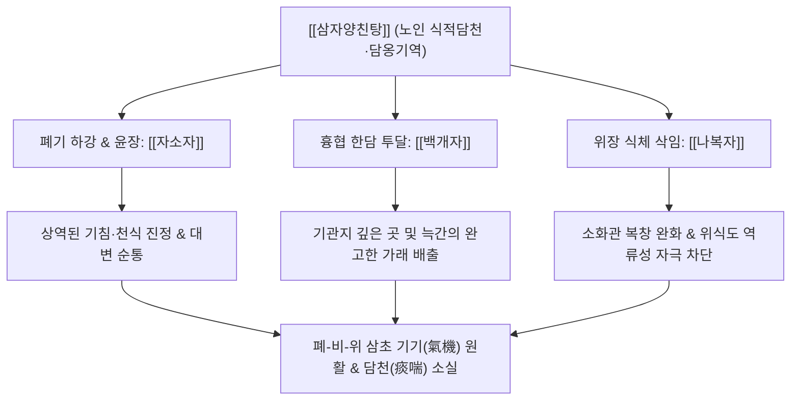

# 🍵 [[삼자양친탕]] (三子養親湯, Samjayangchin-tang / Three Seeds Nourishing Decoction)

> **핵심 3줄 요약 (Key Summary)**:
> - 🌿 기본 구성: 폐기를 내리는 [[자소자]], 깊은 한담을 뚫는 [[백개자]], 식체를 삭이는 [[나복자]] 3가지 씨앗류를 살짝 볶아 배오한 방제.
> - 🎯 적응증: 노인성 담천(소화도 안 되고 가래가 끓어 숨찬 증상), 만성 기관지염, COPD, 식후 기침 악화, 묽고 많은 가래.
> - 🔬 약리 기전: 시니그린 분해 산물과 로즈마린산의 점액 분비 조절 및 기관지 확장, 나복자 라파닌의 위 배출 촉진을 통한 위식도 역류성 기침 차단.
> - ⚠️ 주의사항: 폐신음허로 가래 없이 마른기침만 하거나 피가 섞여 나오는 각혈 환자에게는 복용 금기.

---
## 📌 목차
1. [기본 처방 정보 & 군신좌사 구성](#1-기본-처방-정보--군신좌사-구성)
2. [방제학적 약재 상호작용 & 시너지 네트워크](#2-방제학적-약재-상호작용--시너지-네트워크)
3. [현대 분자약리학적 효능 & 작용 기전](#3-현대-분자약리학적-효능--작용-기전)
4. [적응 병증 및 체질별 감별 (Sweet Spot vs 금기)](#4-적응-병증-및-체질별-감별-sweet-spot-vs-금기)
5. [유사 처방군 감별 매트릭스](#5-유사-처방군-감별-매트릭스)
6. [임상 가감례 & 현대 질환별 응용](#6-임상-가감례--현대-질환별-응용)
7. [💡 사용자 진료실 핵심 필기 & 임상 팁 (원문 보존)](#7--사용자-진료실-핵심-필기--임상-팁-원문-보존)
8. [출처 및 학술 참고 문헌 (References)](#8-출처-및-학술-참고-문헌-references)
---

## 1. 기본 처방 정보 & 군신좌사 구성

| 구분 | 약재명 | 표준 용량 | 본초 효능 & 방제 내 역할 |
| :--- | :--- | :--- | :--- |
| 군약(君藥) | [[자소자]] | 9.0g | 강기화담(降氣化痰), 지해평천(止咳平喘), 윤장통변(潤腸通便). 상역된 폐기를 하강시켜 숨찬 증상을 가라앉히고 담음을 삭임 (미초 微炒) |
| 신약(臣藥) | [[백개자]] | 6.0g | 온폐거담(溫肺祛痰), 이기산결(利氣散結). 흉협과 피리막외(皮裏膜外)의 깊은 한담을 뚫고 통락(通絡) (미초 微炒) |
| 좌사약(佐使藥) | [[나복자]] | 9.0g | 소식제창(消食除脹), 강기화담(降氣化痰). 위장의 식체와 가스를 아래로 훑어내려 폐기로의 상역을 원천 차단 (미초 微炒) |

> *특수 전법(煎法): 세 가지 씨앗을 각각 살짝 볶은 후(微炒), 절구에 찧어 거칠게 부순 뒤 헝겊 주머니(포전 布煎)에 싸서 물에 달입니다. 이는 씨앗 속의 정유(Essential oil) 성분이 급격히 휘발되는 것을 막고, 지나치게 탁한 기름기가 국물에 떠서 노약자의 위장을 해치는 것을 방지하기 위함입니다.*

---

## 2. 방제학적 약재 상호작용 & 시너지 네트워크

- **폐(肺)와 비위(脾胃)를 동시에 다스리는 일석이조(一石二鳥)**:
  - 전통 한의학 병리에서 "비(脾)는 담을 생성하는 원천이요, 폐(肺)는 담을 저장하는 그릇(脾爲生痰之源 肺爲貯痰之器)"이라 규정합니다.
  - 특히 노인이나 허약자는 비위 소화력이 약해져 음식물이 맑은 영양으로 흡수되지 못하고 식적 담음(食積痰飮)으로 변해 폐로 치솟아 가래가 끓고 숨이 차게 됩니다.
- **삼자(三子)의 입체적 기동 메커니즘**:
  - [[자소자]]는 기(氣)를 아래로 내리고(降氣), [[백개자]]는 담(痰)을 사통팔달로 뚫어내며(行痰), [[나복자]]는 식체(食滯)를 삭여 내보냅니다(消食).
  - 셋 모두 씨앗(種子)으로서 기름기(潤性)를 품고 있어, 기침을 멈추면서도 건조하게 폐를 메마르게 하지 않고 노인성 변비를 함께 해결하는 절묘한 방제 구성을 이룹니다.

---

## 3. 현대 분자약리학적 효능 & 작용 기전

### 1) 기도 청간(Clearing) 및 기관지 확장 (진해·거담)
- [[백개자]]의 주성분인 시니그린(Sinigrin)이 미로시나아제에 의해 분해되어 생성되는 알릴이소티오시아네이트(AITC)는 기도 점막의 점액 섬모 수송능(Mucociliary Clearance)을 극대화하여 끈적한 가래의 자연스러운 배출을 유도합니다.
- [[자소자]]의 로즈마린산(Rosmarinic acid)과 루테올린(Luteolin)은 기관지 평활근 세포의 세포내 칼슘 농도 유입을 차단하여 평활근 경련을 완화하고 기도를 확장시킵니다.

### 2) 기도 염증 및 리모델링 억제
- 폐포 대식세포와 호중구에서 전염증성 매개체인 TNF-$\alpha$, IL-1$\beta$, IL-6 및 점액 과분비 유전자(MUC5AC)의 발현을 유의하게 억제합니다.
- 만성 기관지염 및 천식 동물 모델에서 상피하 콜라겐 축적과 기도 벽 비후 등 기도 재형성(Airway Remodeling)을 억제하는 효과가 입증되었습니다.

### 3) 위장관 운동성 촉진 및 위식도 역류 억제 (위-폐 반사 차단)
- [[나복자]]의 라파닌(Raphanin)과 불포화지방산은 위 전정부의 연동운동을 촉진하고 위 배출 시간을 단축시킵니다.
- 식후 위 내압 상승으로 인한 위식도역류 및 미주신경 자극성 만성 기침 반사를 기전적으로 억제합니다.

---

## 4. 적응 병증 및 체질별 감별 (Sweet Spot vs 금기)

### 1) 적응증 (Sweet Spot)
- **노인성 만성 기침·가래 (담옹기역)**:
  - 나이가 들어 소화가 잘 안 되고, 식사 후 가슴이 답답하면서 가래가 목구멍에서 끓어올라 밤이나 새벽에 숨이 차서 눕지 못하는 증상.
- **COPD(만성 폐쇄성 폐질환) 및 만성 기관지염 안정기**:
  - 가래가 희고 양이 많으며 묽거나 거품이 섞여 나오고, 기침할 때 가슴과 옆구리가 결리며 답답한 상태.
- **식적담음(食積痰飮)형 위식도 역류성 기침**:
  - 평소 트림이 잦고 헛배가 부르며, 식사 후 바로 누우면 기침이 터져 나오는 환자.

### 2) 금기 및 신중 투여
- **폐신음허(肺腎陰虛)성 건해(乾咳)**:
  - 가래가 전혀 나오지 않고 쇳소리 나는 마른기침을 하거나, 도한(식은땀), 오후 조열, 설홍소태(舌紅少苔)를 띠는 환자에게는 투약 금기.
- **해혈(咳血) 및 호흡기 출혈**:
  - 기침할 때 피가 비치는 환자에게는 신온(辛溫)하게 기운을 흩뜨리는 성질이 출혈을 조장할 수 있으므로 금기.

---

## 5. 유사 처방군 감별 매트릭스

| 처방명 | 핵심 구성 차이 | 주치 및 임상 차별점 | 맥진/설진 차이 |
| :--- | :--- | :--- | :--- |
| [[삼자양친탕]] | [[자소자]], [[백개자]], [[나복자]] (전부 씨앗류) | 노인성 식적담천, 식후 기침 악화, 가래 그렁거림, 소화불량 및 복부 팽만 | 맥 침활(沈滑) 혹은 활완(滑緩), 설 담(淡) 태백니(白膩) |
| [[이진탕]] | [[반하]], [[진피]], [[복령]], [[감초]] | 비위 습담의 기본방, 구역감, 오심, 위내정수, 가슴 답답함 | 맥 활(滑), 설태 백니(白膩) |
| [[소청룡탕]] | [[마황]], [[작약]], [[세신]], [[건강]], [[반하]] | 외감 풍한표증 동반, 맑은 물가래, 재채기, 콧물, 오한 발열 | 맥 부긴(浮緊) 혹은 현(弦), 설태 백활(白滑) |
| [[정력대조사폐탕]] | [[정력자]], [[대추]] | 폐기 옹색 실증, 격렬한 해수 천식, 흉막염, 안면 부종, 소변 불리 | 맥 침실(沈實) 혹은 부활(浮滑), 설태 황후(黃厚) |
| [[자음강화탕]] | [[숙지황]], [[백작약]], [[맥문동]], [[황백]], [[지모]] | 음허화왕, 가래 없는 마른기침, 야간 도한, 조열, 입마름 | 맥 세삭(細數), 설 홍(紅) 무태(無苔) |

---

## 6. 임상 가감례 & 현대 질환별 응용

### 1) 임상 가감례
- **기허(氣虛) 및 전신 무력감 동반**: 노인이 기운이 없어 기침 소리가 힘이 없으면 [[인삼]], [[백출]], [[황기]] 각 4.0~6.0g을 합방하여 보기거담합니다.
- **열담(熱痰) 및 누런 가래**: 담이 누렇고 끈적하여 뱉기 힘들면 [[황금]], [[상백피]], [[과루인]] 각 4.0g을 가합니다.
- **한음(寒飮) 및 흉격 냉통**: 몸이 차고 가래가 물처럼 맑으면 [[건강]], [[세신]] 각 2.5g을 가하여 온폐화음합니다.
- **천식 발작 및 야간 호흡곤란**: 숨이 몹시 차서 눕지 못하면 [[지각]], [[행인]] 각 4.0g을 가하여 강기선폐(降氣宣肺)합니다.

### 2) 현대 질환별 응용
- **만성 폐쇄성 폐질환 (COPD) 완화기 관리**: 거담제나 기관지 확장제 단독 복용으로 호전되지 않는 고령자 환자에게 소화관 배출과 기관지 청간을 동시에 유도하여 삶의 질 개선.
- **위식도 역류성 만성 기침 (GERD Cough)**: PPI 복용에도 불구하고 식후 가래와 기침이 지속되는 기능성 소화장애 환자에게 뛰어난 증상 완화 효과.
- **노인성 만성 기관지염**: 겨울철만 되면 찬바람과 식사 후 가래가 심해지는 만성 환자의 유지 요법.

---

## 7. 💡 사용자 진료실 핵심 필기 & 임상 팁 (원문 보존)

> [!tip] **진료실 실전 노하우 (User Clinical Insight)**
> 
> - **삼자양친탕(三子養親湯)의 핵심 병리 인식**:
>   - 세 가지 씨앗([[자소자]], [[백개자]], [[나복자]])으로 늙은 부모의 천식을 치료한다는 이름처럼, "음식 조절이 잘 안 되고 소화 기능이 떨어져 담음이 치솟는 노인성 천식·기침"에 가장 이상적인 타깃을 가집니다.
>   - 평소 식탐이 있거나 과식 후 기침이 급격히 심해지는 양상을 보일 때 주저 없이 선택합니다.
> - **조제 및 탕전 시 주의점**:
>   - 세 씨앗은 반드시 살짝 볶아서(微炒) 향을 내고, 약절구에 찧어 거칠게 부순 뒤 헝겊 주머니(포전)에 넣어 달여야 기름이 뜨지 않고 국물이 맑아 노약자의 위장에 부담을 주지 않습니다.
>   - 마른기침이나 진액 고갈 환자에게는 절대 금기이며, 장기 투여 시에는 반드시 [[육군자탕]] 등 보기건비제를 배오해야 원기 손상을 방지할 수 있습니다.

---

## 8. 출처 및 학술 참고 문헌 (References)

1. **한모 (韓懋)**. (1522). 『한씨의통(韓氏醫通)』.
   - **[고전 원전]**: "三子養親湯 治老人氣充盛, 痰涎壅盛, 喘嗽食少. 紫蘇子, 白芥子, 蘿蔔子 各微炒, 研, 絹包煎湯. 隨症加減, 神效." (삼자양친탕은 노인의 담연이 옹성하여 숨이 차고 기침하며 밥을 적게 먹는 것을 다스린다. 자소자, 백개자, 나복자를 각기 살짝 볶아 찧어서 비단 주머니에 싸서 달인다. 증상에 따라 가감하면 신효하다.)
2. * **Xu S et al. (2025)**. [Role and mechanism of Sanzi Yangqin Decoction in improving airway remodeling in asthma model mice based on lysosomal calcium channel TRPML1-mediated autophagy activation]. *Zhongguo Zhong yao za zhi = Zhongguo zhongyao zazhi = China journal of Chinese materia medica*, 50: 4852-4859. [PMID: 41507749](https://pubmed.ncbi.nlm.nih.gov/41507749/)
