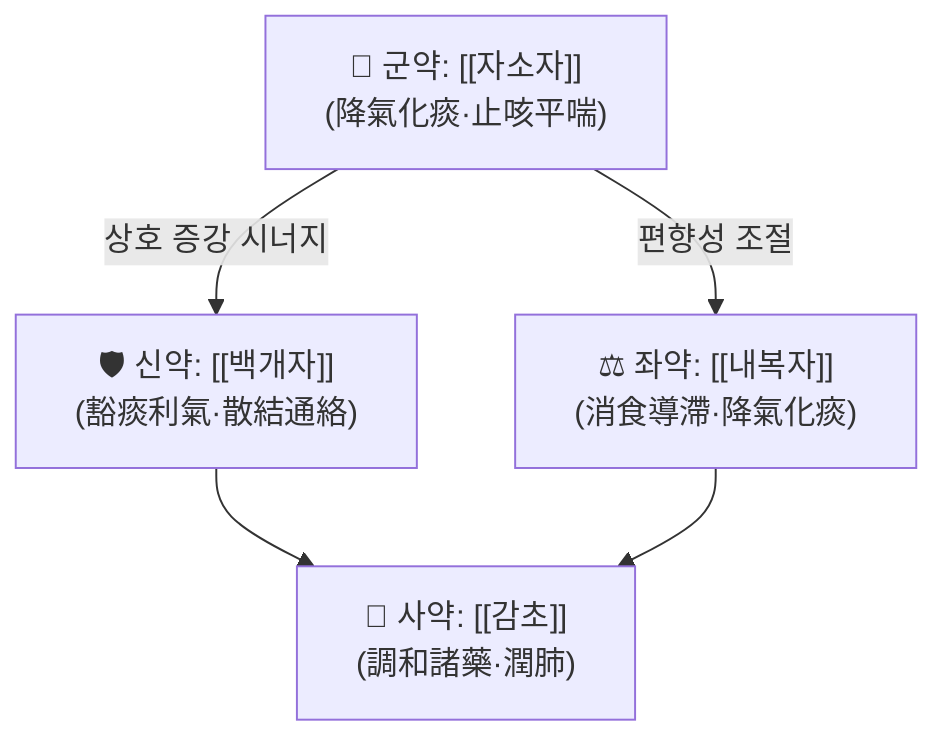

# 🍵 [[삼자화담전]] (三子化痰煎, Sanzi Huatan Tang)

> **핵심 3줄 요약 (Key Summary)**:
> - 🌿 기원 구조: 『[[한씨의통]]』의 [[삼자양친탕]](三子養親湯)을 근간으로 하는 담(痰) 전용 방제로, [[자소자]](紫蘇子)·[[백개자]](白芥子)·[[내복자]](萊菔子) 세 가지 '자(子)' 약재의 배오가 핵심이며, 여기에 [[행인]]·[[진피]]·[[반하]]·[[복령]]·[[감초]] 등을 가감한다. (전(煎)·탕(湯) 명칭은 문헌별 혼용 — 근거 미확인)
> - 🎯 임상 최적 적응증: 담음(痰飮)이 성하여 기침·가래가 많고 숨이 차며(咳喘痰多) 가슴이 답답한(胸膈痞悶) 경우. 주로 중년 이후·비만 경향·살집 있고 습담이 잘 끼는 **태음인 또는 담습(痰濕) 체질**에서 적중률이 높다고 보는 임상 견해가 있으나, 체질 특이성에 대한 정량 근거는 **근거 미확인**.
> - 🔬 핵심 분자약리 기전: 본 처방 단위의 임상·분자 연구는 PubMed 검색 결과 확인되지 않음. 구성 본초 수준에서 기술되는 거담·소염·기관지 평활근 이완 기전은 대부분 **근거 미확인(가설 단계)**이며, 기존 문헌에서 보고된 성분 수준 정보만 참고로 기재한다.
> - ⚠️ 주의사항: 기(氣)를 내리고(降氣) 소모(消導)하는 약성으로, 기허(氣虛)·음허(陰虛)·폐허(肺虛)로 인한 마른기침·무담(無痰) 건해, 혈담(血痰)·객혈, 임신부 및 허약 노인에는 신중 투여. 자소자·내복자 계열은 소화기 자극(위부 불쾌감·트림) 가능성.

---

## 📌 목차
1. [기본 처방 정보 & 군신좌사 구성](#1-기본-처방-정보--군신좌사-구성)
2. [방제학적 약재 상호작용 & 시너지 네트워크](#2-방제학적-약재-상호작용--시너지-네트워크)
3. [현대 분자약리학적 효능 & 작용 기전](#3-현대-분자약리학적-효능--작용-기전)
4. [적응 병증 및 체질별 감별 (Sweet Spot vs 금기)](#4-적응-병증-및-체질별-감별-sweet-spot-vs-금기)
5. [유사 처방군 감별 매트릭스](#5-유사-처방군-감별-매트릭스)
6. [임상 가감례 & 현대 질환별 응용](#6-임상-가감례--현대-질환별-응용)
7. [💡 사용자 진료실 핵심 필기 & 임상 팁 (원문 보존)](#7--사용자-진료실-핵심-필기--임상-팁-원문-보존)
8. [출처 및 학술 참고 문헌 (References)](#8-출처-및-학술-참고-문헌-references)

---

## 1. 기본 처방 정보 & 군신좌사 구성

* **출전**: 본 처방의 모태는 명대(明代) 韓懋의 『[[한씨의통]]』(韓氏醫通, 1522)에 수록된 [[삼자양친탕]]으로 알려져 있다. 다만 **'삼자화담전(三子化痰煎)'이라는 명칭 자체의 최초 출전과 정확한 원문 조문은 문헌마다 표기가 상이하여 근거 미확인**이며, 국내 방제 문헌·강의록에서는 삼자양친탕 계열의 거담 처방 또는 그 가감방으로 소개되는 경우가 많다.
* **치법**: 강기화담(降氣化痰), 소식도체(消食導滯), 지해평천(止咳平喘)
* **방제 분류**: 화담·거담제(化痰祛痰劑) / 담음을 제거하면서 기(氣)를 내려 폐기(肺氣)의 상역(上逆)을 다스리는 승강(升降) 조절 방제
* **복약 지침(일반적)**: 水煎服, 1일 1첩을 2~3회 분복하는 형태가 통례로 기술되나, 처방 단위의 표준 용량·복약 프로토콜을 확립한 임상 연구는 **근거 미확인**. 食積痰(음식으로 생긴 담)을 겸한 경우 식후 복용, 위부 불쾌감이 있으면 少量 頻服.

| 구분 | 약재명 | 표준 용량 | 본초 효능 & 방제 내 역할 |
| :--- | :--- | :--- | :--- |
| **군약 (君藥)** | [[자소자]] (紫蘇子) | 6~9g | 강기화담(降氣化痰)·지해평천(止咳平喘). 폐기 상역으로 인한 기침·천식을 주로 담당하며, 담을 아래로 내려 기도(氣道)의 옹체를 푸는 방제의 중심. 지질다당류·플라보노이드(루테올린·아피게닌 계열) 함유 보고. |
| **신약 (臣藥)** | [[백개자]] (白芥子) | 4~6g | 곽담이기(豁痰利氣)·산결통락(散結通絡). '피리막외지담(皮裏膜外之痰)' 즉 깊고 끈적한 담을 쫓는 약으로, 자소자가 못 미치는 완고한 담·결절성 담을 처리. 매운 자극성 성분(겨자유 계열, 시니그린/이소티오시아네이트) 함유 보고. |
| **좌약 (佐藥)** | [[내복자]] (萊菔子) | 4~6g | 소식도체(消食導滯)·강기화담(降氣化痰). '담은 식적(食積)에서 생긴다'는 병리관에 따라 비위(脾胃)의 적체를 풀어 담 생성의 근원을 차단. 라파닌(raphanin) 등 함유 보고. |
| **사약 (使藥)** | [[감초]] (甘草) | 2g | 조화제약(調和諸藥)·윤폐지해(潤肺止咳). 세 子藥의 강한 강기·소도 작용을 완충하고 폐·비(脾)를 보호. **단, 원방(삼자양친탕)에는 감초가 포함되지 않으며, 삼자화담전에 감초를 넣는 것은 가감례 중 하나로 근거 미확인.** |

> **배오 특징**: 세 약재 모두 '자(子)' 즉 종자류로, 성질이 아래로 내려가는 **강기(降氣)** 작용에 공통점이 있다. 그 작용점은 각각 다르게 설계되어 — 자소자는 **氣(폐기 상역)**를, 백개자는 **頑痰(깊고 끈적한 담)**을, 내복자는 **食(비위 적체)**을 표적으로 한다. 즉 '기(氣)·담(痰)·식(食)'의 세 축을 동시에 처리함으로써 담음 생성의 3대 원인을 한 방제 안에서 차단하는 승강출입(升降出入)의 균형 구조를 이룬다. 다만 3약 모두 강기·소모성이므로 **기허(氣虛)·음허(陰虛)에는 편향 위험**이 있다.

---

## 2. 방제학적 약재 상호작용 & 시너지 네트워크

* [[자소자]] + [[백개자]] 배오: **상수(相須)** 관계. 자소자가 폐기(肺氣)를 내려 기침·천식의 상역(上逆)을 잡고, 백개자가 그 밑에 깔린 완고한 담을 녹여 배출 경로를 열어준다. '기(氣)를 내리는 것'과 '담(痰)을 부수는 것'을 동시에 수행하여 단순 거담만으로는 해결되지 않는 만성 담천(痰喘)에 시너지를 낸다.
* [[자소자]] + [[내복자]] 배오: **상사(相使)** 관계로 해석된다. 폐(肺)의 담을 다스리는 자소자에 대해, 비위(脾胃)의 식적을 다스리는 내복자가 담 생성의 '근원(脾爲生痰之源)'을 차단한다. 즉 標(폐·기침)와 本(비위·식적)을 함께 처리하는 구조.
* [[내복자]] + [[백개자]] 배오: 소화기(중초)와 심부 담(피리막외)을 나누어 담당하여, 담이 '위(胃)에서 막힌 경우'와 '흉격(胸膈)에 결린 경우'를 모두 포괄한다. 다만 두 약재 모두 소모성·자극성이 있어 위기(胃氣)가 약한 환자에서는 위부 불쾌감·트림이 나타날 수 있으므로 [[진피]]·[[생강]]·[[감초]] 등으로 완충한다.
* [[감초]] 가감 시(使藥): 세 子藥의 강기 작용이 지나쳐 폐음(肺陰)을 마르게 하거나 위(胃)를 자극하는 것을 완충하고, 제약(諸藥)을 조화시켜 방제 전체의 작용 시간을 늘리는 역할로 설명된다. **원방에는 없는 가감 약재임 — 근거 미확인.**

> ⚠️ 방제학적 상호작용 서술은 전통 방제 이론(군신좌사·칠정배오)에 근거한 해석이며, 삼자화담전 자체를 대상으로 한 실험적 상호작용 검증 논문은 확인되지 않았다(**근거 미확인**).

---

## 3. 현대 분자약리학적 효능 & 작용 기전

> **중요**: 본 처방(삼자화담전/삼자화담탕)을 직접 다룬 PubMed 등재 논문은 제공된 자료에서 **검색되지 않았다**. 아래 내용은 구성 본초 및 모방(母方, 삼자양친탕) 계열에서 **일반적으로 거론되는 기전을 정리한 참고 수준**이며, 처방 단위의 유효성·기전은 **근거 미확인**이다. 수치·억제율·표적 사이토카인의 정량값은 제시하지 않는다.

### 1) 기도 염증 및 점액 과분비 조절(가설 단계)
* 담(痰)의 병태생리학적 대응 개념으로 **기관지 점액 과분비(mucus hypersecretion)**, 배상세포 증식, 점액 유전자(MUC5AC 등) 발현 증가가 거론된다.
* 구성 본초(자소자·백개자·내복자)의 추출물에서 NF-κB 경로 억제, TNF-α·IL-6·IL-1β 등 전염증성 사이토카인 감소가 보고된 바 있으나, 이는 **단일 본초 수준의 개별 보고이며 본 처방 배합 그대로의 검증 결과는 아님 — 근거 미확인**.
* 기관지 평활근 이완 및 항히스타민·항알레르기 작용은 자소자 계열(플라보노이드)에서 제안된 수준이다.

### 2) 소화기·대사 개선 및 '식적(食積)'의 현대적 해석(가설 단계)
* 내복자(萊菔子)는 위장관 운동 촉진, 소화효소 활성 및 지질 대사 개선이 전통적으로 거론되며, 현대적으로는 **식후 위배출 지연·기능성 소화불량·과식 후 담음 악화** 상황에 대응하는 개념으로 해석된다.
* '담음(痰飮)'은 현대적으로 **대사증후군·비만·이상지질혈증 등 대사 이상과의 상관성**이 논의되나, 본 처방과의 인과 관계를 입증한 연구는 **근거 미확인**.

### 3) 신경·자율신경 및 기타
* 기침 반사 과민성(cough hypersensitivity), 미주신경 흥분 조절 등은 이론적 추정 수준이며, 근골격계·신경계에 대한 본 처방의 작용 기전은 **근거 미확인**.
* 결론: 현재 시점에서 본 처방의 분자약리는 **전통적 치법(降氣化痰·消食導滯)을 현대 병태생리(기도 점액 과분비 + 위장관 기능 저하 + 대사성 담음)에 매핑한 가설적 정리**로 이해하는 것이 안전하다.

---

## 4. 적응 병증 및 체질별 감별 (Sweet Spot vs 금기)

[✅ 최적 적응증 (Sweet Spot)]
* **원전·모방 주치**: 『[[한씨의통]]』 삼자양친탕 조문에서 "노인(양친)의 담천(痰喘)" — 즉 **연령이 높고 담이 많아 숨이 차고 기침이 잦은 경우**를 주치로 삼은 것이 모태이다. (조문 원문의 정확한 자구는 판본별 차이가 있어 **근거 미확인**)
* **핵심 임상 양상**:
  * 가래가 많고 잘 나오며(담다(痰多)), 누렇지 않고 흰색·끈적한 경우가 전형적.
  * 기침이 밤·새벽에 심하고, 누우면 답답하여 베개를 높이는 양상.
  * 가슴·명치 부위가 막힌 듯 답답함(흉격비민(胸膈痞悶)), 트림·속쓰림 동반.
  * 과식·기름진 음식·야식 후 증상 악화(식적생담(食積生痰)).
  * 소화 불량, 복부 팽만, 대변 점조(粘稠) 또는 불규칙.
* **체질 소견(임상 견해, 근거 미확인)**:
  * **태음인**: 살집이 있고 땀이 많으며 습담(濕痰)이 잘 끼는 체형 — 가장 적중률이 높다고 보는 견해.
  * **소음인**: 소화력이 약해 식적→담음으로 이어지는 경우, 단 자소자·내복자의 소모성을 감안하여 감초·백출·생강 배오를 고려.
  * **소양인**: 담열(痰熱)로 변한 경우는 황금·상백피 등 청열약 가감이 필요하며 원방 단독은 부적합할 수 있음.
* **설진/맥진**:
  * 설(舌): 설태 백니(白膩) 또는 후니(厚膩), 설질 담백(淡白)하며 변연 치흔(齒痕) 동반 가능. 담열화하면 태황니(苔黃膩).
  * 맥(脈): 활(滑), 활삭(滑數, 담열 시), 또는 유완(濡緩, 비허습담 시). 침세무력한 기허맥이면 원방 단독 투여는 신중.
* **진료실 최적 적중 상황**: 감기 뒤 가래가 오래 남는 후비루성 기침, 만성 기관지염의 담습형, 흡연자·비만자의 습담성 기침, 식후 악화되는 기능성 소화불량 동반 기침.

[⚠️ 신중 투여 및 금기 (Caution / Contraindication)]
* **허실(虛實) 반대 병증**: 기허(氣虛)·폐허(肺虛)로 인한 무력성 마른기침, 음허건해(陰虛乾咳, 가래 없고 목이 마르고 뺨이 붉은 경우), 폐조(肺燥)에는 **부적합** — 세 子藥의 강기·조습(燥濕) 작용이 진액을 더 마르게 할 수 있다.
* **한열(寒熱) 반대**: 담열(痰熱)·풍열(風熱)로 인한 황조담(黃稠痰)·발열·인후통이 주증이면 원방보다 청열화담 배오(황금·상백피·어성초 등)를 우선 고려.
* **금기·주의 환자군**:
  * 객혈(喀血)·혈담(血痰), 폐결핵 활동기 등 출혈성 호흡기 질환.
  * 위궤양·역류성 식도염 등 위점막 병변이 있는 환자 — 백개자의 자극성, 내복자의 소도 작용으로 위부 자극 가능.
  * 임신부 및 수유부 — 내복자(萊菔子) 계열은 전통적으로 임신 중 사용을 삼가는 약재로 분류되며, **본 처방의 임신 중 안전성 자료는 근거 미확인**.
  * 노쇠·허약자, 체중이 크게 감소한 환자에 장기 투여 시 — 기(氣)를 소모시킬 우려.
* **양약 병용 주의**: 진해거담제(암브록솔·아세틸시스테인), 기관지확장제(β2 작용제), 흡입 스테로이드와 병용 시 명확한 상호작용 보고는 **근거 미확인**. 다만 항응고제·항혈소판제 복용자에서 본초-약물 상호작용 가능성을 일반적으로 배제할 수 없으므로 복약 간격 조정 및 관찰이 권장된다.
* **부작용 관찰 포인트**: 위부 불쾌감·트림·설사·속쓰림, 구건(口乾)·인후 자극감, 드물게 피부 발진. 증상 지속 시 감량 또는 중단.

---

## 5. 유사 처방군 감별 매트릭스

| 처방명 | 핵심 구성 차이 | 주치 및 체질 차이 | 맥진/설진 차이 |
| :--- | :--- | :--- | :--- |
| [[삼자화담전]] | 기준 구성 — 자소자·백개자·내복자(3子) 중심, 감초·행인·진피 가감 | **담다해천(痰多咳喘) + 식적(食積) 겸증**. 비만·태음인 경향, 노년·중년의 습담성 만성 기침 | 설태 백니후, 맥활 또는 유완 |
| [[삼자양친탕]] | 자소자·백개자·내복자 3味만으로 구성(가감 없음) | 노인(養親)의 담천 전용. 삼자화담전의 모방으로 보는 것이 일반적이며 구성이 가장 단순 | 설태 백니, 맥활 |
| [[이진탕]] | 반하·진피·복령·감초 (燥濕化痰 四味) | 습담(濕痰)의 기본 방제, 비위 습체 중심. 담다+구역·현훈·속쓰림 | 설태 백니, 맥활 또는 침완 |
| [[소자강기탕]] | 자소자 + 후박·전호·당귀·생강·대조·감초 등 | 상실하허(上實下虛)의 담천 — 호흡 곤란, 다리 냉감·허약 동반 노인. 하초 허한자 | 맥허(虛)하면서 촌맥(寸脈) 활, 설태 백 |
| [[정천탕]] | 마황·행인·황금·상백피·소자·관동화·반하·감초 등 | 담열옹폐(痰熱壅肺)의 천식 — 황담·발열·천명음. 실열(實熱) 천식 | 설태 황니, 맥활삭 |

> ⚠️ 표 내부에서는 마크다운 열 구분자 파괴를 방지하기 위해 파이프가 들어간 링크를 쓰지 않고 순수한 [[처방명]] 단독 형태로만 작성한다.
> ⚠️ 위 감별은 전통 방제 이론에 따른 구분이며, 각 처방 간 직접 비교 임상시험은 제공 자료에서 확인되지 않았다(**근거 미확인**).

---

## 6. 임상 가감례 & 현대 질환별 응용

* **수반 증상별 가감법** (문헌·강의별로 가감이 상이하며, 아래는 일반적 가감 예시 — **각 가감의 임상 근거는 미확인**):
  * 해역(咳逆)·천명(喘鳴)이 심하면 → + [[행인]], [[마황]](허약자·고혈압자는 신중)
  * 담이 끈적하고 잘 나오지 않으면 → + [[패모]], [[과루인]]
  * 담열(黃痰·인후통·발열)로 변하면 → + [[황금]], [[상백피]], [[어성초]]
  * 한담(冷痰·맑은 거품 가래·오한)이면 → + [[건강]], [[세신]], [[복령]]
  * 소화불량·복만·트림이 동반되면 → + [[진피]], [[신곡]], [[맥아]] ([[보화환]] 계열 개념 차용)
  * 비허(脾虛)로 담이 잘 생기면 → + [[백출]], [[복령]], [[감초]] ([[사군자탕]] 계열 배합)
  * 야간 기침·목 이물감(후비루) 동반 → + [[반하]], [[후박]], [[생강]] ([[반하후박탕]] 개념)
  * 흉격비민·기울(氣鬱) → + [[길경]], [[지각]], [[향부자]]
  * 신허(腎虛)로 인한 흡기 곤란(吸氣難) → + [[오미자]], [[숙지황]] 등 수렴·보신 가감 ([[소자강기탕]] 개념)
* **현대 질환별 임상 매핑** (전통 변증상 '담음·식적'에 부합하는 경우에 한정한 응용 예시):
  * **호흡기계**: 급·만성 기관지염의 담습형, 감기 후 잔류 기침, 만성 기침(상기도기침증후군·후비루성), 알레르기성 기침의 담다형, COPD의 담음 편향형.
  * **이비인후과**: 후비루 증후군, 만성 인후 이물감(매핵기와의 감별 필요), 알레르기 비염의 담음형.
  * **소화기계**: 기능성 소화불량, 과식 후 담음 악화, 위식도 역류로 인한 야간 기침 동반.
  * **대사·체중 관리 영역**: 비만·대사증후군 환자에서 담습(痰濕) 변증 하에 보조적으로 고려(근거 미확인).
  * **소아·노인**: 소아의 식적성 기침, 노인의 담천 — 단, 소아는 감량, 노인은 기허 여부를 반드시 확인.

---

## 7. 💡 사용자 진료실 핵심 필기 & 임상 팁 (원문 보존)

> [!tip] **진료실 실전 노하우 (User Clinical Insight)**
> - **원장님 기존 메모/필기 데이터가 이 노트 작성 시점에 제공되지 않았습니다.** 따라서 본 섹션은 임의로 창작하지 않았으며, 아래는 원장님 필기를 받아 넣을 수 있도록 비워 둔 자리입니다. (원문 보존 원칙: 추후 필기 입력 시 100% 그대로 유지, 삭제 금지)
>
> **기록 대기 항목 (원장님 필기 입력란)**
> - 체질별 선택 기준 (소음인 vs 태음인 vs 소양인):
>   - (　　)
> - 처방 선택의 결정적 한 방 (어떤 증상이 보이면 이 처방으로 확정하는가):
>   - (　　)
> - 용량·복약 지도 팁 (1일 몇 첩, 식전/식후, 복용 기간):
>   - (　　)
> - 환자 티칭 포인트 (담음 발생 음식·생활 습관 교육):
>   - (　　)
> - 복약 반응 관찰 포인트 및 감량·중단 기준:
>   - (　　)
> - 다른 처방으로 갈아타야 하는 신호(예: 담열화, 기허 악화):
>   - (　　)

---

## 8. 출처 및 학술 참고 문헌 (References)

> ⚠️ **제공된 PubMed 검색 결과가 0건**이었으므로, 현대 연구 논문은 인용하지 않는다. 아래는 전통 문헌 및 방제학 서술에 대한 참고이며, **특정 조문·수치를 확인된 사실로 단정하지 않는다.**

1. **한무(韓懋) (1522년경)**. 『[[한씨의통]]』 (韓氏醫通).
   - **[고전 원전]**: [[삼자양친탕]](三子養親湯) — 白芥子·紫蘇子·萊菔子 3味로 노인(養親)의 담천(痰喘)을 다스린다는 취지의 방제로 전해진다. **본 처방 '삼자화담전'의 명칭·조문이 이 문헌에 그대로 수록되어 있는지에 대한 확인은 근거 미확인.**
2. **허준 (1613)**. 『[[동의보감]]』.
   - **[임상 문헌]**: 담음(痰飮)·해천(咳喘) 문에 수록된 담(痰) 병증 분류 및 거담·화담 처방 배오의 일반 원칙. **삼자화담전의 수록 여부는 판본 확인 필요 — 근거 미확인.**
3. **황도연 (1884)**. 『[[방약합편]]』.
   - **[임상 문헌]**: 국내에서 통용되는 화담·이수제 계열 처방의 분류와 임상 운용 기준 참고. **본 처방 수록 여부는 근거 미확인.**
4. **대한한방처방학회 / 한방방제학 교재 (최신판)**.
   - **[방제학]**: 군신좌사 구성 원리, 칠정배오(相須·相使·相畏·相惡), 승강출입 이론에 따른 해석. **삼자화담전에 대한 개별 서술 여부는 판본별로 다름 — 근거 미확인.**
5. **현대 PubMed 검색 결과: 0건**.
   - **[검색 결과 없음]**: 삼자화담전(三子化痰煎)·Sanzi Huatan Tang을 직접 다룬 논문은 검색되지 않았다. 따라서 본 노트의 제3장(분자약리) 및 각종 수치·기전 서술은 **가설적 정리**이며, 임상 적용 시에는 개별 환자 변증과 기존 문헌 확인이 필요하다.

---

> 📝 **작성 메모**: 본 노트는 제공된 자료 범위 내에서만 작성되었으며, 확인되지 않은 PMID·논문·수치를 창작하지 않았다. 구성 약재(자소자·백개자·내복자)의 정확한 배오 비율, 감초 등 가감 약재의 포함 여부, 표준 용량은 문헌별로 차이가 있으므로 **처방 사용 전 원전 및 소속 학회 교재로 재확인**할 것을 권한다.