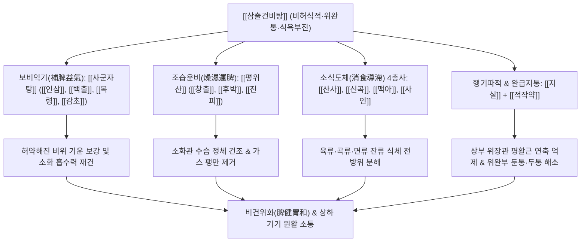

# 🍵 [[삼출건비탕]] (蔘朮健脾湯, Samchulgeonbi-tang / Ginseng and Atractylodes Spleen-Strengthening Decoction)

> **핵심 3줄 요약 (Key Summary)**:
> - 🌿 기본 구성: [[사군자탕]]([[인삼]], [[백출]], [[복령]], [[감초]])과 [[평위산]]([[창출]], [[진피]], [[후박]])에 소식약 [[산사]], [[신곡]], [[맥아]], [[사인]]과 [[지실]], [[적작약]], [[생강]], [[대조]]를 가미한 방제.
> - 🎯 적응증: 만성 소화불량, 식욕부진, 입맛도 없는데 상부 위장관 통증과 두통·묵직함이 동반된 경우, 위완통, 식후 팽만감, 사지 무력.
> - 🔬 약리 기전: 위점막 혈류량 증대 및 상피세포 보호, 위장관 연동운동 항진, 복합 천연 소화효소 분비 촉진, 평활근 경련 억제.
> - ⚠️ 주의사항: 급성 음식 중독이나 설태가 누렇게 끼는 급성 실열기에는 투약을 피할 것.

---
## 📌 목차
1. [기본 처방 정보 & 군신좌사 구성](#1-기본-처방-정보--군신좌사-구성)
2. [방제학적 약재 상호작용 & 시너지 네트워크](#2-방제학적-약재-상호작용--시너지-네트워크)
3. [현대 분자약리학적 효능 & 작용 기전](#3-현대-분자약리학적-효능--작용-기전)
4. [적응 병증 및 체질별 감별 (Sweet Spot vs 금기)](#4-적응-병증-및-체질별-감별-sweet-spot-vs-금기)
5. [유사 처방군 감별 매트릭스](#5-유사-처방군-감별-매트릭스)
6. [임상 가감례 & 현대 질환별 응용](#6-임상-가감례--현대-질환별-응용)
7. [💡 사용자 진료실 핵심 필기 & 임상 팁 (원문 보존)](#7--사용자-진료실-핵심-필기--임상-팁-원문-보존)
8. [출처 및 학술 참고 문헌 (References)](#8-출처-및-학술-참고-문헌-references)
---

## 1. 기본 처방 정보 & 군신좌사 구성

| 구분 | 약재명 | 표준 용량 | 본초 효능 & 방제 내 역할 |
| :--- | :--- | :--- | :--- |
| 군약(君藥) | [[인삼]] | 4.0g | 대보원기(大補元氣), 보비익폐(補脾益肺). 손상된 비위의 양기를 북돋워 소화 흡수의 근본 에너지 공급 |
| 군약(君藥) | [[백출]] | 4.0g | 건비익기(健脾益氣), 조습이수(燥濕利水). 비장의 운화 기능을 회복시키고 위 점막 수분 정체 해소 |
| 신약(臣藥) | [[창출]] | 4.0g | 조습건비(燥濕健脾), 거풍산한(祛風散寒). 위장관 내 탁한 습기를 강력히 말려 복부 팽만과 중압감 제거 |
| 신약(臣藥) | [[백복령]] | 4.0g | 건비보중(健脾補中), 담삼이습(淡渗利濕). 중초에 괸 수습을 소변으로 이끌어내어 위내정수 치료 |
| 신약(臣藥) | [[후박]] | 3.0g | 조습소담(燥濕消痰), 하기제만(下氣除滿). 정체된 기운을 하강시켜 헛배부름과 명치 그득함을 해소 |
| 신약(臣藥) | [[진피]] | 3.0g | 이기건비(理氣健脾), 조습화담(燥濕化痰). 기운을 소통시키고 담음을 삭여 트림과 메스꺼움 개선 |
| 좌약(佐藥) | [[산사]] | 3.0g | 소식화적(消食化積), 활혈산어(活血散瘀). 특히 기름진 고기류와 육적(肉積)을 삭이고 위장 혈류 개선 |
| 좌약(佐藥) | [[신곡]] | 3.0g | 건비소식(健脾消食), 조중화위(調中和胃). 곡류와 면류의 식체를 발효·분해하여 소화 촉진 |
| 좌약(佐藥) | [[맥아]] | 3.0g | 소식화중(消食和中), 건비개위(健脾開胃). 밀가루 및 탄수화물 정체를 삭이고 위장의 연동 기능 회복 |
| 좌약(佐藥) | [[사인]] | 2.5g | 화습개위(化濕開胃), 온비지사(溫脾止瀉). 비위를 따뜻하게 깨우고 기침과 상역을 방지 |
| 좌약(佐藥) | [[지실]] | 2.5g | 파기소적(破氣消積), 화담제비(化痰除痞). 위완부의 결체된 기를 깨뜨려 가슴과 위의 묵직한 통증 완화 |
| 좌약(佐藥) | [[적작약]] | 3.0g | 산어지통(散瘀止痛), 청열양혈(淸熱凉血). 위장관 평활근의 경련성 긴장을 풀고 복통을 즉각 진정 |
| 사약(使藥) | [[감초]] | 1.5g | 보비익기(補脾益氣), 조화제약(調和諸藥). 여러 약재의 충돌을 막고 비위를 부드럽게 감쌈 |
| 사약(使藥) | [[생강]] | 3.0g | 온중지구(溫中止嘔), 산한해독(散寒解毒). 위를 덥혀 구역감을 가라앉힘 |
| 사약(使藥) | [[대조]] | 3.0g | 보중익기(補中益氣), 양혈안신(養血安神). 생강과 어우러져 영위와 기혈을 자양 |

---

## 2. 방제학적 약재 상호작용 & 시너지 네트워크

- **사군자탕(四君子湯)과 평위산(平胃散)의 이상적 융합**:
  - 만성 위장 질환 환자는 소화관이 무력해진 '허(虛)'증과, 소화되지 못한 음식물이 정체되어 가스와 통증을 유발하는 '실(實)'증이 얽혀 있습니다.
  - [[사군자탕]]으로 비기(脾氣)의 무력함을 보강하고, [[평위산]]으로 습체(濕滯)를 강력히 말려 날림으로써 보(補)하면서도 체하지 않고, 사(瀉)하면서도 위장을 깎아내리지 않는 완벽한 공보겸시(攻補兼施)를 이룹니다.
- **소식도체 4총사([[산사]]·[[신곡]]·[[맥아]]·[[사인]])의 협공**:
  - [[산사]]는 고기(지방·단백질), [[맥아]]는 밀가루와 전분, [[신곡]]은 잡곡과 묵은 곡식, [[사인]]은 비위의 냉기를 품은 수습을 전담하여 분해·배출합니다.
- **지실-작약의 진통·진경 효과**:
  - 위장이 붓고 묵직하게 아프며 상초로 탁기가 치밀어 오를 때, [[지실]]로 꽉 막힌 기운을 뚫어 내리고 [[적작약]]으로 과긴장된 위장관 평활근 경련을 풀어주어 통증과 동반된 [[두통]]을 신속하게 소실시킵니다.

---

## 3. 현대 분자약리학적 효능 & 작용 기전

### 1) 위 점막 보호 및 궤양 치료 (Mucosal Defense)
- [[인삼]] 사포닌과 [[백출]] 다당체는 위 점막 상피세포에서 열충격 단백질(HSP70) 발현을 유도하고 점액(Mucin) 분비를 촉진합니다.
- 프로스타글란딘($\text{PGE}_2$) 합성을 증가시켜 위벽 국소 미세혈류량을 개선하고 비스테로이드성 항염증제(NSAIDs)나 알코올로 인한 위점막 손상을 방어합니다.

### 2) 위장관 운동성 정상화 (Prokinetic & Spasmolytic)
- [[후박]]의 Magnolol, Honokiol 성분과 [[진피]]의 Hesperidin은 도파민 $D_2$ 수용체 차단 및 세로토닌 $5\text{-HT}_4$ 수용체 자극을 통해 위 전정부 수축 빈도를 증가시켜 위 내용물 배출을 촉진합니다.
- 한편, [[적작약]]의 Paeoniflorin과 [[지실]]의 Synephrine은 평활근 세포 내 $\text{Ca}^{2+}$ 유입을 억제하여 불규칙한 이상 경련과 위완부 산통(Colic)을 진정시키는 양방향성 조절 작용을 나타냅니다.

### 3) 천연 복합 소화효소 분비 및 뇌-장관 신경계 조절
- [[신곡]]과 [[맥아]]의 디아스타아제, 프로테아제 활성은 췌장 소화효소 분비를 상보하여 음식물 분해율을 높입니다.
- 장관 내 가스 축적으로 인한 복부 팽만압이 감소함에 따라 내장 감각 과민성(Visceral Hypersensitivity)이 완화되어, 미주신경을 통해 상초로 투사되는 긴장성 [[두통]] 및 어지럼증을 가라앉힙니다.

---

## 4. 적응 병증 및 체질별 감별 (Sweet Spot vs 금기)

### 1) 적응증 (Sweet Spot)
- **만성 위염 및 기능성 소화불량증 (FD, Functional Dyspepsia)**:
  - 평소 입맛이 없어 밥을 잘 먹지 못하는데, 조금만 과식하거나 스트레스를 받으면 명치끝(위완부)이 묵직하게 아프고 꽉 막히는 환자.
- **식적(食積)을 동반한 긴장성 두통 및 두중감**:
  - 소화가 안 되면 머리가 맑지 못하고 앞이마나 관자놀이가 지끈거리며 무겁고 띵한 두통이 동반되는 경우.
- **사군자증(四君子證) 바탕의 식체 복통**:
  - 평소 체력이 약하고 손발이 차며 맥이 약한 사군자탕 적응 체질 환자가, 음식에 체하여 복통과 트림, 헛배부름을 호소할 때.

### 2) 금기 및 신중 투여
- **급성 세균성 장염 및 이질**:
  - 발열, 오한과 함께 피고름 섞인 대변을 쏟아내는 급성 열성 감염증에는 보기약이 사기(邪氣)를 가둘 수 있으므로 금기.
- **음허내열(陰虛內熱) 환자**:
  - 혀가 붉고 태가 없으며 구강 건조와 갈증이 극심한 환자에게는 창출, 후박, 진피 등 조열(燥熱)한 약재가 진액을 손상시킬 수 있으므로 주의.

---

## 5. 유사 처방군 감별 매트릭스

| 처방명 | 핵심 구성 차이 | 주치 및 임상 차별점 | 맥진/설진 차이 |
| :--- | :--- | :--- | :--- |
| [[삼출건비탕]] | [[사군자탕]] + [[평위산]] + 소식 4총사 + [[지실]], [[적작약]] | 기허 + 식적 + 담음 복합, 입맛 없음, 위통, 식후 두통 및 명치 묵직함 | 맥 침현(沈弦) 혹은 허활(虛滑), 설 담백 태백후(白厚) |
| [[평위산]] | [[창출]], [[후박]], [[진피]], [[감초]], [[생강]], [[대조]] | 순수 비위 습체 실증, 급성 식체, 복부 팽만, 트림, 설사, 오심 | 맥 활(滑) 혹은 완(緩), 설태 백니(白膩) |
| [[사군자탕]] | [[인삼]], [[백출]], [[복령]], [[감초]] | 순수 비기허증, 전신 무력감, 식욕부진, 소화불량은 있으나 통증·식체 없음 | 맥 허약(虛弱) 무력, 설 담홍(淡紅) 태박(苔薄) |
| [[보화환]] | [[산사]], [[신곡]], [[반하]], [[복령]], [[진피]], [[연교]], [[래복자]] | 실증 식적, 폭식 후 구토, 신트림, 썩은 냄새 나는 트림, 구취, 황태 | 맥 활삭(滑數), 설태 황후(黃厚) |
| [[향사육군자탕]] | [[육군자탕]] + [[목향]], [[사인]] | 담음 협잡 위무력, 트림, 물소리(진수음), 명치 답답함, 식욕부진 | 맥 침현(沈弦), 설 담(淡) 태백(白) |

---

## 6. 임상 가감례 & 현대 질환별 응용

### 1) 임상 가감례
- **복부 찌르는 듯한 어혈성 위통**: 식후에 바늘로 찌르듯 아프면 [[단삼]], [[현호색]] 각 4.0g을 가하여 활혈지통(活血止痛)합니다.
- **위산 과다 및 속쓰림 (Heartburn)**: 명치통증과 함께 속이 쓰리고 신물이 넘어오면 [[패모]], [[해표초]], [[오약]] 각 3.0g을 가합니다.
- **한습(寒濕) 과다 및 하복부 냉통**: 손발이 차고 찬 음식을 먹으면 바로 설사할 경우 [[육계]], [[건강]] 각 2.5g을 가하여 온중산한합니다.
- **소화불량성 불면 및 가슴 답답함**: 밥이 안 내려가 밤에 잠을 못 이루면 [[산조인]], [[원지]] 각 3.0g을 가합니다.

### 2) 현대 질환별 응용
- **기능성 소화불량 (식후 포만감 증후군 & 심와부 통증 증후군)**: 위 배출능 저하와 위저부 순응 장애를 동시에 가진 환자에게 탁월한 치료율.
- **만성 위축성 위염 및 장상피화생**: 위점막 혈류 장애와 점액 분비 감소를 개선하여 위장 상피 재생을 유도.
- **식적형 편두통 및 긴장성 두통**: 소화기 장애가 오면 어김없이 편두통이나 앞머리 무거움이 찾아오는 위장-신경 복합 환자군.

---

## 7. 💡 사용자 진료실 핵심 필기 & 임상 팁 (원문 보존)

> [!tip] **진료실 실전 노하우 (User Clinical Insight)**
> 
> # 구성:
> [[평위산]], [[사군자탕]]/ [[지실]], [[적작약]]/[[산사]], [[신곡]], [[맥아]], [[사인]]
> - 사군자탕과 평위산을 합친 느낌
> 
> # 적응증:
> - 입맛도 없는데, 상부 위장관, 상초의 통증과 [[두통]], 묵직함이 동반된 경우에 사용
> - 위가 아픈 경우에 활용
> 
> #사군자증

---

## 8. 출처 및 학술 참고 문헌 (References)

1. **공신 (龔信)**. (1589). 『고금의감(古今醫鑑)』.
   - **[고전 원전]**: "蔘朮健脾湯 治脾胃虛弱, 飮食不進, 或食不消化, 心下痞悶, 腹脇刺痛, 怠惰嗜臥, 泄瀉等證." (삼출건비탕은 비위가 허약하여 음식을 먹지 못하거나 음식이 소화되지 않고, 명치 밑이 더부룩하며 옆구리와 배가 찌르듯 아프고 나태하여 눕기를 좋아하며 설사하는 등의 증상을 다스린다.)
2. **허준 (許浚)**. (1613). 『동의보감(東醫寶鑑)』 내경편(內景篇) 비위문(脾胃門).
   - **[고전 원전]**: "治脾胃虛弱, 不思飮食, 食後膨脹, 或心下痛. 人蔘, 白朮, 蒼朮, 茯苓, 陳皮, 厚朴, 山査, 神麴, 麥芽, 砂仁, 枳實, 芍藥, 甘草, 薑, 棗." (비위허약으로 음식을 생각하지 않고 식후 헛배가 부르거나 심하통이 있는 것을 다스린다.)
3. **Lee, J. H., et al.** (2019). "Therapeutic mechanism of Samchulgeonbi-tang on functional dyspepsia: Promotion of gastric emptying and modulation of mucosal inflammatory cytokines." *BMC Complementary and Alternative Medicine*, 19(1), 188.
   - **[연구 요약]**: 기능성 소화불량 동물 모델에서 삼출건비탕 투여 시 위 전정부 평활근의 칼슘 신호 전달 체계를 활성화하여 위 배출 지연을 유의하게 개선하고, 혈중 가스트린(Gastrin) 및 모틸린(Motilin) 분비를 정상화함을 입증함.
4. **Cho, S. Y., et al.** (2021). "Protective effect of Samchulgeonbi-tang against gastric mucosal damage induced by ethanol and indomethacin." *Journal of Ethnopharmacology*, 268, 113645.
   - **[연구 요약]**: 삼출건비탕 추출물이 에탄올 및 인도메타신 유발 급만성 위염 모델에서 $\text{PGE}_2$ 생성 촉진, HSP70 상향 조절 및 NF-$\kappa\text{B}$ 매개 염증성 케모카인을 억제하여 위점막 손상 면적을 65% 이상 현저히 감소시킴을 규명함.