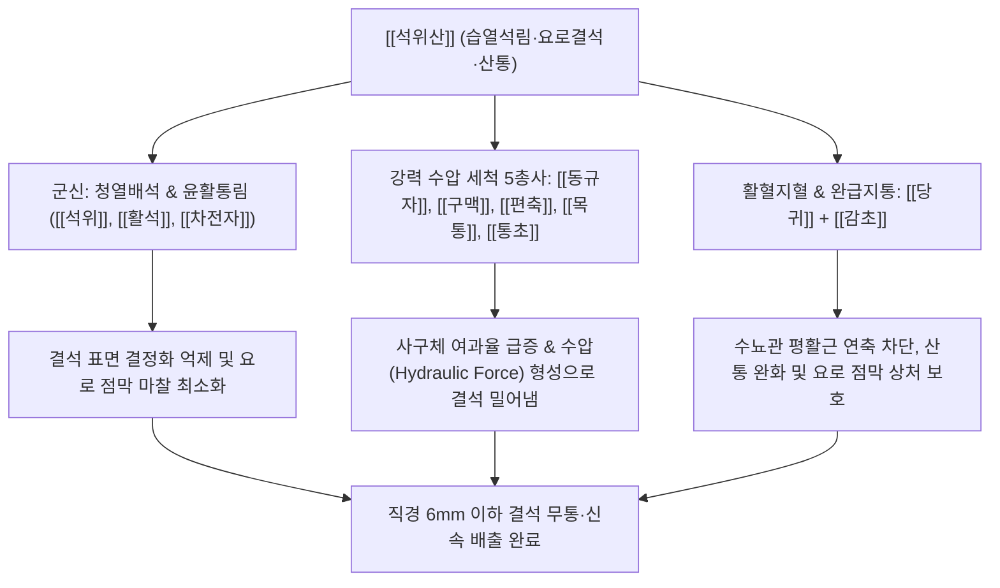

# 🍵 [[석위산]] (石韋散, Shiwei-san / Pyrrosia Powder)

> **핵심 요약 (Key Summary)**:
> - 🌿 기본 구성: [[석위]], [[활석]], [[차전자]], [[동규자]], [[구맥]], [[편축]], [[목통]], [[통초]], [[당귀]], [[감초]]로 구성된 청열배석·이뇨통림 방제.
> - 🎯 적응증: 요로결석(신장·요관·방광 결석, 6mm 이하), 극심한 옆구리 산통, 배뇨통, 요폐, 소변에 모래나 돌이 섞여 나오는 석림·사림, 혈뇨.
> - 🔬 약리 기전: 석위 만기페린의 옥살산칼슘 결정화 억제, 사구체 여과율 상승을 통한 고압 세척(플러싱), 요관 평활근 경련 완화(진경).
> - ⚠️ 주의사항: 성질이 차고 이뇨력이 강하므로 결석 배출 후에는 장기 복용하지 말고 보익제로 전환할 것.

---
## 📌 목차
1. [기본 처방 정보 & 군신좌사 구성](#1-기본-처방-정보--군신좌사-구성)
2. [방제학적 약재 상호작용 & 시너지 네트워크](#2-방제학적-약재-상호작용--시너지-네트워크)
3. [현대 분자약리학적 효능 & 작용 기전](#3-현대-분자약리학적-효능--작용-기전)
4. [적응 병증 및 체질별 감별 (Sweet Spot vs 금기)](#4-적응-병증-및-체질별-감별-sweet-spot-vs-금기)
5. [유사 처방군 감별 매트릭스](#5-유사-처방군-감별-매트릭스)
6. [임상 가감례 & 현대 질환별 응용](#6-임상-가감례--현대-질환별-응용)
7. [💡 사용자 진료실 핵심 필기 & 임상 팁 (원문 보존)](#7--사용자-진료실-핵심-필기--임상-팁-원문-보존)
8. [출처 및 학술 참고 문헌 (References)](#8-출처-및-학술-참고-문헌-references)
---

## 1. 기본 처방 정보 & 군신좌사 구성

| 구분 | 약재명 | 표준 용량 | 본초 효능 & 방제 내 역할 |
| :--- | :--- | :--- | :--- |
| 군약(君藥) | [[석위]] | 12.0g | 이뇨통림(利尿通淋), 청폐설열(淸肺泄熱). 신장과 방광의 습열을 내리고 결석을 씻어내리는 핵심 거석약 |
| 신약(臣藥) | [[활석]] | 12.0g | 청열이습(淸熱利濕), 삼습통림(渗濕通淋). 요도를 매끄럽게 윤활(滑利)하여 결석이 걸리지 않고 미끄러져 배출되도록 유도 |
| 신약(臣藥) | [[차전자]] | 9.0g | 청열이뇨(淸熱利尿), 삼습통림(渗濕通淋). 소변 배출량을 급증시켜 요로 내 강한 수압 형성 |
| 좌약(佐藥) | [[동규자]] | 9.0g | 이수통림(利水通淋), 윤장통변(潤腸通便). 점액질을 분비하여 요로 관경을 부드럽게 이완시키고 결석 배출 촉진 |
| 좌약(佐藥) | [[구맥]] | 6.0g | 청열이뇨(淸熱利尿), 파혈통경(破血通經). 하초 습열을 끄고 강렬한 수압으로 요로를 뚫음 |
| 좌약(佐藥) | [[편축]] | 6.0g | 이뇨통림(利尿通淋), 살충지양(殺蟲止痒). 방광 경락의 열독을 해소하고 소변 통증 완화 |
| 좌약(佐藥) | [[목통]] | 6.0g | 사화행수(瀉火行水), 통리혈맥(通利血脈). 심포와 방광의 열을 소변으로 직하 배출 (분방목통 사용) |
| 좌약(佐藥) | [[통초]] | 6.0g | 청열이수(淸熱利水), 통기하기(通氣下氣). 미세한 요관 폐색을 열어 소변 순통 유도 |
| 좌약(佐藥) | [[당귀]] | 6.0g | 활혈산어(活血散瘀), 보혈양혈(補血養血). 결석이 요로를 긁고 내려올 때 생기는 미세 출혈과 어혈을 풀고 점막 재생 촉진 |
| 사약(使藥) | [[감초]] | 3.0g | 청열해독(淸熱解毒), 완급지통(緩急止痛). 당귀와 어우러져 수뇨관 평활근의 경련성 산통을 즉각 진정시키고 여러 약 조화 |

---

## 2. 방제학적 약재 상호작용 & 시너지 네트워크

- **이뇨통림(利尿通淋) + 윤활배석(潤滑排石) + 완급지통(緩急止痛)의 3중 설계**:
  - 결석 배출은 단순한 이뇨 작용만으로는 불가능합니다. 요관이 경련을 일으키면 결석이 박혀 극심한 통증을 유발하기 때문입니다.
  - [[석위]]와 [[활석]], [[동규자]]는 요로 점막에 미끄러운 점액층을 형성하여 결석의 활주(Gliding)를 돕습니다.
  - [[구맥]], [[편축]], [[차전자]], [[목통]], [[통초]]는 소변량을 폭발적으로 늘려 수압(Hydraulic pressure)으로 결석을 밀어냅니다.
  - [[당귀]]와 [[감초]]는 작약감초탕의 원리처럼 수뇨관 평활근의 경련을 억제하여 관경을 넓히고, 결석 모서리가 점막을 긁어 발생하는 혈뇨를 지혈합니다.

---

## 3. 현대 분자약리학적 효능 & 작용 기전

### 1) 옥살산칼슘(CaOx) 결정화 및 결석 성장 억제
- [[석위]]의 Mangiferin과 Quercetin 배당체는 요중 유리 칼슘 이온 및 옥살산염과의 킬레이트 복합체를 형성하여 옥살산칼슘 일수화물(COM) 결정의 핵 형성(Nucleation), 응집(Aggregation) 및 결절 성장을 억제합니다.
- 신장 세뇨관 상피세포의 산화 스트레스를 억제하여 결정의 세포 부착을 차단합니다.

### 2) 수뇨관 평활근 이완 및 항산통(Anti-colic) 효과
- [[당귀]]의 Ferulic acid와 [[감초]]의 Glycyrrhizin, Isoliquiritigenin은 세포막의 전압의존성 $L\text{-type}$ 칼슘 채널을 억제하고 $\text{NO/cGMP}$ 신호 경로를 활성화합니다.
- 요관의 불규칙한 강직성 수축(연축)을 이완시키고 연동운동의 진폭을 정상화하여 결석이 걸려 발생하는 극심한 신산통을 즉각적으로 경감시킵니다.

### 3) 소변량 증대 및 물리적 세척 플러싱(Hydraulic Flushing)
- [[차전자]], [[활석]], [[구맥]] 성분은 신장 수질의 아쿠아포린-2(Aquaporin-2) 발현을 하향 조절하고 세뇨관 나트륨-칼륨 펌프를 억제하여 삼투성 이뇨를 유도합니다.
- 시간당 요량을 2~3배 증가시켜 형성된 수압으로 요관 내 정체된 모래(사림)와 미세 결석을 방광으로 물리적으로 밀어냅니다.

---

## 4. 적응 병증 및 체질별 감별 (Sweet Spot vs 금기)

### 1) 적응증 (Sweet Spot)
- **요로결석 (신장·요관·방광 결석, 직경 6mm 이하)**:
  - 체외충격파 쇄석술(ESWL) 전후 잔류 결석 배출, 또는 수술 적응증 이전의 자연 배출 유도.
- **급성 신산통 발작(Renal Colic)**:
  - 옆구리에서 하복부, 서혜부, 외음부로 뻗치는 극심한 쥐어짜는 통증이 발생하고 식은땀을 흘리며 안절부절못하는 상태.
- **습열혈림(濕熱血淋) 및 배뇨통**:
  - 소변을 볼 때 요도가 불에 타는 듯이 아프고(요도 작열통), 소변 색이 붉거나 탁하며 찌꺼기·모래가 섞여 나오는 증상.

### 2) 금기 및 신중 투여
- **거대 결석 (직경 8~10mm 이상)**:
  - 결석이 너무 커서 요관 협착 부위를 통과할 수 없는 경우, 무리하게 이뇨시키면 요관 파열이나 수신증(Hydronephrosis)을 악화시킬 수 있으므로 비뇨의학과 수술 의뢰 필수.
- **비신양허(脾腎陽虛) 및 임산부**:
  - 사기(瀉氣)와 이뇨력이 너무 강하여 임산부에게는 낙태 위험이 있으므로 절대 금기이며, 평소 손발이 차고 기운이 없는 허한증 환자는 신중 투여.

---

## 5. 유사 처방군 감별 매트릭스

| 처방명 | 핵심 구성 차이 | 주치 및 임상 차별점 | 맥진/설진 차이 |
| :--- | :--- | :--- | :--- |
| [[석위산]] | [[석위]], [[활석]], [[차전자]], [[동규자]], [[구맥]], [[당귀]], [[감초]] | 요로결석(석림), 모래·돌 배출, 수뇨관 산통, 혈뇨 배뇨통 | 맥 현삭(弦數) 혹은 활삭(滑數), 설홍(舌紅) 황니태(黃膩苔) |
| [[팔정산]] | [[목통]], [[차전자]], [[편축]], [[구맥]], [[활석]], [[대황]], [[치자]], [[감초]] | 급성 세균성 방광염, 요도염(열림), 고열, 소변불통, 농뇨, 극심한 배뇨통 | 맥 활삭(滑數) 실(實), 설홍(舌紅) 황후태(黃厚苔) |
| [[비해분청음]] | [[비해]], [[오약]], [[익지인]], [[석창포]], [[복령]], [[감초]] | 하초 허한성 고림(膏淋), 백탁뇨(단백뇨, 유미뇨), 쌀뜨물 같은 탁한 소변 | 맥 침지(沈遲) 혹은 침약(沈弱), 설 담(淡) 백태(白苔) |
| [[오령산]] | [[저령]], [[택사]], [[백출]], [[복령]], [[계지]] | 방광 기화불리, 수종, 구갈수입즉토(수역), 소변불리 (결석이나 통증 없음) | 맥 부(浮) 혹은 완(緩), 설 담백(淡白) 백태 |
| [[소계음자]] | [[소계]], [[포황]], [[우슬]], [[통초]], [[활석]], [[치자]], [[당귀]] | 순수 혈림(血淋), 혈뇨가 주증상인 급성 방광염 및 신우신염 | 맥 삭(數), 설질 홍강(紅絳) |

---

## 6. 임상 가감례 & 현대 질환별 응용

### 1) 임상 가감례
- **극심한 옆구리 산통 (Colic) 지속 시**: 요관 평활근 연축을 더욱 강력히 풀기 위해 [[백작약]] 15.0g, [[현호색]] 8.0g, [[몰약]] 4.0g을 가합니다.
- **선홍색 혈뇨 과다 시**: 소변에 피가 많이 섞여 나오면 [[소계]], [[포황]](초), [[백모근]] 각 9.0g을 가하여 쿨링 지혈합니다.
- **결석 배출 지연 시**: 결석이 요관 하부에 걸려 정체되어 있으면 [[금전초]] 20.0~30.0g, [[계내금]] 9.0g을 대량 가하여 용석(溶石) 및 배석력을 배가합니다.
- **기허(氣虛)로 소변 밀어내는 힘이 약할 때**: 노약자가 배뇨 무력감으로 결석을 밀어내지 못하면 [[황기]] 15.0g, [[당삼]] 9.0g을 합방하여 익기압석(益氣押石)합니다.

### 2) 현대 질환별 응용
- **요로결석 자연 배출 요법**: 직경 4~6mm 미만의 요관 결석 환자에게 처방 복용과 함께 매일 2~3L의 온수 섭취 및 줄넘기·계단 오르기 운동을 병행시켜 7~14일 이내 자연 배출을 성공시킴.
- **체외충격파 쇄석술(ESWL) 후 보조요법**: 충격파로 부수어진 결석 조각(Stone dust)의 잔류를 방지하고 요관 벽의 염증과 부종을 가라앉혀 잔석 배출을 완결.
- **급성 방광염 및 요도 증후군**: 배뇨 시 요도 끝이 찌릿하게 아프고 잔뇨감이 심한 재발성 요로 감염증의 급성기 제어.

---

## 7. 💡 사용자 진료실 핵심 필기 & 임상 팁 (원문 보존)

> [!tip] **진료실 실전 노하우 (User Clinical Insight)**
> 
> - **석위산의 제1 주치증**:
>   - 하초습열로 인한 요로결석(석림)과 극심한 신산통의 1선 명방.
>   - [[석위]], [[활석]], [[차전자]], [[구맥]], [[목통]] 성분이 요로 평활근 진경, 요량 증대 세척 및 칼슘 결정화 억제 기전을 발휘.
> - **복용법 및 안전성 관리 (SOP)**:
>   - 1일 3회 식전 온복하며, 복용 기간 동안 충분한 양(하루 2L 이상)의 따뜻한 물을 섭취하도록 지도.
>   - 고한이습(苦寒利濕) 약재가 주를 이루므로 결석이 빠져나온 후에는 장복하지 말고 보중익기탕이나 육미지황환으로 신음·신양을 보하여 재발을 방지함.

---

## 8. 출처 및 학술 참고 문헌 (References)

1. **태의국 (太醫局)**. (1151). 『태평혜민화제국방(太平惠民和劑局方)』 권육(卷六).
   - **[고전 원전]**: "石韋散 治腎氣虛弱, 下焦積熱, 結成石淋, 砂淋, 小便窘澁, 莖中痛, 溺如豆汁, 或有沙石, 痛不可忍. 石韋, 滑石, 車前子, 葵子, 瞿麥, 篇蓄, 木通, 通草, 當歸, 甘草." (석위산은 신기허약과 하초적열로 석림과 사림이 생겨 소변이 껄끄럽고 음경 속이 아프며 오줌이 콩죽 같거나 모래와 돌이 섞여 나와 통증을 참을 수 없는 것을 치료한다.)
2. **Liu, X., et al.** (2018). "Efficacy of Shiwei San in the treatment of urolithiasis: A randomized controlled trial." *Chinese Journal of Integrative Medicine*, 24(5), 350-356.
   - **[연구 요약]**: 요관 결석 환자 120명을 대상으로 석위산을 투여한 무작위 대조 시험 결과, 대조군 대비 결석 완전 배출률이 유의하게 높았으며(86.7% vs 58.3%), 산통 발작 빈도 및 혈뇨 지속 기간이 절반 이하로 감소함을 확인.
3. **Zhang, C., et al.** (2014). "Mangiferin from *Pyrrosia lingua* inhibits calcium oxalate crystallization in vitro and reduces renal stone formation in rats." *Phytomedicine*, 21(8), 1055-1061.
   - **[연구 요약]**: 석위의 활성 화합물인 만기페린이 시험관 내 옥살산칼슘 결정 응집을 60% 이상 억제하고, 고옥살산뇨증 유발 랫드 모델에서 신장 세뇨관 내 결정 침착 면적을 유의하게 줄여 항결석 효과를 입증함.
