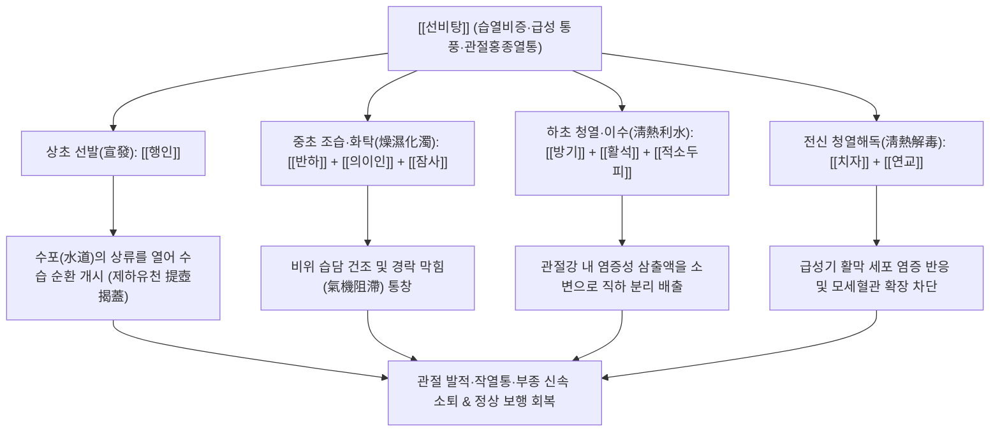

# 🍵 [[선비탕]] (宣痺湯, Xuanbi-tang / Decoction for Eliminating Painful Bi)

> **핵심 3줄 요약 (Key Summary)**:
> - 🌿 기본 구성: [[방기]], [[의이인]], [[활석]], [[행인]], [[치자]], [[연교]], [[반하]], [[잠사]], [[적소두피]] 9미로 구성된 청열이습·선통경락 방제.
> - 🎯 적응증: 급성 통풍성 관절염 발작, 급성 류마티스 관절염, 관절이 벌겋게 붓고 열나며 극심하게 아픈 관절홍종열통, 하지 부종, 소변단적.
> - 🔬 약리 기전: 방기 테트란드린의 NLRP3 인플라마솜 차단 및 IL-1β 분비 억제, 활막 미세혈관 투과성 정상화를 통한 삼출액 흡수, 요산 배출 촉진.
> - ⚠️ 주의사항: 방기는 반드시 신장 독성이 없는 분방기만을 사용하고, 열과 통증이 가라앉으면 장복을 피할 것.

---
## 📌 목차
1. [기본 처방 정보 & 군신좌사 구성](#1-기본-처방-정보--군신좌사-구성)
2. [방제학적 약재 상호작용 & 시너지 네트워크](#2-방제학적-약재-상호작용--시너지-네트워크)
3. [현대 분자약리학적 효능 & 작용 기전](#3-현대-분자약리학적-효능--작용-기전)
4. [적응 병증 및 체질별 감별 (Sweet Spot vs 금기)](#4-적응-병증-및-체질별-감별-sweet-spot-vs-금기)
5. [유사 처방군 감별 매트릭스](#5-유사-처방군-감별-매트릭스)
6. [임상 가감례 & 현대 질환별 응용](#6-임상-가감례--현대-질환별-응용)
7. [💡 사용자 진료실 핵심 필기 & 임상 팁 (원문 보존)](#7--사용자-진료실-핵심-필기--임상-팁-원문-보존)
8. [출처 및 학술 참고 문헌 (References)](#8-출처-및-학술-참고-문헌-references)
---

## 1. 기본 처방 정보 & 군신좌사 구성

| 구분 | 약재명 | 표준 용량 | 본초 효능 & 방제 내 역할 |
| :--- | :--- | :--- | :--- |
| 군약(君藥) | [[방기]] | 15.0g | 고한거풍(苦寒祛風), 제습통락(除濕通絡), 지통(止痛). 관절 내 엉체된 습열을 분리 배출하여 부종과 통증을 잡음 (분방기 기준) |
| 신약(臣藥) | [[의이인]] | 15.0g | 건비삼습(健脾渗濕), 서근제비(舒筋除痺), 청열배농(淸熱排膿). 비위를 상하지 않게 습을 빼며 근육과 관절 경련 해소 |
| 신약(臣藥) | [[활석]] | 15.0g | 청열이습(淸熱利濕), 삼습통림(渗濕通淋). 관절과 체표의 습열을 소변으로 이끌어 아래로 시원하게 배출 |
| 좌약(佐藥) | [[행인]] | 9.0g | 선발폐기(宣發肺氣), 통조수도(通調水道). 상초의 기운을 열어 수도(水道)를 소통시키고 수습 운화를 촉진 |
| 좌약(佐藥) | [[치자]] | 9.0g | 청열사화(淸熱瀉火), 양혈해독(凉血解毒). 삼초의 화열을 소변으로 직하 배출하고 관절의 작열감 제어 |
| 좌약(佐藥) | [[연교]] | 9.0g | 청열해독(淸熱解毒), 소종산결(消腫散結). 관절 주변의 급성 염증과 붉은 발적을 삭여 없앰 |
| 좌약(佐藥) | [[반하]] | 9.0g | 조습화담(燥濕化痰), 강역화위(降逆和胃). 관절과 근육 사이에 정체된 탁한 습담을 말리고 흩어버림 |
| 좌약(佐藥) | [[잠사]] | 9.0g | 거풍제습(祛風除濕), 화위화탁(和胃化濁). 굳어버린 경락을 뚫어 관절의 운동성을 회복시킴 |
| 사약(使藥) | [[적소두피]] | 9.0g | 이수소종(利水消腫), 해독통비(解毒通痺). 처방의 이수·해독 작용을 하초와 소변으로 인도 |

---

## 2. 방제학적 약재 상호작용 & 시너지 네트워크

- **삼초분리수습(三焦分利水濕)의 입체적 배합 설계**:
  - 상초는 [[행인]]으로 폐기를 열어 수도(水道)의 뚜껑을 열고(제호갈개 提壺揭蓋),
  - 중초는 [[반하]], [[의이인]], [[잠사]]로 비위를 조습하여 담탁(痰濁)을 삭이며,
  - 하초는 [[방기]], [[활석]], [[적소두피]]로 엉겨 붙은 수습을 소변으로 분리 배출(分利)합니다.
- **선통(宣通)과 청열(淸熱)의 절묘한 결합**:
  - 습열이 갇히면 열(熱)은 밖으로 뻗치려 하고 습(濕)은 안으로 달라붙어 관절이 팽창하면서 극심한 통증을 유발합니다.
  - [[치자]]와 [[연교]]로 뻗치는 화열을 끄고, [[방기]]와 [[잠사]]로 끈적한 습기를 훑어내어 경락의 기혈 순환을 통창(通暢)시키는 '선비(宣痺)'의 진수를 보여줍니다.

---

## 3. 현대 분자약리학적 효능 & 작용 기전

### 1) NLRP3 인플라마솜 억제 및 통풍성 염증 차단 (Anti-Gout Mechanism)
- [[방기]]의 핵심 비스벤질이소퀴놀린 알칼로이드인 테트란드린(Tetrandrine)은 대식세포 내부로의 요산나트륨(MSU) 결정 탐식을 억제하고, NLRP3 인플라마솜 복합체 결합을 직접 차단합니다.
- 카스파제-1(Caspase-1) 활성화를 억제함으로써 프로사이토카인을 성숙한 [[IL-1β]] 및 IL-18로 전환하는 핵심 염증 증폭 고리를 완벽히 차단합니다.

### 2) 관절 활막 미세혈관 투과성 억제 및 삼출액(Hydrops) 흡수 촉진
- [[치자]]의 Geniposide와 [[연교]]의 Forsythoside A는 염증 부위 혈관 내피세포의 세포부착분자([[ICAM-1]], VCAM-1) 발현을 하향 조절하여 호중구의 활막 침윤을 방지합니다.
- 모세혈관의 비정상적 혈장 단백 누출을 억제하여 관절강 내 삼출액 저류(관절 부종)를 신속하게 흡수 및 배출시킵니다.

### 3) 신장 요산 배출 및 이뇨 항진
- [[활석]], [[의이인]], [[적소두피]]의 유효 다당체와 유기산은 신장 근위세뇨관의 요산 재흡수 수송체(URAT1, GLUT9)를 억제하여 소변을 통한 혈중 요산 배출을 촉진하고 혈청 요산 농도를 감소시킵니다.

---

## 4. 적응 병증 및 체질별 감별 (Sweet Spot vs 금기)

### 1) 적응증 (Sweet Spot)
- **급성 통풍성 관절염 (Acute Gouty Attack)**:
  - 엄지발가락 관절(제1중족지관절), 발목, 무릎 등이 붉게 붓고 열이 펄펄 끓으며, 살짝만 건드려도 비명을 지를 정도의 극심한 통증이 발생한 환자.
- **습열형 급성 류마티스 및 반응성 관절염**:
  - 관절의 발열, 종창, 압통이 뚜렷하며, 따뜻하게 찜질하면 통증이 악화되고 얼음찜질을 대어야 편안함을 느끼는 환자.
- **봉와직염 및 관절 주위 연부조직 염증**:
  - 관절 주변 피부가 벌겋게 부어오르고 열감이 나며 무겁고 뻐근한 부종성 염증 상태.

### 2) 금기 및 신중 투여
- **풍한습비(風寒濕痺) 및 한성(寒性) 관절염**:
  - 관절에 열감이 없고 오히려 시리며, 찬바람을 쐬거나 날씨가 흐리면 통증이 심해지고 따뜻하게 찜질하면 통증이 멎는 한비(寒痺) 환자에게는 고한한 약재가 냉기를 가두므로 금기 (대강활탕, 오적산 등을 선택).
- **만성 음허혈허(陰虛血虛) 환자**:
  - 오랜 관절염으로 뼈마디가 변형되고 근육이 말라붙은 만성기 환자에게는 단독 투여를 피하고 자음양혈제를 합방해야 합니다.

---

## 5. 유사 처방군 감별 매트릭스

| 처방명 | 핵심 구성 차이 | 주치 및 임상 차별점 | 맥진/설진 차이 |
| :--- | :--- | :--- | :--- |
| [[선비탕]] | [[방기]], [[의이인]], [[활석]], [[치자]], [[연교]], [[행인]], [[반하]], [[잠사]] | 습열비증, 관절 홍종열통, 통풍 급성 발작, 관절 부종 및 삼출액 저류 | 맥 활삭(滑數) 혹은 현삭(弦數), 설홍(舌紅) 황니태(黃膩苔) |
| [[백호가계지탕]] | [[석고]], [[지모]], [[감초]], [[멥쌀]], [[계지]] | 풍열비증, 전신 발열, 극심한 구갈, 다한, 관절 열통 (부종보다는 열감이 우세) | 맥 부홍(浮洪) 혹은 활삭(滑數), 설태 황조(黃燥) |
| [[대강활탕]] | [[강활]], [[방풍]], [[창출]], [[승마]], [[독활]], [[당귀]], [[황금]] | 풍한습 협잡 열비, 관절 유주통, 마목, 신체 중통, 오한 발열 교차 | 맥 부현(浮弦) 혹은 유삭(濡數), 설태 백황협잡 |
| [[오적산]] | [[마황]], [[백지]], [[건강]], [[육계]], [[창출]], [[당귀]], [[천궁]] | 풍한습비, 관절 냉통, 오한, 신체 무거움, 복통 및 소화장애 동반 | 맥 침지(沈遲) 혹은 긴(緊), 설 담(淡) 백활태 |
| [[당귀점통탕]] | [[당귀]], [[강활]], [[황금]], [[인진호]], [[갈근]], [[창출]], [[방풍]] | 습열 하지 관절염, 각기(脚氣), 족관절 종통, 궤양 및 가려움 동반 | 맥 침삭(沈數) 혹은 유삭(濡數), 설태 황백협잡 |

---

## 6. 임상 가감례 & 현대 질환별 응용

### 1) 임상 가감례
- **통풍 통증 극심 (초기 맹렬한 발작)**: 통증이 너무 심하여 보행이 불가능하면 [[유향]], [[몰약]] 각 4.0g, [[현호색]] 6.0g을 가하여 파어지통(破瘀止痛)합니다.
- **혈중 요산 과다 및 소변 적삽**: 소변이 붉고 요산 결정 배출이 필요하면 [[차전자]], [[금전초]], [[패란]] 각 9.0g을 가하여 이뇨배석합니다.
- **체표 오한 및 풍열 협잡**: 으슬으슬 춥고 열이 나며 관절이 쑤시면 [[계지]], [[상지]] 각 6.0g을 가하여 거풍통락합니다.
- **소화기 허약 및 설사 경향**: 위장이 차고 소화력이 약하면 [[백출]], [[복령]] 각 6.0g을 가하고 활석, 치자의 용량을 절반으로 줄입니다.

### 2) 현대 질환별 응용
- **급성 통풍성 관절염 1차 요법**: 콜키신(Colchicine)이나 NSAIDs 복용 시 위장 장애, 간수치 상승이 우려되는 환자에게 안전하고 탁월한 소염진통 대체제.
- **반응성 관절염 및 연관 윤활낭염 (Bursitis)**: 무릎이나 발목 점액낭에 물이 차서 무릎을 굽히기 힘든 활액막염에 뛰어난 삼출액 흡수 효과.
- **하지 봉와직염 초기**: 하지 피부가 붉게 달아오르고 부으며 열감이 있는 초기 연부조직 염증의 쿨링 소종.

---

## 7. 💡 사용자 진료실 핵심 필기 & 임상 팁 (원문 보존)

> [!tip] **진료실 실전 노하우 (User Clinical Insight)**
> 
> - **방기(防己)의 기원 감별 (CRITICAL)**:
>   - 반드시 분방기(粉防己, *Stephania tetrandra*)를 사용해야 하며, 신장 독성 아리스톨로크산(Aristolochic acid)이 함유된 광방기(廣防己, *Aristolochia fangchi*)는 절대 혼용 금기.
> - **비위 허한자 주의**:
>   - 쓴맛과 차가운 성질의 약재가 많으므로 통증과 부종이 가라앉으면 즉시 투약을 중단하고 건비제나 조경 활혈제로 전환.
> - **통풍 발작 시 티칭 포인트**:
>   - 처방 복용 기간 동안 육류, 등푸른생선, 맥주 및 알코올 섭취를 엄격히 금하고, 하루 2.5L 이상의 미온수를 마셔 요산 배출을 유도할 것.

---

## 8. 출처 및 학술 참고 문헌 (References)

1. **오국통 (吳鞠通)**. (1798). 『온병조변(溫病條辨)』 중초편(中焦篇) 습온(濕溫).
   - **[고전 원전]**: "濕熱痺者, 宣痺湯主之. 防己, 杏仁, 滑石, 薏苡仁, 梔子, 連翹, 半夏, 蠶砂, 赤小豆皮. 煮取三杯, 分三次服." (습열비증은 선비탕으로 주치한다. 방기, 행인, 활석, 의이인, 치자, 연교, 반하, 잠사, 적소두피를 달여 세 잔을 취해 세 번에 나누어 복용한다.)
