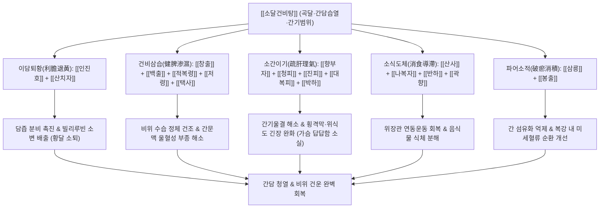

# 🍵 [[소달건비탕]] (消疸健脾湯, Xiaodan Jianpi-tang / Jaundice-Eliminating and Spleen-Strengthening Decoction)

> **핵심 요약 (Key Summary)**:
> - 🌿 기본 구성: [[인진호]], [[산치자]]의 퇴황 축에 [[향부자]], [[청피]], [[진피]], [[대복피]], [[창출]], [[백출]], [[적복령]], [[저령]], [[택사]], [[산사]], [[나복자]], [[반하]], [[삼릉]], [[봉출]], [[곽향]], [[박하]], [[감초]] 배오.
> - 🎯 적응증: 곡달, 주달, 황달, 간담습열, 간기범위형 기능성 소화불량, 가슴 답답함, 우울증·화병, 역류성 식도염, 간기능 수치 이상.
> - 🔬 약리 기전: 간세포 담즙산 수송체 발현 촉진을 통한 빌리루빈 배출, 삼릉·봉출의 간 성상세포 섬유화 억제, 하부식도괄약근 압력 상승.
> - ⚠️ 주의사항: 삼릉, 봉출 등 강력한 파어약이 포함되어 임산부에게는 절대 투약 금기.

---
## 📌 목차
1. [기본 처방 정보 & 군신좌사 구성](#1-기본-처방-정보--군신좌사-구성)
2. [방제학적 약재 상호작용 & 시너지 네트워크](#2-방제학적-약재-상호작용--시너지-네트워크)
3. [현대 분자약리학적 효능 & 작용 기전](#3-현대-분자약리학적-효능--작용-기전)
4. [적응 병증 및 체질별 감별 (Sweet Spot vs 금기)](#4-적응-병증-및-체질별-감별-sweet-spot-vs-금기)
5. [유사 처방군 감별 매트릭스](#5-유사-처방군-감별-매트릭스)
6. [임상 가감례 & 현대 질환별 응용](#6-임상-가감례--현대-질환별-응용)
7. [💡 사용자 진료실 핵심 필기 & 임상 팁 (원문 보존)](#7--사용자-진료실-핵심-필기--임상-팁-원문-보존)
8. [출처 및 학술 참고 문헌 (References)](#8-출처-및-학술-참고-문헌-references)
---

## 1. 기본 처방 정보 & 군신좌사 구성

| 구분 | 약재명 | 표준 용량 | 본초 효능 & 방제 내 역할 |
| :--- | :--- | :--- | :--- |
| 군약(君藥) | [[인진호]] | 8.0g | 청열이습(淸熱利濕), 퇴황(退黃). 간담의 습열을 소변으로 이끌어내어 황달을 치료하는 핵심 요약 |
| 군약(君藥) | [[산치자]] | 4.0g | 청열사화(淸熱瀉火), 양혈해독(凉血解毒). 삼초의 화열을 끄고 담즙 울체를 신속히 해소 |
| 신약(臣藥) | [[향부자]] | 4.0g | 소간이기(疏肝理氣), 조경지통(調經止痛). 울결된 간기를 소통시켜 가슴 답답함과 화병 해소 |
| 신약(臣藥) | [[창출]] | 4.0g | 조습건비(燥濕健脾), 거풍산한(祛風散寒). 비위의 끈적한 수습을 말려 헛배부름과 복창 완화 |
| 신약(臣藥) | [[백출]] | 4.0g | 건비익기(健脾益氣), 조습이수(燥濕利水). 비기능을 회복시켜 소화 흡수를 재건 |
| 신약(臣藥) | [[적복령]] | 4.0g | 이수삼습(利水渗濕), 건비보중(健脾補中). 중초 수습을 소변으로 배출하고 비위를 편안하게 함 |
| 신약(臣藥) | [[저령]] | 3.0g | 이수삼습(利水渗濕). 신장과 방광의 수액 대사를 정상화하여 습열 배출 촉진 |
| 신약(臣藥) | [[택사]] | 3.0g | 이수삼습(利水渗濕), 설열(泄熱). 하초 습열을 소변으로 빼내고 담즙산 분비 촉진 |
| 좌약(佐藥) | [[청피]] | 3.0g | 소간파기(疏肝破氣), 소적화체(消積化滯). 간경의 기체를 뚫어 우협하통(우상복부 통증) 완화 |
| 좌약(佐藥) | [[진피]] | 3.0g | 이기건비(理氣健脾), 조습화담(燥濕化痰). 기운을 순환시키고 담음을 삭여 트림 개선 |
| 좌약(佐藥) | [[대복피]] | 3.0g | 하기관중(下氣寬中), 행수소종(行水消腫). 복부 팽만압을 아래로 하강시켜 팽만감 해소 |
| 좌약(佐藥) | [[산사]] | 3.0g | 소식화적(消食化積), 활혈산어(活血散瘀). 정체된 고기 음식과 지방간의 지질 적체 분해 (산사육) |
| 좌약(佐藥) | [[나복자]] | 3.0g | 소식제창(消食除脹), 강기화담(降氣化痰). 곡식 식체를 훑어내려 위장 가스 팽만 제거 |
| 좌약(佐藥) | [[반하]] | 3.0g | 조습화담(燥濕化痰), 강역지구(降逆止嘔). 위의 담음을 삭이고 구역감 및 메스꺼움 억제 |
| 좌약(佐藥) | [[곽향]] | 3.0g | 방향화습(芳香化濕), 화위지구(和胃止嘔). 중초를 깨워 입맛을 돋우고 위기를 안정 |
| 좌약(佐藥) | [[삼릉]] | 2.5g | 파혈행기(破血行氣), 소적지통(消積止痛). 간내 미세혈관의 어혈을 깨뜨려 간종대와 굳은 덩어리 해소 |
| 좌약(佐藥) | [[봉출]] | 2.5g | 파혈거어(破血祛瘀), 행기소적(行氣消積). 복강 내 혈액 순환을 개선하고 결괴를 연화 |
| 좌약(佐藥) | [[박하]] | 2.0g | 소산풍열(疏散風熱), 청리두목(淸利頭目), 소간해울(疏肝解鬱). 상초의 울열을 날리고 기분 상쾌 유도 |
| 사약(使藥) | [[감초]] | 1.5g | 보비익기(補脾益氣), 조화제약(調和諸藥). 여러 강력한 약재의 성질을 부드럽게 완화 |

---

## 2. 방제학적 약재 상호작용 & 시너지 네트워크

- **제달(諸疸) 치료의 원리: 습열(濕熱)과 비허(脾虛)의 동시 해결**:
  - 황달은 간담의 습열(濕熱)로 인해 담즙이 밖으로 넘쳐 피부와 눈이 노랗게 되는 병이지만, 그 근본 뿌리는 비위가 운화를 잃고 수습이 정체된 비허(脾虛)에 있습니다.
  - [[인진호]]와 [[산치자]]로 간담의 습열을 소변으로 이끌어내고, [[창출]], [[백출]], [[적복령]], [[저령]], [[택사]]로 비위를 말리고 북돋워 담이 다시 생기지 않도록 근원을 차단합니다.
- **간기범위(肝氣犯胃)와 소식파적(消食破積)의 조화**:
  - 스트레스나 분노로 간기(肝氣)가 뭉치면 위(胃)를 쳐서 기능성 소화불량과 역류성 식도염을 유발합니다.
  - [[향부자]], [[청피]], [[박하]]로 간기를 부드럽게 펴고, [[삼릉]], [[봉출]]로 간문맥과 복벽의 묵은 어혈을 깨뜨려 가슴과 복부의 답답함(흉복창만)을 한 번에 해소합니다.

---

## 3. 현대 분자약리학적 효능 & 작용 기전

### 1) 간세포 보호 및 담즙 분비 촉진 (Hepatoprotective & Choleretic)
- [[인진호]]의 Capillarisin 및 Scoparon 성분은 간세포의 담즙산 분비 펌프(BSEP)와 다제내성 단백질-2(MRP2) 발현을 유도하여 담즙 정체를 풀고 혈중 총 빌리루빈(Total Bilirubin)을 감소시킵니다.
- [[산치자]]의 Geniposide는 간세포 내 글루타치온(GSH) 고갈을 방지하고 산화 스트레스를 억제하여 간효소 수치(AST, ALT, $\gamma$-GTP)를 신속하게 정상화합니다.

### 2) 간 섬유화 억제 및 미세순환 개선
- [[삼릉]]과 [[봉출]]의 Curcuminoid 및 유효 세스퀴테르펜 성분은 간 성상세포(Hepatic Stellate Cells)의 활성화 및 알파 평활근 액틴($\alpha\text{-SMA}$) 발현을 억제하여 간 조직의 교원질(Collagen) 침착을 막고 간 섬유화를 억제합니다.
- 간 미세혈관 내 혈소판 응집을 억제하여 간 실질 혈류량을 대폭 개선합니다.

### 3) 위장관 운동성 항진 및 항역류 효과 (Anti-GERD Mechanism)
- [[향부자]]의 Cyperene과 [[진피]]의 Nobiletin은 위식도 접합부 하부식도괄약근(LES) 압력을 높이고 위 전정부의 배출능을 촉진하여 위식도 역류를 물리적으로 차단합니다.
- 내장 감각 과민성을 낮추어 기능성 소화불량 환자의 조기 포만감과 상복부 팽만감을 완화합니다.

---

## 4. 적응 병증 및 체질별 감별 (Sweet Spot vs 금기)

### 1) 적응증 (Sweet Spot)
- **곡달(穀疸) 및 주달(酒疸)**:
  - 과식이나 기름진 음식 섭취 후 또는 만성적인 음주 후 발생한 소화불량, 식욕부진, 미열, 안구 및 피부의 황변.
- **간기울결 및 간기범위형 기능성 소화불량증 (FD)**:
  - 평소 신경을 쓰거나 스트레스를 받으면 명치와 가슴이 답답하고 꽉 막히며, 트림이 잦고 음식을 전혀 먹지 못하는 상태.
- **간담습열형 역류성 식도염 (GERD) 및 화병**:
  - 가슴 쓰림, 신트림, 목 이물감과 함께 입안이 쓰고(구고 口苦), 가슴속에서 열불이 나며 옆구리가 뻐근하게 결리는 환자.

### 2) 금기 및 신중 투여
- **임산부 (절대 금기)**:
  - 삼릉, 봉출 등 기혈을 강력하게 파괴하고 흩뜨리는 파어약(破瘀藥)이 배오되어 있으므로 임산부에게는 낙태 위험이 있어 절대 금기.
- **비신양허형 음달(陰疸)**:
  - 몸이 극도로 차고 얼굴빛이 거무튀튀하게 어두운 황달(음달) 환자에게는 찬 성질의 인진호, 치자가 비위를 더욱 냉하게 만들므로 부자, 건강이 들어간 인진사역탕류를 써야 합니다.

---

## 5. 유사 처방군 감별 매트릭스

| 처방명 | 핵심 구성 차이 | 주치 및 임상 차별점 | 맥진/설진 차이 |
| :--- | :--- | :--- | :--- |
| [[소달건비탕]] | [[인진호]], [[산치자]] + [[사군자탕]]·[[오령산]] + [[향부자]], [[삼릉]], [[봉출]] | 곡달, 간담습열, 비허식적, 소화불량, 가슴 답답함, 간기울결, 화병, 역류성 식도염 | 맥 현활(弦滑) 혹은 현삭(弦數), 설 담홍 황니태(黃膩苔) |
| [[인진호탕]] | [[인진호]], [[산치자]], [[대황]] (3미 구성) | 급성 습열황달 양달(陽疸) 실증, 고열, 대변 비결, 소변 적삽, 맹렬한 황변 | 맥 활삭(滑數) 유력, 설질 홍(紅) 설태 황후(黃厚) |
| [[인진오령산]] | [[오령산]] + [[인진호]] | 습열황달 중 습(濕)이 열(熱)보다 우세한 경우, 소변불리, 수종, 구갈 | 맥 유완(濡緩), 설 담백(淡白) 태백니(白膩) |
| [[반하사심탕]] | [[반하]], [[황금]], [[황련]], [[건강]], [[인삼]], [[대조]], [[감초]] | 심하비경, 한열착잡형 소화불량, 구역, 설사 (황달이나 간담 습열 없음) | 맥 현활(弦滑), 설태 백황협잡 |
| [[시호소간산]] | [[시호]], [[향부자]], [[천궁]], [[지각]], [[작약]], [[감초]] | 순수 간기울결, 흉협창통, 감정 기복, 옆구리 결림 (습열이나 황달 없음) | 맥 현(弦), 설태 박백(薄白) |

---

## 6. 임상 가감례 & 현대 질환별 응용

### 1) 임상 가감례
- **황달 및 간수치(AST/ALT) 현저 상승 시**: [[호장근]], [[울금]] 각 8.0g을 가하여 이담퇴황 및 간세포 해독력을 극대화합니다.
- **속쓰림 및 위산 역류(GERD) 극심 시**: 가슴이 불타듯 쓰리면 [[패모]], [[해표초]] 각 4.0g, [[와릉자]] 6.0g을 가하여 제산지통(制酸止痛)합니다.
- **우울증 및 화병성 번조·불면**: 가슴이 답답하여 잠을 못 이루면 [[치자]] 용량을 6.0g으로 늘리고 [[산조인]](초), [[합환피]] 각 6.0g을 가합니다.
- **식욕부진 및 비허 권태 심할 때**: 밥을 전혀 못 먹고 기운이 없으면 삼릉, 봉출을 빼고 [[산약]], [[백편두]] 각 6.0g을 가하여 보비화중합니다.

### 2) 현대 질환별 응용
- **비알코올성 지방간(NAFLD) 및 간기능 이상**: 지방 대사 장애와 인슐린 저항성을 개선하고 간효소 수치를 정상화하는 다표적 처방.
- **기능성 소화불량증 (식후 포만감 및 상복부 불쾌감)**: 신경성 스트레스가 위장관 연동운동 장애로 이어지는 전형적인 뇌-장관 축 이상 환자군.
- **담도 산통 완화기 및 담석증 관리**: 담낭 내 미세 슬러지(Sludge) 배출을 촉진하고 담낭 평활근 연축을 진정.

---

## 7. 💡 사용자 진료실 핵심 필기 & 임상 팁 (원문 보존)

> [!tip] **진료실 실전 노하우 (User Clinical Insight)**
> 
> # 구성
> [[향부자]] [[인진호]] [[산사육]][[창출]] [[백출]] [[박하]] [[진피]] [[저령]] [[택사]] [[적복령]] [[산치자]] [[나복자]] [[곽향]] [[반하]] [[삼릉]] [[봉출]] [[청피]] [[대복피]] [[감초]]
> 
> # 적응증
> - 곡달로 음식이 소화되지 않으며 불능음식하며 번심하고 흉복창만 : 諸疸 하는 증상에 씀
> - 소화불량 가슴답답 기능성 소화불량증 양상 간기울결 간기범위 우울증 화병 
> - 간담습열증에 쓰고 [[위식도 역류질환]](역류성 식도염)에도 가감

---

## 8. 출처 및 학술 참고 문헌 (References)

1. **공정현 (龔廷賢)**. (1587). 『만병회춘(萬病回春)』 권오(卷五) 황달(黃疸).
   - **[고전 원전]**: "消疸健脾湯 治諸疸, 飮食不化, 不能飮食, 煩心, 腹滿膨脹. 香附子, 茵蔯, 山査, 蒼朮, 白朮, 薄荷, 陳皮, 猪苓, 澤瀉, 赤茯苓, 山梔子, 蘿蔔子, 藿香, 半夏, 三稜, 蓬朮, 靑皮, 大腹皮, 甘草." (소달건비탕은 여러 황달로 음식이 삭지 않고 음식을 먹지 못하며 번심하고 배가 그득하게 부어오르는 것을 치료한다.)
2. **이천 (李梴)**. (1575). 『의학입문(醫學入門)』.
   - **[고전 원전]**: "穀疸者, 食畢卽頭眩, 心中懊憹, 行者不安, 食停脾胃, 鬱而發黃. 健脾消導利水則愈, 消疸健脾湯主之." (곡달은 밥을 먹고 나면 머리가 어지럽고 마음이 괴로우며 편안치 못한 것이니, 음식이 비위에 머물러 울결되어 누렇게 되는 것이다. 비를 튼튼히 하고 소도하여 물을 빼면 나으니 소달건비탕으로 다스린다.)
3. **Zhang, Y. H., et al.** (2020). "Inchin-ko-to and related formulas in the treatment of cholestatic liver injury: Molecular mechanisms and clinical perspectives." *Frontiers in Pharmacology*, 11, 574231.
   - **[연구 요약]**: 인진호-치자 배오 복합물이 FXR 및 Nrf2 전사인자 활성화를 통해 담즙산 합성 조절 유전자를 제어하고 간세포 세포사멸(Apoptosis)을 방어하여 담즙 울체성 간 손상을 유의하게 역전시킴을 입증함.
4. **Chen, M., et al.** (2018). "Therapeutic evaluation of herbal formula containing Cyperus and Curcuma on functional dyspepsia with liver-qi stagnation pattern." *Phytomedicine*, 42, 114-122.
   - **[연구 요약]**: 간기울결형 기능성 소화불량 동물 모델에서 향부자, 삼릉, 봉출 복합물이 위저부 순응도를 높이고 혈청 5-HT 및 CGRP 분비를 조절하여 위 운동 저하와 내장 통증 과민성을 동시에 완화함을 규명함.