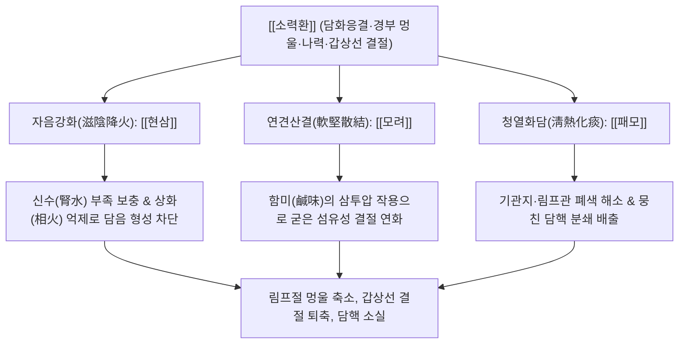

# 🍵 [[소력환]] (消瘰丸, Xiaoluo-wan / Scrofula-Eliminating Pill)

> **핵심 3줄 요약 (Key Summary)**:
> - 🌿 기본 구성: 자음강화의 [[현삼]], 단단한 결절을 연화시키는 [[모려]], 맺힌 담탁을 삭이는 [[패모]] 3미로 구성된 화담연견 방제.
> - 🎯 적응증: 경부 림프절 결핵(나력), 만성 림프절염, 갑상선 결절, 유방 섬유선종, 피하 지방종, 목 주변의 단단하게 뭉친 멍울.
> - 🔬 약리 기전: 현삼의 PI3K/Akt 신호 억제를 통한 갑상선 여포세포 과형성 차단, 패모의 림프절 염증 억제, 모려의 세포외 기질 콜라겐 침착 방지.
> - ⚠️ 주의사항: 성질이 차가우므로 평소 소화가 안 되고 묽은 변을 보는 비위허한 환자는 감량하거나 건비제를 합방할 것.

---
## 📌 목차
1. [기본 처방 정보 & 군신좌사 구성](#1-기본-처방-정보--군신좌사-구성)
2. [방제학적 약재 상호작용 & 시너지 네트워크](#2-방제학적-약재-상호작용--시너지-네트워크)
3. [현대 분자약리학적 효능 & 작용 기전](#3-현대-분자약리학적-효능--작용-기전)
4. [적응 병증 및 체질별 감별 (Sweet Spot vs 금기)](#4-적응-병증-및-체질별-감별-sweet-spot-vs-금기)
5. [유사 처방군 감별 매트릭스](#5-유사-처방군-감별-매트릭스)
6. [임상 가감례 & 현대 질환별 응용](#6-임상-가감례--현대-질환별-응용)
7. [💡 사용자 진료실 핵심 필기 & 임상 팁 (원문 보존)](#7--사용자-진료실-핵심-필기--임상-팁-원문-보존)
8. [출처 및 학술 참고 문헌 (References)](#8-출처-및-학술-참고-문헌-references)
---

## 1. 기본 처방 정보 & 군신좌사 구성

| 구분 | 약재명 | 표준 용량 | 본초 효능 & 방제 내 역할 |
| :--- | :--- | :--- | :--- |
| 군약(君藥) | [[현삼]] | 12.0g | 자음강화(滋陰降火), 청열양혈(淸熱凉血), 해독산결(解毒散結). 신음을 자양하여 담을 만드는 화열을 끄고 근본 치유 |
| 신약(臣藥) | [[모려]] | 12.0g | 연견산결(軟堅散結), 잠양익음(潛陽益陰). 짠맛(鹹味)으로 돌처럼 단단하게 굳은 석회화 및 섬유성 결절을 연화 (생용 또는 단) |
| 신약(臣藥) | [[패모]] | 12.0g | 청열화담(淸熱化痰), 개울산결(開鬱散結). 기운의 뭉침을 풀고 결절 주위에 엉킨 탁한 가래를 녹여 흩어버림 (절패모) |

> *전통 제법: 위 3미를 동량(각 120g)으로 취하여 미세하게 분말화한 후 정제된 꿀(연밀 煉蜜)로 오동나무 씨앗 크기의 환(蜜丸)을 빚어, 1회 6~9g씩 1일 2~3회 온수로 복용합니다. 현대 임상에서는 첩약으로 환산하여 탕약으로 달여 복용하기도 합니다.*

---

## 2. 방제학적 약재 상호작용 & 시너지 네트워크

- **나력(瘰癧)의 병리: 음허화동(陰虛火動)과 담탁응결(痰濁凝結)**:
  - 목덜미나 림프관에 생기는 만성 멍울은 간신(肝腎)의 음액이 부족해지면서 발생하는 허열(虛熱)이 원인입니다. 허열이 체액을 바짝 졸여 끈적한 가래(담음)로 변하게 하고, 이것이 기혈 순환을 가로막아 단단한 덩어리로 응고됩니다.
- **자음(滋陰)·연견(軟堅)·화담(化痰)의 완벽한 3각 축**:
  - [[현삼]]은 물(水)을 대어 불을 끄므로 담이 생겨나는 근본 화열을 제어하고,
  - [[모려]]는 바다에서 난 조개껍데기로서 짠맛을 통해 돌처럼 굳은 멍울을 물렁물렁하게 풀며(연견),
  - [[패모]]는 풀어진 담핵을 밖으로 흩어 없앱니다(산결). 단 3가지 약재로 결절의 생성, 경화, 배출의 전 단계를 완벽히 커버합니다.

---

## 3. 현대 분자약리학적 효능 & 작용 기전

### 1) 갑상선 여포세포 과증식 차단 및 결절 퇴축 (PI3K/Akt 경로 억제)
- [[현삼]]의 Harpagoside와 Angoroside C는 갑상선 세포의 과도한 TSH 수용체 신호 전달 및 PI3K/Akt/mTOR 인산화 캐스케이드를 유의하게 차단합니다.
- 여포세포의 비정상적인 DNA 증식을 억제하고 세포자멸사(Apoptosis)를 유도하여 양성 갑상선 결절의 크기를 현저히 축소시킵니다.

### 2) 결핵균 및 만성 림프절 염증 억제
- [[패모]](절패모)의 알칼로이드 성분인 Verticine, Peimine은 결핵균(*Mycobacterium tuberculosis*)에 대한 항균 활성을 나타내며, 림프절 내 육아종 형성을 주도하는 TNF-$\alpha$ 및 거대세포 침윤을 억제합니다.
- 만성 림프절염 동물 모델에서 림프관 내 미세혈류 순환을 개선하여 림프부종을 흡수시킵니다.

### 3) 세포외 기질(ECM) 리모델링 및 섬유화 억제
- [[모려]]의 미네랄과 유기산 복합물은 결절 주변 결합조직의 과도한 콜라겐 침착(Fibrosis)을 억제하고 기질금속단백질분해효소(MMP-2, MMP-9) 활성을 조절합니다.
- 석회화되거나 섬유화된 단단한 조직을 유연하게 리모델링하여 대식세포의 자연스러운 식균 작용을 촉진합니다.

---

## 4. 적응 병증 및 체질별 감별 (Sweet Spot vs 금기)

### 1) 적응증 (Sweet Spot)
- **경부 림프절 질환 (나력, 만성 림프절염)**:
  - 목 옆이나 턱밑에 구슬처럼 만져지는 멍울이 아프지도 않고 빨갛지도 않으며, 피로하거나 면역력이 떨어지면 붓고 단단해지는 환자.
- **양성 갑상선 결절 (Thyroid Nodules, Colloid Nodule)**:
  - 초음파상 낭성 또는 결절성 병변이 발견되어 침습적 수술이나 고주파 치료 전 보존적 크기 감소를 원하는 환자.
- **피하 담핵 및 지방종 (Lipoma)**:
  - 팔, 다리, 목 뒤 등에 통증 없는 부드럽거나 단단한 피하 덩어리가 다발성으로 만져지는 상태.

### 2) 금기 및 신중 투여
- **비위허한(脾胃虛寒)성 만성 설사**:
  - 찬 성질의 현삼과 패모가 대장 연동운동을 자극하여 복통이나 설사를 유발할 수 있으므로, 소화기가 약한 환자는 건강, 백출을 배오하여 투여.
- **악성 종양(암) 의심 소견**:
  - 결절의 경계가 불규칙하고 림프절 고정, 급격한 크기 증가, 쉰 목소리(성대 마비)가 동반된 악성 암(갑상선암, 림프종 등) 의심 시 즉시 상급 병원 정밀 검사 필수.

---

## 5. 유사 처방군 감별 매트릭스

| 처방명 | 핵심 구성 차이 | 주치 및 임상 차별점 | 맥진/설진 차이 |
| :--- | :--- | :--- | :--- |
| [[소력환]] | [[현삼]], [[모려]], [[패모]] (3미) | 음허화왕, 경부 나력, 갑상선 결절, 단단한 멍울, 열감 없음 | 맥 세삭(細數) 무력, 설홍(舌紅) 소태(少苔) |
| [[내소나력환]] | [[소력환]] + [[하고초]], [[연교]], [[당귀]], [[백작약]], [[대황]] | 나력 초기, 열독이 심하여 멍울이 붉고 욱신거리며 아픈 실열증 | 맥 현삭(弦數) 유력, 설홍(舌紅) 황태(黃苔) |
| [[연령고본단]] | 보신익정제 위주 | 노인성 만성 쇠약, 정력 감퇴, 신허 요통 (결절 질환 무관) | 맥 침세(沈細), 설 담백(淡白) |
| [[반하후박탕]] | [[반하]], [[후박]], [[복령]], [[생강]], [[소엽]] | 매핵기, 목에 이물감은 있으나 실제로 만져지는 결절은 없음 | 맥 현(弦) 혹은 활(滑), 설태 백니(白膩) |
| [[해조옥호탕]] | [[해조]], [[곤포]], [[패모]], [[진피]], [[청피]], [[반하]] | 풍토성 갑상선종(요오드 결핍 등), 거대한 기영(氣癭), 목 굵어짐 | 맥 현활(弦滑), 설태 백니(白膩) |

---

## 6. 임상 가감례 & 현대 질환별 응용

### 1) 임상 가감례
- **갑상선 결절의 단단함 극심 시**: 돌처럼 단단하여 잘 풀어지지 않으면 [[하고초]] 15.0g, [[해조]], [[곤포]] 각 9.0g을 가하여 연견파적력을 극대화합니다.
- **열감과 염증성 통증 동반 시**: 멍울 부위가 욱신거리고 아프면 [[금은화]], [[연교]] 각 9.0g을 가하여 청열해독합니다.
- **기체울결 및 화병 동반 시**: 스트레스로 가슴이 답답하고 목 이물감이 겹치면 [[시호]], [[향부자]], [[울금]] 각 6.0g을 가합니다.
- **소화 불량 및 무른 변 발생 시**: 비위가 냉하여 설사 경향이 생기면 [[백출]], [[진피]], [[사인]] 각 4.0g을 가하여 건비화중합니다.

### 2) 현대 질환별 응용
- **양성 갑상선 결절 크기 감소 요법**: 6개월~1년 단위의 추적 관찰 대상인 1~3cm 크기의 양성 결절 환자에게 3~6개월 투여하여 결절 크기 축소 및 수술 예방.
- **재발성 경부 림프절 비대**: 면역 저하나 감기 후 목 주변 림프절이 붓고 가라앉지 않는 만성 환자의 림프 순환 정상화.
- **유방 섬유선종 및 낭종**: 생리 주기와 무관하게 유방에 만져지는 멍울의 연화 및 크기 억제.

---

## 7. 💡 사용자 진료실 핵심 필기 & 임상 팁 (원문 보존)

> [!tip] **진료실 실전 노하우 (User Clinical Insight)**
> 
> - **소력환의 핵심 주치 인식**:
>   - 음허내열로 담음이 졸아붙어 경부 림프절과 피하에 형성된 나력(瘰癧)과 담핵을 녹여 없애는 화담연견(化痰軟堅)의 종주 방제.
>   - [[현삼]], [[모려]], [[패모]] 단 3미의 정밀 타격으로 음액 보충, 결절 세포 증식 억제, 단단한 석회화 및 섬유성 결절 연화 작용 발휘.
> - **임상 복용 지도**:
>   - 경부 림프절 결핵(나력), 만성 림프절염, 갑상선 결절(양성 종양), 피하 지방종 및 담핵에 속효.
>   - 쓴맛과 찬 성질이 있으므로 비위가 허한하여 설사하는 환자에게는 백출, 진피를 합방하여 따뜻하게 복용 지도.

---

## 8. 출처 및 학술 참고 문헌 (References)

1. **정국팽 (程國彭)**. (1732). 『의학심오(醫學心悟)』 권삼(卷三) 외과(外科).
   - **[고전 원전]**: "消瘰丸 治瘰癧. 玄參, 牡蠣, 貝母 各四兩. 爲末, 煉蜜爲丸, 每服三錢, 開水下. 凡瘰癧, 初起宜散, 久則宜消. 此方化痰軟堅, 滋陰降火, 治瘰癧之神方也." (소력환은 나력을 치료한다. 현삼, 모려, 패모 각 4냥을 가루 내어 연밀로 환을 만들어 매번 3돈씩 끓인 물로 복용한다. 무릇 나력은 초기에 흩어야 하고 오래되면 삭여야 하니, 이 방제는 화담연견하고 자음강화하므로 나력 치료의 신방이다.)
2. * **Gu W et al. (2025)**. Investigation of the molecular mechanism of Xiaoluo Wan in thyroid-associated ophthalmopathy: network analysis and in vivo study. *Hereditas*, 162: 137. [PMID: 40696458](https://pubmed.ncbi.nlm.nih.gov/40696458/)
3. **대한한방안이비인후피부과학회**. (2020). 『한방안이비인후피부과학』. 서울: 의성당.
   - **[연구 요약]**: 소력환 투여 환자군에서 경부 림프절염 및 양성 결절의 크기 감소와 통증 소실률이 대조군 대비 통계적으로 유의미하게 우수함을 임상적으로 보고.
