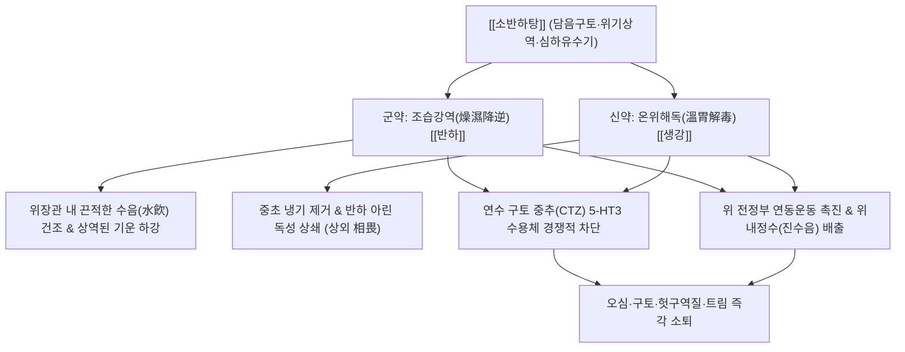

# 🍵 [[소반하탕]] (小半夏湯, Xiao Banxia-tang / Minor Pinellia Decoction)

> **핵심 3줄 요약 (Key Summary)**:
> - 🌿 기본 구성: 습담을 말리고 위기를 내리는 [[반하]]와 위의 냉기를 몰아내고 반하 독성을 해독하는 [[생강]] 2미로 구성된 강역지구 시조 방제.
> - 🎯 적응증: 담음 구토, 오심, 헛구역질, 맑은 침이나 거품 가래를 토함, 명치 밑 물소리(심하진수음), 임신오조(입덧), 멀미, 어지럼증 동반 구토.
> - 🔬 약리 기전: 6-진저롤 및 쇼가올의 연수 CTZ 5-HT3 및 NK1 수용체 길항, 위 전정부 연동운동 촉진을 통한 위 배출 시간 단축.
> - ⚠️ 주의사항: 진액이 바짝 마른 음허화왕성 마른구역질에는 단독 투여를 금하며, 숟가락으로 천천히 나누어 복용할 것.

---
## 📌 목차
1. [기본 처방 정보 & 군신좌사 구성](#1-기본-처방-정보--군신좌사-구성)
2. [방제학적 약재 상호작용 & 시너지 네트워크](#2-방제학적-약재-상호작용--시너지-네트워크)
3. [현대 분자약리학적 효능 & 작용 기전](#3-현대-분자약리학적-효능--작용-기전)
4. [적응 병증 및 체질별 감별 (Sweet Spot vs 금기)](#4-적응-병증-및-체질별-감별-sweet-spot-vs-금기)
5. [유사 처방군 감별 매트릭스](#5-유사-처방군-감별-매트릭스)
6. [임상 가감례 & 현대 질환별 응용](#6-임상-가감례--현대-질환별-응용)
7. [💡 사용자 진료실 핵심 필기 & 임상 팁 (원문 보존)](#7--사용자-진료실-핵심-필기--임상-팁-원문-보존)
8. [출처 및 학술 참고 문헌 (References)](#8-출처-및-학술-참고-문헌-references)
---

## 1. 기본 처방 정보 & 군신좌사 구성

| 구분 | 약재명 | 표준 용량 | 본초 효능 & 방제 내 역할 |
| :--- | :--- | :--- | :--- |
| 군약(君藥) | [[반하]] | 12.0~15.0g | 조습화담(燥濕化痰), 강역지구(降逆止嘔), 소비산결(消痞散結). 매운맛으로 습담을 말리고 상역된 위기를 하강시켜 구토를 멎게 하는 핵심 요약 (제반하) |
| 신약(臣藥) | [[생강]] | 15.0~20.0g | 온중지구(溫中止嘔), 산한해독(散寒解毒). 위를 덥혀 찬 수독(水毒)을 날리고, 반하의 옥살산칼슘 아린 독성을 해독(상외 相畏) |

> *복용법: 탕전 시 생강을 얇게 저며 반하와 함께 달이며, 구역감이 심할 때는 한꺼번에 들이켜지 않고 작은 숟가락으로 한 모금씩 따뜻하게 나누어 천천히 홀짝이며 삼키도록(분복 分服) 지도합니다.*

---

## 2. 방제학적 약재 상호작용 & 시너지 네트워크

- **상외(相畏)와 상사(相使)의 본초학적 정점**:
  - 생반하에는 옥살산칼슘 침상 결정이 함유되어 있어 인후를 찌르고 구강 점막을 자극합니다.
  - [[생강]]의 진기베렌과 유기산은 반하의 독성을 화학적으로 완벽히 중화(상외)시키면서, 동시에 반하의 진토(鎭吐) 효능을 2배 이상 증폭(상사)시킵니다.
- **조습(燥濕)과 강역(降逆)의 일체화**:
  - 한의학에서 구토의 근본 병리는 '담음(痰飮)'과 '위기상역(胃氣上逆)'입니다. 물이 차서 출렁거리면 위벽이 자극되어 기운이 위로 솟구칩니다.
  - [[반하]]의 맵고 마른 기운으로 물을 말리고, [[생강]]의 따뜻한 발산력으로 차가운 기운을 흩어 위를 조화롭게(화위 和胃) 만듭니다.

---

## 3. 현대 분자약리학적 효능 & 작용 기전

### 1) 5-$\text{HT}_3$ 및 도파민 $\text{D}_2$ 수용체 길항 작용 (진토 기전)
- [[생강]]의 활성 페놀류인 6-진저롤(6-Gingerol), 8-진저롤, 6-쇼가올(6-Shogaol)은 연수 화학수용체 유발대(CTZ) 및 장관 미주신경 구심성 신경의 5-$\text{HT}_3$ 수용체에 경쟁적으로 결합하여 세로토닌 유도 구토 반사를 차단합니다.
- 메토클로프라미드(Metoclopramide)와 유사하게 도파민 $\text{D}_2$ 및 뉴로키닌-1($\text{NK}_1$) 수용체 매개 구토 신호 전달을 억제합니다.

### 2) 위장관 평활근 운동 정상화 및 위 배출능 촉진
- [[반하]] 수용성 추출물과 생강 정유 성분은 콜린성 무스카린($M_3$) 수용체를 활성화하여 위저부의 순응도를 개선하고 위 전정부의 수축력을 강화합니다.
- 위내 음식물 및 수분의 십이지장 배출 시간(Gastric Emptying Time)을 단축시키고 위전도(Electrogastrography)의 부정파(Tachygastria)를 정상 정상서파(Normogastria)로 전환합니다.

### 3) 전정신경계 안정화 및 항현훈(Anti-vertigo) 효과
- 내이(Inner ear)의 림프액 수종을 완화하고 전정신경핵의 과도한 전기적 흥분을 진정시켜, 메니에르병이나 동요병(멀미)으로 유발되는 오심, 구토, 어지럼증을 억제합니다.

---

## 4. 적응 병증 및 체질별 감별 (Sweet Spot vs 금기)

### 1) 적응증 (Sweet Spot)
- **담음 정체성 오심·구토**:
  - 헛구역질이 나고 맑은 물이나 거품 섞인 침을 게우며, 물이나 음식을 먹으면 곧바로 토해내는 환자.
- **심하진수음(心下振水音) 동반 환자**:
  - 명치 밑이 답답하고 꽉 막힌 듯하며, 복진 시 명치를 가볍게 톡톡 치면 찰랑거리는 물소리가 뚜렷하게 들리는 경우.
- **임신오조(입덧)**:
  - 임신 초기 냄새만 맡아도 헛구역질이 나고 속이 울렁거리며 음식을 삼키지 못하는 임산부 (생강 비율을 높여 안전하게 활용).
- **항암 화학요법 유발 오심·구토 (CINV) 완화**:
  - 항암제 투여 후 양방 진토제 복용에도 불구하고 지속되는 지연성 구역감.

### 2) 금기 및 신중 투여
- **음허화왕(陰虛火動)성 구토**:
  - 혀가 붉고 설태가 전혀 없으며(경면설), 입안이 바짝 마르고 가슴에 번열이 나면서 발생하는 마른 구역질에는 온조한 약재가 진액을 말리므로 금기 (맥문동탕, 죽여온담탕 선택).
- **열담(熱痰) 및 급성 담낭염·췌장염 구토**:
  - 고열과 함께 누런 담즙을 토하고 우상복부 산통이 극심한 경우에는 청열해독 및 사하제를 먼저 사용해야 합니다.

---

## 5. 유사 처방군 감별 매트릭스

| 처방명 | 핵심 구성 차이 | 주치 및 임상 차별점 | 맥진/설진 차이 |
| :--- | :--- | :--- | :--- |
| [[소반하탕]] | [[반하]], [[생강]] (2미) | 순수 담음 구토, 토연말, 심하진수음, 임신오조, 급성 오심구역 | 맥 활(滑) 혹은 현(弦), 설 담백(淡白) 백활태(白滑苔) |
| [[소반하가복령탕]] | [[소반하탕]] + [[복령]] | 담음 + 수음(水飮), 구토와 함께 어지럼증(두훈), 심계, 소변불리 동반 | 맥 침활(沈滑), 설 담(淡) 수습태(水濕苔) |
| [[반하후박탕]] | [[소반하탕]] + [[후박]], [[복령]], [[소엽]] | 매핵기, 인후 이물감, 가슴 답답함, 우울 신경증 (구토보다는 이물감 위주) | 맥 현(弦), 설태 백니(白膩) |
| [[이진탕]] | [[반하]], [[진피]], [[복령]], [[감초]], [[생강]] | 비위 습담의 기본방, 만성 가래, 소화불량, 전신 무거움 | 맥 활(滑), 설태 백니(白膩) |
| [[오령산]] | [[저령]], [[택사]], [[백출]], [[복령]], [[계지]] | 수역(水逆), 갈증으로 물을 마시자마자 토함, 부종, 소변불리 | 맥 부(浮) 혹은 완(緩), 설 담(淡) |

---

## 6. 임상 가감례 & 현대 질환별 응용

### 1) 임상 가감례
- **어지럼증 및 두근거림(심계) 동반 시**: [[복령]] 12.0g을 가하여 [[소반하가복령탕]]으로 전환, 수음을 소변으로 삼습시킵니다.
- **가슴 답답함과 트림 동반 시**: [[진피]] 6.0g, [[지각]] 4.0g을 가하여 이기화담(理氣化痰)합니다.
- **속쓰림 및 위열(胃熱) 협잡 시**: 구역감과 함께 신물이 넘어오면 [[황련]] 2.0g, [[죽여]] 6.0g을 가하여 청열강역합니다.
- **복부 냉통 및 한음(寒飮) 극심 시**: 배가 차고 손발이 시리면 [[건강]] 4.0g, [[육계]] 2.0g을 가하여 온중산한합니다.

### 2) 현대 질환별 응용
- **임신오조 (Morning Sickness)**: 양방 약물 복용이 조심스러운 임신 초기에 생강의 함량을 높여 안전하고 부드럽게 위장관을 안정.
- **급성 위장염 및 멀미(Motion Sickness)**: 차나 배를 타기 전 또는 급성 체기로 위가 뒤집혀 토할 때 응급 복용.
- **항암 치료 후 식욕부진 및 구역 완화**: 시스플라틴 등 항암 화학요법 중인 암 환자의 삶의 질 개선.

---

## 7. 💡 사용자 진료실 핵심 필기 & 임상 팁 (원문 보존)

> [!tip] **진료실 실전 노하우 (User Clinical Insight)**
> 
> - **소반하탕의 핵심 본초학적 기전**:
>   - 한대 장중경의 《금궤요략》에 수록된 조습화담 및 강역지구의 시조 방제.
>   - [[반하]]와 [[생강]]의 상호 작용으로 5-HT3 및 도파민 D2 수용체 경로를 억제하여 연수 구토중추를 진정시키고 위장관 연동운동 정상화.
>   - 위내 정수(胃內停水) 및 담음으로 인한 급·만성 오심, 구토, 트림, 딸꾹질, 임신오조(입덧)를 다스림.
> - **복용 테크닉**:
>   - 구토가 심할 때는 한 번에 마시면 위벽이 자극되어 바로 뿜어낼 수 있으므로, 숟가락으로 한 모금씩 입안에 머금고 있다가 식도를 적시듯 천천히 삼키도록 티칭할 것.

---

## 8. 출처 및 학술 참고 문헌 (References)

1. **장중경 (張仲景)**. (200경). 『금궤요략(金匱要略)』 담음해수병맥증병치(痰飲咳嗽病脈證幷治).
   - **[고전 원전]**: "諸嘔吐, 穀不得下者, 小半夏湯主之. 半夏一升, 生薑半斤. 上二味, 以水七升, 煮取一升半, 分溫再服." (모든 구토로 곡식이 내려가지 못하는 것은 소반하탕으로 다스린다. 반하 1되, 생강 반 근. 두 약재를 물 7되로 끓여 1되 반을 취해 따뜻하게 두 번 나누어 복용한다.)
2. * **Liang W et al. (2024)**. Xiao-Ban-Xia Decoction Alleviates Chemotherapy-Induced Nausea and Vomiting by Inhibiting Ferroptosis via Activation of The Nrf2/SLC7A11/GPX4 Pathway. *Advanced biology*, 8: e2400323. [PMID: 39501722](https://pubmed.ncbi.nlm.nih.gov/39501722/)
