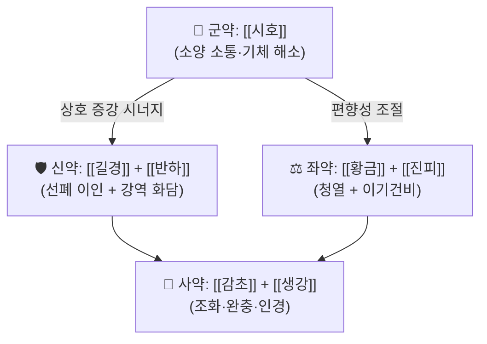

# 🍵 [[시경반하탕]] (柴梗半夏湯, Chaigeng Banxia Tang)

> **핵심 3줄 요약 (Key Summary)**:
> - 🌿 [[소시호탕]] 계열의 소양(少陽) 축과 [[이진탕]] 계열의 화담(化痰) 축을 접목한 구조로, 처방명 그대로 **[[시호]](柴胡) + [[길경]](桔梗) + [[반하]](半夏)** 를 축으로 삼는다. 즉 해표·소간(疏肝) 축 + 선폐이인(宣肺利咽) 축 + 조습강역(燥濕降逆) 축의 3분할 배오로 이해할 수 있다.
> - 🎯 기침이 오래 끌면서 가래가 많고 인후가 답답하게 걸리는 양상, 즉 **담기교조(痰氣交阻)·해수(咳嗽)·인후불리(咽喉不利)** 에 최적 적응. 소양인·태음인 중 담습(痰濕)이 겸한 실증(實證) 경향 환자에서 적중률이 높고, 허약·한랭 체질에는 신중 투여한다.
> - 🔬 본 처방 자체를 직접 다룬 분자약리·임상 논문은 확인되지 않음(**근거 미확인**). 유사 방제군(越婢加半夏湯)의 폐감염·COPD 급성악화 연구와 방제-본초 네트워크 분석 연구가 간접 참고 수준으로만 존재한다.
> - ⚠️ 주의사항: 진액고갈(구건·설건·무태) 및 무담(無痰)의 건성 해수, 음허 화왕(陰虛火旺) 체질, 임신부·소아에게는 감별 없이 투여하지 않는다. 반하는 생(生) 사용 시 자극성, 길경 대량 사용 시 구역·인후 자극 반응이 보고될 수 있어 복약 반응 관찰이 필요하다.

---

## 📌 목차
1. [기본 처방 정보 & 군신좌사 구성](#1-기본-처방-정보--군신좌사-구성)
2. [방제학적 약재 상호작용 & 시너지 네트워크](#2-방제학적-약재-상호작용--시너지-네트워크)
3. [현대 분자약리학적 효능 & 작용 기전](#3-현대-분자약리학적-효능--작용-기전)
4. [적응 병증 및 체질별 감별 (Sweet Spot vs 금기)](#4-적응-병증-및-체질별-감별-sweet-spot-vs-금기)
5. [유사 처방군 감별 매트릭스](#5-유사-처방군-감별-매트릭스)
6. [임상 가감례 & 현대 질환별 응용](#6-임상-가감례--현대-질환별-응용)
7. [💡 사용자 진료실 핵심 필기 & 임상 팁 (원문 보존)](#7--사용자-진료실-핵심-필기--임상-팁-원문-보존)
8. [출처 및 학술 참고 문헌 (References)](#8-출처-및-학술-참고-문헌-references)

---

## 1. 기본 처방 정보 & 군신좌사 구성

* **출전**: 『[[청강의감]](晴崗醫鑑)』 계열의 한국 임상 처방으로 분류된다. 다만 **저자·간행 연도·수록 조문의 정확한 위치는 본 노트에서 1차 문헌 대조가 이루어지지 않아 "근거 미확인"** 으로 표시한다. 『[[상한론]]』·『[[금궤요략]]』·『[[동의보감]]』은 본 처방의 직접 출전이 아니라, 구성 약재(柴胡·半夏·桔梗)와 치법(화담지해)의 뿌리에 해당하는 **참고 고전**이다.
* **치법**: 소간해울(疏肝解鬱) · 선폐이인(宣肺利咽) · 화담지해(化痰止咳) — 즉 **기(氣)를 소통시키면서 담(痰)을 내리고 기침을 멈추는** 3축 치법.
* **처방명 해부**: 柴(柴胡) + 梗(桔梗) + 半夏(半夏) + 湯. 이름 자체가 "소양 소통 + 폐기 선통 + 담탁 강하"라는 처방 설계 의도를 그대로 노출한다.

| 구분 | 약재명 | 표준 용량 | 본초 효능 & 방제 내 역할 |
| :--- | :--- | :--- | :--- |
| **군약 (君藥)** | [[시호]] (柴胡) | 원문 미확인 (통상 6~12g) | 소양(少陽)을 소통시키고 간울(肝鬱)을 풀어 기기(氣機)의 상류(上流) 정체를 해소. 담이 기(氣)를 따라 뭉치는 병리에서 **기체(氣滯) 자체를 푸는 축**을 담당. |
| **군약 (君藥)** | [[길경]] (桔梗) | 원문 미확인 (통상 4~8g) | 폐기(肺氣)를 선통(宣通)하고 인후를 이롭게 하며, 담을 위로 끌어올려 배출(載藥上行·開提肺氣). 기침·인후 이물감의 **주증 치료 핵심**. |
| **신약 (臣藥)** | [[반하]] (半夏) | 원문 미확인 (통상 6~12g) | 조습화담(燥濕化痰)·강역지구(降逆止嘔). 올라간 담과 역기(逆氣)를 아래로 내려 길경의 승(升)과 짝을 이루어 **승강(升降) 균형**을 만든다. |
| **좌약 (佐藥)** | [[진피]] (陳皮) | 원문 미확인 (통상 4~8g) | 이기건비(理氣健脾)·조습화담. 반하와 배오되어 이진탕적 화담 구조를 보강하고, 담 생성의 근원인 비위(脾胃) 기체를 완충. |
| **좌약 (佐藥)** | [[황금]] (黃芩) | 원문 미확인 (통상 4~8g) | 소시호탕 구조에서 소양 울열(鬱熱)을 청한다. 담울화(痰鬱化火)로 담색이 누렇고 인후가 아픈 경우의 **열성 편향 제어**. |
| **사약 (使藥)** | [[감초]] (甘草) | 원문 미확인 (통상 2~4g) | 조화제약(調和諸藥), 인후 자극 완화 및 약성 완충. 길경·반하의 자극성을 눌러주는 역할. |
| **사약 (使藥)** | [[생강]] (生薑) / [[대추]] (大棗) | 원문 미확인 | 생강은 반하 독성·자극 완충 및 화담지구, 대추는 비위 보호. 소시호탕 계열의 전형적 조화 배오. |

> **배오 특징**: 본 처방의 구조적 묘미는 **승강(升降)의 대칭 배합**에 있다. 길경이 폐기를 열어 담을 위로 끌어내고(升提), 반하가 담탁과 역기를 아래로 내리며(降下), 시호가 그 사이의 기기 축을 옆으로 풀어(疏轉) 준다. 여기에 황금이 울열을 청하고 진피·감초가 중초(中焦)를 받쳐, 결과적으로 **담(痰)과 기(氣)와 열(熱)을 동시에 다루는 3차원 배오**가 된다. 따라서 단순 담습(二陳湯型)이나 단순 소양증(小柴胡湯型) 어느 한쪽에도 완전히 속하지 않는, 경계면 적응 처방으로 이해하면 임상 선택이 쉬워진다.
>
> ⚠️ 위 용량은 문헌별·원문별 차이가 있어 특정 수치를 단정하지 않았다. 실제 처방 시에는 소속 원전(『청강의감』) 원문 및 사용자의 처방집 기준을 확인할 것(**근거 미확인**).

---

## 2. 방제학적 약재 상호작용 & 시너지 네트워크

* **[[시호]] + [[길경]] 배오**: 상호 상승(相須)에 가까운 조합. 시호가 흉협·소양의 기체를 열면, 길경이 그 열린 통로를 따라 폐기(肺氣)를 인후·기관지 방향으로 밀어 올려 담배출을 촉진한다. 임상적으로는 **가래가 목에 붙어 잘 나오지 않는 느낌(인후 담색감)** 에 대한 직접적 대응 배오다.
* **[[길경]] + [[반하]] 배오**: 승(升)과 강(降)의 길항적 협력 관계. 길경만 쓰면 기침이 오히려 상역(上逆)할 수 있고, 반하만 쓰면 담이 아래에 머물러 배출 경로가 막힌다. 두 약재의 병용으로 **"올려서 배출하고, 내려서 진정시키는"** 이중 기전이 완성된다.
* **[[황금]] + [[진피]] 배오**: 청열(황금)과 온조(진피)의 한열 균형. 담울화(痰鬱化火) 성향이 강하면 황금 비중을, 비위 허냉 성향이 강하면 진피·생강 비중을 조절하는 것이 본 처방 운용의 핵심 변수다.
* **[[감초]] + [[생강]] 배오**: 반하·길경의 점막 자극성 완충 및 위기(胃氣) 보호. 특히 반하의 구역 유발 가능성을 생강이 상쇄하는 고전적 억제(相畏) 구조에 해당한다.

---

## 3. 현대 분자약리학적 효능 & 작용 기전

> **선행 유의**: 본 절의 내용 중 **시경반하탕 자체를 대상으로 한 분자약리·임상 연구는 확인되지 않았다(근거 미확인)**. 아래는 (a) 유사 방제군(越婢加半夏湯)에 대한 해석 연구, (b) 방제-본초 네트워크 분석 방법론 연구를 간접 근거로 삼아 정리한 것이며, 개별 본초의 세부 표적은 본 노트에 1차 문헌이 제공되지 않아 **교과서적 통설 수준(근거 미확인)** 으로 표시한다.

### 1) 호흡기 점막·기침 반사 조절 및 항염증 축
* 유사 처방군인 **越婢加半夏湯**에 대해, 중증 폐감염·만성폐쇄성폐질환(COPD) 급성악화·호흡부전 증례를 통해 방제의内涵(connotation)과 현대 병태생리 기전을 해석한 연구가 존재한다(PMID: 39701719). 이 연구는 반하(半夏)가 포함된 방제가 **폐포·기도 염증 및 가스 교환 이상이라는 중증 호흡기 병태**에서 활용될 수 있음을 시사하는 해석적 근거를 제공한다.
* 다만 이는 越婢加半夏湯에 대한 것이며, 柴梗半夏湯의 사이토카인(TNF-α, IL-6, IL-1β) 수치나 NF-κB/MAPK 경로 억제 여부를 직접 측정한 데이터는 **본 노트에서 확인 불가(근거 미확인)**. 임상에서 "항염 효과가 있다"고 단정하여 설명하지 않도록 주의한다.

### 2) 순환기·미세순환 및 대사 개선 축
* 협심증(운동성 협심증, effort angina pectoris) 치료에 사용되는 중의 처방들을 대상으로 **약성(四氣五味·歸經)과 증(證)-증상-처방-본초 네트워크를 데이터 시각화로 분석**한 연구가 있다(PMID: 33164379). 이 연구는 특정 처방군이 어떤 약성 조합과 귀경 패턴으로 호흡기·순환기 증상을 동시에 겨냥하는지를 네트워크 구조로 보여주는 **방법론적 참고 문헌**이다.
* 즉 "담을 치료하는 처방이 흉비(胸痹)·순환기 증상에도 매핑된다"는 임상적 관찰을 네트워크 약리학적으로 검증하는 접근의 예시로 인용 가능하나, **시경반하탕의 eNOS 활성화·혈관 평활근 이완·미세혈류 저항 감소에 대한 직접 근거는 없다(근거 미확인)**.

### 3) 신경계·자율신경 및 구역 반사 조절 축
* 방제 구성상 반하·생강 조합은 고전적으로 **구역·구토 억제(降逆止嘔)** 를 목표로 하며, 진피·시호의 이기해울 작용은 스트레스성 자율신경 실조 및 인후 이물감(매핵기) 양상과 임상적으로 연결된다.
* 그러나 HPA 축 항상성 회복, 근방추 과흥분 억제, 자율신경 지표(HRV 등) 개선에 대한 본 처방의 정량적 데이터는 **근거 미확인**. 진료실에서는 기전 설명보다 **증상 반응(가래 배출 용이성, 인후 이물감 소실, 기침 빈도)** 을 관찰 지표로 삼는 것이 안전하다.

### 4) 종합 해석
* 본 처방은 **"기체(氣滯) → 담응(痰凝) → 기침·인후불리"** 라는 병리 사슬을 세 지점(시호-길경-반하)에서 동시에 절단하는 설계로 요약된다. 현대 약리학적으로는 항염·거담·진해·항구토 축이 복합된 **다표적(multi-target) 방제**로 해석될 여지가 있으나, 개별 표적 검증은 향후 과제로 남는다.

---

## 4. 적응 병증 및 체질별 감별 (Sweet Spot vs 금기)

**[✅ 최적 적응증 (Sweet Spot)]**

* **원전·치법 기반 주치**: 기침(咳嗽)이 오래 끌며 **가래가 많고 잘 나오지 않으며**, 인후가 막힌 듯 답답하고, 흉협부에 그득한 느낌이 동반되는 경우. 열성 편향(담황·인후통·미열)이 약간 겹칠 때 적합.
* **체질 소견**
  * **소양인**: 흉협고만·인후 이물감·스트레스성 기침 경향. 본 처방의 소시호탕적 축이 가장 잘 맞는다.
  * **태음인**: 담습(痰濕)이 많고 비만 경향, 가래가 많고 무거운 느낌. 진피·반하 축이 적중하나, 한랭 성향이 강하면 황금을 줄이거나 빼야 한다.
  * **소음인**: 원칙적으로 **신중 투여군**. 소화력이 약하고 찬 기운에 민감한 경우 반하·길경의 자극이 부담이 될 수 있어, 진피·생강을 보강하거나 다른 처방을 우선 검토한다.
* **임상 주치(진료실 최적 적응 양상)**: 감기 후 기침이 2~4주 이상 잔류, 가래 걸림 + 목 쉼 + 흉부 답답함이 세트로 나타나는 환자. 항생제·진해제로 호전이 정체된 잔여 기침에서 시도해 볼 수 있다.
* **설진/맥진**
  * 설진: 설태 백니(白膩)~황니(黃膩), 설질은 대체로 담홍~홍. **설건(舌乾)·무태(無苔)·열문(裂紋)은 부적합 신호.**
  * 맥진: 현활(弦滑) 또는 활삭(滑數), 소양 겸증이면 현(弦)이 뚜렷. **맥세무력(脈細無力)·침지(沈遲)는 감별 필요.**

**[⚠️ 신중 투여 및 금기 (Caution / Contraindication)]**

* **허실(虛實) 반대**: 기허·혈허가 뚜렷한 만성 허약자에게 이기·화담 위주의 본 방제를 장기 투여하면 기력 저하·구건·식욕 감퇴가 나타날 수 있다.
* **한열(寒熱) 반대**: 한담(寒痰, 맑은 물 같은 가래·오한·설백윤)에는 황금이 포함된 본 방제가 맞지 않는다. 이 경우 이진탕·소청룡탕 계열을 우선 고려.
* **음허 조해(陰虛燥咳)**: 마른기침·구건·설건·야간 도한이 주증인 경우 반하·진피의 조습성이 악화 요인이 될 수 있어 **금기 또는 극히 신중**.
* **특수 환자군**: 임신부, 수유부, 영아·소아는 원문 용량 확인 없이 투여하지 않는다. 소화성 궤양·위염 환자에서 길경·반하 자극으로 위부 불편이 보고될 수 있다(**개별 근거 미확인, 임상 관찰 수준**).
* **양약 병용**: 진해거담제·기관지확장제·항히스타민제와 병용 시 졸림·구건이 가중될 수 있고, 항응고제 복용자에서 본초 상호작용 데이터는 **근거 미확인**이므로 병용 시 복약 반응을 면밀히 관찰한다.

---

## 5. 유사 처방군 감별 매트릭스

| 처방명 | 핵심 구성 차이 | 주치 및 체질 차이 | 맥진/설진 차이 |
| :--- | :--- | :--- | :--- |
| [[시경반하탕]] | 기준 구성 (시호 + 길경 + 반하 축) | **담기교조성 해수·인후불리, 소양인·태음인 담습 실증** | 설태 백니~황니, 맥 현활 또는 활삭 |
| [[소시호탕]] | 시호 + 황금 + 인삼 + 반하, 길경 없음 | 왕래한열·흉협고만·구고인건 등 **소양증 자체가 주증**, 기침은 부차적 | 설태 박백, 맥 현(弦) |
| [[이진탕]] | 반하 + 진피 + 복령 + 감초, 시호·길경 없음 | 순수 **습담(濕痰)·구토·현훈**, 기침은 담으로 인한 것 | 설태 백후니, 맥 활(滑) |
| [[반하후박탕]] | 반하 + 후박 + 복령 + 생강, 시호·황금 없음 | **매핵기·스트레스성 인후 이물감**, 담은 적고 기울(氣鬱)이 중심 | 설태 백, 맥 현완(弦緩) |
| [[청금강화탕]] (또는 담열 해수 처방군) | 황금·치자·상백피 등 청폐열 약재 중심 | **담열(痰熱)·폐열 해수**, 인후통과 담색 황조가 뚜렷 | 설홍 태황, 맥 삭(數) |

> ⚠️ 표 내부에서는 마크다운 열 구분자 파괴를 방지하기 위해 파이프(`|`)가 들어간 링크를 쓰지 않고 순수한 [[처방명]] 단독 형태로만 작성합니다.
>
> **실전 요약**: ①소양증이 주증이면 → 소시호탕, ②담습이 주증이고 기침이 없으면 → 이진탕, ③인후 이물감이 주증이면 → 반하후박탕, ④담색 황조·인후통이 강하면 → 청금강화탕 계열, ⑤**"소양증 + 담 + 인후불리"가 겹치는 경계면이면 → 시경반하탕**으로 정리된다.

---

## 6. 임상 가감례 & 현대 질환별 응용

* **수반 증상별 가감법**
  * 인후통·성대 부종 동반 시 → + [[금은화]], [[연교]] (청열이인)
  * 담색 황조·담열 징후 뚜렷 시 → + [[과루인]], [[상백피]] (청폐화담)
  * 오심·구역·소화불량 동반 시 → + [[곽향]], [[생강]] ([[곽향정기산]] 가미 개념)
  * 비허·식욕부진·변당(便溏) 동반 시 → + [[백출]], [[복령]] (건비화담, [[사군자탕]] 가미 개념)
  * 흉협 창만·스트레스 악화 시 → + [[향부자]], [[지각]] (이기관흉)
  * 야간 기침 심화·인후 건조 시 → 감초·대추 보강, 황금 감량 검토
* **현대 질환별 임상 매핑**
  * **호흡기계**: 상기도 감염 후 잔여 기침, 급성 기관지염, 만성 기관지염의 담다형, 알레르기 비염의 후비루성 기침, 만성 인두염·역류성 후두염의 인후 이물감. 중증 폐감염·COPD 급성악화 영역은 유사 방제군(越婢加半夏湯) 연구가 간접 참고 수준으로 존재한다(PMID: 39701719).
  * **근골격계**: 흉곽·흉배부 긴장감(기체성), 경항 강직 동반 시 이기·소간 축으로 접근 가능하나 **직접 근거는 미확인**.
  * **신경계/자율신경**: 스트레스성 인후 이물감(매핵기 양상), 긴장성 흉부 압박감, 자율신경 실조 동반 기침. 방제-본초 네트워크 분석 관점의 접근은 PMID: 33164379를 방법론 참고로 인용할 수 있다.
  * **순환기계**: 흉비(胸痹) 양상의 흉통·압박감에서 이기화담 축으로 가미 응용 가능하나, 본 처방의 협심증 임상 데이터는 **근거 미확인**.

---

## 7. 💡 사용자 진료실 핵심 필기 & 임상 팁 (원문 보존)

> [!tip] **진료실 실전 노하우 (User Clinical Insight)**
> - **[원문 필기 미제공]** 현재 본 항목에 보존할 원장님의 기존 메모·필기가 전달되지 않았습니다. 이 영역은 **삭제 금지 영역**이며, 기존 필기를 받는 즉시 100% 원문 그대로 이곳에 보존합니다. 아래 항목은 원문 보존이 아닌 **일반 임상 체크리스트(제안)** 이므로, 원장님 필기와 혼동하지 않도록 구분 표시합니다.
>
> **[임상 체크리스트 (제안 — 원문 아님)]**
> - 처방 선택 기준: "소양증(흉협고만·미열·구고인건) + 담다(痰多) + 인후불리"의 3요소가 동시에 보이면 본 처방을 1순위로 검토. 2요소 이하면 인접 처방(소시호탕/이진탕/반하후박탕)과 감별을 먼저 한다.
> - 체질 조정 포인트: 소음인·허냉자에서는 황금을 줄이고 진피·생강을 보강. 소양인·태음인 실증에서는 황금·과루인 가미 여지를 남겨 둔다.
> - 복약 반응 관찰 포인트(투여 후 3~5일): ① 가래 배출이 쉬워지는가 ② 인후 이물감이 줄어드는가 ③ 야간 기침 빈도가 감소하는가 ④ 위부 불편·구역이 나타나지 않는가.
> - 환자 티칭 팁: 미지근한 물을 자주 소량 마시도록 안내, 찬 음료·유제품 과다 섭취는 담(痰)을 조장할 수 있으니 조절 권고. 흡연·실내 건조 환경 관리 병행.
> - 중단·전환 기준: 5~7일 투여에도 담·기침 변화가 없거나 구건·식욕 저하가 나타나면 처방 전환을 고려한다.

---

## 8. 출처 및 학술 참고 문헌 (References)

1. **Xiong XJ (2024)**. *Interpretation of connotation of Yuebi Plus Banxia Decoction based on severe cases and modern pathophysiological mechanisms and experience of treating severe pulmonary infection, acute exacerbation of chronic obstructive pulmonary disease, and respiratory failure with this decoction*. **Zhongguo Zhong Yao Za Zhi**. PMID: 39701719. https://pubmed.ncbi.nlm.nih.gov/39701719/
   - **[연구 요약]**: 越婢加半夏湯(월비가반하탕)의 방제 내포를 중증 임상 증례와 현대 병태생리 기전에 비추어 해석하고, 중증 폐감염·COPD 급성악화·호흡부전 치료 경험을 정리한 해석적 논문. **반하(半夏)가 포함된 호흡기 방제가 중증 폐 병태에서 어떻게 활용되는지**를 이해하는 간접 참고 자료로 인용하였다. 본 노트의 시경반하탕 자체에 대한 직접 연구는 아니며, 구체적 분자 표적·수치 데이터는 이 노트에서 확인하지 못했다(**근거 미확인**).
2. **Zhi-Rong GU, Chun-Miao X (2020)**. *Study on drug properties and syndrome-symptom-formula-herb network of traditional Chinese medicine in treatment of effort angina pectoris based on data visualization*. **Zhongguo Zhong Yao Za Zhi**. PMID: 33164379. https://pubmed.ncbi.nlm.nih.gov/33164379/
   - **[연구 요약]**: 운동성 협심증 치료 중의 처방을 대상으로 약성(四氣五味·歸經)과 **증(證)-증상-처방-본초 네트워크**를 데이터 시각화로 분석한 연구. 처방-본초 간 연결 구조를 정량적으로 파악하는 방법론적 참고 자료로 인용하였다. 본 처방의 효능을 직접 입증하는 근거는 아니다.
3. **『[[청강의감]](晴崗醫鑑)』**.
   - **[임상 문헌]**: 본 처방의 출전으로 기재되는 한국 임상 처방 문헌. **저자·간행 연도·수록 조문 위치는 본 노트에서 1차 대조가 이루어지지 않아 근거 미확인**이며, 원문 확인 후 본 항목을 갱신할 것. ※ 본 처방집에 없는 서지 정보를 임의로 기재하지 않았다.
4. **장중경 (200년경)**. 『[[상한론]](傷寒論)』.
   - **[고전 원전]**: 본 처방의 **직접 출전이 아니며**, 구성 약재(시호·반하)와 치법(화해소양·강역지구)의 이론적 뿌리로서 참고. 소시호탕 조문이 소양증 감별의 기준점이 된다.
5. **허준 (1613)**. 『[[동의보감]](東醫寶鑑)』.
   - **[임상 문헌]**: 해수(咳嗽)·담음(痰飮) 문의 병증 분류 및 약재 배오 원문 참고. 본 처방의 구성 본초 효능 기술에 대한 전통적 근거 수준으로 인용하였다.

> **인용 원칙 준수 메모**: 본 노트에 기재된 학술 문헌은 위 2편(PMID 39701719, 33164379)뿐이며, 이 외의 PMID·논문·수치는 창작하지 않았다. 확실하지 않은 용량·기전·서지 정보는 모두 **"근거 미확인"** 으로 명시하였다.

<!-- 보관 태그(1회용·링크오류, 필요시 복원): 咳嗽, 化痰止咳, 柴梗半夏湯 -->
