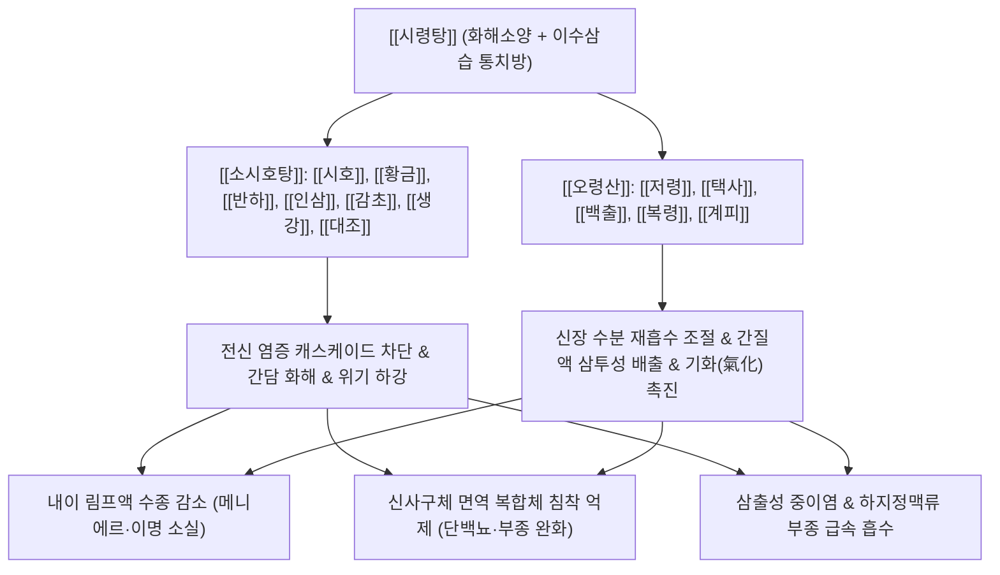

# 🍵 [[시령탕]] (柴苓湯, Sairei-to / Chai-Ling Decoction)

> **핵심 요약 (Key Summary)**:
> - 🌿 기본 구성: 화해소양과 항염증의 [[소시호탕]]([[시호]], [[황금]], [[반하]], [[인삼]], [[감초]], [[생강]], [[대조]])과 수독을 빼내는 [[오령산]]([[저령]], [[택사]], [[백출]], [[복령]], [[계피]])의 합방.
> - 🎯 적응증: 갈증, 소변량 감소, 부종, 오심, 구토, 설사, 삼출성 중이염, 메니에르병, 어지럼증, 스테로이드 의존성 난청, IgA 신증, 삼차신경통.
> - 🔬 약리 기전: 시호 사이코사포닌 H의 알도스테론 억제 이뇨, 바소프레신 V2 억제를 통한 내림프수종 해소, 황금·감초의 PDGF 티로신 키나아제 억제.
> - ⚠️ 주의사항: 인터페론 제제 병용 금기이며, 간질성 폐렴 발생 여부를 모니터링할 것.

---
## 📌 목차
1. [기본 처방 정보 & 군신좌사 구성](#1-기본-처방-정보--군신좌사-구성)
2. [방제학적 약재 상호작용 & 시너지 네트워크](#2-방제학적-약재-상호작용--시너지-네트워크)
3. [현대 분자약리학적 효능 & 작용 기전](#3-현대-분자약리학적-효능--작용-기전)
4. [적응 병증 및 체질별 감별 (Sweet Spot vs 금기)](#4-적응-병증-및-체질별-감별-sweet-spot-vs-금기)
5. [유사 처방군 감별 매트릭스](#5-유사-처방군-감별-매트릭스)
6. [임상 가감례 & 현대 질환별 응용](#6-임상-가감례--현대-질환별-응용)
7. [💡 사용자 진료실 핵심 필기 & 임상 팁 (원문 보존)](#7--사용자-진료실-핵심-필기--임상-팁-원문-보존)
8. [출처 및 학술 참고 문헌 (References)](#8-출처-및-학술-참고-문헌-references)
---

## 1. 기본 처방 정보 & 군신좌사 구성

| 구분 | 약재명 | 표준 용량 | 본초 효능 & 방제 내 역할 |
| :--- | :--- | :--- | :--- |
| 군약(君藥) | [[시호]] | 7.0g | 화해소양(和解少陽), 소간해울(疏肝解鬱). 간담의 울열을 풀고 시상하부-하수체-부신피질 축을 조절 |
| 군약(君藥) | [[택사]] | 6.0g | 이수삼습(利水渗濕), 설열(泄熱). 신장과 방광의 수습을 소변으로 강렬하게 배출하여 부종 완화 |
| 신약(臣藥) | [[황금]] | 4.0g | 청열조습(淸熱燥濕), 사화해독(瀉火解毒). 상초와 중초의 염증성 화열을 끄고 시호와 짝을 이루어 소양병 치료 |
| 신약(臣藥) | [[저령]] | 4.5g | 이수삼습(利水渗濕). 택사와 함께 사구체 여과를 촉진하고 조직 간질액 저류 배출 |
| 신약(臣藥) | [[복령]] | 4.5g | 건비보중(健脾補中), 담삼이습(淡渗利濕). 비위를 돕고 수습을 소변으로 이끌며 신경 안정 |
| 신약(臣藥) | [[백출]] | 4.5g | 건비익기(健脾益氣), 조습이수(燥濕利水). 소화관 점막 수분 정체를 말리고 비장의 운화 기능 회복 (창출 대용 가능) |
| 좌약(佐藥) | [[반하]] | 5.0g | 조습화담(燥濕化痰), 강역지구(降逆止嘔). 위장의 담음을 삭이고 구역감과 오심을 진정 |
| 좌약(佐藥) | [[인삼]] | 3.0g | 대보원기(大補元氣), 익기건비(益氣健脾). 이뇨로 인한 기운 소모를 방어하고 면역력 보강 |
| 좌약(佐藥) | [[계피]] | 3.0g | 온통경맥(溫通經脈), 조양화기(助陽化氣). 방광의 기화(氣化) 작용을 도와 수액 순환을 정상화 (계지) |
| 좌약(佐藥) | [[생강]] | 3.0g | 온중지구(溫中止嘔), 산한해독(散寒解毒). 위장을 따뜻하게 하여 구토를 멎게 하고 약성을 조화 |
| 좌약(佐藥) | [[대조]] | 3.0g | 보중익기(補中益氣), 양혈안신(養血安神). 인삼과 함께 비위를 자양하고 체액 완충 |
| 사약(使藥) | [[감초]] | 2.0g | 청열해독(淸熱解毒), 조화제약(調和諸藥). 여러 약재의 충돌을 완충하고 항염증 시너지 유도 |

---

## 2. 방제학적 약재 상호작용 & 시너지 네트워크

- **소시호탕(柴)과 오령산(苓)의 완전무결한 합방**:
  - 임상에서 만나는 많은 환자는 단순한 수분 저류(부종)뿐만 아니라, 체내 만성 염증이나 자율신경 실조(미열, 오심, 가슴 답답함)를 동시에 가지고 있습니다.
  - [[소시호탕]]으로 간담과 림프계의 염증을 끄고 면역계를 안정시키며, [[오령산]]으로 신장과 세포외액의 비정상적 수분(수독 水毒)을 소변으로 빼내어 완벽한 표리상응(表裏相應) 치료를 달성합니다.
- **알도스테론과 바소프레신의 이중 제어**:
  - [[시호]]의 사포닌은 부신피질 알도스테론을 억제하여 나트륨과 수분의 체내 정체를 막고,
  - [[오령산]] 약재들은 바소프레신 수용체와 아쿠아포린 수송체를 조절하여 부작용 없는 천연 이수 작용을 완성합니다.

---

## 3. 현대 분자약리학적 효능 & 작용 기전

### 1) 신장 사구체 보호 및 항섬유화 작용 (IgA 신증 및 신증후군 억제)
- [[황금]]의 Baicalin과 [[감초]]의 Glycyrrhizin 복합물은 혈소판 유래 성장인자(PDGF) 티로신 키나아제 활성을 직접 억제합니다.
- IgA 면역복합체 과량 투여 동물 모델에서 사구체 메산지움 세포(Mesangial cell)의 과도한 증식을 억제하고 신장 경화도(Sclerosis)를 유의하게 감소시키며 단백뇨 배출량을 줄입니다.

### 2) 내이 림프수종 개선 및 이뇨 작용 (바소프레신 V2 수용체 억제)
- 신장 집합관 및 내이(Inner ear) 혈관조의 바소프레신 $V_2$ 수용체 자극을 억제하고, 아쿠아포린-2(AQP2) 수선 및 세포막 이동을 차단합니다.
- 내림프액 압력을 낮추어 메니에르병의 회전성 어지럼증, 이충만감(귀 먹먹함), 이명 및 급성 감음성 난청을 신속하게 호전시킵니다.

### 3) 스테로이드 절약 효과 (Steroid-Sparing Effect) 및 항염증
- [[시호]]의 Saikosaponins과 황금 플라보노이드는 내인성 코르티코스테로이드 분비를 자극하고 대식세포의 iNOS/NO 생성 및 COX-2, TNF-$\alpha$, IL-6 분비를 억제합니다.
- 자가면역질환이나 신장 질환 환자가 스테로이드를 감량할 때 발생하는 리바운드 현상(Rebound phenomenon)을 효과적으로 방어합니다.

---

## 4. 적응 병증 및 체질별 감별 (Sweet Spot vs 금기)

### 1) 적응증 (Sweet Spot)
- **이비인후과 질환 (내림프수종 & 삼출성 염증)**:
  - 메니에르병, 회전성 현훈, 이충만감, 이명, 삼출성 중이염(중이강 내 삼출액 저류), 스테로이드 의존성 돌발성·감음성 난청.
- **신장 및 비뇨기과 질환**:
  - IgA 신병증, 만성 사구체신염, 미세변화 신증후군, 단백뇨 및 혈뇨 동반 부종, 소변량 감소.
- **염증성 소화기 질환 및 자가면역 질환**:
  - 크론병, 궤양성 대장염, 장염 후 지속되는 수양성 설사와 복통, 구갈, 오심.
- **혈관 및 신경 질환**:
  - 하지정맥류성 부종 및 중압감, 삼차신경통(안면 신경 주위 부종성 압박).

### 2) 금기 및 신중 투여
- **간질성 폐렴 환자**:
  - 시호-황금 복합물 투여 시 매우 드물게 알레르기성 간질성 폐렴(마른기침, 호흡곤란, 발열)이 발생할 수 있으므로, 폐 섬유화증 환자는 복용 주의 및 모니터링.
- **인터페론 제제 병용 금기**:
  - 인터페론 치료를 받는 만성 간염 환자에게 병용 시 간질성 폐렴 위험이 급증하므로 병용 절대 금기.

---

## 5. 유사 처방군 감별 매트릭스

| 처방명 | 핵심 구성 차이 | 주치 및 임상 차별점 | 맥진/설진 차이 |
| :--- | :--- | :--- | :--- |
| [[시령탕]] | [[소시호탕]] + [[오령산]] 전초 배오 | 염증(소양병) + 수음(부종·구갈·설사), 메니에르병, 삼출성 중이염, 신증후군 | 맥 현활(弦滑) 혹은 현삭(弦數), 설 담홍(淡紅) 백태(白苔) |
| [[소시호탕]] | [[시호]], [[황금]], [[반하]], [[인삼]], [[감초]], [[생강]], [[대조]] | 순수 소양병, 한열왕래, 흉협고만, 묵묵불욕음식, 심번희구 (부종이나 수독 없음) | 맥 현(弦), 설태 박백(薄白) |
| [[오령산]] | [[저령]], [[택사]], [[백출]], [[복령]], [[계피]] | 순수 수액대사 장애, 수역(水逆), 부종, 소변불리 (염증이나 한열왕래 없음) | 맥 부(浮) 혹은 완(緩), 설 담(淡) 태백 |
| [[방기황기탕]] | [[방기]], [[황기]], [[백출]], [[감초]], [[생강]], [[대조]] | 표허 기허성 수종, 식은땀(자한), 도한, 하지 부종, 관절 무거움 | 맥 부(浮) 무력, 설 담백(淡白) 치흔 |
| [[진무탕]] | [[복령]], [[작약]], [[백출]], [[생강]], [[부자]] | 비신양허 수음내정, 극심한 사지 냉감, 묽은 설사, 한성 어지럼증 | 맥 침미(沈微), 설 담(淡) 백활태 |

---

## 6. 임상 가감례 & 현대 질환별 응용

### 1) 임상 가감례
- **급성 메니에르병 어지럼증 극심 시**: 회전성 현훈으로 눈을 뜨지 못하면 [[천마]], [[조구등]] 각 6.0g을 가하여 식풍평간(熄風平肝)합니다.
- **삼출성 중이염 고막 삼출액 지연 시**: 중이에 찬 물이 빠지지 않으면 [[신이]], [[창이자]], [[석창포]] 각 4.0g을 가하여 이규통규(利竅通竅)합니다.
- **신장 질환 단백뇨 과다 시**: 소변 거품과 단백뇨가 심하면 [[황기]] 15.0g, [[당삼]] 9.0g, [[익모초]] 12.0g을 합방하여 익기활혈합니다.
- **삼차신경통 및 안면 신경통**: 통증이 찌릿하게 발작하면 [[백작약]] 15.0g, [[감초]] 6.0g을 증량하여 완급지통합니다.

### 2) 현대 질환별 응용
- **메니에르병 및 이비인후과 급성기 요법**:
  - 발작성 어지럼증 및 난청 초기 응급 상황 시 1회 2포씩 증량 복용하여 내림프액 수종을 신속하게 배출시키고 청력 손실을 방어.
- **소아 난치성 삼출성 중이염**:
  - 튜브 삽입술(환기관 삽입술)을 권유받은 소아 환자에게 4~8주 투약하여 중이강 내 삼출액 완전 흡수 유도.
- **스테로이드 의존성 신질환 테이퍼링**:
  - 신증후군이나 자가면역성 신염 환자의 경구 스테로이드 감량 과정에서 단백뇨 재발 방지 및 부종 억제.

---

## 7. 💡 사용자 진료실 핵심 필기 & 임상 팁 (원문 보존)

> [!tip] **진료실 실전 노하우 (User Clinical Insight)**
> 
> # 구성
> [[시호]] [[저령]] [[택사]] [[반하]] [[황금]] [[창출]] [[대조]] [[인삼]] [[복령]] [[감초]] [[계피]] [[생강]]
> - [[소시호탕]] + [[오령산]]
> 
> # 적응증
> - 갈증, 소변량 감소, 부종, 오심, 구토, 설사 등의 증상이 있는 경우에 사용
> - 항염증 작용과 수분대사 개선 작용을 한다. 
> - 삼출성 중이염, 어지럼, 메니에르병, 스테로이드 의존성 감음 난청, 내림프수종, 삼차신경통, 염증성 소화기 질환, 하지정맥류 등에 활용
> - 응급상황에 해당하는 경우 2포씩 복용하면 효과를 높일 수 있음
> 
> # 약리 작용
> - 이수 작용, NO 생산과 관련한 바소프레신 V2 수용체 자극 억제, 대식세포 억제, 산화스트레스 경감 작용
> - IgA 과량 투여 쥐에게 사용하였을 때, 사구체 증식 수가 줄고, 경화도가 감소([[황금]]과 [[감초]]가 PDGF 티로신 키나아제 억제)
> - [[시호]]의 사이코사포닌(Saikosaponin H)이 알도스테론 억제해 이뇨 효과

---

## 8. 출처 및 학술 참고 문헌 (References)

1. **태의국 (太醫局)**. (1151). 『태평혜민화제국방(太平惠民和劑局方)』.
   - **[고전 원전]**: "柴苓湯 治傷寒發熱, 渴而小便不利, 或濕熱相搏, 腹滿泄瀉, 嘔吐下痢, 及水腫, 黃疸." (시령탕은 상한으로 열이 나고 갈증이 나며 소변이 잘 나오지 않는 것, 또는 습과 열이 서로 엉겨 배가 부르고 설사하며 구토하고 이질을 앓거나 수종과 황달이 있는 것을 치료한다.)
2. **Hattori, T., et al.** (1998). "Sairei-to inhibits PDGF-induced proliferation of cultured rat mesangial cells through suppression of PDGF receptor tyrosine kinase." *European Journal of Pharmacology*, 350(2-3), 303-311.
   - **[연구 요약]**: 시령탕 구성 성분 중 황금의 바이칼린과 감초의 글리시리진이 PDGF 수용체 티로신 키나아제 자가인산화를 억제하여 사구체 메산지움 세포 증식을 차단하고 IgA 신증의 신조직 섬유화를 유의하게 완화함을 입증함.
3. **Kawakami, Z., et al.** (2012). "Effect of Sairei-to on aquaporin-2 expression and inner ear fluid homeostasis in a model of endolymphatic hydrops." *Phytomedicine*, 19(13), 1162-1169.
   - **[연구 요약]**: 내림프수종 모델에서 시령탕이 바소프레신 V2 수용체 신호를 억제하고 이뇨 및 내이 림프액 수송 단백질(AQP2)을 하향 조절하여 청각 기능 저하와 회전성 어지럼증을 유의하게 개선함을 규명함.