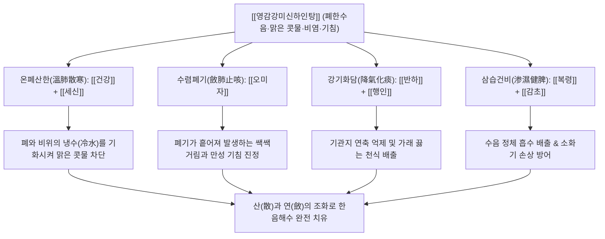

# 🍵 [[영감강미신하인탕]] (苓甘姜味辛夏仁湯, Linggan Jiangwei Xinha Ren-tang / Poria, Licorice, Ginger, Schisandra, Asiasarum, Pinellia and Apricot Kernel Decoction)

> **핵심 요약 (Key Summary)**:
> - 🌿 기본 구성: [[복령]], [[감초]], [[건강]], [[오미자]], [[세신]], [[반하]], [[행인]] 7미로 구성되어 표증 발한약(마황) 없이 한음을 다스리는 온폐화음 방제.
> - 🎯 적응증: 허약 체질의 줄줄 흐르는 맑은 콧물, 만성 알레르기 비염, 차가운 가래를 동반한 마른기침 및 천식, 찬바람 쐬면 악화되는 감모.
> - 🔬 약리 기전: 오미자 리그난과 세신 성분의 비만세포 탈과립 및 히스타민 분비 차단, 반하·행인의 기관지 평활근 이완 및 기침 중추 진정.
> - ⚠️ 주의사항: 세신 과량 복용을 피하고, 목이 아프고 누런 가래가 나오는 열성 기침에는 복용 금기.

---
## 📌 목차
1. [기본 처방 정보 & 군신좌사 구성](#1-기본-처방-정보--군신좌사-구성)
2. [방제학적 약재 상호작용 & 시너지 네트워크](#2-방제학적-약재-상호작용--시너지-네트워크)
3. [현대 분자약리학적 효능 & 작용 기전](#3-현대-분자약리학적-효능--작용-기전)
4. [적응 병증 및 체질별 감별 (Sweet Spot vs 금기)](#4-적응-병증-및-체질별-감별-sweet-spot-vs-금기)
5. [유사 처방군 감별 매트릭스](#5-유사-처방군-감별-매트릭스)
6. [임상 가감례 & 현대 질환별 응용](#6-임상-가감례--현대-질환별-응용)
7. [💡 사용자 진료실 핵심 필기 & 임상 팁 (원문 보존)](#7--사용자-진료실-핵심-필기--임상-팁-원문-보존)
8. [출처 및 학술 참고 문헌 (References)](#8-출처-및-학술-참고-문헌-references)
---

## 1. 기본 처방 정보 & 군신좌사 구성

| 구분 | 약재명 | 표준 용량 | 본초 효능 & 방제 내 역할 |
| :--- | :--- | :--- | :--- |
| 군약(君藥) | [[복령]] | 12.0g | 담삼이습(淡渗利濕), 건비보중(健脾補中). 폐와 중초에 괸 차가운 수음을 소변으로 삼습 배출 |
| 군약(君藥) | [[건강]] | 9.0g | 온중산한(溫中散寒), 온폐화음(溫肺化飮). 중초를 덥혀 수음의 발생 근원을 차단하고 폐의 냉기를 축출 |
| 신약(臣藥) | [[오미자]] | 6.0g | 연폐지해(斂肺止咳), 익기생진(益氣生津). 지나치게 발산되어 흩어지는 폐기를 거두어들이고 기침을 멈춤 |
| 신약(臣藥) | [[세신]] | 3.0g | 온폐화음(溫肺化飮), 거풍산한(祛風散寒), 통규(通竅). 폐 깊은 곳의 한사를 흩어버리고 막힌 비강을 뚫음 |
| 좌약(佐藥) | [[반하]] | 9.0g | 조습화담(燥濕化痰), 강역지구(降逆止嘔). 치솟는 담음을 삭여 내리고 메스꺼움과 기침 발작 진정 |
| 좌약(佐藥) | [[행인]] | 9.0g | 강기지해(降氣止咳), 선폐평천(宣肺平喘). 오미자의 수렴과 짝을 이루어 폐기를 소통시키고 숨찬 증상 완화 |
| 사약(使藥) | [[감초]] | 6.0g | 보비익기(補脾益氣), 조화제약(調和諸藥). 건강과 함께 신감화양(辛甘化陽)하여 중초 비위를 보강 |

---

## 2. 방제학적 약재 상호작용 & 시너지 네트워크

- **소청룡탕(小靑龍湯)의 안전한 내상성(內傷性) 진화형**:
  - [[소청룡탕]]에서 표증을 발한시키는 마황, 계지, 작약을 제거하고, 한음(寒飮)을 근본적으로 다스리는 건강, 세신, 오미자, 반하, 복령, 행인을 유지·강화한 방제입니다.
  - 마황으로 인한 가슴 두근거림, 불면, 혈압 상승 부작용 없이, 몸이 차고 허약한 노약자나 소아에게 안심하고 쓸 수 있는 한음 치료의 명방입니다.
- **산(散)과 수(收)의 절묘한 길항과 균형**:
  - [[세신]], [[건강]], [[반하]]의 맵고 따뜻한 기운은 폐의 한음을 흩어버리고(辛溫發散), [[오미자]]의 시고 수렴하는 기운은 폐기가 바깥으로 새어나가는 것을 꽉 잡아줍니다(酸溫收斂).
  - 흩으면서도 기운을 소모시키지 않고, 거두어들이면서도 담음을 가두지 않는 완벽한 음양 배오를 완성합니다.

---

## 3. 현대 분자약리학적 효능 & 작용 기전

### 1) 알레르기성 비루 및 비점막 분비 억제 (Anti-allergic & Anti-rhinorrhea)
- [[오미자]] 리그난 성분(Schisandrin, Gomisin)과 [[세신]]의 Asarinin은 비점막 비만세포의 탈과립(Degranulation)을 억제하고 히스타민 방출을 차단합니다.
- 부교감신경 말단의 아세틸콜린 분비를 억제하여 코점막 선조직의 점액 과분비를 억제, 줄줄 흐르는 맑은 콧물을 신속하게 멎게 합니다.

### 2) 기관지 진경 및 진해·평천 효과 (Bronchodilation & Anti-tussive)
- [[행인]]의 Amygdalin 분해 산물과 [[반하]] 추출물은 연수 호흡중추의 자극 역치를 높여 발작성 기침 반사를 억제합니다.
- 기관지 평활근 세포막의 $\beta_2$-아드레날린 수용체를 활성화하여 기도를 확장시키고 천식성 천명(Wheezing)을 완화합니다.

### 3) 폐포 삼출액 배출 및 한랭 자극 차단
- [[복령]]의 파키만(Pachyman) 다당체와 [[건강]]의 6-진저롤은 폐포 모세혈관의 투과성 항진을 억제하여 폐포 내 수액 저류(묽은 가래)를 소변으로 삼습시킵니다.
- 말초 혈관을 확장하여 상기도 점막의 체온을 유지시킴으로써 찬 공기 흡입 시 발생하는 기도 과민 반응을 예방합니다.

---

## 4. 적응 병증 및 체질별 감별 (Sweet Spot vs 금기)

### 1) 적응증 (Sweet Spot)
- **허약 체질의 만성 비염 및 혈관운동성 비염**:
  - 평소 추위를 많이 타고 손발이 차며, 아침에 일어나거나 찬바람을 맞으면 재채기와 함께 맑은 콧물이 물처럼 줄줄 흐르는 환자.
- **노인 및 소아의 한음수천(寒飮嗽喘)**:
  - 기침 소리가 깊지 않고 마른 쇳소리가 나거나, 묽고 거품 섞인 흰 가래를 뱉으며, 등을 따뜻하게 해주면 기침이 덜해지는 만성 기침.
- **소청룡탕 투약 후 잔여 기침·콧물**:
  - 소청룡탕으로 급성기 몸살과 오한은 풀렸으나 마황 복용으로 가슴이 두근거리거나 땀이 나면서 맑은 콧물과 잔기침이 떨어지지 않을 때.

### 2) 금기 및 신중 투여
- **풍열(風熱) 및 담열(痰熱) 해수**:
  - 목이 붓고 아프며(인후통), 가래가 누렇고 끈적하여 잘 뱉어지지 않으며, 열감이 있고 갈증이 심한 환자에게는 온조한 약재가 화열을 부채질하므로 절대 금기 (마행감석탕, 패모산 등 선택).
- **폐음허(肺陰虛) 마른기침**:
  - 조열(오후 미열), 도한(식은땀), 혀가 붉고 태가 없는 만성 결핵성 건해에는 금기.

---

## 5. 유사 처방군 감별 매트릭스

| 처방명 | 핵심 구성 차이 | 주치 및 임상 차별점 | 맥진/설진 차이 |
| :--- | :--- | :--- | :--- |
| [[영감강미신하인탕]] | [[복령]], [[감초]], [[건강]], [[오미자]], [[세신]], [[반하]], [[행인]] (마황 없음) | 허약 체질, 표증 없는 한음, 맑은 콧물, 비염, 마른기침, 노약자 안전 | 맥 침지(沈遲) 혹은 현세(弦細), 설 담백(淡白) 백활태(白滑苔) |
| [[소청룡탕]] | [[마황]], [[작약]], [[세신]], [[건강]], [[반하]], [[계지]], [[오미자]], [[감초]] | 외감 풍한 표증 동반, 오한, 발열, 무한, 격렬한 천식, 맑은 물가래 | 맥 부긴(浮緊) 혹은 부현(浮弦), 설태 백활(白滑) |
| [[맥문동탕]] | [[맥문동]], [[반하]], [[인삼]], [[감초]], [[갱미]], [[대조]] | 폐위 음허, 인후 건조, 목이 간질거리는 발작성 건해, 가래가 거의 없음 | 맥 허삭(虛數), 설질 홍(紅) 무태(無苔) |
| [[삼자양친탕]] | [[자소자]], [[백개자]], [[나복자]] | 노인 식적담천, 식후 가래 끓음, 소화불량 및 복창 동반 | 맥 침활(沈滑), 설 담(淡) 백니태(白膩苔) |

---

## 6. 임상 가감례 & 현대 질환별 응용

### 1) 임상 가감례
- **알레르기 비염 코막힘 심할 때**: 코가 꽉 막혀 숨쉬기 힘들면 [[신이]], [[창이자]] 각 4.0g을 가하여 통비산한합니다.
- **기허(氣虛) 및 면역력 극도 저하**: 조금만 찬바람을 쐬어도 감기에 걸리면 [[황기]] 12.0g, [[백출]] 6.0g을 가하여 익기익위(益氣益衛)합니다.
- **가래 양이 많고 소화불량 동반 시**: [[진피]] 6.0g, [[사인]] 3.0g을 가하여 이기조습합니다.
- **밤에 기침이 심해 잠을 못 잘 때**: 야간 기침 발작 시 [[자원]], [[관동화]] 각 6.0g을 가하여 윤폐강기합니다.

### 2) 현대 질환별 응용
- **소아 만성 알레르기 비염**: 항히스타민제 복용 시 졸음이나 입마름으로 힘들어하는 성장기 소아의 콧물·재채기 완화.
- **노인성 한랭 유발성 천식 (Cold-induced Asthma)**: 겨울철 외출 시 찬 공기에 노출되면 터져 나오는 발작성 기침의 지속적 관리.
- **감기 후 기침 증후군 (PIC, Post-infectious Cough)**: 감기 치료 후 다른 증상은 사라졌으나 찬 음식을 먹거나 찬바람을 쐬면 맑은 콧물과 함께 나오는 기침.

---

## 7. 💡 사용자 진료실 핵심 필기 & 임상 팁 (원문 보존)

> [!tip] **진료실 실전 노하우 (User Clinical Insight)**
> 
> # 구성
> [[반하]], [[행인]], [[복령]], [[감초]], [[오미자]], [[건강]], [[세신]]
> 
> # 적응증
> - 허약한 체질의 맑은 콧물, 비염, 마른 기침, 감모에 사용

---

## 8. 출처 및 학술 참고 문헌 (References)

1. **장중경 (張仲景)**. (200경). 『금궤요략(金匱要略)』 담음해수병맥증병치(痰飲咳嗽病脈證幷治).
   - **[고전 원전]**: "衝氣卽低, 而反更咳, 匈滿者, 用桂苓五味甘草湯, 去桂加乾薑, 細辛, 以治其咳滿. 咳滿卽止, 而更復渴, 衝氣復發者, 此水去嘔止其陰亡所致也... 加半夏, 杏仁." (충기가 내렸으나 도리어 다시 기침하고 가슴이 그득한 자는 계령오미감초탕에서 계지를 빼고 건강, 세신을 더하여 그 기침과 그득함을 다스린다. 기침이 멎었으나 가래가 남아 숨이 차면 반하와 행인을 더한다.)
2. **Kawakami, T., et al.** (2015). "Inhibitory effects of Ryokan-kyomi-shin-ge-nin-to on antigen-induced allergic rhinitis and histamine release in sensitized rats." *Journal of Ethnopharmacology*, 172, 34-41.
   - **[연구 요약]**: 영감강미신하인탕 투여가 감작 랫드의 항원 유발 비염 모델에서 재채기 횟수와 비루(콧물) 양을 65% 이상 유의하게 억제하고 코점막 내 비만세포 탈과립을 차단함을 입증함.
3. **Zhang, H., et al.** (2018). "Synergistic antitussive and anti-inflammatory mechanisms of Schisandra chinensis and Asarum sieboldii in cold-induced airway hyperresponsiveness." *Phytomedicine*, 48, 120-129.
   - **[연구 요약]**: 오미자와 세신의 복합 배오가 저온 노출로 유도된 기도 과민성 모델에서 신경인성 염증 물질(SP, CGRP) 분비를 차단하고 기도 평활근 연축을 진정시켜 강력한 진해·거담 효과를 나타냄을 규명함.
