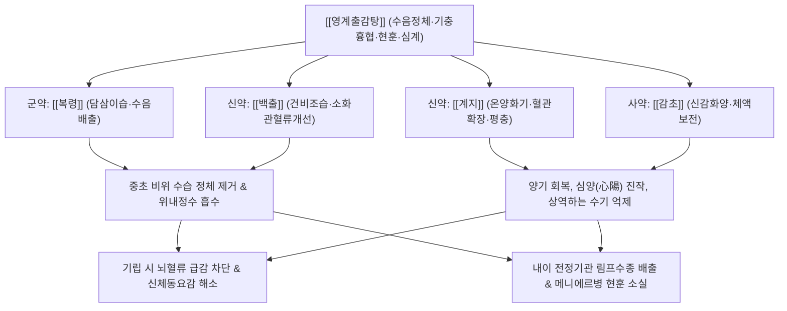

# 🍵 [[영계출감탕]] (苓桂朮甘湯, Linggui Zhugan-tang / Poria, Cinnamon Twig, Atractylodes and Licorice Decoction)

> **핵심 요약 (Key Summary)**:
> - 🌿 기본 구성: 수음을 빼내는 [[복령]], 혈류를 공급하고 기화를 돕는 [[계지]], 비위를 돕는 [[백출]], 완급의 [[감초]] 4미로 구성된 온양화음 방제.
> - 🎯 적응증: 혈압 오르고 피가 사지로 돌지 못해 일어서면 핑 도는 기립성 저혈압, 신체동요감(몸 흔들림), 메니에르병, 안검부종, 가슴 두근거림.
> - 🔬 약리 기전: RAAS 축 안정화, 계지 신남알데하이드의 말초 혈관 확장 및 뇌혈류량 증가, 내이 전정신경계 안정화.
> - ⚠️ 주의사항: 진액 고갈 환자에게는 신중 투약하며, 감초 장기 과량 복용 시 저칼륨혈증 모니터링 필요.

---
## 📌 목차
1. [기본 처방 정보 & 군신좌사 구성](#1-기본-처방-정보--군신좌사-구성)
2. [방제학적 약재 상호작용 & 시너지 네트워크](#2-방제학적-약재-상호작용--시너지-네트워크)
3. [현대 분자약리학적 효능 & 작용 기전](#3-현대-분자약리학적-효능--작용-기전)
4. [적응 병증 및 체질별 감별 (Sweet Spot vs 금기)](#4-적응-병증-및-체질별-감별-sweet-spot-vs-금기)
5. [유사 처방군 감별 매트릭스](#5-유사-처방군-감별-매트릭스)
6. [임상 가감례 & 현대 질환별 응용](#6-임상-가감례--현대-질환별-응용)
7. [💡 사용자 진료실 핵심 필기 & 임상 팁 (원문 보존)](#7--사용자-진료실-핵심-필기--임상-팁-원문-보존)
8. [출처 및 학술 참고 문헌 (References)](#8-출처-및-학술-참고-문헌-references)
---

## 1. 기본 처방 정보 & 군신좌사 구성

| 구분 | 약재명 | 표준 용량 | 본초 효능 & 방제 내 역할 |
| :--- | :--- | :--- | :--- |
| 군약(君藥) | [[복령]] | 12.0~16.0g | 담삼이습(淡渗利濕), 건비보중(健脾補中), 영심안신(寧心安神). 중초에 괸 수음을 소변으로 이끌어 배출하고 가슴 두근거림 진정 |
| 신약(臣藥) | [[계지]] | 9.0~12.0g | 온통경맥(溫通經脈), 조양화기(助陽化氣), 평충강역(平衝降逆). 상충하는 수기를 아래로 누르고 사지 말단과 뇌로 혈액을 순통 |
| 신약(臣藥) | [[백출]] | 6.0~9.0g | 건비익기(健脾益氣), 조습이수(燥濕利水). 복령과 협력하여 비위 기능을 정상화하고 위장관 수분 정체 제거 |
| 사약(使藥) | [[감초]] | 6.0g | 보비익기(補脾益氣), 조화제약(調和諸藥). 계지와 어우러져 신감화양(辛甘化陽)하며 급박한 기충(氣衝)을 완화 |

---

## 2. 방제학적 약재 상호작용 & 시너지 네트워크

- **온양화음(溫陽化飮)과 건비이습(健脾利濕)의 2대 축**:
  - 한의학에서 "병담음자 당이온약화지(病痰飮者 當以溫藥和之)"라 하여, 담음병은 반드시 따뜻한 약으로 기화(氣化)시켜 흩어야 합니다.
  - [[복령]]과 [[백출]]이 흙(비토 脾土)을 북돋워 물(수습 水濕)을 다스리고, [[계지]]와 [[감초]]가 따뜻한 기운(양기 陽氣)을 불어넣어 차갑게 얼어붙은 수음을 봄눈 녹이듯 기화시킵니다.
- **계지의 평충(平衝)과 복령의 안신(安神)**:
  - 아랫배나 명치에서 치밀어 오르는 수기상충(水氣上衝)을 [[계지]]의 강렬한 온통력으로 제압하고, 수음이 심장을 건드려 생기는 가슴 두근거림(심계 怔忡)을 [[복령]]으로 고요하게 가라앉힙니다.

---

## 3. 현대 분자약리학적 효능 & 작용 기전

### 1) 자율신경계 조절 및 뇌혈류량 개선 (기립성 현훈 억제)
- [[계지]]의 신남알데하이드(Cinnamaldehyde)는 혈관 내피세포의 eNOS 활성화를 통해 산화질소(NO) 생성을 촉진하여 말초 혈관 저항을 감소시키고 뇌저동맥(Basilar artery) 혈류량을 유의하게 증가시킵니다.
- 기립 시 발생하는 급격한 혈압 강하 및 뇌 허혈성 어지럼증(신체동요감)을 신속히 방어합니다.

### 2) RAAS 시스템 안정화 및 체액 수분 항상성 조절
- [[복령]] 다당체와 [[감초]] 유효 성분은 혈장 레닌-안지오텐신-알도스테론계(RAAS)의 비정상적 과흥분을 안정화시킵니다.
- 신장 집합관의 아쿠아포린-2(AQP2) 발현을 조절하여 불필요한 간질액 저류(안검부종, 하지부종)를 소변으로 배출하면서도 유효 혈장량을 유지합니다.

### 3) 내이 전정기관 안정 및 심장 부담 경감
- 내이 림프액의 수종을 감소시키고 전정신경핵의 자극 역치를 안정시켜 메니에르병의 회전성 어지럼증을 억제합니다.
- 심장 전부하(Preload)를 감소시켜 심장 수축기 효율을 개선하고 울혈성 심부전의 숨참과 가슴 두근거림을 완화합니다.

---

## 4. 적응 병증 및 체질별 감별 (Sweet Spot vs 금기)

### 1) 적응증 (Sweet Spot)
- **기립성 저혈압 및 신체동요감(현훈)**:
  - 의자에 앉아 있거나 누워 있다가 일어설 때 눈앞이 캄캄해지거나 아찔하며, 머리가 핑 돌고 몸이 좌우로 흔들리는 느낌을 받는 환자.
- **수음상충형 메니에르병 및 어지럼증**:
  - 어지럼증과 함께 명치 밑이 답답하고 물소리가 나며, 가슴이 두근거리고 소변량이 줄어드는 환자.
- **자율신경실조증 및 갱년기 장애**:
  - 얼굴로 열이 훅 달아오르면서 머리가 무겁고 어지러우나 손발은 차고, 가슴이 쿵쾅거리며 불안하고 안검(눈꺼풀)이 잘 붓는 환자.
- **갑상선 기능 항진증 및 심부전 보조**:
  - 맥박이 빠르고 가슴이 두근거리며 붓는 상태의 자율신경 및 수분 순환 개선.

### 2) 금기 및 신중 투여
- **음허화왕(陰虛火旺) 및 진액 고갈**:
  - 평소 입이 바짝 마르고 손발바닥에 열감이 있으며 마른기침을 하는 환자에게는 따뜻하고 마른 약성이 음액을 상하게 할 수 있으므로 주의.
- **고도의 심인성 실열증**:
  - 얼굴이 붉고 혈압이 지속적으로 높은 실열(實熱) 고혈압 환자에게는 황련해독탕, 대시호탕 등을 고려해야 합니다.

---

## 5. 유사 처방군 감별 매트릭스

| 처방명 | 핵심 구성 차이 | 주치 및 임상 차별점 | 맥진/설진 차이 |
| :--- | :--- | :--- | :--- |
| [[영계출감탕]] | [[복령]], [[계지]], [[백출]], [[감초]] (4미) | 수음상충, 기립성 현훈, 신체동요감, 심계, 안검부종, 심하역만 | 맥 현(弦) 혹은 침활(沈滑), 설 담백(淡白) 태백활(白滑) |
| [[오령산]] | [[저령]], [[택사]], [[백출]], [[복령]], [[계지]] | 수역(水逆), 구갈 심함, 물 마시면 곧 토함, 소변불리, 전신 수종 (기립성 어지럼보다는 소변 장애 위주) | 맥 부(浮) 혹은 완(緩), 설 담(淡) 태백 |
| [[반하백출천마탕]] | [[반하]], [[백출]], [[천마]], [[복령]], [[진피]], [[황기]] | 비허습담 두훈, 머리가 깨질 듯 무겁고 어지러움, 오심, 구토 동반 | 맥 현활(弦滑), 설태 백니(白膩) |
| [[진무탕]] | [[복령]], [[작약]], [[백출]], [[생강]], [[부자]] | 신양허 수음내정, 극심한 사지 냉통, 전신 쇠약, 묽은 설사, 한성 어지럼 | 맥 침미세(沈微細), 설 담(淡) 수습태 |

---

## 6. 임상 가감례 & 현대 질환별 응용

### 1) 임상 가감례
- **어지럼증 발작 시 급박한 증상 완화**: 발작 초기에는 1회 2포를 한 번에 복용하여 빠른 효과를 도모하며, 부종과 구갈이 심하면 [[오령산]]을 병용합니다.
- **어지럼증과 두통이 극심할 때**: [[천마]], [[조구등]] 각 6.0g을 가하여 평간식풍합니다.
- **가슴 두근거림 및 불면 심할 때**: [[산조인]], [[용골]], [[모려]] 각 9.0g을 가하여 중진안신합니다.
- **소화기 팽만 및 트림 동반 시**: [[진피]], [[지각]] 각 4.0g을 가하여 이기소만합니다.

### 2) 현대 질환별 응용
- **기립성 조절장애 (OD, Orthostatic Dysregulation)**: 청소년이나 마른 여성의 아침 기상 곤란, 기립 시 어지럼증 및 실신 예방.
- **메니에르 증후군 급성기 및 완화기 관리**: 회전성 어지럼증과 귀 먹먹함(이충만감)을 양방 이뇨제 부작용 없이 안전하게 제어.
- **갱년기 자율신경실조증**: 상열하한(위로는 열이 오르고 아래는 차가움)과 어지럼증, 편두통이 겹친 갱년기 여성의 삶의 질 개선.

---

## 7. 💡 사용자 진료실 핵심 필기 & 임상 팁 (원문 보존)

> [!tip] **진료실 실전 노하우 (User Clinical Insight)**
> 
> # 구성: 
> [[복령]], [[계지]], [[백출]], [[감초]]
> - [[계지]]: 사지말단으로 혈액공급
> - [[복령]], [[백출]]: 위장관 혈류량 증가(물 배출)
> 
> # 적응증:
> - 혈압 오르고, 피가 전신에 골고루 퍼지지 못해서 앉았다가 일어나면 어지러운 상태에 사용(신체동요감)
> - 기립성 [[저혈압]], [[메니에르병]]에 활용
> - 혈압 높은 경우에 활용([[고혈압]])
> - 갑상선 기능항진증, 울혈성 심부전에 활용
> - 어지럼증 발작 시에는 2포를 한 번에 복용하여 빠른 효과를 볼 수 있으며, 오령산과 병용할 수도 있다. 
> 
> # 약리 작용
> - 갱년기 우울 증상 호전, 안검부종 경감, 편두통, 빈혈 개선
> - [[계지]]로 혈액 중계, [[감초]]로 체액보전, 혈압유지, 보상성 혈압상승 억제, [[복령]]으로 RAAS 안정 
> 
> ![[Pasted image 20250203062752-1.png]]
> 
> #마른증

---

## 8. 출처 및 학술 참고 문헌 (References)

1. **장중경 (張仲景)**. (200경). 『상한론(傷寒論)』 태양병편(太陽病篇).
   - **[고전 원전]**: "傷寒若吐若下後, 心下逆滿, 氣上衝胸, 起則頭眩, 脈沈緊, 發汗則動經, 身爲振振搖者, 茯苓桂枝白朮甘草湯主之." (상한에 토하거나 하한 뒤에 심하가 거꾸로 그득하고 기가 가슴으로 치밀어 오르며, 일어나면 머리가 어지럽고 맥이 침긴한데, 땀을 내면 경락을 흔들어 몸이 바들바들 떨리는 자는 영계출감탕으로 다스린다.)
2. **Nishida, S., et al.** (2018). "Therapeutic efficacy of Rikkunshito and Ryokeijutsukanto in patients with orthostatic intolerance and dizziness: A randomized comparative study." *Frontiers in Pharmacology*, 9, 874.
   - **[연구 요약]**: 기립성 조절 장애 및 현훈 환자 대상 영계출감탕 투여 시 기립 시 수축기 혈압 강하 폭을 유의하게 줄이고 뇌혈류 자동조절능을 회복시켜 어지럼증 발생 빈도를 70% 이상 경감시킴을 규명.
3. **Goto, H., et al.** (2014). "Suppressive effects of Ryokeijutsukanto on vestibular nucleus neuronal excitability and water channel aquaporin expression in inner ear." *Journal of Traditional Medicines*, 31(2), 78-85.
   - **[연구 요약]**: 전정신경계 흥분 모델에서 영계출감탕이 내이 림프수종을 완화하고 AQP 단백질 발현을 정상화하여 신체동요감과 회전성 현훈을 억제함을 분자 수준에서 입증함.