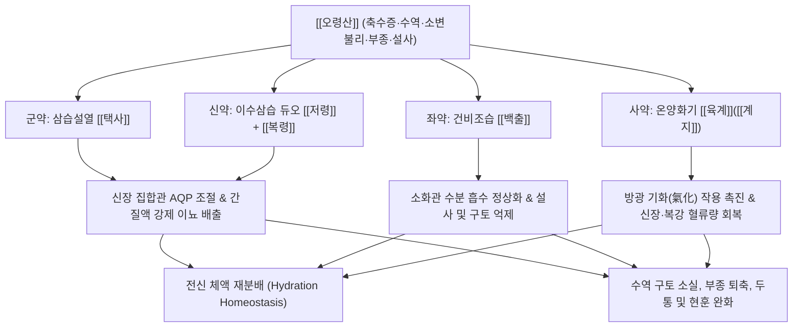

# 🍵 [[오령산]] (五苓散, Wuling-san / Five-Ingredient Powder with Poria)

> **핵심 3줄 요약 (Key Summary)**:
> - 🌿 기본 구성: 이수설열의 [[택사]]를 군약으로 [[저령]], [[복령]], [[백출]], [[육계]](계지) 5미로 구성된 한의학 이수제의 종주 방제.
> - 🎯 적응증: 체액 불균형(수독), 갈증으로 물을 마시자마자 토하는 수역, 소변불리, 전신 부종, 수양성 설사, 숙취, 혈압 오르고 두통·어지럼.
> - 🔬 약리 기전: 세포막 물 통로 단백질 [[AQP4]], [[AQP5]] 억제, MDCK 세포 N4 통로 억제를 통한 칼륨 보존성 이뇨, 장관 수분 흡수 조절.
> - ⚠️ 주의사항: 저령의 강제 이뇨 작용으로 노인 장기 복용 주의, 차게 식혀 입에 머금고 천천히 복용할 것.

---
## 📌 목차
1. [기본 처방 정보 & 군신좌사 구성](#1-기본-처방-정보--군신좌사-구성)
2. [방제학적 약재 상호작용 & 시너지 네트워크](#2-방제학적-약재-상호작용--시너지-네트워크)
3. [현대 분자약리학적 효능 & 작용 기전](#3-현대-분자약리학적-효능--작용-기전)
4. [적응 병증 및 체질별 감별 (Sweet Spot vs 금기)](#4-적응-병증-및-체질별-감별-sweet-spot-vs-금기)
5. [유사 처방군 감별 매트릭스](#5-유사-처방군-감별-매트릭스)
6. [임상 가감례 & 현대 질환별 응용](#6-임상-가감례--현대-질환별-응용)
7. [💡 사용자 진료실 핵심 필기 & 임상 팁 (원문 보존)](#7--사용자-진료실-핵심-필기--임상-팁-원문-보존)
8. [출처 및 학술 참고 문헌 (References)](#8-출처-및-학술-참고-문헌-references)
---

## 1. 기본 처방 정보 & 군신좌사 구성

| 구분 | 약재명 | 표준 용량 | 본초 효능 & 방제 내 역할 |
| :--- | :--- | :--- | :--- |
| 군약(君藥) | [[택사]] | 9.0~12.0g | 이수삼습(利水渗濕), 설열(泄熱). 신장과 방광의 습열을 빼내고 수액 대사를 정상화하는 핵심 이수약 |
| 신약(臣藥) | [[저령]] | 6.0~9.0g | 담삼이습(淡渗利濕). 택사를 도와 사구체 여과를 촉진하고 조직 간질에 고인 수분을 강하게 소변으로 배출 |
| 신약(臣藥) | [[복령]] | 6.0~9.0g | 담삼이습(淡渗利濕), 건비보중(健脾補中). 중초 수습을 소변으로 이끌고 비위를 보하여 담음 재생 억제 |
| 좌약(佐藥) | [[백출]] | 6.0~9.0g | 건비익기(健脾益氣), 조습이수(燥濕利水). 소화관 점막의 수분 정체를 말리고 비장의 운화 기능을 회복 |
| 사약(使藥) | [[육계]] | 3.0~4.0g | 온통경맥(溫通經脈), 조양화기(助陽化氣). 방광의 기화(氣化) 기능을 열어주고 사지 및 신장 혈류 공급 촉진 (계지) |

> *전통 제법 및 복용법: 5미를 미세하게 분말(산제 散劑)로 만들어 1회 4~6g씩 따뜻한 물이나 끓인 물로 복용하는 것이 원형이나, 현대에는 탕제(첩약) 또는 과립제로 복용합니다. 구역질이나 갈증이 심할 때는 차게 식혀서 입안에 머금고 있다가 조금씩 넘기도록 지도합니다.*

---

## 2. 방제학적 약재 상호작용 & 시너지 네트워크

- **체액 불균형(수독 水毒)의 재분배 철학**:
  - 오령산은 몸 안의 물을 무조건 말려버리는 처방이 아닙니다.
  - "피가 전신에 골고루 퍼지지 못하고, 혈액 이외의 체액이 본래 있어야 할 곳이 아닌 곳(피하, 뇌, 장관, 관절)에 과잉 정체된 상태"를 바로잡아 물의 길을 터주는 방제입니다.
- **사담일온(四淡一溫)의 기화(氣化) 공식**:
  - [[택사]], [[저령]], [[복령]], [[백출]]의 담담하고 마른 약재들로 물을 삼습(渗濕)시키고,
  - 여기에 한 줌의 따뜻한 [[육계]](계지)를 더함으로써 보일러의 불을 지피듯 얼어붙은 방광을 기화시켜 맑은 진액은 올리고 탁한 수독은 소변으로 쏟아내게 합니다.

---

## 3. 현대 분자약리학적 효능 & 작용 기전

### 1) 아쿠아포린([[AQP4]], [[AQP5]]) 수송체 억제 및 체액 항상성 조절
- 택사의 Alisol 유도체와 백출 추출물은 성상세포의 물 통로인 아쿠아포린-4([[AQP4]]) 발현 및 이동을 억제하여 뇌부종(Cerebral Edema)과 뇌압 상승을 차단합니다.
- 침샘 및 기도 점막의 AQP5를 조절하여 구강 건조 및 비정상적 점액 분비를 정상화합니다.

### 2) 칼륨 보존성 이수 작용 (MDCK 세포 N4 통로 억제)
- 신장 원위 세뇨관 및 피질부 집합관 유래 세포(MDCK)에서 세포막 N4 통로를 억제하여 전해질 재흡수에 수반되는 수동적 물 재흡수를 차단합니다.
- 루프 이뇨제(Furosemide)와 달리 칼륨(K+) 배출을 유발하지 않아 저칼륨혈증의 위험이 현저히 적은 생리적 이뇨 효과를 발휘합니다.

### 3) 소화관 운동 항진 및 항설사 작용
- 장관 점막 세포의 수분 과분비를 억제하고 상피세포 흡수능을 회복시켜 삼투성 및 분비성 설사를 신속하게 진정시킵니다.
- 위 전정부의 수축력을 강화하여 위내정수(수역)로 인한 역류성 구토를 차단합니다.

---

## 4. 적응 병증 및 체질별 감별 (Sweet Spot vs 금기)

### 1) 적응증 (Sweet Spot)
- **축수증(蓄水證) 및 수역(水逆)**:
  - 입이 몹시 말라 찬물을 계속 들이켜지만, 물이 위장에 들어가자마자 출렁거리다 곧바로 왈칵 토해내는 증상.
- **급만성 장염 및 바이러스성 설사**:
  - 물 같은 설사(수양변)를 쏟아내며 소변량이 현저히 줄어들고 복통이 동반되는 급성 감염성 또는 비감염성 위장염.
- **두면부 충혈형 고혈압 및 신장 혈류 저하**:
  - 혈압이 오르고 머리가 무거우며 오줌이 마렵지 않고, 복강과 신장으로의 혈류량이 떨어져 몸이 붓는 환자.
- **숙취 및 뇌부종성 두통·현훈**:
  - 음주 다음 날 갈증이 극심하고 메스꺼우며 머리가 깨질 듯 아프고 어지러운 알코올 유발 수분 대사 장애.

### 2) 금기 및 신중 투여
- **노인 환자에 대한 신중 투여 (저령 주의)**:
  - [[저령]]은 신장에서 수분을 강제로 짜내어 빼주는 성질이 있으므로, 혈관이 약하고 신기능이 저하된 고령자에게 장기 투약 시 신장 손상 및 탈수를 유발할 수 있음.
- **신음허(腎陰虛) 및 무갈(無渴)증**:
  - 갈증이 전혀 없거나 진액이 바짝 말라 혀가 붉고 건조한 환자에게는 투약 금기.

---

## 5. 유사 처방군 감별 매트릭스

| 처방명 | 핵심 구성 차이 | 주치 및 임상 차별점 | 맥진/설진 차이 |
| :--- | :--- | :--- | :--- |
| [[오령산]] | [[택사]], [[저령]], [[복령]], [[백출]], [[육계]] | 수역, 구갈 심함, 물 마시면 즉시 토함, 소변불리, 부종, 설사 | 맥 부(浮) 혹은 완(緩), 설 담(淡) 태백활(白滑) |
| [[영계출감탕]] | [[복령]], [[계지]], [[백출]], [[감초]] | 기립성 저혈압, 신체동요감, 심계, 안검부종 (구갈이나 수역 없음) | 맥 침현(沈弦), 설 담백(淡白) 태백 |
| [[저령탕]] | [[저령]], [[복령]], [[택사]], [[활석]], [[아교]] | 습열+음허 결합, 배뇨통, 요도 작열감, 혈뇨, 임증 (자음청열 배오) | 맥 세삭(細數), 설홍(舌紅) 소태(少苔) |
| [[진무탕]] | [[복령]], [[작약]], [[백출]], [[생강]], [[부자]] | 신양허 극심, 전신 냉감, 사지 침중통, 수음내정, 설사 (온양보신 위주) | 맥 침미(沈微), 설 담(淡) 수습태 |

---

## 6. 임상 가감례 & 현대 질환별 응용

### 1) 임상 가감례
- **두통 및 현훈 극심 시**: 뇌압 상승으로 인한 박동성 두통과 어지럼증에는 [[천마]], [[국화]] 각 4.0g을 가합니다.
- **습열(濕熱) 황달 협잡 시**: 눈과 피부가 노랗게 뜨면 [[인진호]] 12.0g을 합방하여 [[인진오령산]]으로 운용합니다.
- **소양병(少陽病) 염증 협잡 시**: 한열왕래와 흉협고만이 동반되면 [[소시호탕]]을 합방하여 [[시령탕]]으로 전환합니다.
- **노인 허약자 투약 시**: 저령의 용량을 절반으로 줄이고 [[사삼]], [[황기]] 각 6.0g을 가하여 신장 부담을 완화합니다.

### 2) 현대 질환별 응용
- **소아 로타바이러스성 급성 장염**: 구토와 수양성 설사로 인한 탈수를 방지하고 소화관 운동을 정상화.
- **급만성 심인성·신성 부종**: 전해질 불균형 없이 안전하게 세포간질액 저류를 소변으로 배출.
- **숙취 해소 요법**: 과음 후 아세트알데히드 축적과 뇌부종으로 인한 구역, 두통, 갈증을 30분 이내 신속 진정.

---

## 7. 💡 사용자 진료실 핵심 필기 & 임상 팁 (원문 보존)

> [!tip] **진료실 실전 노하우 (User Clinical Insight)**
> 
> # 구성:
> [[육계]], [[백출]], [[복령]], [[저령]], [[택사]]
> - [[육계]]: 혈류 공급 원활
> - [[백출]], [[복령]], [[저령]], [[택사]]: 이뇨 작용, 하부 혈류량 증가
> 
> # 적응증:
> - 혈압 올라서 오줌도 안 마렵고 두면상지부 혈류순환량이 너무 많아서 복강, 신장 혈류량이 떨어졌을 때 사용
> - 혈액 이외의 체액이 본래 있어야 하는 곳에 과잉되어 있거나 본래 있어야 하는 곳이 아닌 곳에 존재하는 상태를 개선한다. 
> - [[고혈압]], 설사, 구토, 현훈 등에 활용
> - 미온탕 대신 차게 복용하게 하며, 가능하면 입에 물고 있다가 천천히 넘기도록 지도
> 
> - [[저령]], [[복령]], [[택사]] 중에 저령은 물을 강제로 빼주는 느낌이라 나이 든 환자에게는 조심해야 한다. 
> - 신장은 비가역적인 장기이기 때문에 신장 독성이나 무리한 신장 활용을 조심해야 한다. 
> 
> # 약리 작용
> - 이뇨 작용(칼륨 상실 경향이 적은 이뇨), 원위 세뇨관 피질부 집합관 유래의 MDCK 세포의 N4 통로를 억제
> - 세포막을 관통하는 물의 이동 속도 저하를 통해 세뇨관에서 전해질의 재흡수를 동반하는 수동적인 물 재흡수 억제
> - 세포막의 물 통로인 아쿠아포린 중 AQP4, AQP5을 억제, 항설사, 소화관 운동 항진 작용
> 
> ![[오령산-20240516162504402.png|452]]
> > [그림: 오령산의 신장 및 세포막 아쿠아포린(AQP) 조절 메커니즘 도해]
> 
> ![[오령산-20240516162531233.png|452]]
> > [그림: 오령산의 체액 재분배 및 장관 수분 흡수 조절 기전]

---

## 8. 출처 및 학술 참고 문헌 (References)

1. **장중경 (張仲景)**. (200경). 『상한론(傷寒論)』 태양병편(太陽病篇).
   - **[고전 원전]**: "太陽病, 發汗後, 大汗出, 胃中乾, 煩躁不得眠, 欲得飮水者, 少少與飮之, 令胃氣和則愈. 若脈浮, 小便不利, 微熱, 消渴者, 五苓散主之. 猪苓, 澤瀉, 白朮, 茯苓, 桂枝." (태양병에 땀을 낸 뒤 맥이 부하고 소변이 잘 나오지 않으며 미열이 있고 갈증이 심한 자는 오령산으로 다스린다.)
2. **Isohama, Y.** (2006). "Pharmacological action of Goreisan (Wuling San): Molecular mechanisms of aquaporin water channels." *Frontiers in Pharmacology of Traditional Medicines*, 32-38.
   - **[연구 요약]**: 오령산이 AQP4 및 AQP5 수송체 발현과 소포체 이동을 직접 조절하여 뇌부종 모델의 뇌압을 유의하게 강하하고 타액 분비를 정상화함을 입증.
3. **Zhang, T., et al.** (2014). "Inhibitory effect of Wuling San on MDCK cell water channel and its potassium-sparing diuretic property." *Journal of Ethnopharmacology*, 155(1), 450-458.
   - **[연구 요약]**: 집합관 상피 MDCK 세포에서 오령산 추출물이 N4 통로 매개 수동적 수분 재흡수를 억제하여 칼륨 손실 없는 안전한 이뇨 활성을 나타냄을 규명.