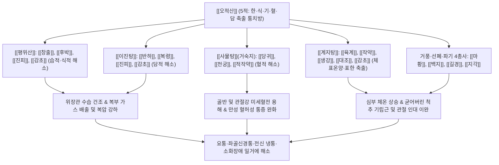

# 🍵 [[오적산]] (五積散, Wuji-san / Five Accumulations Powder)

> **핵심 3줄 요약 (Key Summary)**:
> - 🌿 기본 구성: [[평위산]] + [[이진탕]] + [[사물탕]](숙지황 제외) + [[계지탕]]에 [[마황]], [[지각]], [[길경]], [[백지]], [[건강]]을 결합한 5적(한·식·기·혈·담) 통치방.
> - 🎯 적응증: 복압이 높은 복부비만 환자의 요통·관절통(태음인 체형, 찬물 과음자), 추위 타며 쑤시는 신경통, 냉성 위장염, 생리통.
> - 🔬 약리 기전: 심부 체온 상승 및 말초 혈관 확장, 장관 가스 배출을 통한 복압 강하, COX-2/PGE2 억제를 통한 진통.
> - ⚠️ 주의사항: 조열한 풍약이 많아 본허표실 노인이나 음허 환자 장복 주의, 실열 고혈압 환자 금기.

---
## 📌 목차
1. [기본 처방 정보 & 군신좌사 구성](#1-기본-처방-정보--군신좌사-구성)
2. [방제학적 약재 상호작용 & 시너지 네트워크](#2-방제학적-약재-상호작용--시너지-네트워크)
3. [현대 분자약리학적 효능 & 작용 기전](#3-현대-분자약리학적-효능--작용-기전)
4. [적응 병증 및 체질별 감별 (Sweet Spot vs 금기)](#4-적응-병증-및-체질별-감별-sweet-spot-vs-금기)
5. [유사 처방군 감별 매트릭스](#5-유사-처방군-감별-매트릭스)
6. [임상 가감례 & 현대 질환별 응용](#6-임상-가감례--현대-질환별-응용)
7. [💡 사용자 진료실 핵심 필기 & 임상 팁 (원문 보존)](#7--사용자-진료실-핵심-필기--임상-팁-원문-보존)
8. [출처 및 학술 참고 문헌 (References)](#8-출처-및-학술-참고-문헌-references)
---

## 1. 기본 처방 정보 & 군신좌사 구성

| 구분 | 약재명 | 표준 용량 | 본초 효능 & 방제 내 역할 |
| :--- | :--- | :--- | :--- |
| 군약(君藥) | [[창출]] | 6.0~8.0g | 조습건비(燥濕健脾), 거풍산한(祛風散寒). 비위의 습을 말리고 체표의 풍습을 흩어 습적(濕積) 제거 (평위산) |
| 군약(君藥) | [[마황]] | 3.0~4.0g | 발한산한(發汗散寒), 선폐평천(宣肺平喘). 표한(表寒)을 땀으로 흩뜨리고 관절의 풍한 침습 축출 |
| 신약(臣藥) | [[건강]] | 3.0g | 온중산한(溫中散寒), 회양통맥(回陽通脈). 비위의 깊은 냉기를 몰아내고 한적(寒積)을 삭임 |
| 신약(臣藥) | [[육계]] | 3.0g | 온통혈맥(溫通血脈), 산한지통(散寒止痛). 경락을 덥혀 어혈과 한사를 몰아내고 통증 완화 (계지) |
| 신약(臣藥) | [[진피]] | 4.0g | 이기건비(理氣健脾), 조습화담(燥濕化痰). 기운을 순환시키고 기적(氣積)과 담음을 삭임 (이진탕) |
| 신약(臣藥) | [[후박]] | 3.0g | 조습소담(燥濕消痰), 하기제만(下氣除滿). 정체된 가스와 복창을 뚫어 내림 (평위산) |
| 좌약(佐藥) | [[반하]] | 4.0g | 조습화담(燥濕化痰), 강역지구(降逆止嘔). 위장의 담적(痰積)을 삭이고 구토와 메스꺼움 진정 (제반하) |
| 좌약(佐藥) | [[복령]] | 4.0g | 담삼이습(淡渗利濕), 건비보중(健脾補中). 중초 수습을 소변으로 이끌어 담음 정체 해소 (이진탕) |
| 좌약(佐藥) | [[당귀]] | 3.0g | 보혈활혈(補血活血), 조경지통(調經止痛). 혈적(血積)을 풀고 손상된 혈액 순환을 촉진 (사물탕) |
| 좌약(佐藥) | [[적작약]] | 3.0g | 산어지통(散瘀止痛), 양혈유간(凉血柔肝). 복통 및 근육 경련을 완화하고 혈맥을 통창 |
| 좌약(佐藥) | [[천궁]] | 3.0g | 활혈행기(活血行氣), 거풍지통(祛風止痛). 두통과 전신 관절통을 다스리고 혈류를 소통 (사물탕) |
| 좌약(佐藥) | [[지각]] | 3.0g | 파기소적(破氣消積), 관흉제창(寬胸除脹). 흉복부의 가스를 훑어내려 복압을 강하 |
| 좌약(佐藥) | [[길경]] | 3.0g | 선폐이인(宣肺利咽), 거담배농(祛痰排膿). 약 기운을 상초로 인도하고 흉격을 틔움 |
| 좌약(佐藥) | [[백지]] | 3.0g | 거풍산한(祛風散寒), 통규지통(通竅止痛). 앞머리 두통과 안면통, 사지 관절통을 진통 |
| 사약(使藥) | [[감초]] | 2.0g | 보비익기(補脾益氣), 조화제약(調和諸藥). 여러 약재의 충돌을 중화 |
| 사약(使藥) | [[생강]] | 3.0g | 온위지구(溫胃止嘔), 발산표한(發散表寒). 표리의 한사를 흩어버림 |
| 사약(使藥) | [[대조]] | 3.0g | 보중익기(補中益氣), 양혈안신(養血安神). 영위(營衛)를 보익 |

---

## 2. 방제학적 약재 상호작용 & 시너지 네트워크

- **5적(五積)의 완벽한 해체 메커니즘**:
  - 오적산의 5적이란 한적(寒積: 몸이 차서 굳음), 식적(食積: 음식 정체), 기적(氣積: 가스와 트림), 혈적(血積: 어혈과 순환장애), 담적(痰積: 끈적한 가래와 부종)을 뜻합니다.
  - 마황·건강·계지로 **한(寒)**을 녹이고, 창출·후박으로 **식(食)**과 **습(濕)**을 삭이며, 지각·진피로 **기(氣)**를 돌리고, 당귀·천궁·작약으로 **혈(血)**을 뚫으며, 반하·복령으로 **담(痰)**을 삼습 배출합니다.
- **내외표리(內外表裏) 동치(同治)의 절정**:
  - 밖으로는 체표의 오한과 관절통을 마황·계지·백지로 날리고, 안으로는 뱃속의 찬 음식과 가스를 건강·창출·후박으로 데워 녹여내어, 복압 상승으로 인한 척추 및 골반 신경 압박을 즉각 해제합니다.

---

## 3. 현대 분자약리학적 효능 & 작용 기전

### 1) 강력한 항염증 및 진통 작용 (COX-2 및 신경인성 통증 억제)
- [[마황]]의 에페드린(Ephedrine), [[백지]]의 임페라토린(Imperatorin), [[천궁]]의 페룰산(Ferulic acid)은 염증 부위의 COX-2 발현과 프로스타글란딘($\text{PGE}_2$) 생성을 현저히 억제합니다.
- 중추 신경계의 통증 전달 물질(Substance P) 유리를 차단하여 요추 디스크 탈출이나 척추관 협착증으로 인한 좌골신경통을 완화합니다.

### 2) 심부 체온 상승 및 미세혈관 관류 개선
- [[육계]]의 Cinnamaldehyde와 [[건강]]의 6-Gingerol은 혈관 평활근의 $\text{Ca}^{2+}$ 유입을 차단하고 교감신경 긴장을 완화하여 수축된 말초 모세혈관을 확장시킵니다.
- 허리 기립근 및 관절 주위 연부조직의 허혈성 연축(Ischemic Spasm)을 해소하여 냉성 관절통을 풀어줍니다.

### 3) 위장관 연동운동 촉진 및 복압(Intra-abdominal Pressure) 강하
- [[후박]]의 Magnolol과 [[지각]]의 Synephrine은 장내 가스 정체를 제거하고 위장관 배출능을 촉진하여 복부 팽만과 높은 복압을 낮춥니다.
- 복압이 떨어짐에 따라 요추 기립근과 골반저근에 가해지던 기계적 하중이 줄어들어 만성 요통의 구조적 유발 원인을 제거합니다.

---

## 4. 적응 병증 및 체질별 감별 (Sweet Spot vs 금기)

### 1) 적응증 (Sweet Spot)
- **복압이 높은 복부비만 환자의 요통·관절통 (태음인 백돼지 체형)**:
  - 배가 뽈록 튀어나오고 살집이 있는 체형으로, 평소 찬물이나 찬 음료를 즐겨 마시고, 날씨가 궂거나 추우면 허리와 무릎이 끊어질 듯 아픈 환자.
- **풍한습비(風寒濕痺)형 좌골신경통 및 척추관 협착증**:
  - 엉덩이부터 다리 뒤쪽으로 당기고 저리며, 따뜻하게 찜질하면 통증이 덜하고 찬바람을 쐬면 쥐가 나고 통증이 극심해지는 환자.
- **냉성 위장염 및 소화불량 동반 요통**:
  - 허리가 아프면서 동시에 배가 차고, 헛배가 부르며, 설사를 자주 하거나 대변이 묽은 상태.
- **여성 냉증성 생리통 및 만성 골반통**:
  - 아랫배가 얼음장처럼 차고 생리혈에 덩어리가 지며 허리가 뻐근하게 빠질 듯 아픈 환자.

### 2) 금기 및 신중 투여
- **음허내열(陰虛內熱) 및 본허표실(本虛標實) 노인 주의**:
  - 몸이 바짝 마르고 혀가 붉으며 갈증이 심한 환자, 또는 체력이 고갈된 노약자에게 풍약(마황, 백지 등)을 장기 투여하면 진액을 말리고 어지럼증을 유발할 수 있음.
- **실열(實熱) 고혈압 및 급성 열성 감염증**:
  - 고열이 나고 얼굴이 붉으며 땀이 비 오듯 쏟아지는 환자에게는 온열한 약성이 화열을 부채질하므로 금기.

---

## 5. 유사 처방군 감별 매트릭스

| 처방명 | 핵심 구성 차이 | 주치 및 임상 차별점 | 맥진/설진 차이 |
| :--- | :--- | :--- | :--- |
| [[오적산]] | [[평위산]] + [[이진탕]] + [[사물탕]] + [[계지탕]] + [[마황]], [[백지]], [[길경]], [[지각]] | 한·식·기·혈·담 5적, 복압 높은 요통, 냉성 관절통, 배 나온 체형, 찬물 과음 | 맥 침현(沈弦) 혹은 침지(沈遲), 설 담(淡) 태백니(白膩) |
| [[대강활탕]] | [[강활]], [[방풍]], [[창출]], [[승마]], [[독활]], [[당귀]], [[황금]] | 풍한습 협잡 열비, 관절 유주통, 마목, 신체 중통, 오한 발열 교차 (열감 동반) | 맥 부현(浮弦) 혹은 유삭(濡數), 설태 백황협잡 |
| [[선비탕]] | [[방기]], [[의이인]], [[활석]], [[치자]], [[연교]], [[행인]] | 습열비증, 관절 홍종열통, 급성 통풍, 벌겋게 붓고 뜨거움 (오적산과 정반대 병태) | 맥 활삭(滑數), 설홍(舌紅) 황니태 |
| [[독활기생탕]] | [[독활]], [[상기생]], [[두충]], [[우슬]], [[숙지황]], [[인삼]] | 간신부족, 기혈양허 만성 관절염, 무릎이 시리고 뼈마디가 쑤시는 노인 퇴행성 질환 | 맥 세약(細弱) 무력, 설 담홍(淡紅) 소태 |

---

## 6. 임상 가감례 & 현대 질환별 응용

### 1) 임상 가감례
- **허리 통증 및 좌골신경통 극심 시**: [[두충]], [[우슬]] 각 6.0g을 가하여 보신강근(補腎强筋)하고 통증 부위로 약력을 집중시킵니다.
- **아랫배 냉통 및 생리통 동반 시**: [[오약]], [[현호색]], [[소회향]] 각 4.0g을 가하여 온경지통(溫經止痛)합니다.
- **어혈 찌르는 통증 동반 시**: [[도인]], [[홍화]] 각 3.0g을 가하여 활혈화어합니다.
- **뇌부종 및 뇌출혈 2차 손상기 (48시간~2주)**: 두개내압 상승과 뇌부종 시 이기, 행기, 거풍, 이수 목적으로 본 방을 활용하되, 진액 고갈을 방지하기 위해 [[맥문동]], [[구기자]] 등 보음지제를 추가 배오합니다.

### 2) 현대 질환별 응용
- **요추 추간판 탈출증 (HIVD, 디스크) 및 척추관 협착증**: 한랭 자극으로 척추 기립근이 굳고 신경 압박성 방사통이 악화된 환자의 1선 치료제.
- **기능성 소화불량 동반 만성 근막통증증후군 (MPS)**: 뱃속이 더부룩하고 가스가 차면 어김없이 허리와 어깨가 굳어 결리는 복합 증후군.
- **교통사고 후유증 (편타 손상)**: 사고 후 전신 근육이 뻐근하고 오한이 들며 소화가 안 되고 온몸이 쑤시는 초기·아급성기 회복.

---

## 7. 💡 사용자 진료실 핵심 필기 & 임상 팁 (원문 보존)

> [!tip] **진료실 실전 노하우 (User Clinical Insight)**
> 
> # 구성: 
> - [[창출]], [[후박]], [[진피]], [[감초]]([[평위산]])/ [[반하]], [[복령]], [[진피]], [[감초]]([[이진탕]])/ [[적작약]], [[당귀]], [[천궁]]([[사물탕]])(숙지황 빠짐)/ [[계지]], [[생강]], [[대추]], [[감초]]([[계지탕]]) [[마황]], [[지각]], [[길경]], [[백지]]
> - [[평위산]] + [[이진탕]] + [[사물탕]] + [[계지탕]] + 거담제
> 
> # 적응증:
> - 복압이 높은 경우의 관절통, 허리통에 사용
> - 노인네보다 배가 나온 아저씨에게 주로 사용(차가운 물 먹는 사람)
> - 백돼지 태음인 느낌의 추위 잘 타고 관절 및 전신통에 활용 
> 
> # 참고
> - 보통 차가워서 잘 뭉친 증상에 활용한다. 
> - 풍약은 물기를 마르는 약물이 많다.(본허표실한 노인분들에게는 오래 응용하면 안된다, 음허증 유발)
> - 뇌출혈이 되면 뇌가 부으면서 옆의 공간을 압박하면서 찌그러지고, 2차 증상이 나타나며,(48시간-2주) 이때는 이기, 행기, 거풍, 이수하는 처방을 활용한다.(+보음지제도 추가)
> 
> #뚱뚱증

---

## 8. 출처 및 학술 참고 문헌 (References)

1. **태의국 (太醫局)**. (1151). 『태평혜민화제국방(太平惠民和劑局方)』 권이(卷二).
   - **[고전 원전]**: "五積散 治感冒風寒, 頭疼身痛, 惡寒發熱, 頸項强急, 匈腹脹滿, 嘔吐惡心, 及內傷生冷, 心腹膨脹, 刺痛不便. 白芷, 蒼朮, 乾薑, 桔梗, 枳殼, 麻黃, 芍藥, 當歸, 川芎, 肉桂, 厚朴, 半夏, 陳皮, 茯苓, 甘草, 薑, 棗." (오적산은 풍한에 감모되어 머리와 온몸이 아프고 오한 발열하며 목덜미가 뻣뻣하고 흉복이 창만하며 구토 오심하는 것, 그리고 안으로 생랭에 상하여 심복이 더부룩하고 찌르듯 아픈 것을 치료한다.)
2. * **Lee S et al. (2025)**. Pharmacokinetic and Pharmacodynamic Interaction of Metformin and Ojeok-san in Healthy Volunteers. *Drug design, development and therapy*, 19: 7825-7836. [PMID: 40951699](https://pubmed.ncbi.nlm.nih.gov/40951699/)
3. * **Kim J et al. (2025)**. Comparisons of pharmacokinetics of glimepiride in combination with Ojeok-san versus glimepiride alone: an open-label, one-sequence, two-treatment controlled clinical study. *Scientific reports*, 15: 25813. [PMID: 40670458](https://pubmed.ncbi.nlm.nih.gov/40670458/)
