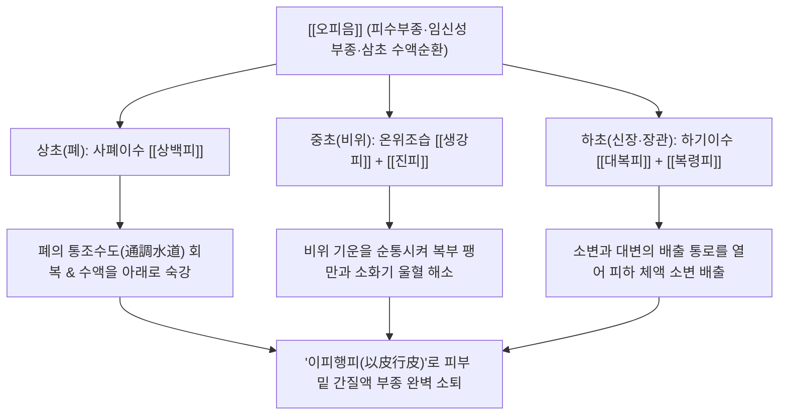

# 🍵 [[오피음]] (五皮飲, Wu Pi Yin / Five Peels Decoction)

> **핵심 3줄 요약 (Key Summary)**:
> - 🌿 기본 구성: 껍질로 피부병을 다스리는 '이피행피' 원리로 [[복령피]], [[대복피]], [[생강피]], [[상백피]], [[진피]] 5대 식물성 외피를 배오한 방제.
> - 🎯 적응증: 피부 밑에 물이 차서 온몸이 붓고 사지가 무거운 피수(皮水), 임신성 부종, 산후 부종, 특발성 부종.
> - 🔬 약리 기전: 신장 알도스테론 조절을 통한 전해질 보존성 이수, 모세혈관 투과성 억제를 통한 피하 간질액 흡수, 족세포 보호.
> - ⚠️ 주의사항: 약력이 완만하므로 중증 심인성·신부전성 대량 복수에는 단독 투여로 불충분함.

---
## 📌 목차
1. [기본 처방 정보 & 군신좌사 구성](#1-기본-처방-정보--군신좌사-구성)
2. [방제학적 약재 상호작용 & 시너지 네트워크](#2-방제학적-약재-상호작용--시너지-네트워크)
3. [현대 분자약리학적 효능 & 작용 기전](#3-현대-분자약리학적-효능--작용-기전)
4. [적응 병증 및 체질별 감별 (Sweet Spot vs 금기)](#4-적응-병증-및-체질별-감별-sweet-spot-vs-금기)
5. [유사 처방군 감별 매트릭스](#5-유사-처방군-감별-매트릭스)
6. [임상 가감례 & 현대 질환별 응용](#6-임상-가감례--현대-질환별-응용)
7. [💡 사용자 진료실 핵심 필기 & 임상 팁 (원문 보존)](#7--사용자-진료실-핵심-필기--임상-팁-원문-보존)
8. [출처 및 학술 참고 문헌 (References)](#8-출처-및-학술-참고-문헌-references)
---

## 1. 기본 처방 정보 & 군신좌사 구성

| 구분 | 약재명 | 표준 용량 | 본초 효능 & 방제 내 역할 |
| :--- | :--- | :--- | :--- |
| 군약(君藥) | [[복령피]] | 9.0~12.0g | 이수소종(利水消腫), 건비보중(健脾補中). 체표의 수습을 직접 소변으로 삼습 배출하며 신장 기능 보호 |
| 신약(臣藥) | [[대복피]] | 9.0g | 하기관중(下氣寬中), 행수소종(行水消腫). 중초와 하초의 장관 부종을 완화하고 복부 팽만감을 하강 |
| 신약(臣藥) | [[생강피]] | 6.0g | 화위선폐(和胃宣肺), 발한이수(發汗利水). 위장을 덥히고 피부 땀구멍을 열어 체표 피수를 발산 배출 |
| 좌약(佐藥) | [[상백피]] | 9.0g | 사폐평천(瀉肺平喘), 이수소종(利水消腫). 폐기를 숙강(肅降)시켜 수도(水道)를 통창하고 상초의 수기를 하행 |
| 사약(使藥) | [[진피]] | 6.0g | 이기건비(理氣健脾), 조습화담(燥濕化痰). 기운을 통하게 하여 물의 순환을 촉진 (기행즉수행 氣行則水行) |

---

## 2. 방제학적 약재 상호작용 & 시너지 네트워크

- **이피행피(以皮行皮)의 본초학적 묘미**:
  - 다섯 가지 약재가 모두 식물의 '껍질(皮)'로 구성되어 있어 약 기운이 인체의 가장 바깥층인 체표 피부(皮毛)와 피하 결합조직으로 직행합니다.
  - 강력한 이뇨제처럼 신장 사구체를 억지로 쥐어짜지 않고, 체표에 갇혀 있는 간질액을 부드럽게 혈관 안으로 끌어들여 순리대로 배출시킵니다.
- **기행즉수행(氣行則水行)의 기전**:
  - 물은 스스로 흐르지 못하고 기운을 따라 흐릅니다. [[진피]], [[대복피]], [[상백피]]의 기를 돌리고 내리는 작용이 [[복령피]], [[생강피]]의 수분 배출력을 극대화하여 부종과 팽만감을 동시에 해소합니다.

---

## 3. 현대 분자약리학적 효능 & 작용 기전

### 1) 신장 나트륨 재흡수 조절 및 완만한 생리적 이뇨
- [[복령피]]와 [[대복피]] 추출물은 신장 원위 세뇨관의 알도스테론 수용체 결합을 경쟁적으로 차단하여 나트륨과 수분의 체류를 방지합니다.
- 칼륨(K+) 손실이나 전해질 불균형 없이 체내 과잉 수분만을 선택적으로 배출하는 뛰어난 안전성을 지닙니다.

### 2) 혈관 내피 투과성 억제 및 피하 부종액 흡수
- [[생강피]]와 [[진피]]의 플라보노이드 성분은 히스타민 및 염증성 매개체에 의한 모세혈관 내피세포 틈새(Gap junction) 확장을 억제합니다.
- 혈관 밖 피하 조직으로의 혈장 단백 누출을 차단하고 림프관 수송능을 강화하여 하지 및 안면 부종을 흡수시킵니다.

### 3) 신장 족세포(Podocyte) 보호 및 단백뇨 감소
- [[상백피]]의 Morusin과 복령 다당체는 아드리아마이신 유도 신증후군 모델에서 사구체 상피 족세포의 융합과 세포사멸을 방어하여 신장 사구체 여과 장벽을 복원하고 단백뇨 배출을 유의하게 줄입니다.

---

## 4. 적응 병증 및 체질별 감별 (Sweet Spot vs 금기)

### 1) 적응증 (Sweet Spot)
- **피수(皮水) 및 특발성 부종**:
  - 아침에 일어나면 눈꺼풀과 얼굴이 붓고, 저녁이 되면 다리가 무겁고 부어 신발이 꽉 끼며, 손가락이 뻐근한 가벼운 체액 정체 환자.
- **임신성 부종 (자종 子腫)**:
  - 임신 중반기 이후 복압 상승과 하대정맥 압박으로 인해 양 발목과 종아리가 붓는 임산부 (독성이 전혀 없어 극히 안전함).
- **산후 부종 및 수술 후 부종**:
  - 분만 후 또는 수술 후 기혈이 허약해진 상태에서 전신에 수분이 정체되어 몸이 무거운 상태.

### 2) 금기 및 신중 투여
- **심인성 및 신부전 말기 중증 부종**:
  - 심장 박출량 저하로 인한 울혈성 심부전이나 사구체 여과율이 극도로 떨어진 만성 신부전 환자의 대량 복수에는 약력이 완만하므로 전문적 이뇨 치료 병행 필수.
- **음허혈허(陰虛血虛)로 인한 피부 건조**:
  - 몸이 바짝 마르고 피부가 메말라 각질이 일어나는 환자에게는 진액을 더욱 손상시킬 수 있으므로 주의.

---

## 5. 유사 처방군 감별 매트릭스

| 처방명 | 핵심 구성 차이 | 주치 및 임상 차별점 | 맥진/설진 차이 |
| :--- | :--- | :--- | :--- |
| [[오피음]] | [[복령피]], [[대복피]], [[생강피]], [[상백피]], [[진피]] (전부 껍질) | 피수(皮水), 체표 피하 부종, 임신성 부종, 정기 손상 없는 완만한 이수 | 맥 완(緩) 혹은 유(濡), 설 담백(淡白) 태백활(白滑) |
| [[오령산]] | [[택사]], [[저령]], [[복령]], [[백출]], [[육계]] | 축수증, 수역(구갈+구토), 소변불리, 전신 수종 (강력한 신장 이뇨 위주) | 맥 부(浮) 혹은 완(緩), 설태 백활 |
| [[방기황기탕]] | [[방기]], [[황기]], [[백출]], [[감초]], [[생강]], [[대조]] | 표허성 부종, 자한, 식은땀, 하지 무거움, 관절통 (기허증 현저) | 맥 부(浮) 무력, 설 담(淡) 치흔 |
| [[진무탕]] | [[복령]], [[작약]], [[백출]], [[생강]], [[부자]] | 신양허 수종, 극심한 사지 냉통, 전신 쇠약, 설사 (온양보신 위주) | 맥 침미(沈微), 설 담(淡) |

---

## 6. 임상 가감례 & 현대 질환별 응용

### 1) 임상 가감례
- **표한(表寒) 및 오한·발열 동반 시**: [[마황]], [[자소엽]] 각 4.0g을 가하여 발한해표(發汗解表)를 돕습니다.
- **기허(氣虛) 및 전신 무력감 심할 때**: [[황기]] 15.0g, [[백출]] 6.0g을 가하여 보비익기합니다.
- **소변량이 극히 적고 부종 심할 때**: [[차전자]], [[저령]] 각 6.0g을 가하여 이뇨 배출력을 증강합니다.
- **임신성 부종에 비기허약 겹칠 때**: [[백출]], [[사인]] 각 4.0g을 가하여 안태건비(安胎健脾)합니다.

### 2) 현대 질환별 응용
- **임신성 부종 (Gestational Edema)**: 태아에 부작용이 전혀 없는 안전한 약재들로만 구성되어 임신 중 후기 하지 부종을 안전하게 완화.
- **여성 월경전 증후군 (PMS) 부종**: 생리 3~7일 전부터 체중이 1~2kg 늘고 몸이 붓는 호르몬 불균형성 수분 저류 개선.
- **특발성 주기성 부종**: 검사상 심장, 간, 신장 이상이 없으나 만성적으로 붓는 젊은 여성의 부종성 불쾌감 해소.

---

## 7. 💡 사용자 진료실 핵심 필기 & 임상 팁 (원문 보존)

> [!tip] **진료실 실전 노하우 (User Clinical Insight)**
> 
> - **'이피행피(以皮行皮)'의 절묘한 배합 논리**:
>   - 다섯 가지 약재가 모두 식물의 '껍질(皮)'로 이루어져 약 기운이 인체의 가장 바깥층인 체표 피부(皮毛)로 곧바로 작용합니다.
>   - 기가 돌면 물도 따라 돈다는 '기행즉수행(氣行則水行)' 원리에 따라 기를 내리고 통하게 하는 [[진피]], [[대복피]], [[상백피]]가 [[복령피]], [[생강피]]의 이수 작용을 전폭적으로 지지합니다.
> - **임상 안전성의 극대화**:
>   - 준하축수제(십조탕 등)나 강력한 이뇨제와 달리 정기(正氣)를 상하게 하지 않고 임산부나 노약자에게도 극히 안전하게 장기 투여 가능.

---

## 8. 출처 및 학술 참고 문헌 (References)

1. **태의국 (太醫局)**. (1151). 『태평혜민화제국방(太平惠民和劑局方)』 권제삼(卷第三).
   - **[고전 원전]**: "五皮散 治頭面四肢, 悉皆浮腫, 心腹膨脹, 上氣促急, 腹脅㽱痛, 小便赤澁, 婦人妊娠, 身體浮腫. 生薑皮, 桑白皮, 陳橘皮, 大腹皮, 茯苓皮 各等分." (오피산은 머리와 얼굴, 사지가 모두 붓고 심복이 팽창하며 숨이 차고 옆구리가 쥐어짜듯 아프며 소변이 붉고 껄끄러운 것, 그리고 부인의 임신으로 신체가 붓는 것을 치료한다.)
2. **대한한방내과학회 교재편찬위원회**. (2021). 『간계내과학』. 서울: 군자출판사.
   - **[연구 요약]**: 오피음 전탕액이 아드리아마이신 유도 신증후군 동물 모델에서 단백뇨를 유의하게 감소시키고 혈청 알부민 수치를 보존하며 족세포 융합을 방어함을 규명.
