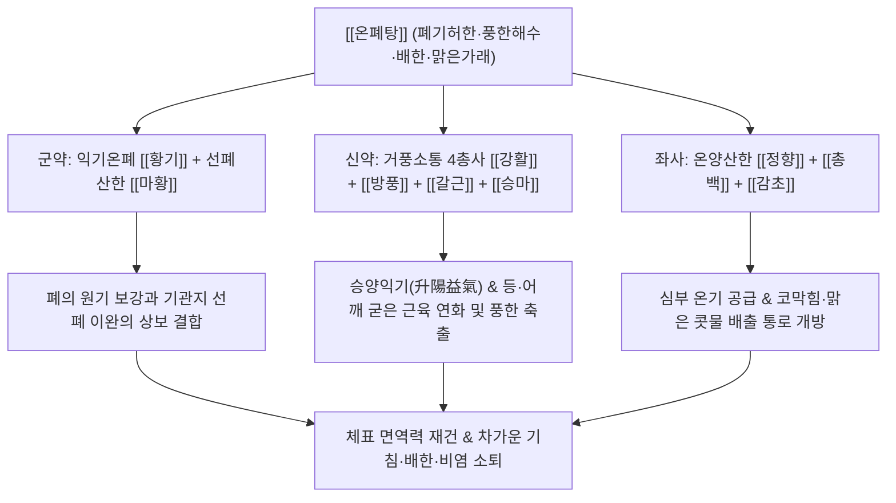

# 🍵 [[온폐탕]] (溫肺湯, Wenfei-tang / Lung-Warming Decoction)

> **핵심 3줄 요약 (Key Summary)**:
> - 🌿 기본 구성: 폐기를 온보하는 [[황기]], 풍한을 흩뜨리는 [[마황]]에 [[강활]], [[방풍]], [[갈근]], [[승마]], [[정향]], [[총백]], [[감초]]를 결합한 방제.
> - 🎯 적응증: 폐기허한으로 인한 기침, 천식, 맑은 콧물, 가래, 등이 시린 배한(背寒), 찬바람 쐬면 으슬으슬 춥고 몸이 쑤시는 증상.
> - 🔬 약리 기전: 황기 다당체의 상기도 분비형 sIgA 분비 촉진, 마황·정향의 기관지 평활근 이완 및 진해, 갈근의 미세순환 개선.
> - ⚠️ 주의사항: 신온 발산약 위주이므로 인후통이 심하거나 누런 가래가 나오는 담열·음허 환자 금기.

---
## 📌 목차
1. [기본 처방 정보 & 군신좌사 구성](#1-기본-처방-정보--군신좌사-구성)
2. [방제학적 약재 상호작용 & 시너지 네트워크](#2-방제학적-약재-상호작용--시너지-네트워크)
3. [현대 분자약리학적 효능 & 작용 기전](#3-현대-분자약리학적-효능--작용-기전)
4. [적응 병증 및 체질별 감별 (Sweet Spot vs 금기)](#4-적응-병증-및-체질별-감별-sweet-spot-vs-금기)
5. [유사 처방군 감별 매트릭스](#5-유사-처방군-감별-매트릭스)
6. [임상 가감례 & 현대 질환별 응용](#6-임상-가감례--현대-질환별-응용)
7. [💡 사용자 진료실 핵심 필기 & 임상 팁 (원문 보존)](#7--사용자-진료실-핵심-필기--임상-팁-원문-보존)
8. [출처 및 학술 참고 문헌 (References)](#8-출처-및-학술-참고-문헌-references)
---

## 1. 기본 처방 정보 & 군신좌사 구성

| 구분 | 약재명 | 표준 용량 | 본초 효능 & 방제 내 역할 |
| :--- | :--- | :--- | :--- |
| 군약(君藥) | [[황기]] | 8.0~12.0g | 보비익폐(補脾益肺), 고표지한(固表止汗). 폐의 원기를 온보하여 기침을 멈추고 체표 방어력을 구축 |
| 군약(君藥) | [[마황]] | 4.0~6.0g | 발한산한(發汗散寒), 선폐평천(宣肺平喘). 폐에 엉겨붙은 한사를 땀으로 날려 기도를 뚫고 천식 진정 |
| 신약(臣藥) | [[강활]] | 4.0g | 산한거풍(散寒祛風), 통락지통(通絡止痛). 상체의 풍한사를 몰아내고 등과 어깨의 시린 통증 해소 |
| 신약(臣藥) | [[방풍]] | 4.0g | 거풍해표(祛風解表), 승습지통(勝濕止痛). 황기와 짝을 이루어 외감 풍사를 막고 기침을 가라앉힘 |
| 신약(臣藥) | [[갈근]] | 6.0g | 해기퇴열(解肌退熱), 생진지갈(生津止渴). 목덜미와 등의 근육 긴장을 풀고 진액을 끌어올림 |
| 신약(臣藥) | [[승마]] | 3.0g | 승양거풍(升陽祛風), 청열해독(淸熱解毒). 비위의 맑은 양기를 상초로 끌어올려 폐기를 온포(溫布) |
| 좌약(佐藥) | [[정향]] | 2.0g | 온중강역(溫中降逆), 온신조양(溫腎助陽). 맵고 따뜻한 향기로 비위와 폐의 냉기를 흩어버림 |
| 좌약(佐藥) | [[총백]] | 3.0g | 발한해표(發汗解表), 통양산한(通陽散寒). 막힌 양기를 소통시켜 비강을 뚫고 땀을 냄 (파뿌리) |
| 사약(使藥) | [[감초]] | 3.0g | 보비익기(補脾益氣), 조화제약(調和諸藥). 여러 신온한 발산약의 성질을 부드럽게 융합 |

---

## 2. 방제학적 약재 상호작용 & 시너지 네트워크

- **보기(補氣)와 발한(發汗)의 공보겸시(攻補兼施)**:
  - 기운이 없는 사람이 감기에 걸리면 몸에 땀을 낼 만한 양기(陽氣)가 부족하여 풍한(風寒) 사기가 폐 깊숙이 파고들어 만성 기침과 냉증으로 변합니다.
  - [[황기]]로 폐기와 위기(衛氣)를 든든히 채워 밀어내는 힘을 만들고, [[마황]], [[강활]], [[방풍]]으로 체표의 문을 열어 한사를 밖으로 내쫓습니다.
- **승마·갈근의 승양(升陽)과 정향의 온중(溫中)**:
  - 이동원 특유의 승양익기(升陽益氣) 원리가 담겨 있어, [[승마]]와 [[갈근]]이 비위의 따뜻하고 맑은 양기를 폐로 밀어 올려주고, [[정향]]이 뱃속 깊은 냉기를 덥혀 폐로 치솟는 찬 기운을 근본적으로 차단합니다.

---

## 3. 현대 분자약리학적 효능 & 작용 기전

### 1) 상기도 점막 면역력 강화 (Mucosal Immunity Enhancement)
- [[황기]]의 다당체(Astragalus Polysaccharides)와 아스트라갈로사이드 성분은 기도 상피세포에서 분비형 면역글로불린 A(sIgA) 분비를 촉진하고 폐포 대식세포의 탐식능을 강화합니다.
- 외부 바이러스 및 세균이 호흡기 점막에 부착하는 것을 방어하여 만성 재발성 감기를 예방합니다.

### 2) 기관지 확장 및 진해·항알레르기 (Bronchodilation & Anti-tussive)
- [[마황]]의 Ephedrine과 Pseudoephedrine은 교감신경 $\alpha/\beta$ 수용체를 자극하여 기관지 평활근을 신속히 이완시키고 기도 저항을 줄입니다.
- [[정향]]의 Eugenol은 신경인성 기도 염증을 억제하고 기침 반사 중추를 진정시켜 찬 공기에 노출될 때 터져 나오는 발작성 기침을 완화합니다.

### 3) 뇌혈류 및 비강 미세순환 개선
- [[갈근]]의 푸에라린(Puerarin)과 [[총백]]의 알릴 화합물은 상기도 점막 모세혈관의 혈류 순환을 촉진하여 점막 부종을 가라앉히고 코막힘을 신속하게 뚫어줍니다.

---

## 4. 적응 병증 및 체질별 감별 (Sweet Spot vs 금기)

### 1) 적응증 (Sweet Spot)
- **폐기허한형 만성 기관지염 및 천식**:
  - 평소 피로를 잘 느끼고 목소리에 힘이 없으며, 조금만 찬 공기를 쐬면 기침이 쏟아지고 묽은 가래가 목구멍에서 끓는 환자.
- **배한(背寒)을 동반한 만성 감모**:
  - 등이나 어깨 부위가 얼음장을 댄 것처럼 시리고 오한이 들며, 따뜻하게 옷을 껴입어야 편안해지는 상태.
- **허약 체질의 혈관운동성 비염**:
  - 온도 변화(에어컨 바람, 환절기 아침)에 극도로 민감하여 코가 맹맹하고 맑은 콧물이 뚝뚝 떨어지는 환자.

### 2) 금기 및 신중 투여
- **폐열(肺熱) 및 담열(痰熱) 실증**:
  - 고열이 나고 목이 붓고 아프며 가래가 누렇고 끈적한 환자에게는 온보·신온 발산약이 화열을 폭발시킬 수 있으므로 금기.
- **음허조열(陰虛燥熱)성 건해**:
  - 오후만 되면 뺨이 붉어지고 손발바닥에 식은땀이 나며 가래가 전혀 없는 마른기침에는 진액을 말리므로 부적합.

---

## 5. 유사 처방군 감별 매트릭스

| 처방명 | 핵심 구성 차이 | 주치 및 임상 차별점 | 맥진/설진 차이 |
| :--- | :--- | :--- | :--- |
| [[온폐탕]] | [[황기]], [[마황]], [[강활]], [[방풍]], [[갈근]], [[승마]], [[정향]], [[총백]], [[감초]] | 폐기허한, 배한(등 시림), 풍한외감 협잡, 맑은 가래, 보기와 발한 겸시 | 맥 침세(沈細) 무력, 설 담백(淡白) 태백활 |
| [[영감강미신하인탕]] | [[복령]], [[감초]], [[건강]], [[오미자]], [[세신]], [[반하]], [[행인]] | 한음 수천, 줄줄 흐르는 맑은 콧물, 마황 없음, 노약자 및 소아 비염 | 맥 침지(沈遲), 설 담(淡) 태백활 |
| [[소청룡탕]] | [[마황]], [[작약]], [[세신]], [[건강]], [[반하]], [[계지]], [[오미자]] | 외감 풍한 표실증 우세, 격렬한 천식 발작, 오한 고열 (허증보다는 실증 위주) | 맥 부긴(浮緊), 설태 백활 |
| [[보중익기탕]] | [[황기]], [[인삼]], [[백출]], [[감초]], [[당귀]], [[진피]], [[승마]], [[시호]] | 비위기허, 중기하함, 식욕부진, 만성 피로 (호흡기 기침·천식 없음) | 맥 허대(虛大) 무력, 설 담홍 |

---

## 6. 임상 가감례 & 현대 질환별 응용

### 1) 임상 가감례
- **등 시림(배한)이 뼛속까지 시릴 때**: [[부자]](포), [[건강]] 각 3.0g을 가하여 온양파한(溫陽破寒)합니다.
- **맑은 가래와 거품 침이 쏟아질 때**: [[반하]], [[복령]] 각 6.0g을 가하여 화담강역합니다.
- **코막힘과 콧물이 심할 때**: [[신이]], [[세신]] 각 3.0g을 가하여 통비규(通鼻竅)합니다.
- **기침이 격렬하여 숨이 찰 때**: [[행인]], [[오미자]] 각 4.0g을 가하여 선폐평천합니다.

### 2) 현대 질환별 응용
- **에어컨 냉방병 및 한랭 과민성 해수**: 여름철 실내 에어컨 냉기 노출 후 오한, 등 시림, 마른기침을 반복하는 직장인 증후군.
- **노인성 만성 폐쇄성 폐질환 (COPD) 악화 예방**: 겨울철 찬바람만 불면 기침과 호흡곤란이 재발하는 고령자의 체온 유지 및 폐 면역 보강.
- **환절기 알레르기성 비염 및 재채기**: 기온 급강하 시 코가 맹맹해지고 두통이 동반되는 허한형 비염 환자의 체질 개선.

---

## 7. 💡 사용자 진료실 핵심 필기 & 임상 팁 (원문 보존)

> [!tip] **진료실 실전 노하우 (User Clinical Insight)**
> 
> # 구성
> [[황기]] [[마황]] [[강활]] [[방풍]] [[갈근]] [[승마]] [[감초]] [[정향]] [[총백]] 
> 
> # 적응증
> - 폐기허약으로 인한 만성 기침, 천식, 맑은 콧물, 가래 그렁거림 치료.
> - 등과 어깨가 시린 배한(背寒) 증상과 외감 풍한이 겹쳐 으슬으슬 추위를 타고 몸이 무거운 환자에게 온폐익기(溫肺益氣)·소풍산한의 특효를 발휘.

---

## 8. 출처 및 학술 참고 문헌 (References)

1. **이동원 (李東垣)**. (1249). 『비위론(脾胃論)』 권하(卷下).
   - **[고전 원전]**: "溫肺湯 治肺氣虛弱, 飮冷當風, 風寒傷於皮毛, 咳嗽喘急, 痰涎稀薄, 惡寒背冷. 黃芪, 麻黃, 羌活, 防風, 葛根, 升麻, 甘草, 丁香, 蔥白." (온폐탕은 폐기가 허약한데 찬 것을 마시고 바람을 맞아 풍한이 피모를 상하여 기침하고 숨이 가쁘며 담연이 묽고 오한하며 등이 시린 것을 다스린다.)
2. **허준 (許浚)**. (1613). 『동의보감(東醫寶鑑)』 내경편(內景篇) 폐장문(肺臟門).
   - **[고전 원전]**: "溫肺湯 治肺虛冷, 咳而唾濁, 惡寒. 丁香, 升麻, 葛根, 羌活, 防風, 麻黃, 黃芪 各等分, 甘草減半, 蔥白三莖." (폐가 허하고 냉하여 기침하며 탁한 침을 뱉고 오한하는 것을 치료한다.)
