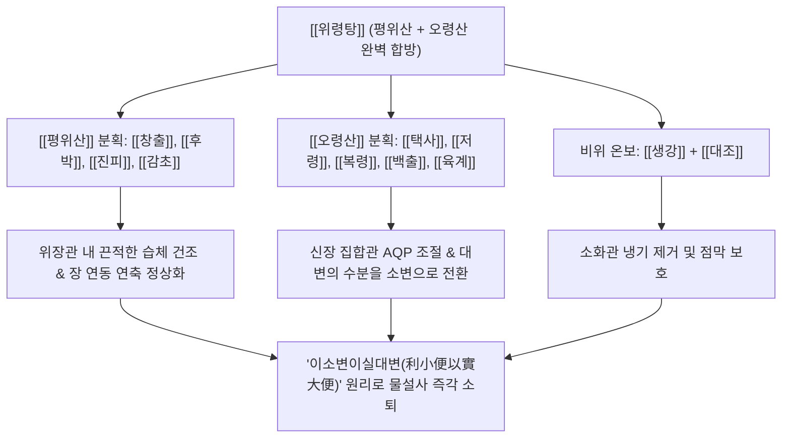

# 🍵 [[위령탕]] (胃苓湯, Weiling-tang / Stomach-Calming and Poria Decoction)

> **핵심 3줄 요약 (Key Summary)**:
> - 🌿 기본 구성: 습을 말리는 [[평위산]]([[창출]], [[후박]], [[진피]], [[감초]])과 물을 빼는 [[오령산]]([[택사]], [[저령]], [[복령]], [[백출]], [[계지]])에 [[생강]], [[대조]] 배오.
> - 🎯 적응증: 찬 음식 과다나 서습으로 인한 급성 물설사(수양성 설사), 복명(배에서 꼬르륵 소리), 복통, 식중독, 장염, 소변량 급감.
> - 🔬 약리 기전: 대장 AQP4 및 신장 AQP2 조절을 통한 '이소변이실대변(대변 수분을 소변으로 전환)', 장점막 밀착연접 복원, 장관 연축 억제.
> - ⚠️ 주의사항: 조습이수약 위주이므로 진액 고갈 환자나 건성 변비 환자 금기, 설사가 멎으면 즉시 중단할 것.

---
## 📌 목차
1. [기본 처방 정보 & 군신좌사 구성](#1-기본-처방-정보--군신좌사-구성)
2. [방제학적 약재 상호작용 & 시너지 네트워크](#2-방제학적-약재-상호작용--시너지-네트워크)
3. [현대 분자약리학적 효능 & 작용 기전](#3-현대-분자약리학적-효능--작용-기전)
4. [적응 병증 및 체질별 감별 (Sweet Spot vs 금기)](#4-적응-병증-및-체질별-감별-sweet-spot-vs-금기)
5. [유사 처방군 감별 매트릭스](#5-유사-처방군-감별-매트릭스)
6. [임상 가감례 & 현대 질환별 응용](#6-임상-가감례--현대-질환별-응용)
7. [💡 사용자 진료실 핵심 필기 & 임상 팁 (원문 보존)](#7--사용자-진료실-핵심-필기--임상-팁-원문-보존)
8. [출처 및 학술 참고 문헌 (References)](#8-출처-및-학술-참고-문헌-references)
---

## 1. 기본 처방 정보 & 군신좌사 구성

| 구분 | 약재명 | 표준 용량 | 본초 효능 & 방제 내 역할 |
| :--- | :--- | :--- | :--- |
| 군약(君藥) | [[창출]] | 5.0g | 조습건비(燥濕健脾), 거풍산한(祛風散寒). 비위의 탁한 습을 말려 복부 팽만과 소화관 수분 정체 제거 (평위산) |
| 군약(君藥) | [[택사]] | 5.0g | 이수삼습(利水渗濕), 설열(泄熱). 신장과 방광의 습열을 빼내고 장관의 수분을 소변으로 유도 (오령산) |
| 신약(臣藥) | [[후박]] | 4.0g | 조습소담(燥濕消痰), 하기제만(下氣除滿). 장내 가스를 배출하고 복통과 창만 완화 (평위산) |
| 신약(臣藥) | [[저령]] | 4.0g | 담삼이습(淡渗利濕). 사구체 여과를 도와 대변으로 빠지는 수분을 소변으로 강력 전환 (오령산) |
| 신약(臣藥) | [[복령]] | 4.0g | 담삼이습(淡渗利濕), 건비보중(健脾補中). 중초 수습을 소변으로 빼내고 비위를 든든히 보익 (오령산) |
| 좌약(佐藥) | [[진피]] | 4.0g | 이기건비(理氣健脾), 조습화담(燥濕化痰). 기운을 통하게 하여 트림과 구역감을 진정 (평위산) |
| 좌약(佐藥) | [[백출]] | 4.0g | 건비익기(健脾益氣), 조습이수(燥濕利水). 소화관 점막의 수분 흡수능을 회복시켜 설사 제어 (오령산) |
| 좌약(佐藥) | [[육계]] | 2.5g | 온통경맥(溫通經脈), 조양화기(助陽化氣). 방광의 기화 기능을 돕고 찬 배를 덥혀 복통 진정 (계지) |
| 사약(使藥) | [[감초]] | 2.0g | 보비익기(補脾益氣), 조화제약(調和諸藥). 여러 약재의 성질을 조화시키고 급박한 복통 완화 |
| 사약(使藥) | [[생강]] | 3.0g | 온중지구(溫中止嘔), 산한해독(散寒解毒). 위장을 따뜻하게 하여 구역감을 가라앉힘 |
| 사약(使藥) | [[대조]] | 3.0g | 보중익기(補中益氣), 양혈안신(養血安神). 생강과 어우러져 비위를 보익 |

---

## 2. 방제학적 약재 상호작용 & 시너지 네트워크

- **이소변이실대변 (利小便以實大便)의 방제학적 정점**:
  - 설사가 날 때 장운동 억제제(로페라미드 등)를 무리하게 쓰면 장내 독소와 병원균이 갇혀 장마비나 염증 악화를 유발합니다.
  - 위령탕은 장관에 정체되어 설사로 쏟아지는 잉여 수분을 신장 방광 경로(소변)로 전환시켜 빼내어 줌으로써, 장내 삼투압을 자연스럽게 정상화하고 변을 단단하게 굳힙니다.
- **조습(燥濕)과 이수(利水)의 유기적 분업**:
  - [[평위산]]이 위장관의 눅눅한 습기를 말려 배가 끓는 복명(腹鳴)과 헛배부름을 가라앉히고,
  - [[오령산]]이 물길(수도 水道)을 열어 고인 물을 소변으로 시원하게 빼내어 설사와 구토를 동시에 잡습니다.

---

## 3. 현대 분자약리학적 효능 & 작용 기전

### 1) 장관 및 신장 아쿠아포린([[AQP2]], [[AQP4]]) 발현 정상화
- [[택사]]의 Alisol과 [[복령]]의 Pachyman 성분은 신장 바소프레신 $V_2$ 수용체 경로를 조절하여 전해질 손실 없이 자유수 배출을 촉진합니다.
- 대장 점막 상피세포의 AQP4 발현을 정상화하여 대장 내강으로의 수분 과분비를 차단하고 장관 내 수분 흡수를 촉진합니다.

### 2) 장점막 염증 차단 및 밀착연접(Tight Junction) 복원
- [[창출]]의 Atractylodin과 [[후박]]의 Magnolol은 LPS 유도 장관 대식세포의 NF-$\kappa\text{B}$ 활성화를 차단하여 NO, TNF-$\alpha$, IL-6 방출을 억제합니다.
- 장점막 상피세포 간 밀착연접 단백질(Claudin-1, Occludin)을 복원하여 장 누수(Gut Leak) 및 독소 흡수를 방어합니다.

### 3) 장관 평활근 연축 억제 및 산통성 복통 진정
- [[계지]]의 Cinnamaldehyde와 감초 성분은 장관 평활근 세포막의 $\text{Ca}^{2+}$ 유입을 억제하여 설사 직전 배가 쥐어짜듯 뒤틀리는 경련성 산통을 신속하게 가라앉힙니다.

---

## 4. 적응 병증 및 체질별 감별 (Sweet Spot vs 금기)

### 1) 적응증 (Sweet Spot)
- **급성 수양성 설사 및 여름철 서습설사**:
  - 찬물, 맥주, 수박, 빙과류를 과다 섭취한 후 배에서 꼬르륵 소리가 요란하게 나며 물 같은 설사를 쏟아내고 소변량이 급감한 환자.
- **비감염성 및 경증 감염성 급성 장염·식중독**:
  - 오심, 구토와 함께 명치끝이 답답하고 뒤가 묵직하지 않으면서 맑은 물설사를 하는 상태.
- **수토불복(水土不服)형 여행자 설사**:
  - 해외여행이나 출장 중 물과 음식이 바뀌어 배탈이 나고 설사가 멎지 않는 경우.

### 2) 금기 및 신중 투여
- **습열성(濕熱性) 세균성 이질 (이급후중, 혈변)**:
  - 변을 보고 나서도 뒤가 묵직하고(이급후중), 피고름이나 점액이 섞여 나오며 항문이 불타듯 뜨거운 이질성 설사에는 금기 (갈근금련탕, 작약탕 선택).
- **진액 고갈 및 만성 허약자**:
  - 혀가 붉고 바짝 말라 있으며 체중 감소가 심한 환자에게는 조습이수약이 진액을 더욱 말릴 수 있으므로 주의.

---

## 5. 유사 처방군 감별 매트릭스

| 처방명 | 핵심 구성 차이 | 주치 및 임상 차별점 | 맥진/설진 차이 |
| :--- | :--- | :--- | :--- |
| [[위령탕]] | [[평위산]] + [[오령산]] 동량 합방 | 한습·서습 설사, 복명, 물설사, 소변불리, 복통 (냄새 심하지 않음) | 맥 침완(沈緩) 혹은 유(濡), 설 담(淡) 태백니(白膩) |
| [[갈근금련탕]] | [[갈근]], [[황련]], [[황금]], [[감초]] | 습열 이질, 악취 심한 설사, 항문 작열통, 고열, 번갈 | 맥 활삭(滑數), 설홍(舌紅) 황니태(黃膩苔) |
| [[삼령백출산]] | [[사군자탕]] + [[산약]], [[백편두]], [[의이인]], [[연자육]] | 만성 비허성 설사, 묽은 변, 식욕부진, 영양 흡수 장애 (만성기 유지 요법) | 맥 세약(細弱) 무력, 설 담백(淡白) 태박 |
| [[평위산]] | [[창출]], [[후박]], [[진피]], [[감초]] | 급만성 식체, 복부 팽만, 트림, 오심 (설사보다는 소화기 정체 위주) | 맥 활(滑), 설태 백니(白膩) |
| [[오령산]] | [[저령]], [[택사]], [[백출]], [[복령]], [[계지]] | 수역(수분 섭취 즉시 구토), 구갈, 소변불리, 부종 (복통이나 설사 없음) | 맥 부(浮) 혹은 완(緩), 설 담백 |

---

## 6. 임상 가감례 & 현대 질환별 응용

### 1) 임상 가감례
- **복부 냉통 극심 시**: 배가 차고 쥐어짜듯 아프면 [[건강]], [[목향]] 각 3.0g을 가하여 온중지통합니다.
- **구역·구토 심할 때**: 위가 울렁거리고 토하면 [[반하]], [[곽향]] 각 4.0g을 가하여 강역지구합니다.
- **열감이 살짝 겹칠 때**: 소변이 약간 붉고 찌릿하면 [[황련]] 2.0g을 가하여 청열조습합니다.
- **설사 후 탈수 및 구갈 심할 때**: [[맥문동]], [[오미자]] 각 4.0g을 가하여 생진지갈(生津止渴)합니다.

### 2) 현대 질환별 응용
- **급성 수양성 장염 (Acute Watery Diarrhea)**: 항생제나 장운동 억제제 없이도 삼투성 수분 저류를 해소하여 1~2일 내 설사 완결.
- **여름철 냉방병성 설사 및 복통**: 찬 음식과 찬바람 노출 후 뱃속이 얼어붙어 발생하는 복통과 설사 개선.
- **여행자 설사 (Traveler's Diarrhea)**: 물갈이로 인한 복명, 설사, 오심의 신속한 응급 처치.

---

## 7. 💡 사용자 진료실 핵심 필기 & 임상 팁 (원문 보존)

> [!tip] **진료실 실전 노하우 (User Clinical Insight)**
> 
> - **평위산과 오령산의 완벽한 융합**:
>   - 명대 공정현의 《만병회춘》에 수록된 방제로 평위산과 오령산을 동량 합방하여 습체와 부종 및 수양성 설사를 다스리는 거습제 제1방.
>   - 창출의 아트락틸로딘과 후박의 마그놀롤이 비위의 습체를 말리고 택사, 복령, 저령이 아쿠아포린을 조절하여 대변의 수분을 소변으로 전환.
>   - 여름철 냉음료 섭취 후 발생하는 급성 수양성 설사, 복통 설사, 식중독, 장염 및 소변불리를 신속히 치유하는 한의학적 지사·이뇨 복합 처방.
> - **급성기 단기 투약 원칙**:
>   - 수양성 설사와 복통이 멎고 소변이 시원하게 배출되면 즉시 복용을 중단하고, 미음이나 삼령백출산 등으로 전환하여 비위 점막을 회복시킬 것.

---

## 8. 출처 및 학술 참고 문헌 (References)

1. **공정현 (龔廷賢)**. (1587). 『만병회춘(萬病回春)』 권삼(卷三) 설사(泄瀉).
   - **[고전 원전]**: "治夏月脾胃不和, 腹痛泄瀉, 水穀不分, 胃苓湯主之. 卽平胃散 合 五苓散也." (여름철 비위가 불화하여 배가 아프고 설사하며 물과 곡식이 분리되지 않는 것을 치료하니 위령탕으로 다스린다. 곧 평위산과 오령산을 합한 것이다.)
2. **Lee, J. A., et al.** (2014). "Anti-inflammatory effects of Weiling-tang in LPS-stimulated RAW 264.7 cells." *BMC Complementary and Alternative Medicine*, 14, 389.
   - **[연구 요약]**: 위령탕 추출물이 대식세포에서 NF-$\kappa\text{B}$ 활성화를 차단하여 NO 및 염증 매개물 생성을 유의하게 억제함을 입증.
3. **Zhang, C., et al.** (2018). "Regulatory mechanisms of Wuling San and Pingwei San on aquaporin expression in diarrhea models." *Journal of Ethnopharmacology*, 214, 23-31.
   - **[연구 요약]**: 평위산과 오령산 복합 방제가 장관 및 신장의 아쿠아포린 수송체 발현을 정상화하여 대변 내 수분 분비를 억제하고 소변 배출을 유도하여 설사를 멎게 함을 규명.