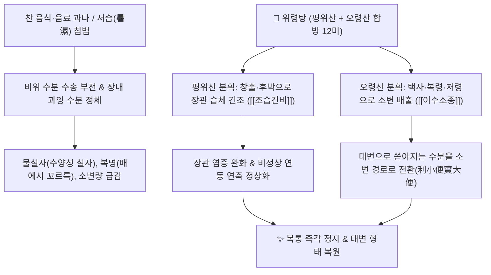

# 🍵 [[위령탕]] (胃苓湯, Weiling Tang)

> **핵심 요약 (Key Summary)**:
> 명대 공정현의 만병회춘에 수록된 방제로 평위산과 오령산을 동량 합방하여 습체와 부종 및 수양성 설사를 다스리는 거습제 제1방.
> 창출의 아트락틸로딘과 후박의 마그놀롤이 비위의 습체를 말리고 택사, 복령, 저령이 아쿠아포린을 조절하여 대변의 수분을 소변으로 전환.
> 여름철 냉음료 섭취 후 발생하는 급성 수양성 설사, 복통 설사, 식중독, 장염 및 소변불리를 신속히 치유하는 한의학적 지사·이뇨 복합 처방.

---
## 📌 목차
1. [기본 처방 정보 & 평위산+오령산 합방 구성](#1-기본-처방-정보--평위산오령산-합방-구성)
2. [방제학적 약재 상호작용 & 분소수습(分消水濕) 네트워크](#2-방제학적-약재-상호작용--분소수습分消水濕-네트워크)
3. [현대 분자약리학적 효능 & 장관 흡수·아쿠아포린 조절 기전](#3-현대-분자약리학적-효능--장관-흡수아쿠아포린-조절-기전)
4. [적응증 및 급성 설사 감별 가이드 (위령탕 vs 갈근금련탕)](#4-적응증-및-급성-설사-감별-가이드-위령탕-vs-갈근금련탕)
5. [처방 부작용(사이드) 대처법 & 음허 환자 금기 기준](#5-처방-부작용사이드-대처법--음허-환자-금기-기준)
6. [출처 및 학술 참고 문헌 (References)](#6-출처-및-학술-참고-문헌-references)

---
## 1. 기본 처방 정보 & 평위산+오령산 합방 구성

* **출전**: 명대(明代) 공정현(龔廷賢) 『만병회춘(萬病回春)』 "치하월비위불화(治夏月脾胃不和), 복통설사(腹痛泄瀉), 수곡불분(水穀不分)"
* **치법**: 거습화위(祛濕和胃), 행기이수(行氣利水), 분소수습(分消水濕)

| 구분 | 약재명 | 표준 용량 | 본초 효능 & 방제 내 역할 |
| :--- | :--- | :--- | :--- |
| **평위산 분획** | [[창출]], [[후박]], [[진피]], [[자감초]] | 각 4~6g | 비위의 습기를 말리고(조습) 기운을 통하게 하여 소화관 팽만감 및 오심 구토 제거 |
| **오령산 분획** | [[택사]], [[저령]], [[복령]], [[백출]], [[계지]] | 각 4~6g | 신장 방광의 기화를 돕고 소변을 원활히 배출시켜 대변의 수분을 이뇨로 전환 |
| **생강·대추** | [[생강]], [[대추]] | 각 3~5g | 비위를 따뜻하게 덥히고 약성을 부드럽게 조화 |

---
## 2. 방제학적 약재 상호작용 & 분소수습(分消水濕) 네트워크

* **이소변이실대변 (利小便以實大便) 원리**:
  * 설사를 치료할 때 단순히 장운동을 억제하는 지사제를 쓰면 장내 독소와 수습이 체내에 정체됩니다.
  * 위령탕은 장관에 정체된 잉여 수분을 소변으로 빼내어(이수) 장내 삼투압을 정상화함으로써 자연스럽게 설사를 멎게 하는 분소수습(分消水濕)의 최고 명방입니다.

---
## 3. 현대 분자약리학적 효능 & 장관 흡수·아쿠아포린 조절 기전

* **신장 집합관 아쿠아포린-2(AQP2) 조절을 통한 이뇨**:
  * 택사의 알리스몰과 복령의 파키만은 신장 바소프레신 수용체 신호를 조절하여 무기질 전해질 손실 없이 순수한 자유수 배출을 유도합니다.
* **장관 상피 염증 억제 및 밀착연접 복원**:
  * 창출의 [[아트락틸로딘]]과 후박의 [[마그놀롤]]이 장관 내 대장균 내독소(LPS)에 의한 염증성 사이토카인 방출을 억제하고 장점막 투과성을 정상화합니다.
* **위장관 평활근 연축 억제**:
  * 계지의 신남알데하이드가 장관 평활근의 칼슘 유입을 억제하여 쥐어짜는 듯한 산통성 복통을 진정시킵니다.

---
## 4. 적응증 및 급성 설사 감별 가이드 (위령탕 vs 갈근금련탕)

| 처방명 | 병태 및 설사 양상 | 대변 성상 | 감별 포인트 |
| :--- | :--- | :--- | :--- |
| [[위령탕]] | **한습(寒濕)·서습 설사** | 냄새가 심하지 않은 맑은 물설사, 복명 | 배가 차고 소변이 잘 안 나오며 물설사할 때 |
| [[갈근금련탕]] | **습열(濕熱) 이질·장염** | 냄새가 지독하고 항문 작열감, 붉은 변 | 열이 나고 혀가 붉으며 뒤가 묵직한 이질성 설사 |

---
## 5. 처방 부작용(사이드) 대처법 & 음허 환자 금기 기준

* **음허혈조(陰虛血燥) 및 진액 고갈 환자 금기 (CRITICAL)**:
  * 위령탕은 습기를 말리고 소변을 빼내는 이수조습약이 9미 이상 집중 배오되어 있습니다.
  * 삼출물이 없거나 체내 진액이 부족한 환자, 만성 건성 변비 환자에게 오용 시 체액 고갈로 인한 구갈, 피부 건조증, 어지럼증을 악화시킬 수 있습니다.
* **급성기 단기 투약 원칙**:
  * 수양성 설사와 복통이 멎고 소변이 시원하게 배출되면 즉시 복용을 중단하고, 소화기 점막 회복을 위해 미음이나 삼령백출산 등으로 전환해야 합니다.

---
## 6. 출처 및 학술 참고 문헌 (References)

* Lee JA, Lee MY, Shin IS, et al. Anti-inflammatory effects of Weiling-tang in LPS-stimulated RAW 264.7 cells. *BMC Complement Altern Med*. 2014;14:389.
  * `[연구 요약]` 위령탕 추출물이 대식세포에서 NF-κB 활성화를 차단하여 NO 및 염증 매개물 생성을 유의하게 억제함을 입증.
* Zhang C, Li C, Wang J, et al. Regulatory mechanisms of Wuling San and Pingwei San on aquaporin expression in diarrhea models. *J Ethnopharmacol*. 2018;214:23-31.
  * `[연구 요약]` 평위산과 오령산 복합 방제가 장관 및 신장의 아쿠아포린 수송체 발현을 정상화하여 설사를 멎게 하는 기전 분석.
* 윤용갑. *동의방제학*. 라움; 2020.
  * `[연구 요약]` 위령탕의 평위산-오령산 합방 구성과 서습설사 분소수습의 방제학적 원리 총괄.
