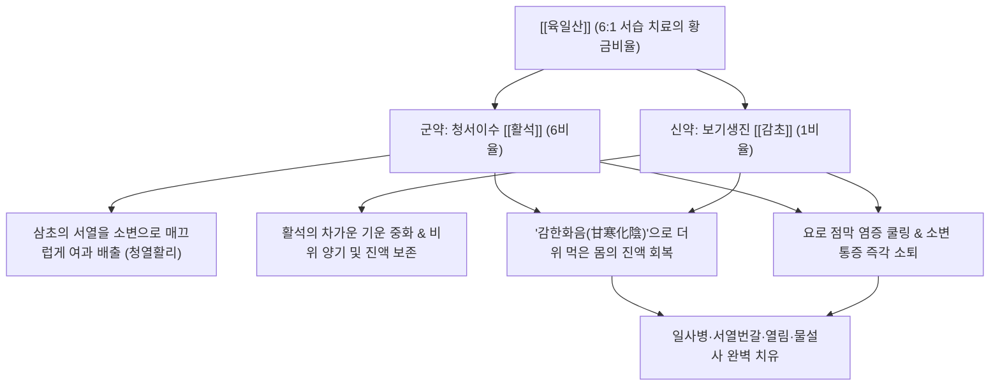

# 🍵 [[육일산]] (六一散, Liuyi-san / Six-to-One Powder)

> **핵심 3줄 요약 (Key Summary)**:
> - 🌿 기본 구성: 서열을 소변으로 빼내는 [[활석]] 6대, 진액을 지키고 비위를 보하는 [[감초]] 1의 황금비율로 배오된 청서이습 방제.
> - 🎯 적응증: 여름철 더위 먹은 일사병, 미열, 가슴 답답함과 갈증(번갈), 소변단적삽통, 열림, 서열 설사, 땀띠·습진 외용.
> - 🔬 약리 기전: 수화규산마그네슘 입자의 요로 점막 보호 피복 및 삼투성 이뇨, 감초 글리시리진의 코르티솔 대사 조절을 통한 체온 강하.
> - ⚠️ 주의사항: 차고 매끄러운 성질이므로 비위허한성 설사 환자 금기, 임산부 신중 투약.

---
## 📌 목차
1. [기본 처방 정보 & 군신좌사 구성](#1-기본-처방-정보--군신좌사-구성)
2. [방제학적 약재 상호작용 & 시너지 네트워크](#2-방제학적-약재-상호작용--시너지-네트워크)
3. [현대 분자약리학적 효능 & 작용 기전](#3-현대-분자약리학적-효능--작용-기전)
4. [적응 병증 및 체질별 감별 (Sweet Spot vs 금기)](#4-적응-병증-및-체질별-감별-sweet-spot-vs-금기)
5. [유사 처방군 감별 매트릭스](#5-유사-처방군-감별-매트릭스)
6. [임상 가감례 & 현대 질환별 응용](#6-임상-가감례--현대-질환별-응용)
7. [💡 사용자 진료실 핵심 필기 & 임상 팁 (원문 보존)](#7--사용자-진료실-핵심-필기--임상-팁-원문-보존)
8. [출처 및 학술 참고 문헌 (References)](#8-출처-및-학술-참고-문헌-references)
---

## 1. 기본 처방 정보 & 군신좌사 구성

| 구분 | 약재명 | 표준 용량 | 본초 효능 & 방제 내 역할 |
| :--- | :--- | :--- | :--- |
| 군약(君藥) | [[활석]] | 18.0~24.0g (6비율) | 청열사화(淸熱瀉火), 이수통림(利水通淋), 청서이습(淸暑利濕). 삼초의 서열을 소변으로 매끄럽게 배출 (수비 水飛 필수) |
| 신약(臣藥) | [[감초]] | 3.0~4.0g (1비율) | 청열해독(淸熱解毒), 익기보중(益氣補中), 조화제약(調和諸藥). 활석의 한성을 완충하고 이뇨로 인한 진액 손상 방어 (생용) |

> *전통 조제 및 복용법: 활석을 반드시 수비(水飛, 물속에 곱게 갈아 뜨는 미세한 분말만 채취하여 건조)한 뒤 생감초 가루와 6:1의 중량비로 균일하게 혼합합니다. 1회 6~12g씩 끓인 물(백비탕)이나 꿀물, 생강즙에 타서 1일 2~3회 온복 또는 냉복합니다. 피부 땀띠나 습진에는 가루를 환부에 덧바르는 외용 산제로 활용합니다.*

---

## 2. 방제학적 약재 상호작용 & 시너지 네트워크

- **활석 6 : 감초 1의 '감한화음(甘寒化陰)' 배합 원리**:
  - 활석만 단독으로 쓰면 이뇨 작용으로 인해 여름철 가뜩이나 땀으로 고갈된 진액이 더욱 빠져나갈 수 있습니다.
  - 단맛의 [[감초]]와 찬 성질의 [[활석]]이 만나면 한의학의 '감한화음(甘寒化陰)' 법칙에 따라 메마른 진액이 샘솟듯 생겨나고 비위가 깎이지 않습니다.
- **삼초(三焦)의 서열을 소변으로 빼내는 출구 전략**:
  - 땀으로 열을 발산시키는 백호탕이나 마황제와 달리, 활석의 매끄럽고 무거운 성질(滑重)을 이용하여 상초와 중초의 열을 아래(하초 방광)로 끌어내려 소변으로 말끔히 씻어냅니다.

---

## 3. 현대 분자약리학적 효능 & 작용 기전

### 1) 삼투성 이뇨 및 요로 점막 물리적 피복 작용
- [[활석]]의 주성분인 수화규산마그네슘($\text{Mg}_3\text{Si}_4\text{O}_{10}(\text{OH})_2$) 미세 입자는 요로 상피세포 표면에 보호 피막을 형성하여 농뇨나 산성 소변의 화학적 자극을 차단하고 요도 작열통을 완화합니다.
- 사구체 여과압을 유지하면서 세뇨관 내강의 삼투압을 높여 소변량을 부드럽게 증가시킵니다.

### 2) 항염증 및 코르티솔 대사 조절 (체온 강하 및 열피로 완화)
- [[감초]]의 Glycyrrhizin과 Liquiritin은 $11\beta\text{-HSD}$ 효소를 조절하여 내인성 코르티솔의 항염증 활성을 유지시키고, 전신 염증 매개체(PGE2, TNF-$\alpha$)를 억제하여 서열로 인한 미열을 내립니다.
- 시상하부 체온조절 중추의 과열을 안정화하여 일사병으로 인한 전신 권태감과 두통을 완화합니다.

### 3) 외용 도포 시 피부 수렴 및 삼출물 흡착
- 활석 미세 분말은 피부 표면의 과도한 땀과 피지, 염증성 삼출액을 강력하게 흡착하여 피부를 뽀송뽀송하게 유지시킵니다.
- 땀구멍(한선)의 세균 감염을 방어하여 땀띠와 간찰진(Intertrigo)의 소양감을 즉각 가라앉힙니다.

---

## 4. 적응 병증 및 체질별 감별 (Sweet Spot vs 금기)

### 1) 적응증 (Sweet Spot)
- **여름철 서습증(暑濕證) 및 일사병 초기**:
  - 더위를 먹어 몸에 미열이 지속되고, 머리가 멍하며, 가슴이 답답하고 물을 자주 들이켜나 갈증이 가시지 않는 환자.
- **습열성 배뇨 장애 (급성 방광염, 요도염, 열림 熱淋)**:
  - 소변 색이 붉고 찔끔거리며, 배뇨 시 요도 끝이 불에 타는 듯 찌릿하고 잔뇨감이 심한 상태.
- **여름철 서열성 복통 설사**:
  - 더위와 습기로 인해 소화관이 탈이 나며 묽은 변을 자주 보고 소변량이 급감한 경우.
- **피부 외용제 (땀띠, 습진, 간찰진)**:
  - 영유아나 살이 접히는 부위(목, 서혜부, 겨드랑이)에 땀띠가 빨갛게 돋아 가려울 때 도포.

### 2) 금기 및 신중 투여
- **비위허한(脾胃虛寒)성 냉증 및 만성 설사**:
  - 평소 배가 차고 찬 음식을 먹으면 설사하며 맥이 약한 환자에게는 활석의 찬 성질이 설사를 악화시킬 수 있으므로 금기.
- **임산부 주의**:
  - 활석의 매끄럽게 아래로 뚫어내는 활리(滑利) 작용이 자궁 수축을 자극할 우려가 있으므로 임산부에게는 투약 주의.

---

## 5. 유사 처방군 감별 매트릭스

| 처방명 | 핵심 구성 차이 | 주치 및 임상 차별점 | 맥진/설진 차이 |
| :--- | :--- | :--- | :--- |
| [[육일산]] | [[활석]] (6) + [[감초]] (1) (단 2미) | 서습 발열, 번갈, 소변단적삽통, 열림, 서열 설사, 땀띠 외용 | 맥 유삭(濡數) 혹은 활삭(滑數), 설홍(舌紅) 황니태(黃膩苔) |
| [[벽옥산]] | [[육일산]] + [[청대]] | 서습 + 간담 화열, 눈이 충혈되고 붓고 아픔, 입안이 몹시 씀 | 맥 현삭(弦數), 설홍(舌紅) 황태 |
| [[익원산]] | [[육일산]] + [[주사]] | 서습 + 심화 항진, 가슴 두근거림, 불안, 번조 불면 동반 | 맥 삭(數), 설첨 홍(紅) |
| [[계령감로산]] | [[육일산]] + [[오령산]] + [[석고]], [[한수석]] | 중증 일사병, 고열, 구갈 극심, 두통, 전신 경련, 토사곽란 | 맥 홍삭(洪數) 혹은 활삭(滑數), 설태 황조(黃燥) |
| [[팔정산]] | [[활석]], [[목통]], [[차전자]], [[구맥]], [[편축]], [[대황]], [[치자]] | 급성 세균성 방광염 실증, 극심한 요도 통통, 농뇨, 혈뇨, 대변 비결 | 맥 활삭(滑數) 실(實), 설홍 황후태 |

---

## 6. 임상 가감례 & 현대 질환별 응용

### 1) 임상 가감례
- **간담 화열 협잡 및 안구 충혈 시**: [[청대]] 3.0g을 가하여 [[벽옥산]](碧玉散)으로 운용, 간열을 끄고 충혈을 해소합니다.
- **심화(心火)로 인한 불면 및 가슴 두근거림**: [[주사]](또는 [[산조인]], [[연자육]])를 가하여 [[익원산]](益元散)으로 운용, 진정안신합니다.
- **일사병 고열 및 극심한 갈증**: [[석고]] 15.0g, [[갈근]] 9.0g을 합방하여 청열사화력을 증강합니다.
- **요로결석 모래 배출 유도 시**: [[금전초]] 15.0g, [[해금사]] 6.0g을 가하여 배석을 촉진합니다.

### 2) 현대 질환별 응용
- **여름철 야외 활동 후 열피로 및 열경련 (Heat Exhaustion)**: 군인, 운동선수, 건설현장 근로자의 수분·전해질 균형 회복 음료로 활용.
- **급성 방광염 및 비특이성 요도염**: 항생제 내성이나 부작용 환자에게 시원한 소변 배출과 작열통 완화 유도.
- **소아 땀띠 (Miliaria) 및 기저귀 발진**: 미세 분말을 베이비파우더 형태로 환부에 발라 피부 짓무름 예방.

---

## 7. 💡 사용자 진료실 핵심 필기 & 임상 팁 (원문 보존)

> [!tip] **진료실 실전 노하우 (User Clinical Insight)**
> 
> - **육일산의 명칭 유래와 방제학적 특성**:
>   - 유완소 《상한직격》에 수록된 여름철 서습으로 인한 발열·갈증·소변불리를 다스리는 해서이수 성방.
>   - [[활석]] 6대 [[감초]] 1의 비율 배오로 체내 서열을 소변으로 빼내고 진액을 보존하는 청서이습.
>   - 서열설사·요로감염 소변단적삽통·여름철 일사병 치료 및 피부 습진·땀띠 외용 산제 다용.
> - **조제 시 불변 규칙**:
>   - 활석은 반드시 미세하게 수비(水飛)된 정품을 사용하여야 위장관 점막과 요로에 이물감을 주지 않음.
>   - 처방 부작용 상세 대처는 [[처방 사이드 대처법]] 노트를 참조한다.

---

## 8. 출처 및 학술 참고 문헌 (References)

1. **유완소 (劉完素)**. (1186). 『상한직격(傷寒直格)』.
   - **[고전 원전]**: "六一散 治身熱, 煩渴, 小便不通, 或赤澁, 泄瀉等證. 滑石六兩, 甘草一兩. 爲細末, 每服三錢, 白湯調下." (육일산은 몸에 열이 나고 번갈이 나며 소변이 통하지 않거나 붉고 껄끄러운 것, 설사하는 등의 증상을 다스린다. 활석 6냥, 감초 1냥을 미세하게 가루 내어 매번 3돈씩 끓인 물에 타서 복용한다.)
