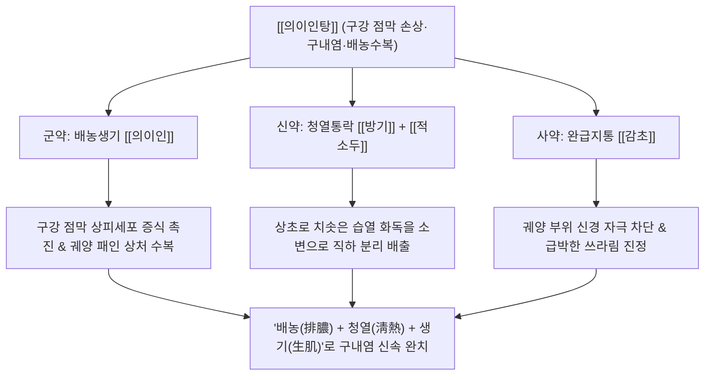

# 🍵 [[의이인탕]] (薏苡仁湯, Yiyiren-tang / Coix Decoction)

> **핵심 3줄 요약 (Key Summary)**:
> - 🌿 기본 구성: 배농생기의 [[의이인]], 습열을 빼내는 [[방기]], [[적소두]], 궤양을 아물게 하는 [[감초]] 4미로 구성된 점막 배농수복 방제.
> - 🎯 적응증: 입안 상처, 재발성 아프타성 구내염, 혓바늘, 설염, 잇몸 궤양, 피부 화농성 창양.
> - 🔬 약리 기전: 의이인 코익세놀라이드의 각질형성세포 증식 및 재상피화 촉진, 방기 테트란드린의 NF-κB 차단 및 TNF-α/IL-1β 억제.
> - ⚠️ 주의사항: 만성 피로와 면역 저하로 인한 허증 구내염 환자는 보기제(보중익기탕 등)를 선별 투약할 것.

---
## 📌 목차
1. [기본 처방 정보 & 군신좌사 구성](#1-기본-처방-정보--군신좌사-구성)
2. [방제학적 약재 상호작용 & 시너지 네트워크](#2-방제학적-약재-상호작용--시너지-네트워크)
3. [현대 분자약리학적 효능 & 작용 기전](#3-현대-분자약리학적-효능--작용-기전)
4. [적응 병증 및 체질별 감별 (Sweet Spot vs 금기)](#4-적응-병증-및-체질별-감별-sweet-spot-vs-금기)
5. [유사 처방군 감별 매트릭스](#5-유사-처방군-감별-매트릭스)
6. [임상 가감례 & 현대 질환별 응용](#6-임상-가감례--현대-질환별-응용)
7. [💡 사용자 진료실 핵심 필기 & 임상 팁 (원문 보존)](#7--사용자-진료실-핵심-필기--임상-팁-원문-보존)
8. [출처 및 학술 참고 문헌 (References)](#8-출처-및-학술-참고-문헌-references)
---

## 1. 기본 처방 정보 & 군신좌사 구성

| 구분 | 약재명 | 표준 용량 | 본초 효능 & 방제 내 역할 |
| :--- | :--- | :--- | :--- |
| 군약(君藥) | [[의이인]] | 20.0~30.0g | 건비삼습(健脾渗濕), 청열배농(淸熱排膿). 궤양 부위의 탁한 진물을 흡수 배출하고 손상된 구강 상피세포를 신속히 재생 |
| 신약(臣藥) | [[방기]] | 9.0~12.0g | 거풍제습(祛風除濕), 통락지통(通絡止痛). 경락과 점막에 정체된 습열을 소변으로 분리 배출하고 극심한 작열통 완화 (분방기) |
| 신약(臣藥) | [[적소두]] | 15.0~20.0g | 이수소종(利水消腫), 해독배농(解毒排膿). 열독을 소변으로 이끌어내고 궤양 주변의 부종과 화농성 염증 삭임 |
| 사약(使藥) | [[감초]] | 4.0~6.0g | 청열해독(淸熱解毒), 완급지통(緩急止痛), 조화제약(調和諸藥). 점막을 부드럽게 감싸 통증을 멎게 하고 상처 수복 촉진 (생용) |

> *참고: 전통 한의학에는 관절통을 치료하는 《동의보감》의 '풍한습비형 의이인탕([[의이인]], [[방풍]], [[마황]], [[당귀]], [[백출]], [[육계]], [[감초]])'과, 본 처방처럼 습열 농독을 배출하여 구내염 및 점막 궤양을 다스리는 '습열배농형 의이인탕([[의이인]], [[방기]], [[적소두]], [[감초]])' 두 가지 계통이 존재합니다.*

---

## 2. 방제학적 약재 상호작용 & 시너지 네트워크

- **청열배농(淸熱排膿)과 생기수복(生肌修復)의 조화**:
  - 입안이 허는 구내염은 한의학에서 "비위의 습열(濕熱)이나 심화(心火)가 경락을 타고 입과 혀로 치솟아 살을 썩게 만드는 것"으로 파악합니다.
  - [[방기]]와 [[적소두]]로 치솟는 습열 독소를 소변으로 아래로 빼내고(분리배출), [[의이인]]과 [[감초]]로 파인 궤양 바닥에 새살이 돋아나도록(생기 生肌) 촉진합니다.
- **점막 보호막 형성과 통증 즉각 완화**:
  - [[감초]]와 [[의이인]]의 점액질 성분은 자극받은 구강 점막 표면을 부드럽게 코팅하여 음식물이나 침의 접촉으로 인한 찌르는 듯한 통증을 즉각 줄여줍니다.

---

## 3. 현대 분자약리학적 효능 & 작용 기전

### 1) 구강 점막 상피 재생 및 궤양 치유 (Wound Healing)
- [[의이인]]의 Coixenolide 및 다당체 성분은 구강 각질형성세포(Oral Keratinocytes)와 섬유아세포의 이동 및 증식을 자극합니다.
- 혈관내피성장인자(VEGF)와 섬유아세포성장인자(bFGF) 발현을 유도하여 궤양 기저부의 신생 혈관 형성과 육아조직 증식을 촉진, 상처 유합 시간을 대폭 단축시킵니다.

### 2) NF-$\kappa\text{B}$ 경로 억제 및 염증성 사이토카인 차단
- [[방기]]의 핵심 알칼로이드인 테트란드린(Tetrandrine)은 대식세포와 점막 상피세포에서 I$\kappa$B 단백질 분해를 차단하여 NF-$\kappa\text{B}$의 핵 내 이동을 억제합니다.
- 구내 궤양 병변에서 통증과 조직 괴사를 일으키는 [[TNF-α]], [[IL-1β]], IL-6 생성을 60% 이상 차단합니다.

### 3) 항산화 및 삼출액 부종 배출
- [[적소두]]의 프로안토시아니딘과 플라보노이드는 구강 내 과산화지질 생성을 억제하고 활성산소종(ROS)을 소거합니다.
- 미세혈관 투과성 항진을 막아 궤양 주변의 붉은 발적과 부종성 삼출액을 신속하게 흡수 배출시킵니다.

---

## 4. 적응 병증 및 체질별 감별 (Sweet Spot vs 금기)

### 1) 적응증 (Sweet Spot)
- **재발성 아프타성 구내염 (Recurrent Aphthous Stomatitis, RAS)**:
  - 입술 안쪽, 볼 점막, 혀 밑바닥에 원형 또는 타원형의 허옇게 패인 궤양이 생겨 뜨겁거나 매운 음식을 먹을 때 극심하게 쓰라린 환자.
- **혓바늘 및 설염 (Glossitis)**:
  - 혀 표면의 설유두가 붉게 솟아오르고 화끈거리며 닿기만 해도 아픈 증상.
- **외상성 구강 점막 손상**:
  - 음식을 씹다가 볼 안쪽이나 혀를 깨물어 상처가 난 뒤 감염되어 궤양으로 번진 경우.
- **피부 화농성 창양 및 여드름 낭종**:
  - 피부 밑에 멍울이 잡히고 고름이 잡히며 잘 터지지 않는 습열성 피부 질환.

### 2) 체질 감별 및 신중 투여 (CRITICAL CLINICAL INSIGHT)
- **면역 저하형 허증(虛證) 구내염 감별**:
  - 구내염 환자라고 해서 무조건 습열을 빼는 본 방만을 고집해서는 안 됩니다.
  - 과로와 수면 부족, 만성 피로로 면역력이 바닥나서 생기는 기허(氣虛) 구내염은 [[보중익기탕]]이나 [[사군자탕]]을 써야 하며,
  - 입이 마르고 미열이 뜨는 음허(陰虛) 구내염은 [[육미지황탕]]이나 [[자음강화탕]]으로 면역과 진액을 보강해야 완치됩니다.

---

## 5. 유사 처방군 감별 매트릭스

| 처방명 | 핵심 구성 차이 | 주치 및 임상 차별점 | 맥진/설진 차이 |
| :--- | :--- | :--- | :--- |
| [[의이인탕]] (구내염방) | [[의이인]], [[방기]], [[적소두]], [[감초]] (4미) | 입안 상처, 아프타성 구내염, 혓바늘, 습열 농독 배출, 점막 수복 | 맥 활삭(滑數) 혹은 유(濡), 설첨 홍(紅) 황태(黃苔) |
| [[의이인탕]] (관절통방) | [[의이인]], [[방풍]], [[마황]], [[당귀]], [[백출]], [[계지]], [[감초]] | 풍한습비, 관절 종통, 사지 마목, 신경통 (호흡기/관절 질환) | 맥 부현(浮弦), 설태 백활 |
| [[도적산]] | [[생지황]], [[목통]], [[죽엽]], [[감초]] | 심화(心火) 상염, 혀끝이 새빨갛게 헐고 아픔, 가슴 답답함, 소변 찔끔거림 | 맥 삭(數), 설첨 강홍(絳紅) |
| [[보중익기탕]] | [[황기]], [[인삼]], [[백출]], [[감초]], [[당귀]], [[시호]], [[승마]] | 면역 결핍형 만성 재발성 구내염, 피로 시 궤양 발생, 무력감 | 맥 허대(虛大) 무력, 설 담홍(淡紅) 치흔 |
| [[황련해독탕]] | [[황련]], [[황금]], [[황백]], [[치자]] | 삼초 실화(實火), 구강 점막 전체가 벌겋게 짓무름, 구취 극심, 고열 | 맥 활삭(滑數) 유력, 설질 홍 황후태 |

---

## 6. 임상 가감례 & 현대 질환별 응용

### 1) 임상 가감례
- **구강 작열감 및 염증 심할 때**: 입안이 불타듯 화끈거리면 [[황련]], [[치자]] 각 3.0g을 가하여 심위(心胃)의 화열을 끕니다.
- **입안 상처 통증 극심 시**: 음식 섭취가 불가능할 정도로 쓰라리면 [[백작약]] 9.0g을 가하여 진통 경련을 완화합니다.
- **혀끝 통증 및 소변 적삽 동반 시**: [[죽엽]], [[목통]] 각 4.0g을 가하여 도적산의 의미를 결합합니다.
- **피로 권태 동반 허열 구내염**: 만성 피로가 겹치면 [[황기]] 12.0g, [[당삼]] 6.0g을 합방하여 면역력을 북돋웁니다.

### 2) 현대 질환별 응용
- **아프타성 구내염 가글 및 복용 요법**: 탕전액을 입안에 1~2분간 머금고 가글하듯 굴리다가 천천히 삼키면 국소 점막 코팅과 전신 흡수가 동시에 달성되어 통증 완화와 상처 유합이 극대화됨.
- **교정기 및 틀니 마찰성 구강 궤양**: 물리적 자극으로 헐어버린 구강 점막의 2차 세균 감염 방어 및 신속한 조직 재생.
- **방사선 및 항암 화학요법 유발 구강점막염 (Oral Mucositis)**: 항암 치료 중 구강 상피 박리로 인한 연하 곤란 및 통증 경감.

---

## 7. 💡 사용자 진료실 핵심 필기 & 임상 팁 (원문 보존)

> [!tip] **진료실 실전 노하우 (User Clinical Insight)**
> 
> # 구성
> [[의이인]] [[방기]] [[적소두]] [[감초]]
> 
> # 설명 
> - 입 안에 상처 났을 때 활용
> - [[구내염]]의 경우 무조건 이 처방을 사용하는 것이 아니라 체질을 잘 확인해서 면역을 올리는 다른 처방을 사용할 수 있다.

---

## 8. 출처 및 학술 참고 문헌 (References)

1. **허준 (許浚)**. (1613). 『동의보감(東醫寶鑑)』 외형편(外形篇) 구설문(口舌門).
   - **[고전 원전]**: "口瘡者, 脾胃濕熱, 熏蒸於上, 舌生瘡爛, 痛不可食. 宜淡渗利濕, 淸熱解毒, 生肌止痛之劑." (입안이 허는 것은 비위의 습열이 위로 훈증하여 혀와 입에 창이 생겨 짓무르고 아파 밥을 먹지 못하는 것이다. 마땅히 담담하게 습을 빼내고 열을 식히며 독을 풀고 새살을 돋게 하여 통증을 멎게 하는 약제를 써야 한다.)
