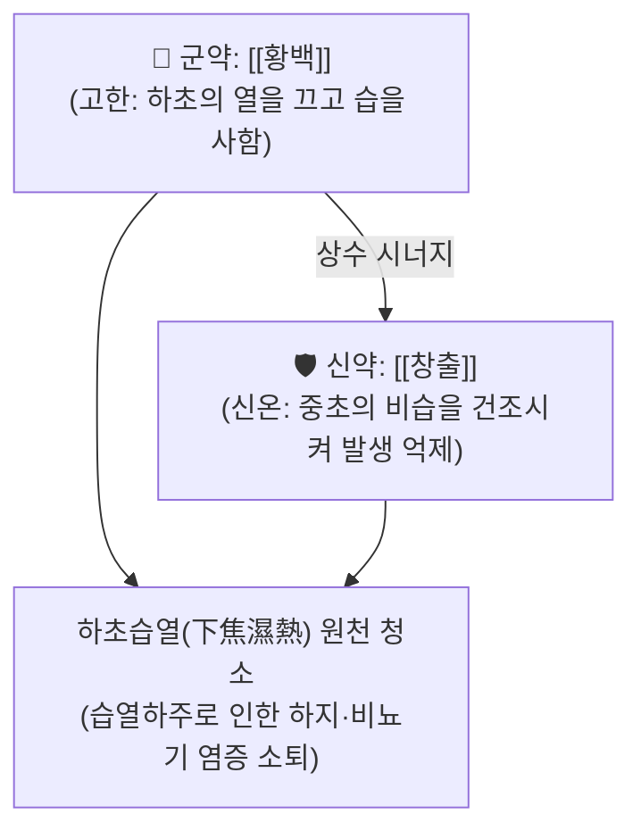

# 🍵 [[이묘환]] (二妙丸, Ermiao Wan)

> **핵심 3줄 요약 (Key Summary)군약 (君藥)신약 (臣藥)** | [[창출]] | 12g | 신고온조(辛苦溫燥), 건비조습, 비위를 도와 수습(水濕)의 근원을 말림 |

---

## 2. 방제학적 약재 상호작용 (창출과 황백의 상수)

* **한열조습의 절묘한 결합**:
  * 습(濕)은 무겁고 탁하여 아래로 가라앉고(下流), 열(熱)은 타오르므로 둘이 엉키면 하초(골반, 비뇨생식기, 하지 관절)에 끈적하게 달라붙어 떨어지지 않음.
  * 황백의 찬 성질로 불을 끄고, 창출의 따뜻하고 매운 성질로 습기를 증발시켜 **습과 열을 동시에 분리 격파**.

---

## 3. 현대 분자약리학적 효능 & 작용 기전

* **요산 배출 촉진 및 항통풍 효능**:
  * 신장 근위세뇨관의 요산 수송체(URAT1, GLUT9) 발현을 억제하여 요산 재흡수를 줄이고 소변 배출을 촉진.
* **항균 및 만성 골반강/비뇨기 염증 차단**:
  * 베르베린이 요로감염균 및 칸디다 진균 증식을 차단하고 [[NF-κB]] 유래 염증성 사이토카인 분비 억제.

---

## 4. 적응 병증 및 체질별 감별 (Sweet Spot vs 금기)

### ✅ 최적 적응증 (Sweet Spot)
* **습열하주증 (濕熱下注證)**:
  * 다리에 힘이 빠지고 무거우며 붓고 화끈거려 걷기 힘든 하지 무력증(각기).
  * 발가락 관절, 발목이 붉게 붓고 찌르듯 아픈 통풍 급성기.
  * 여성의 색이 누렇고 냄새가 나며 가려운 대하증(황대하).
  * 남성의 음낭 밑이 축축하고 가려우며 짓무르는 음낭습진.
* **설진 및 맥진**:
  * **설진(舌診)**: 설홍(舌紅), 설태황니(苔黃膩, 누렇고 끈적한 태).
  * **맥진(脈診)**: 맥활삭(脈滑數) 또는 유삭.

### ⚠️ 신중 투여 및 금기 (Caution / Contraindication)
* **음허진고 환자 금기**:
  * 창출의 조열성이 강하므로 진액이 마른 음허 환자에게는 단독 사용 금기.

---

## 5. 확장 처방군 감별: 이묘·삼묘·사묘환 매트릭스

| 처방명 | 구성 약재 | 약력 강화 방향 | 최적 주치 |
| :--- | :--- | :--- | :--- |
|  | 황백, 창출 | 기본 청열조습 | 습열성 하지 종창, 대하, 습진 |
| **삼묘환사묘환** | 삼묘환 + [[의이인]] | 이수소종 극대화 | 통풍성 관절염, 요산혈증, 극심한 관절 종열 |

---

## 6. 임상 가감례 & 현대 비뇨기·관절 질환 응용

* **수반 증상별 가감법**:
  * 관절 종통과 요산 수치가 높을 때 $\rightarrow$ + [[의이인]], [[우슬]] (사묘환화)
  * 비뇨기 배뇨통이 심할 때 $\rightarrow$ + [[차전자]], [[비해]]
* **현대 질환 매핑**:
  * 급성 통풍성 관절염, 만성 질염, 자궁경부염, 음낭 습진, 지루성 피부염 하지형.

---

## 7. 출처 및 학술 참고 문헌 (References)
* Zhu DX. *Danxi Xinfa* (Heart and Essence of Danxi's Methods). 1481.
  * `[연구 요약]`: 이묘환 원전 수록, 하초 습열로 인한 하지 위벽증 치료 방제 제정.
* Wang X, et al. Ermiao Wan attenuates hyperuricemia and urate-induced inflammation in mice through regulating URAT1 and NLRP3 inflammasome. *J Ethnopharmacol*. 2021;267:113488.
  * `[연구 요약]`: 이묘환의 신장 요산 수송체 조절 및 NLRP3 인플라마솜 억제 항통풍 기전 규명.
