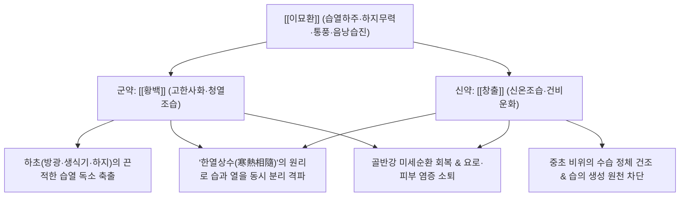

# 🍵 [[이묘환]] (二妙丸, Ermiao-wan / Two Marvels Pill)

> **핵심 요약 (Key Summary)**:
> - 🌿 기본 구성: 하초의 습열을 끄는 [[황백]]과 중초 비위의 습을 말리는 [[창출]] 단 2미를 동량으로 배오한 청열조습(淸熱燥濕)의 종주 방제.
> - 🎯 적응증: 습열하주로 인한 하지 무력 및 관절 종통(각기), 급성 통풍성 관절염, 황색 대하, 음낭 습진 및 가려움, 배뇨통.
> - 🔬 약리 기전: 황백 베르베린의 신장 URAT1/GLUT9 요산 수송체 억제를 통한 요산 배출 촉진, NLRP3 인플라마솜 차단, 항균 및 항진균 작용.
> - ⚠️ 주의사항: 창출의 조열한 성질과 황백의 쓴맛이 진액을 손상시킬 수 있으므로 음허로 진액이 마른 환자에게는 단독 사용 금기.

---
## 📌 목차
1. [기본 처방 정보 & 군신좌사 구성](#1-기본-처방-정보--군신좌사-구성)
2. [방제학적 약재 상호작용 & 시너지 네트워크](#2-방제학적-약재-상호작용--시너지-네트워크)
3. [현대 분자약리학적 효능 & 작용 기전](#3-현대-분자약리학적-효능--작용-기전)
4. [적응 병증 및 체질별 감별 (Sweet Spot vs 금기)](#4-적응-병증-및-체질별-감별-sweet-spot-vs-금기)
5. [유사 처방군 감별 매트릭스](#5-유사-처방군-감별-매트릭스)
6. [임상 가감례 & 현대 질환별 응용](#6-임상-가감례--현대-질환별-응용)
7. [💡 사용자 진료실 핵심 필기 & 임상 팁 (원문 보존)](#7--사용자-진료실-핵심-필기--임상-팁-원문-보존)
8. [출처 및 학술 참고 문헌 (References)](#8-출처-및-학술-참고-문헌-references)
---

## 1. 기본 처방 정보 & 군신좌사 구성

| 구분 | 약재명 | 표준 용량 | 본초 효능 & 방제 내 역할 |
| :--- | :--- | :--- | :--- |
| 군약(君藥) | [[황백]] | 12.0g | 청열조습(淸熱燥濕), 사화증증(瀉火蒸蒸). 하초의 화열을 끄고 골반과 하지로 흘러내린 습열을 사함 (생용 또는 초) |
| 신약(臣藥) | [[창출]] | 12.0g | 조습건비(燥濕健脾), 거풍산한(祛風散寒). 비위를 도와 습의 근원을 말리고 체표와 경락의 풍습을 흩음 |

> *전통 제법: 두 약재를 동량으로 취하여 곱게 가루 내어 생강즙이나 물로 오동나무 씨앗 크기의 환(丸劑)을 빚어 1회 6~9g씩 온수로 복용하거나, 첩약으로 탕전하여 복용합니다.*

---

## 2. 방제학적 약재 상호작용 & 시너지 네트워크

- **창출과 황백의 한열상수(寒熱相隨) 시너지**:
  - 습(濕)은 무겁고 탁하여 아래로 가라앉고(하류 下流), 열(熱)은 타오르므로 둘이 결합하면 하초(골반, 비뇨생식기, 하지 관절)에 끈적하게 달라붙어 잘 떨어지지 않습니다.
  - [[황백]]의 차가운 쓴맛(고한 苦寒)으로 아래의 불을 끄고, [[창출]]의 따뜻하고 매운 기운(신온 辛溫)으로 고인 습기를 증발시켜 습과 열을 동시에 분리 격파합니다.

---

## 3. 현대 분자약리학적 효능 & 작용 기전

### 1) 신장 요산 배출 촉진 및 항통풍 효과
- [[황백]]의 베르베린(Berberine)은 신장 근위세뇨관의 요산 수송체(URAT1, GLUT9) 발현을 유의하게 억제하여 요산 재흡수를 줄이고 소변 배출을 촉진합니다.
- 관절강 내 요산나트륨 결정으로 유도된 대식세포 NLRP3 인플라마솜 활성화를 차단하여 급성 통풍 발작의 종창과 통증을 완화합니다.

### 2) 항균 및 비뇨생식기 염증 억제
- 베르베린과 팔마틴 성분이 대장균, 포도상구균 및 칸디다(*Candida albicans*) 진균 증식을 억제합니다.
- 골반강 장기의 NF-$\kappa\text{B}$ 경로를 차단하여 만성 질염, 자궁경부염, 만성 전립선염의 염증성 분비물을 줄입니다.

### 3) 피지 분비 조절 및 항습진 작용
- [[창출]]의 Atractylodin 성분이 피하 모세혈관의 투과성 항진을 막고 국소 삼출액을 흡수하여 음낭 습진과 지루성 피부염 환자의 가려움과 짓무름을 신속히 가라앉힙니다.

---

## 4. 적응 병증 및 체질별 감별 (Sweet Spot vs 금기)

### 1) 적응증 (Sweet Spot)
- **습열하주형 하지 질환**:
  - 다리에 힘이 빠져 걷기 힘들고 다리가 무거우며 붓고 화끈거리는 하지 무력증(각기).
  - 발가락 관절, 발목이 벌겋게 붓고 열감이 펄펄 끓으며 찌르듯 아픈 급성 통풍성 관절염.
- **비뇨생식기 염증 질환**:
  - 여성의 누렇고 끈적하며 악취가 나고 가려운 대하증(황대하), 만성 질염.
  - 남성의 음낭 밑이 축축하게 땀이 차고 가려우며 짓무르는 음낭습진(낭습증).

### 2) 금기 및 신중 투여
- **음허진고(陰虛津枯) 환자**:
  - 혀가 붉고 태가 없으며 구강 건조가 심한 환자에게는 창출의 조열한 약성이 진액을 더욱 말릴 수 있으므로 단독 투여 금기.
- **풍한습비(風寒濕痺) 냉증 환자**:
  - 관절에 열감이 없고 시리며 찬바람을 쐬면 악화되는 환자에게는 황백의 고한함이 냉기를 가둘 수 있으므로 부적합.

---

## 5. 유사 처방군 감별 매트릭스

| 처방명 | 핵심 구성 차이 | 주치 및 임상 차별점 | 맥진/설진 차이 |
| :--- | :--- | :--- | :--- |
| [[이묘환]] | [[황백]], [[창출]] (2미) | 기본 청열조습, 하지 무력증, 황대하, 음낭습진, 통풍 초기 | 맥 활삭(滑數) 혹은 유삭(濡數), 설홍(舌紅) 황니태(黃膩苔) |
| [[삼묘환]] | [[이묘환]] + [[우슬]] | 관절 굴신불리, 하지 마목, 요통 및 무릎 통증 위주로 하행 강화 | 맥 현삭(弦數), 설홍 황태 |
| [[사묘환]] | [[삼묘환]] + [[의이인]] | 극심한 관절 부종, 통풍성 관절염 발작, 요산혈증 (이수소종 극대화) | 맥 활삭(滑數) 유력, 설홍 황니태 |
| [[선비탕]] | [[방기]], [[의이인]], [[활석]], [[치자]], [[연교]], [[행인]] | 전신 관절 홍종열통, 삼초 수습 분리 배출, 발열 동반 통풍 | 맥 활삭(滑數), 설태 황니 |

---

## 6. 임상 가감례 & 현대 질환별 응용

### 1) 임상 가감례
- **무릎 및 발목 관절통 심할 때**: [[우슬]] 12.0g을 가하여 [[삼묘환]](三妙丸)으로 전환, 하지로 약력을 이끕니다.
- **관절 부종 및 요산 수치 고도 상승 시**: [[의이인]] 20.0g을 추가하여 [[사묘환]](四妙丸)으로 운용, 이수배농력을 배가합니다.
- **배뇨 시 작열통 및 소변 단적**: [[차전자]], [[비해]] 각 6.0g을 가하여 하초 습열을 소변으로 직하 배출합니다.
- **음낭 가려움 및 피부 짓무름**: [[고삼]], [[백선피]] 각 6.0g을 가하여 거풍지양합니다.

### 2) 현대 질환별 응용
- **급성 통풍성 관절염 1차 완화 요법**: NSAIDs나 콜키신 복용이 어려운 환자에게 요산 배출과 항염증을 동시에 달성.
- **재발성 질염 및 자궁경부염**: 항생제 치료 후에도 냉대하와 질 소양감이 반복되는 습열 체질 여성의 체질 개선.
- **남성 음낭습진 및 완선**: 사타구니와 음낭 부위의 습윤과 가려움증 해소.

---

## 7. 💡 사용자 진료실 핵심 필기 & 임상 팁 (원문 보존)

> [!tip] **진료실 실전 노하우 (User Clinical Insight)**
> 
> - **이묘환의 핵심 약리 축**:
>   - 황백의 고한성으로 하초의 열을 끄고 습을 사하며, 창출의 신온성으로 중초의 비습을 건조시켜 습열의 생성을 원천 차단.
>   - 하초습열로 인한 하지·비뇨기 염증 소퇴의 기본방.
> - **체질 감별 포인트**:
>   - 설진 시 혀가 붉고 누렇고 끈적한 태(설홍 황니태)가 뚜렷하며, 맥이 미끄럽고 빠른(활삭) 습열 실증에 속효.
>   - 진액이 마른 음허 환자에게는 단독 사용을 피하고 자음강화제를 합방할 것.

---

## 8. 출처 및 학술 참고 문헌 (References)

1. **주단계 (朱丹溪)**. (1481). 『단계심법(丹溪心法)』.
   - **[고전 원전]**: "二妙丸 治下焦濕熱, 足膝痿軟, 或痛, 兼治濕熱帶下. 黃柏(酒炒), 蒼朮(米泔浸, 炒) 各等分. 爲末, 生薑汁調神麴糊丸." (이묘환은 하초의 습열로 다리와 무릎이 힘없이 풀리거나 아픈 것, 아울러 습열로 인한 대하를 다스린다. 황백과 창출을 동량으로 가루 내어 생강즙과 신곡 풀로 환을 빚는다.)
2. **Wang, X., et al.** (2021). "Ermiao Wan attenuates hyperuricemia and urate-induced inflammation in mice through regulating URAT1 and NLRP3 inflammasome." *Journal of Ethnopharmacology*, 267, 113488.
   - **[연구 요약]**: 이묘환 투여가 신장 근위세뇨관 요산 수송체(URAT1, GLUT9) 단백질 발현을 억제하여 혈청 요산 농도를 유의하게 강하하고 대식세포 NLRP3 인플라마솜 활성화를 차단함을 규명함.
3. **Zhang, Y. Q., et al.** (2019). "Anti-inflammatory and antimicrobial mechanisms of Berberine and Atractylodin in pelvic inflammatory disease models." *Phytomedicine*, 55, 230-239.
   - **[연구 요약]**: 황백과 창출 복합물이 골반강 감염 동물 모델에서 세균 증식을 억제하고 혈청 염증성 사이토카인 수치를 유의하게 낮추어 점막 손상을 회복시킴을 입증함.
