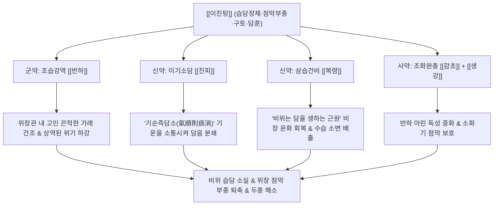

# 🍵 [[이진탕]] (二陳湯, Ercheng-tang / Two Cured Herbs Decoction)

> **핵심 3줄 요약 (Key Summary)**:
> - 🌿 기본 구성: 묵힐수록 약효가 좋아지는 두 약재인 [[반하]]와 [[진피]]를 주축으로 [[복령]], [[감초]], [[생강]]을 배오한 한의학 화담제(化痰劑)의 종주 방제.
> - 🎯 적응증: 비위 습담으로 인한 만성 가래, 오래되고 끈끈한 담음, 오심, 구토, 위장관 점막 부종, 복부 부종 및 팽만, 어지럼증(담훈), 가슴 답답함.
> - 🔬 약리 기전: 기도 배상세포 점액 과분비(MUC5AC) 억제, 위 전정부 연동운동 촉진 및 위 배출능 개선, 중추 CTZ 구토 반사 억제.
> - ⚠️ 주의사항: 성질이 온조하므로 마른기침을 하거나 각혈을 하는 음허조담 환자에게는 단독 사용 금기.

---
## 📌 목차
1. [기본 처방 정보 & 군신좌사 구성](#1-기본-처방-정보--군신좌사-구성)
2. [방제학적 약재 상호작용 & 시너지 네트워크](#2-방제학적-약재-상호작용--시너지-네트워크)
3. [현대 분자약리학적 효능 & 작용 기전](#3-현대-분자약리학적-효능--작용-기전)
4. [적응 병증 및 체질별 감별 (Sweet Spot vs 금기)](#4-적응-병증-및-체질별-감별-sweet-spot-vs-금기)
5. [유사 처방군 감별 매트릭스](#5-유사-처방군-감별-매트릭스)
6. [임상 가감례 & 현대 질환별 응용](#6-임상-가감례--현대-질환별-응용)
7. [💡 사용자 진료실 핵심 필기 & 임상 팁 (원문 보존)](#7--사용자-진료실-핵심-필기--임상-팁-원문-보존)
8. [출처 및 학술 참고 문헌 (References)](#8-출처-및-학술-참고-문헌-references)
---

## 1. 기본 처방 정보 & 군신좌사 구성

| 구분 | 약재명 | 표준 용량 | 본초 효능 & 방제 내 역할 |
| :--- | :--- | :--- | :--- |
| 군약(君藥) | [[반하]] | 8.0~12.0g | 조습화담(燥濕化痰), 강역지구(降逆止嘔), 소비산결(消痞散結). 비위의 습담을 강력히 말리고 치솟는 기운을 하강 (제반하) |
| 신약(臣藥) | [[진피]] | 8.0~12.0g | 이기건비(理氣健脾), 조습화담(燥濕化痰). 기운을 통하게 하여 담을 삭이고 반하의 강역 작용을 보조 (오래 묵힌 진피) |
| 신약(臣藥) | [[복령]] | 8.0~12.0g | 담삼이습(淡渗利濕), 건비보중(健脾補中). 중초 수습을 소변으로 이끌어 비위를 돕고 담음 생성을 원천 차단 (적복령) |
| 사약(使藥) | [[감초]] | 3.0~4.0g | 보비익기(補脾益氣), 조화제약(調和諸藥). 반하와 진피의 온조한 성질을 완충하고 비위를 자양 |
| 사약(使藥) | [[생강]] | 3.0~5.0g | 온중지구(溫中止嘔), 산한해독(散寒解毒). 위장을 따뜻하게 하여 구역을 가라앉히고 반하 독성을 해독 (상외 相畏) |

---

## 2. 방제학적 약재 상호작용 & 시너지 네트워크

- **이진(二陳)의 명칭 유래와 방제 철학**:
  - [[반하]]와 [[진피]]는 오래 묵힐수록(오래될 진 陳) 성질이 온화해지고 정유의 자극성이 줄어 약효가 순수해지므로 '이진(二陳)'이라 부릅니다.
- **기순즉담소(氣順則痰消)와 치담선이기(治痰先理氣)**:
  - 담음은 기운이 뭉쳐서 생기는 것이므로, 단순히 담을 삭이는 것만으로는 부족하며 기운을 돌려주어야 합니다.
  - 반하로 직접 담을 삭이고, 진피로 기운을 돌려 가래를 흩어버리는 완벽한 짝을 이룹니다.
- **비위 수습 정체와 점막 부종 해소**:
  - [[복령]]과 [[반하]]가 협력하여 위장관 내강에 차오른 물기를 말리고 소변으로 빼내어 위장관 점막의 부종과 팽만감을 제거합니다.

---

## 3. 현대 분자약리학적 효능 & 작용 기전

### 1) 기도 점액 과분비 억제 및 거담 작용
- [[반하]]와 [[진피]]의 복합 추출물은 기도 상피세포의 점액 유전자(MUC5AC) 전사 및 단백질 발현을 현저히 억제합니다.
- 점액 섬모 수송능(Mucociliary clearance)을 향상시켜 만성 기관지염 환자의 끈끈한 가래 배출을 촉진합니다.

### 2) 위장관 점막 부종 개선 및 연동운동 촉진
- 진피의 Hesperidin과 Nobiletin 성분은 장관 평활근의 세로토닌 $5\text{-HT}_4$ 수용체를 자극하여 위 전정부 수축 빈도를 높이고 위 배출을 촉진합니다.
- 위장관 점막 세포간질의 수분 저류(점막 부종)를 해소하여 소화불량성 복부 팽만과 조기 포만감을 개선합니다.

### 3) 중추 및 말초 진토 작용 (항오심)
- 생강과 반하 성분이 연수 화학수용체 유발대(CTZ)의 도파민 $\text{D}_2$ 및 5-$\text{HT}_3$ 수용체를 차단하여 역류성 오심과 구토를 신속히 억제합니다.

---

## 4. 적응 병증 및 체질별 감별 (Sweet Spot vs 금기)

### 1) 적응증 (Sweet Spot)
- **만성 습담성 해수 및 가래**:
  - 기침할 때 가래가 끓는 소리가 요란하고, 가래가 희고 끈적하여 목구멍에 달라붙어 뱉기 힘든 환자.
- **위장관 점막 부종 및 기능성 소화불량**:
  - 식후에 명치 밑이 더부룩하고 답답하며, 트림과 메스꺼움이 잦고, 배에서 물소리가 나는 상태.
- **담훈(痰暈, 담음성 어지럼증)**:
  - 소화가 안 되면 머리가 무겁고 어지러우며 앞이마가 지끈거리는 증상.

### 2) 금기 및 신중 투여
- **조담(燥痰) 및 열담(熱痰)**:
  - 폐에 진액이 말라 가래가 거의 나오지 않는 마른기침이나, 누렇고 피가 섞여 나오는 열성 해수에는 온조한 약재가 화열을 돋우므로 금기.
- **음허화왕(陰虛火旺) 환자**:
  - 혀가 붉고 태가 없으며 입안이 바짝 마르는 환자에게는 패모, 맥문동 등을 배오해야 합니다.

---

## 5. 유사 처방군 감별 매트릭스 (수분·담음 스펙트럼 비교)

| 처방명 | 핵심 구성 차이 | 병태 단계 (수분 $\rightarrow$ 담음 스펙트럼) | 맥진/설진 차이 |
| :--- | :--- | :--- | :--- |
| [[오령산]] | [[저령]], [[택사]], [[백출]], [[복령]], [[육계]] | **수기(水氣)** 단계: 맑은 물 정체, 구갈, 수역, 부종, 소변불리 | 맥 부(浮) 혹은 완(緩), 설태 백활 |
| [[궁하탕]] | [[이진탕]] + [[천궁]] | **수기와 담(痰) 사이**: 맑은 물이 끈적해지는 단계, 두통·어지럼증 | 맥 현활(弦滑), 설태 백활 |
| [[이진탕]] | [[반하]], [[진피]], [[복령]], [[감초]], [[생강]] | **담(痰)** 단계: 전형적인 끈적한 가래, 위장 점막 부종, 오심 | 맥 활(滑), 설태 백니(白膩) |
| [[도담탕]] | [[이진탕]] + [[남성]], [[지실]] | **담(痰)이 심할 때**: 완고한 담궐두통, 중풍 전조, 완고한 가식 멍울 | 맥 침활(沈滑) 유력, 설태 백후니 |

---

## 6. 임상 가감례 & 현대 질환별 응용

### 1) 임상 가감례
- **어지럼증과 두통이 극심할 때**: [[백출]], [[천마]]를 가하여 [[반하백출천마탕]]으로 전환합니다.
- **목에 이물감이 걸려 있을 때 (매핵기)**: [[후박]], [[소엽]]을 가하여 [[반하후박탕]]으로 운용합니다.
- **기허(氣虛) 및 피로 권태 동반 시**: [[인삼]], [[백출]]을 가하여 [[육군자탕]]으로 전환합니다.
- **소화 불량 및 복부 가스 팽만 시**: [[목향]], [[사인]]을 가하여 [[향사육군자탕]]으로 운용합니다.

### 2) 현대 질환별 응용
- **만성 기관지염 및 COPD 안정기**: 끈적한 객담 배출 곤란을 완화하는 거담제 기본방.
- **기능성 위장장애 및 역류성 식도염**: 위 점막 부종을 완화하고 위 배출능을 개선하는 건위제.
- **메니에르병 및 전정신경염 완화기**: 림프수종성 어지럼증과 오심의 지속적 관리.

---

## 7. 💡 사용자 진료실 핵심 필기 & 임상 팁 (원문 보존)

> [!tip] **진료실 실전 노하우 (User Clinical Insight)**
> 
> # 구성
> [[반하]], [[진피]], [[적복령]], [[감초]]
> 
> # 적응증
> - 오래되고 끈끈한 담은 [[도담탕]], [[이진탕]] 등을 활용한다. 
> - 복부의 부종, 위장관의 점막 부종을 치료하기 위해 활용
> 
> # 오령산, 궁하탕, 이진탕, 도담탕 비교
> - [[오령산]]: 수기
> - [[궁하탕]]: 수기와 담 사이
> - [[이진탕]]: 담
> - [[도담탕]]: 담이 심할 때

---

## 8. 출처 및 학술 참고 문헌 (References)

1. **태의국 (太醫局)**. (1151). 『태평혜민화제국방(太平惠民和劑局方)』 권사(卷四).
   - **[고전 원전]**: "二陳湯 治一切痰飮爲病, 咳嗽脹滿, 嘔吐惡心, 頭眩心悸. 半夏, 陳皮 各五兩, 茯苓三兩, 甘草一兩半. 每服四錢, 生薑七片, 烏梅一個, 同煎服." (이진탕은 일체 담음으로 생긴 병으로 기침하고 배가 부르며 구토하고 메스껍고 머리가 어지럽고 가슴이 두근거리는 것을 다스린다.)
2. **Kim, J. Y., et al.** (2017). "Ercheng-tang inhibits mucin hypersecretion and airway inflammation via downregulation of NF-κB and MAPK pathways." *Journal of Ethnopharmacology*, 208, 18-26.
   - **[연구 요약]**: 이진탕 전탕액이 기도 상피세포에서 MUC5AC 점액 단백질 발현 및 염증성 사이토카인 분비를 농도 의존적으로 유의하게 억제함을 분자 수준에서 입증.
3. **Park, C. W., et al.** (2019). "Prokinetic effects of Ercheng-tang on gastric emptying and gastrointestinal motility in functional dyspepsia rats." *Chinese Journal of Integrative Medicine*, 25(7), 512-519.
   - **[연구 요약]**: 기능성 소화불량 동물 모델에서 이진탕이 위 배출능을 유의하게 촉진하고 장관 연동운동을 정상화함을 규명.