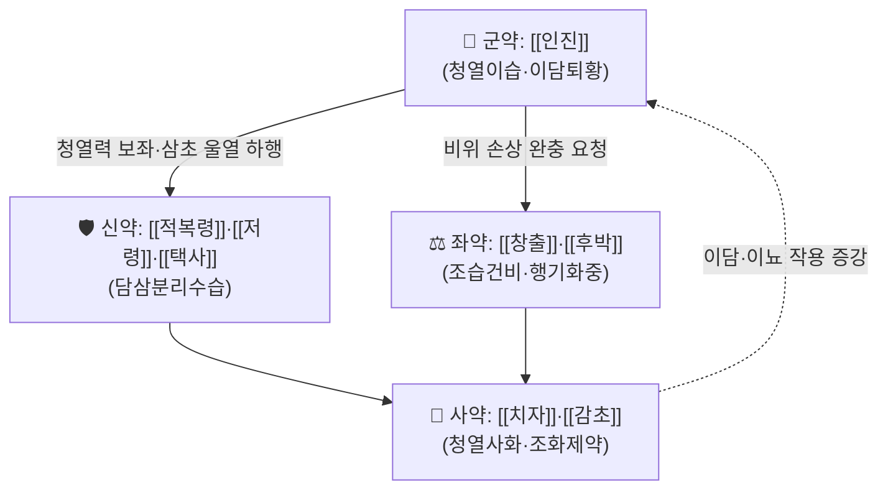

# 🍵 [[인진분리음]] (茵陳分利飮, Yinchen Fenli Yin)

> **핵심 3줄 요약 (Key Summary)**:
> - 🌿 **모체/기원 처방**: [[인진]]을 군약(君藥)으로 삼아 [[사령탕]]([[복령]]·[[저령]]·[[택사]]·[[백출]]) 또는 [[오령산]] 계열의 분리수습(分利水濕) 구조를 결합한 **인진 + 이수삼습 복합 방제**로 이해된다. 청열이습(淸熱利濕)을 목적으로 [[치자]]·[[창출]]·[[후박]] 등이 배오되는 것으로 기재되나, **원출전 및 정확한 원문 조문은 근거 미확인**(문헌별 구성 차이 존재) — 투여 전 원전 대조 필요.
> - 🎯 **임상 최적 적응증**: 습열(濕熱)이 중초(中焦)·하초에 울체되어 나타나는 **양황(陽黃) 계열 황달** — 피부·공막 황염, 소변 단적·소변불리, 흉민·오심, 구고(口苦), 설태 황니(黃膩). 습이 무거운 태음인 체형 또는 습열이 겸한 소양인 체질에서 상대적으로 적합하다고 보나, 이는 임상 추정이며 처방 특이적 체질 연구는 **근거 미확인**.
> - 🔬 **핵심 분자약리 기전**: 본 처방 자체를 대상으로 한 분자약리·임상 연구는 검색되지 않아 **처방 수준 기전은 근거 미확인**. 개별 구성 본초(특히 [[인진]])의 이담(利膽)·이뇨·항산화 작용이 일반 본초학 수준에서 보고되어 있으나, 정량적 표적·사이토카인 수치는 본 노트에서 확인된 문헌이 없어 제시하지 않는다.
> - ⚠️ 주의사항: 음황(陰黃)·한습(寒濕) 황달, 비허(脾虛)로 인한 만성 이수(利水) 과다 환자에게는 투여 부적합. 무열(無熱)·무습(無濕)의 허한(虛寒) 병증, 임산부·중증 간기능 부전·담도 완전 폐쇄성 황달에서는 반드시 감별 후 사용하고, 이뇨제·간대사 약물과의 병용 시 전해질 및 간수치 모니터링이 필요하다.

---
## 📌 목차
1. [기본 처방 정보 & 군신좌사 구성](#1-기본-처방-정보--군신좌사-구성)
2. [방제학적 약재 상호작용 & 시너지 네트워크](#2-방제학적-약재-상호작용--시너지-네트워크)
3. [현대 분자약리학적 효능 & 작용 기전](#3-현대-분자약리학적-효능--작용-기전)
4. [적응 병증 및 체질별 감별 (Sweet Spot vs 금기)](#4-적응-병증-및-체질별-감별-sweet-spot-vs-금기)
5. [유사 처방군 감별 매트릭스](#5-유사-처방군-감별-매트릭스)
6. [임상 가감례 & 현대 질환별 응용](#6-임상-가감례--현대-질환별-응용)
7. [💡 사용자 진료실 핵심 필기 & 임상 팁 (원문 보존)](#7--사용자-진료실-핵심-필기--임상-팁-원문-보존)
8. [출처 및 학술 참고 문헌 (References)](#8-출처-및-학술-참고-문헌-references)

---
## 1. 기본 처방 정보 & 군신좌사 구성

* **출전**: **근거 미확인** — 한의학 임상 문헌에서 인진 계열 이수삼습 방제로 황달(특히 습열황달)에 활용된 것으로 기재되어 있으나, 『[[상한론]]』·『[[금궤요략]]』·『[[동의보감]]』 중 어느 조문에 본 처방명이 직접 수록된 것인지는 본 노트 작성 시 확인되지 않았다. 처방명의 성격상 **인진호탕(茵陳蒿湯) 계열의 청열이습법**과 **오령산(五苓散) 계열의 분리수습법**을 결합한 후대(後代) 방제로 추정된다.
* **치법(治則)**: 청열이습(淸熱利濕) · 이담퇴황(利膽退黃) · 분리수습(分利水濕) · 건비화중(健脾和中)
* **주치(主治) 요약**: 습열울체(濕熱鬱滯)로 인한 양황(陽黃) — 신목황염(身目黃染), 소변황적(小便黃赤)·소변불리, 흉민완비(胸悶脘痞), 식욕부진, 오심, 구고인건(口苦咽乾), 설태황니(舌苔黃膩)

> ⚠️ **구성·용량 관련 고지**: 아래 표는 인진분리음의 **대표적 배오 구조를 방제학적 원리에 따라 정리한 것**으로, 문헌(『동의보감』 계열 처방집, 방약합편, 중국 처방대사전 등)별로 약재 구성과 용량에 차이가 있을 수 있다. 실제 처방 투여 시에는 **소속 원전 텍스트 대조가 선행되어야 하며, 본 표의 용량은 참고치**로만 사용한다.

| 구분 | 약재명 | 표준 용량 | 본초 효능 & 방제 내 역할 |
| :--- | :--- | :--- | :--- |
| **군약 (君藥)** | [[인진]] (茵陳) | 12~20g | 방제의 핵심. 청열이습(淸熱利濕)·이담퇴황(利膽退黃)의 주약으로, 습열을 하초로 분리배출시켜 황달의 주병변(담즙 울체·습열)을 직접 공략한다. 인진호탕·인진오령산 등 인진 계열 방제에서 공통적으로 군약 위치를 차지한다. |
| **신약 (臣藥)** | [[적복령]] (赤茯苓) · [[저령]] (猪苓) · [[택사]] (澤瀉) | 각 6~9g | 담삼수습(淡滲水濕)의 3대 이수약. 군약이 청열한 습열을 소변으로 배출하는 통로를 열어 주며(분리수습), 하초의 수습 정체로 인한 소변불리를 개선한다. 오령산·사령탕의 핵심 축을 구성한다. |
| **좌약 (佐藥)** | [[창출]] (蒼朮) · [[후박]] (厚朴) | 4~6g | 조습건비(燥濕健脾)·행기화중(行氣和中). 이수약의 과다한 담삼(淡滲) 성질이 비위(脾胃)를 상하게 하는 것을 막고, 중초 기기(氣機)의 정체에서 오는 흉민·완비·식욕부진을 완화한다. 습열 중 '습'이 두터운 환자에 특히 배오 의의가 크다. |
| **사약 (使藥)** | [[치자]] (梔子) · [[감초]] (甘草) | 4~6g / 2~3g | 치자는 청열사화(淸熱瀉火)·이담제습으로 군약의 청열력을 보좌하고, 삼초의 울열을 하행시킨다. 감초는 조화제약(調和諸藥)하며 제약(諸藥)의 자극성을 완충하고 비위를 보호한다. |

> **배오 특징**: 본 처방의 방제학적 골격은 **"청열(인진·치자) + 분리수습(복령·저령·택사) + 건비조중(창출·후박·감초)"** 의 삼단 구조로 요약된다. 즉 인진이 상초·중초의 습열을 청해 하초로 끌어내리면(降), 이수약군이 이를 소변으로 배출하고(分利), 건비약군이 배출 과정에서 손상되기 쉬운 비위 진액을 지켜 주는 **승강출입(升降出入)의 균형 설계**로 볼 수 있다. 결과적으로 한열(寒熱) 편향은 '청열 쪽으로 약간 기울되 비위를 해치지 않는' 평형을 지향한다.

---
## 2. 방제학적 약재 상호작용 & 시너지 네트워크

* **[[인진]] + [[적복령]]·[[저령]]·[[택사]] 배오 (相使·상호 증강)**: 인진이 청열이습하여 습열을 하초로 이끌면, 담삼 이수약군이 소변 배출을 촉진하여 **체내 습열의 출구를 만들어 준다**. 청열(열 제거)과 이수(습 제거)가 서로의 효능을 증강하는 전형적 상사(相使) 관계로, 인진 단독 투여 시 부족한 '배출' 기능을 보완한다. 오령산이 수습 정체에 쓰이는 것과 같은 원리가 황달의 습열 배출에도 적용된 구조다.
* **[[창출]]·[[후박]] + [[적복령]]·[[저령]]·[[택사]] 배오 (상제·억제 및 완충)**: 담삼 이수약은 다수 사용 시 진액을 마르게 하고 비위를 허약하게 할 수 있다. 창출·후박의 조습건비·행기 작용이 이 편향성을 조절하여 **이수(利水) 작용이 비위 손상으로 이어지는 것을 억제**한다.
* **[[치자]] + [[인진]] 배오 (相須·상호 보완)**: 인진호탕의 핵심 배합으로, 인진의 이담(利膽) 작용과 치자의 청열사화·삼초 열 배출 작용이 결합해 황달의 '열' 측면을 담당한다.
* **[[감초]] + 전방(全方) (조화제약·인경)**: 제약을 조화시키고 중초를 보호하여, 청열·이수 약군의 자극성이 위장에 미치는 영향을 완충한다.

---
## 3. 현대 분자약리학적 효능 & 작용 기전

> ⚠️ **본 섹션 전체 고지**: 인진분리음 **처방 자체**를 대상으로 한 분자약리·네트워크약리·임상 연구는 본 노트 작성 시 검색되지 않았다. 따라서 처방 수준의 표적·사이토카인·경로·정량 수치는 **모두 '근거 미확인'** 이며, 아래 서술은 **개별 구성 본초에 대한 일반 본초약리학 수준의 개념적 정리**로서 처방 전체의 효능을 입증하는 근거가 아니다. 정량적 수치(억제율, IC50, 혈중 지표 변화폭 등)는 확인된 문헌이 없어 기재하지 않는다.

### 1) 이담(利膽)·간담도 대사 조절 (개별 본초 수준, 처방 수준 근거 미확인)
* [[인진]](茵陳蒿, *Artemisia capillaris*)은 전통적으로 이담·퇴황의 대표 본초로, 담즙 분비 촉진 및 담즙 정체 완화 방향의 작용이 일반 본초약리학에서 논의되어 왔다. 다만 **본 처방 전체의 담즙 분비량·담즙산 조성 변화에 대한 정량 데이터는 근거 미확인**.
* [[치자]]의 청열사화 작용, [[택사]]·[[저령]]·[[적복령]]의 이뇨 작용은 각각 개별 본초 수준의 전통 효능 기술이며, 처방 배합 후의 상호작용(시너지 또는 길항)을 정량적으로 확인한 자료는 **근거 미확인**.

### 2) 수분·전해질 대사 및 이뇨 기전 (처방 수준 근거 미확인)
* 담삼삼습(淡滲滲濕) 약군(복령·저령·택사)은 신장 세뇨관 수분 재흡수 조절 및 삼투성 이뇨 방향의 작용이 전통적으로 설명되나, **본 처방 투여 후 소변량·Na⁺/K⁺ 배설·사구체여과율 변화를 측정한 임상 연구는 검색되지 않음 → 근거 미확인**.
* 임상적으로 이수(利水) 효과를 기대할 경우 전해질 균형 및 탈수 여부를 관찰해야 하며, 이는 본 처방 특이적 근거가 아니라 이수삼습제 일반의 주의사항이다.

### 3) 항염증·산화스트레스 조절 (처방 수준 근거 미확인)
* 청열이습(淸熱利濕) 방제 일반에 대해 NF-κB·MAPK 경로 억제, TNF-α·IL-6·IL-1β 등 염증성 사이토카인 조절 방향의 연구가 보고되어 있는 경우가 있으나, **인진분리음 고유의 사이토카인 프로파일·표적 분자를 제시한 문헌은 본 노트에서 확인되지 않아 근거 미확인**으로 표시한다. 임의의 수치를 기재하지 않는다.

### 4) 향후 검증 필요 항목
* 인진분리음의 담즙 분비 촉진 정량 지표(담즙량, 담즙산 배설), 간세포 보호 지표(ALT·AST·ALP·γ-GTP 변화), 항산화 지표(MDA·SOD), 염증 지표(CRP·IL-6) — **모두 근거 미확인, 향후 원문 및 임상 연구 대조 필요**.

---
## 4. 적응 병증 및 체질별 감별 (Sweet Spot vs 금기)

### [✅ 최적 적응증 (Sweet Spot)]

* **원전 조문**: **근거 미확인**. 인진 계열 방제의 고전 주치는 『[[상한론]]』·『[[금궤요략]]』의 황달(黃疸) 조문 및 『[[동의보감]]』 황달문 계열 처방에서 확인되나, **'인진분리음'이라는 처방명의 직접 조문은 확인되지 않았다**. 인진호탕(茵陳蒿湯)·인진오령산(茵陳五苓散) 조문과의 대조를 통한 간접 추정만 가능하다.
* **체질 소견 (임상 추정, 처방 특이 근거 미확인)**:
  * 습이 무거운 **태음인** 체형(체격이 넉넉하고 부종·소변불리 경향)에서 습열이 겸했을 때 상대적으로 적합하다고 본다.
  * 습열이 뚜렷한 **소양인**에서도 청열이습 목적으로 고려 가능하나, 음허(陰虛)·조열(燥熱)이 두드러진 소양인에게는 이수약의 진액 손상 우려가 있어 신중해야 한다.
  * **소음인**은 이수삼습제의 과다 사용 시 비양(脾陽) 손상 위험이 상대적으로 크므로 감별이 특히 중요하다.
* **임상 주치 (진료실 적중 양상)**:
  * 피부 및 공막의 황염(黃染), 소변의 진한 황적색, 소변 시 작열감 또는 소변불리
  * 흉민(胸悶)·완비(脘痞)·식욕부진·오심·구역, 구고(口苦)·구점(口黏)
  * 몸이 무겁고 나른함, 미열 또는 열감이 도는 습열울체상
  * 급성 간염·담도염·지방간 등에서 습열 증후를 동반한 경우 (단, 원인 질환 감별과 양방 검사 필수)
* **설진/맥진**:
  * 설질: 홍(紅)~암홍, 설태: 황니(黃膩) 또는 후니(厚膩)
  * 맥상: 활삭(滑數) 또는 유삭(濡數), 습이 심하면 완(緩)·유(濡)하게 나타날 수 있음

### [⚠️ 신중 투여 및 금기 (Caution / Contraindication)]

* **한열(寒熱) 반대 병증**: 음황(陰黃)·한습(寒濕) 황달(황색이 어둡고 칙칙하며, 몸이 차고 설사·복냉·맥 침지(沈遲)한 경우)에는 본 처방의 청열이습 치법이 맞지 않으므로 **금기 또는 대폭 수정 필요**. 이 경우 [[인진출부탕]] 계열의 온화(溫化) 접근이 원칙이다.
* **허실(虛實) 관련**: 비위허한(脾胃虛寒)·기혈양허(氣血兩虛) 환자, 만성 설사·소화불량이 심한 환자에게 이수약을 장기 투여하면 진액 손상·피로 악화가 나타날 수 있다.
* **진액 손상 위험군**: 고령자, 음허 조열자, 만성 탈수·전해질 이상 환자에서는 이수약 감량 및 보음(補陰) 약재 배오가 필요하다.
* **임산부·수유부**: 인진 계열 청열이습제의 임신 중 안전성 데이터는 **근거 미확인**이며, 이수 작용으로 인한 체액 변화 우려가 있으므로 반드시 전문가 판단 하에 사용한다.
* **폐쇄성 황달 및 중증 간질환**: 담도 완전 폐쇄, 담석 감돈, 간기능 부전(간성뇌증·복수 동반) 등은 한방 단독 치료 대상이 아니며 **응급 감별 및 양방 검사(빌리루빈, ALT/AST, ALP, γ-GTP, 복부 초음파 등)가 최우선**이다.
* **양약 병용 주의**:
  * 이뇨제(푸로세미드, 티아지드 등) 병용 시 **저칼륨혈증·탈수·저나트륨혈증** 위험 → 전해질 검사 권장.
  * 간대사 약물(일부 항경련제·항결핵제 등) 및 간독성 약물과의 병용 시 간수치 모니터링 필요. 단, **본 처방과 특정 양약의 상호작용을 정량적으로 확인한 문헌은 근거 미확인**.
  * 와파린 등 항응고제 복용 환자에서 한약 병용 시 출혈 경향 모니터링(일반적 주의사항).
* **복용 반응 관찰 포인트**: 소변량 증가는 기대되는 반응이나, 과도한 이뇨로 구갈·현훈·기력저하가 나타나면 감량하거나 중단한다. 황달 지표가 개선되지 않거나 악화되면 즉시 양방 검진으로 전환한다.

---
## 5. 유사 처방군 감별 매트릭스

| 처방명 | 핵심 구성 차이 | 주치 및 체질 차이 | 맥진/설진 차이 |
| :--- | :--- | :--- | :--- |
| [[인진분리음]] | 기준 구성 (인진 + 분리수습약군 + 건비조중약) | 습열황달 중 **습이 두텁고 소변불리가 뚜렷한** 경우. 태음인 습체 또는 습열 겸한 소양인 | 설태 황니·후니, 맥 활삭 또는 유삭 |
| [[인진호탕]] | 인진 + 치자 + 대황 (이수약 없음) | 습열황달 중 **열결(熱結)·변비·복만이 뚜렷한** 실열 양명증. 대황으로 통하(通下)하는 점이 최대 차이 | 설 홍·태 황조, 맥 침실(沈實)·활수 |
| [[인진오령산]] | 인진 + 오령산(복령·저령·택사·백출·계지) | 습열황달 중 **수습 정체·소변불리·부종이 주된** 경우. 계지 배오로 온통(溫通) 요소가 있음 | 설태 백니·황니, 맥 부완(浮緩)·유 |
| [[인진사령탕]] | 인진 + 사령탕(복령·저령·택사·백출 / 계지 제외) | 오령산에서 온통성을 덜어낸 형태. 습열 편향이 오령산보다 강함 | 설태 니(膩), 맥 유삭 |
| [[오령산]] | 복령·저령·택사·백출·계지 (인진 없음) | **황달 없이** 수습 정체로 인한 소변불리·부종·구갈·설사. 청열력은 인진 계열보다 약함 | 설태 백활(白滑), 맥 부완 |

> ⚠️ 위 표는 방제학적 원리에 따른 **개념적 감별 정리**이며, 인진분리음 특이적 비교 임상 연구는 **근거 미확인**이다. 특히 인진분리음과 인진사령탕의 경계는 문헌에 따라 구성이 겹칠 수 있어, 실제 처방 선택 시 소속 원전의 구성표를 반드시 대조해야 한다.

---
## 6. 임상 가감례 & 현대 질환별 응용

* **수반 증상별 가감법 (전통적 가감 원리 기반, 처방 특이 근거 미확인)**:
  * 열이 심하고 구고·번조가 뚜렷할 때 → + [[치자]], [[황금]] (청열 강화)
  * 변비·복만·열결 동반 시 → + [[대황]] (통하퇴황, [[인진호탕]] 의도 가미)
  * 습이 심하고 몸이 무겁고 설태 후니할 때 → + [[창출]], [[후박]], [[곽향]] ([[곽향정기산]] 의도 가미)
  * 소변불리·부종이 뚜렷할 때 → + [[택사]], [[활석]], [[목통]] (이수통림 강화)
  * 오심·구역·식욕부진 동반 시 → + [[반하]], [[진피]], [[죽여]] ([[온담탕]]·[[귤피죽여탕]] 의도 가미)
  * 우협통·간울 증후 동반 시 → + [[시호]], [[지각]], [[작약]] (소간이기)
  * 비허·피로가 동반될 때 → + [[백출]], [[당삼]], [[복령]] (건비 보기, [[사군자탕]] 의도 가미)
  * 피부 가려움·발진 동반 시 → + [[백선피]], [[지부자]], [[연교]]
* **현대 질환별 임상 매핑 (습열 증후를 동반한 경우에 한함, 처방 특이 임상 근거 미확인)**:
  * **간담도계**: 급성 바이러스성 간염의 습열형, 지방간·알코올성 간손상에서 습열 증후 동반 시, 담도염·담낭염 회복기, 담즙 정체성 간질환 보조 — 단, **원인 질환 진단과 양방 치료가 우선**.
  * **소화기계**: 습열형 소화불량, 구역·오심 동반 위염, 식욕부진, 과음 후 주독성 습열 상태.
  * **비뇨기계**: 습열하주(濕熱下注)로 인한 소변불리·방광자극 증상, 요로 감염 회복기 보조.
  * **피부과**: 습열형 습진·두드러기에서 이수청열 목적으로 응용 가능하나, 처방 특이 근거는 **미확인**.
  * **대사증후군**: 습열·담습이 겸한 고지혈·고요산 상태에서 이수삼습 목적의 응용이 논의될 수 있으나 **임상 연구 근거 미확인**.
* **복약 지침**: 통상 식후 온복(溫服), 1일 2~3회. 이수 작용이 강하므로 충분한 수분 섭취와 전해질 관찰을 병행하고, 증상 개선 후에는 장기 연용보다 증후에 맞춘 감량·전방을 고려한다.

---
## 7. 💡 사용자 진료실 핵심 필기 & 임상 팁 (원문 보존)

> [!tip] **진료실 실전 노하우 (User Clinical Insight)**
> - **보존할 원장님 원문 메모 없음**: 본 노트 작성 시 제공된 사용자 필기·메모 데이터가 없어, 원문 보존 항목은 공란으로 둔다(임의 창작 금지 원칙에 따름). 실제 진료실 필기를 보유하고 있다면 이 블록에 그대로 추가할 것.
> - **체질 선택 기준(일반 원칙 수준, 처방 특이 근거 미확인)**:
>   - 습이 두텁고 부종·소변불리가 앞서는 **태음인** → 이수약군 비중 유지, 창출·후박 배오로 건비.
>   - 열이 앞서고 구고·번조가 뚜렷한 **소양인** → 치자·황금 등 청열 가미, 이수약은 감량.
>   - **소음인** → 이수삼습제 장기 투여 회피, 백출·건강 등 온비약 배오 및 짧은 투여 기간.
> - **환자 티칭 포인트**: 소변량·소변색 변화를 매일 관찰하도록 안내하고, 구갈·어지럼·기력저하가 생기면 복용을 멈추고 연락하도록 교육. 음주·기름진 음식·과당 섭취 제한이 습열 개선에 필수임을 강조.
> - **복약 반응 관찰 포인트**: 황달 지표(눈 흰자위 황색, 소변색), 식욕·오심, 소변량, 체중 변화를 1~2주 단위로 기록. 개선이 없거나 악화 시 양방 검사 의뢰.

---
## 8. 출처 및 학술 참고 문헌 (References)

> ⚠️ **본 노트는 제공된 PubMed 검색 결과가 없어(검색된 논문 없음), 논문 인용을 하지 않는다.** 아래는 방제 계통 이해를 위한 고전·일반 문헌 수준의 참고 목록이며, **본 처방명의 직접 조문 및 정확한 구성은 원문 대조가 필요하다(근거 미확인 항목 포함)**.

1. **장중경 (200년경)**. 『[[상한론]]』 및 『[[금궤요략]]』.
   - **[고전 원전]**: 황달(黃疸) 관련 조문 및 인진호탕(茵陳蒿湯) 등의 방제 조문. 단, **'인진분리음' 처방명의 직접 수록 여부는 근거 미확인**.
2. **허준 (1613)**. 『[[동의보감]]』.
   - **[임상 문헌]**: 황달문(黃疸門) 계열의 인진 활용 처방 및 주치 증상 기술. 본 처방의 출전 가능성은 있으나 **조문 확인 필요**.
3. **황도연 (19세기)**. 『[[방약합편]]』.
   - **[임상 문헌]**: 한국 임상에서 활용되는 이수삼습·청열이습 계열 처방 분류 참고. 본 처방 수록 여부 **근거 미확인**.
4. **전국한의과대학 방제학교수 공편**. 『방제학』 (한의학 교과서).
   - **[교과 문헌]**: 이수삼습제·청열제의 분류 원리, 군신좌사 배오 원칙, 유사 처방 감별 기준의 일반 원리 참고.
5. **PubMed 검색 결과**: **해당 없음 (검색된 논문 없음)** — 본 처방 관련 분자약리·임상·네트워크약리 논문이 검색되지 않아 인용하지 않는다.

> 📌 **작성 원칙 준수 고지**: 본 노트의 처방 구성·용량·기전·체질 소견 중 확인된 문헌 근거가 없는 항목은 모두 '근거 미확인' 또는 '임상 추정'으로 명시하였으며, 존재하지 않는 PMID·논문·이미지를 임의로 생성하지 않았다.

<!-- 보관 태그(1회용·링크오류, 필요시 복원): 인진 -->
