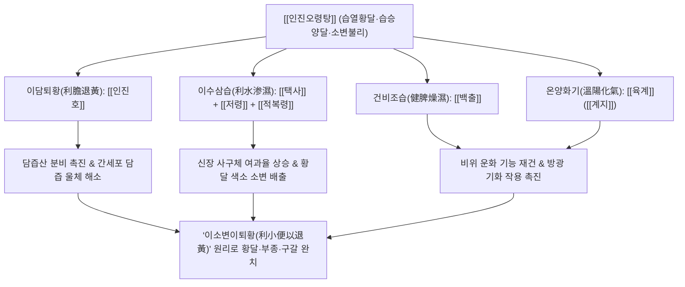

# 🍵 [[인진오령탕]] (茵蔯五苓湯, Yinchen Wuling-tang / Artemisia and Five-Ingredient Powder with Poria Decoction)

> **핵심 3줄 요약 (Key Summary)**:
> - 🌿 기본 구성: 간담의 습열을 끄고 담즙을 배출시키는 [[인진호]]에 체내 수독을 소변으로 빼내는 [[오령산]]([[택사]], [[저령]], [[적복령]], [[백출]], [[육계]])을 배오한 방제.
> - 🎯 적응증: 습열황달 중 습(濕)이 열(熱)보다 우세한 경우(습승양달), 피부와 안구 황달, 소변량 감소(소변불리), 갈증, 전신 부종, 지방간, 간수치 상승.
> - 🔬 약리 기전: 인진호 카필라리신의 담즙산 수송체(BSEP) 발현 촉진을 통한 빌리루빈 배출, 오령산 복합물의 아쿠아포린([[AQP2]]) 억제를 통한 이뇨, 간세포 보호.
> - ⚠️ 주의사항: 대변이 비결하고 열이 치성한 양달 실증에는 인진호탕을 쓰고, 몸이 차고 얼굴이 어두운 음달에는 인진사역탕을 선택할 것.

---
## 📌 목차
1. [기본 처방 정보 & 군신좌사 구성](#1-기본-처방-정보--군신좌사-구성)
2. [방제학적 약재 상호작용 & 시너지 네트워크](#2-방제학적-약재-상호작용--시너지-네트워크)
3. [현대 분자약리학적 효능 & 작용 기전](#3-현대-분자약리학적-효능--작용-기전)
4. [적응 병증 및 체질별 감별 (Sweet Spot vs 금기)](#4-적응-병증-및-체질별-감별-sweet-spot-vs-금기)
5. [유사 처방군 감별 매트릭스](#5-유사-처방군-감별-매트릭스)
6. [임상 가감례 & 현대 질환별 응용](#6-임상-가감례--현대-질환별-응용)
7. [💡 사용자 진료실 핵심 필기 & 임상 팁 (원문 보존)](#7--사용자-진료실-핵심-필기--임상-팁-원문-보존)
8. [출처 및 학술 참고 문헌 (References)](#8-출처-및-학술-참고-문헌-references)
---

## 1. 기본 처방 정보 & 군신좌사 구성

| 구분 | 약재명 | 표준 용량 | 본초 효능 & 방제 내 역할 |
| :--- | :--- | :--- | :--- |
| 군약(君藥) | [[인진호]] | 12.0~15.0g | 청열이습(淸熱利濕), 퇴황(退黃). 간담의 습열을 끄고 담즙 정체를 풀어 황달을 치료하는 핵심 요약 |
| 군약(君藥) | [[택사]] | 9.0~12.0g | 이수삼습(利水渗濕), 설열(泄熱). 신장과 방광의 수습을 소변으로 강렬하게 배출 |
| 신약(臣藥) | [[저령]] | 6.0~9.0g | 담삼이습(淡渗利濕). 사구체 여과를 촉진하여 담즙 색소가 섞인 탁한 수분을 체외로 배출 |
| 신약(臣藥) | [[적복령]] | 6.0~9.0g | 담삼이습(淡渗利濕), 건비보중(健脾補中). 중초 수습을 삼습시키고 비위를 도와 담음 생성 억제 |
| 좌약(佐藥) | [[백출]] | 6.0~9.0g | 건비익기(健脾益氣), 조습이수(燥濕利水). 비장의 운화 기능을 회복시켜 수습 정체 해소 |
| 사약(使藥) | [[육계]] | 3.0~4.0g | 온통경맥(溫通經脈), 조양화기(助陽化氣). 방광의 기화(氣化) 기능을 열어주고 혈류 순환 촉진 (계지) |

> *참고: 금궤요략 원방에서는 인진호 분말과 오령산 분말을 섞어 복용하는 인진오령산(茵蔯五苓散) 형태였으나, 후세 방제학에서는 탕약으로 달여 복용하는 인진오령탕(茵蔯五苓湯)으로 널리 운용됩니다.*

---

## 2. 방제학적 약재 상호작용 & 시너지 네트워크

- **이소변이퇴황 (利小便以退黃)의 정밀한 배합**:
  - 황달 치료의 3대 원칙 중 하나는 "소변을 잘 나오게 하여 담즙 색소를 몸 밖으로 씻어내는 것(利小便)"입니다.
  - [[인진호탕]]이 대황으로 대변을 통하게 하여 열(熱)을 내리는 처방이라면, [[인진오령탕]]은 [[오령산]]의 강력한 이뇨력으로 소변을 통하게 하여 습(濕)을 빼내는 방제입니다.
- **습승양달(濕勝陽疸)의 맞춤 처방**:
  - 황달이 발생했으나 열감이나 변비보다는, 몸이 붓고 소변이 잘 안 나오며 물을 마시면 속이 울렁거리는 등 '수분 정체(습)'가 주원인일 때 최고의 적응증을 가집니다.

---

## 3. 현대 분자약리학적 효능 & 작용 기전

### 1) 담즙산 수송체 발현 촉진 및 빌리루빈 배출 (Choleretic)
- [[인진호]]의 Capillarisin과 Scoparon 성분은 간세포의 담즙산 분비 펌프(BSEP)와 다제내성 단백질-2(MRP2) 발현을 상향 조절합니다.
- 간세포 내 축적된 빌리루빈을 담도로 신속히 배출시키고 혈중 총 빌리루빈(Total Bilirubin) 농도를 정상화합니다.

### 2) 신장 아쿠아포린([[AQP2]]) 억제 및 삼투성 이뇨
- [[택사]]와 [[저령]] 추출물은 신장 집합관의 AQP2 이동을 억제하여 전해질 불균형 없이 순수한 자유수와 황달 색소의 소변 배출을 유도합니다.
- 간질환 환자에게 흔히 동반되는 복강 및 하지의 수분 저류(부종)를 완화합니다.

### 3) 간세포 보호 및 항염증 (간효소 수치 강하)
- 간세포막 지질 과산화를 억제하고 글루타치온(GSH) 고갈을 방어하여 혈청 AST, ALT, $\gamma$-GTP 수치를 유의하게 강하시킵니다.
- 비알코올성 및 알코올성 지방간 모델에서 간내 지질 침착을 줄이고 미세혈류 순환을 개선합니다.

---

## 4. 적응 병증 및 체질별 감별 (Sweet Spot vs 금기)

### 1) 적응증 (Sweet Spot)
- **습승양달(濕勝陽疸, 습이 열보다 우세한 황달)**:
  - 피부와 눈 흰자위가 귤껍질처럼 노랗게 뜨고, 소변량이 적고 붉으며, 몸이 붓고 무거우며, 대변은 굳지 않고 무르거나 정상인 환자.
- **알코올성 간염 및 숙취성 황달**:
  - 과음 후 간기능 수치가 상승하고 피로감이 극심하며, 입이 마르고 속이 메스꺼우며 얼굴빛이 칙칙하게 노란 상태.
- **비알코올성 지방간(NAFLD) 동반 부종**:
  - 간질환과 함께 복부 팽만, 하지 부종, 소변불리가 동반된 경우.

### 2) 금기 및 신중 투여
- **열승양달(熱勝陽疸) 실증**:
  - 고열이 나고 대변이 꽉 막혀 나오지 않으며 혀가 새빨갛고 황태가 두껍게 낀 환자에게는 대황과 치자가 들어간 [[인진호탕]]을 써야 함.
- **한습음달(寒濕陰疸)**:
  - 몸이 얼음장처럼 차고 얼굴빛이 어둡고 거무튀튀한 음달 환자에게는 부자와 건강이 든 [[인진사역탕]]을 선택해야 합니다.

---

## 5. 유사 처방군 감별 매트릭스

| 처방명 | 핵심 구성 차이 | 주치 및 임상 차별점 | 맥진/설진 차이 |
| :--- | :--- | :--- | :--- |
| [[인진오령탕]] | [[오령산]] + [[인진호]] | **습승양달(濕勝)**: 소변불리, 부종, 구갈, 대변 정상, 수분 정체 우세 | 맥 유완(濡緩) 혹은 현(弦), 설 담(淡) 태백니 |
| [[인진호탕]] | [[인진호]], [[산치자]], [[대황]] (3미) | **열승양달(熱勝)**: 맹렬한 황달, 고열, 변비(대변비결), 섬어, 실열 | 맥 활삭(滑數) 유력, 설홍(舌紅) 황후태 |
| [[인진사역탕]] | [[인진호]], [[부자]], [[건강]], [[감초]] | **한습음달(陰疸)**: 전신 극심한 냉감, 안색 암황, 맥미세, 허한증 | 맥 침미세(沈微細), 설 담백(淡白) |
| [[오령산]] | [[저령]], [[택사]], [[백출]], [[복령]], [[육계]] | 축수증, 수역, 소변불리, 부종 (황달이나 간질환 없음) | 맥 부(浮) 혹은 완(緩), 설태 백활 |

---

## 6. 임상 가감례 & 현대 질환별 응용

### 1) 임상 가감례
- **황달 색소 짙고 간수치 급상승 시**: [[호장근]], [[울금]] 각 8.0g을 가하여 이담퇴황력을 극대화합니다.
- **가슴과 명치가 답답하고 트림 동반 시**: [[지각]], [[진피]] 각 4.0g을 가하여 이기소만합니다.
- **오심 구토가 심할 때**: [[반하]], [[생강]] 각 4.0g을 가하여 강역지구합니다.
- **복부 팽만과 가스 심할 때**: [[후박]], [[대복피]] 각 4.0g을 가하여 위령탕의 의미를 결합합니다.

### 2) 현대 질환별 응용
- **급만성 바이러스성 간염 및 독성 간염**: 빌리루빈 정체와 간세포 손상을 부드럽게 완화하여 황달 소퇴 유도.
- **비알코올성 지방간 및 간비대**: 복부 비만과 수분 정체가 동반된 지방간 환자의 간내 미세순환 및 대사 개선.
- **담즙 울체성 소양증**: 담즙산의 혈중 역류로 인한 전신 피부 가려움증 완화.

---

## 7. 💡 사용자 진료실 핵심 필기 & 임상 팁 (원문 보존)

> [!tip] **진료실 실전 노하우 (User Clinical Insight)**
> 
> # 구성:
> [[인진호]], [[택사]], [[적복령]], [[백출]], [[저령]], [[육계]]
> 
> # 적응증:
> - 습열황달 중 습(濕)이 열(熱)보다 우세하여 소변이 잘 나오지 않고 갈증이 나며 몸이 붓는 습승양달(濕勝陽疸)의 대표 처방.
> - 인진호탕과 달리 설사를 시키지 않고 소변을 통하게 하여(이소변) 자연스럽게 황달 색소를 체외로 배출시키는 부드러운 퇴황법.

---

## 8. 출처 및 학술 참고 문헌 (References)

1. **장중경 (張仲景)**. (200경). 『금궤요략(金匱要略)』 황달병맥증병치(黃疸病脈證幷治).
   - **[고전 원전]**: "黃疸病, 茵蔯五苓散主之. 茵蔯蒿末十分, 五苓散五分. 二物和, 先食飮方寸匕, 日三服." (황달병은 인진오령산으로 다스린다. 인진호 가루 10푼, 오령산 5푼을 섞어 식전에 1방촌시씩 하루 세 번 복용한다.)
2. * **Arab JP et al. (2009)**. Effects of Japanese herbal medicine Inchin-ko-to on endotoxin-induced cholestasis in the rat. *Annals of hepatology*, 8: 228-33. [PMID: 19841502](https://pubmed.ncbi.nlm.nih.gov/19841502/)
3. * **Zhang B et al. (2025)**. Network-based analysis and experimental validation of identified natural compounds from Yinchen Wuling San for acute myeloid leukemia. *Frontiers in pharmacology*, 16: 1591164. [PMID: 40520175](https://pubmed.ncbi.nlm.nih.gov/40520175/)
