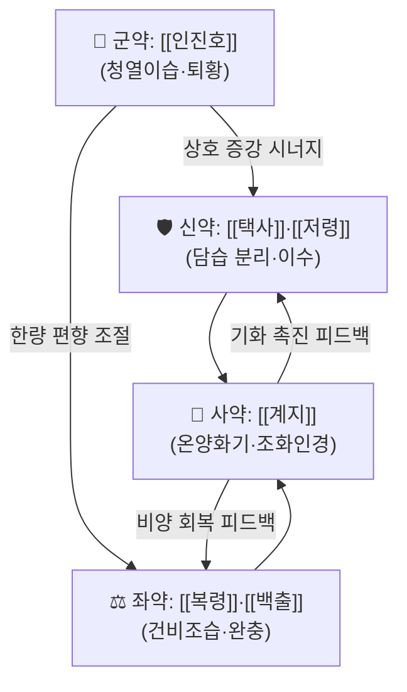

# 🍵 [[인진위령탕]] (茵陳五苓散, Yinchen Wuling San)

> **핵심 3줄 요약 (Key Summary)**:
> - 🌿 **모체 처방**: [[오령산]](五苓散: [[택사]]·[[저령]]·[[복령]]·[[백출]]·[[계지]])에 [[인진호]](茵陳蒿)를 가한 처방. 『금궤요략』에서는 인진호말(茵陳蒿末) 十分과 오령산(五苓散) 五分을 배합하는 **2:1 비율**의 산제(散劑) 형태로 제시되며, 현대 임상에서는 탕제로 전용(轉用)해 쓴다.
> - 🎯 **임상 최적 적응증**: 습열(濕熱)이 중초에 정체되면서 소변불리·부종·구니(口膩)·식욕부진을 동반한 **간담도계 질환(황달, 간효소 상승, 지방간, 간경변 보조)**. 담음·습체 경향의 태음인 체형(살집 있고 부종 잘 붓는 편)에서 적중률이 높다.
> - 🔬 **핵심 분자약리 기전**: 대사이상 관련 지방간염(MASH) 모델에서 **YAP/TAZ 신호경로 조절**을 통한 완화 작용이 보고되었고(PMID 40683423), 뇌졸중 환자의 혈청 간효소 상승 개선 증례(PMID 30572459), 간경변 코호트에서의 보조요법 유리한 결과(PMID 32507445)가 있다. 항암 관련 연구는 네트워크 약리학·분자도킹 수준의 **전임상 탐색**이다(PMID 40520175, 35873484).
> - ⚠️ 주의사항: 음허진조(陰虛津燥)·무습열(無濕熱) 소변자리(自利) 환자, 탈수·전해질 이상 위험군, 이뇨제·항응고제 병용 환자는 신중 투여. 임신부는 계지·택사 이수작용을 고려해 신중히 판단한다.

---
## 📌 목차
1. [기본 처방 정보 & 군신좌사 구성](#1-기본-처방-정보--군신좌사-구성)
2. [방제학적 약재 상호작용 & 시너지 네트워크](#2-방제학적-약재-상호작용--시너지-네트워크)
3. [현대 분자약리학적 효능 & 작용 기전](#3-현대-분자약리학적-효능--작용-기전)
4. [적응 병증 및 체질별 감별 (Sweet Spot vs 금기)](#4-적응-병증-및-체질별-감별-sweet-spot-vs-금기)
5. [유사 처방군 감별 매트릭스](#5-유사-처방군-감별-매트릭스)
6. [임상 가감례 & 현대 질환별 응용](#6-임상-가감례--현대-질환별-응용)
7. [💡 사용자 진료실 핵심 필기 & 임상 팁 (원문 보존)](#7--사용자-진료실-핵심-필기--임상-팁-원문-보존)
8. [출처 및 학술 참고 문헌 (References)](#8-출처-및-학술-참고-문헌-references)

---
## 1. 기본 처방 정보 & 군신좌사 구성

* **출전**: 장중경(張仲景) 『[[금궤요략]]』 「황달병맥증병치(黃疸病脈證幷治)」 — "황달병, 인진오령산 주지(黃疸病, 茵陳五苓散主之)." 이후 『[[동의보감]]』 「잡병편·황달(黃疸)」 문에서도 황달·소변불리의 대표 방제로 수록되어 한국 임상에서 널리 활용되어 왔다.
* **치법**: 청열이습퇴황(淸熱利濕退黃), 이수삼습(利水滲濕), 온양화기(溫陽化氣).
* **구성 원리**: 오령산은 원래 담습(痰濕)이 중초에 정체되어 나타나는 갈증·소변불리·부종·현훈을 다스리는 이수제이며, 여기에 청열이담(淸熱利膽)의 요약(要藥)인 인진호를 군약으로 증입하여 **"수습(水濕)을 빼내는 축(軸)"과 "습열(濕熱)을 청하는 축(軸)"을 동시에 세운 처방**이다. 인진호가 없으면 청열퇴황력이 약하고, 오령산이 없으면 이수배습(利水排濕)의 출구가 없어 습열이 빠져나갈 길이 없다는 것이 방제학의 핵심 논리이다.

| 구분 | 약재명 | 표준 용량 | 본초 효능 & 방제 내 역할 |
| :--- | :--- | :--- | :--- |
| **군약 (君藥)** | [[인진호]] (茵陳蒿) | 10~20g | 청열이습(淸熱利濕)·퇴황(退黃)의 주약. 담즙 배설 촉진·간세포 보호를 겨냥하며, 습열황달의 핵심 표적 병변(간·담도)을 직접 공략한다. 『금궤요략』 원방에서는 인진호말 十分(오령산 대비 2배)으로 군약적 위상을 명시. |
| **신약 (臣藥)** | [[택사]] (澤瀉) | 8~12g | 담습(痰濕)을 하행시켜 소변으로 배출하는 이수삼습의 주력. 신(腎)·방광 인경(引經)하며, 인진호의 청열 작용에 **배출 통로**를 부여한다. 오령산 단독에서는 통상 군약, 인진오령산에서는 신약으로 재배치된다. |
| **신약 (臣藥)** | [[저령]] (豬苓) | 6~9g | 담습 분리(分利) 작용으로 택사와 협력해 수습을 하초로 유도. 방광습열을 겸한 소변불리·요로 자극 증상에 보조적으로 대응. |
| **좌약 (佐藥)** | [[복령]] (茯苓) | 6~9g | 건비삼습(健脾滲濕) 및 영심안신(寧心安神). 군약의 청열 편향이 비위(脾胃)를 손상시키지 않도록 완충하고, 수습 생성의 근원인 비허(脾虛)를 다스린다. |
| **좌약 (佐藥)** | [[백출]] (白朮) | 6~9g | 건비조습(健脾燥濕)·이수. 복령과 배오하여 "비를 세워 습을 말리는" 구조를 형성, 이수제 과용으로 인한 기액(氣液) 소모를 방지한다. |
| **사약 (使藥)** | [[계지]] (桂枝) | 3~6g | 온양화기(溫陽化氣)하여 정체된 수기를 기화(氣化)시키고, 제약(諸藥)을 조화하며 인경 작용을 담당. 인진호의 **한량(寒涼) 편향을 조절하는 평형추** 역할이 방제학적 묘미이다. |

> **배오 특징**: 원방은 인진호말 : 오령산 = 2 : 1의 산제(散劑)로, 식전에 方寸匕(약 1~2g 상당)를 1일 3회 복용하도록 제시되어 있다(『금궤요략』). 현대 임상에서는 동일 비율 개념을 유지하면서 탕제로 전용하며, **인진호를 10~20g으로 넉넉히, 계지는 3~6g으로 최소한** 쓰는 것이 일반적이다. 전체 처방의 승강(升降)은 "인진호의 청열(청강) + 계지의 온화(온승) + 택사·저령·복령의 하행 이수"로 구성되어, **상초의 열을 내리고 중초의 습을 말리며 하초로 배출**하는 3단 구조의 출입(出入) 균형을 이룬다.

---
## 2. 방제학적 약재 상호작용 & 시너지 네트워크

* **[[인진호]] + [[택사]] 배오**: 인진호가 습열을 청하고 담즙 배설을 촉진하면, 택사가 그 열과 습을 소변으로 끌어내리는 **상사(相使) 관계**를 이룬다. 인진호 단독으로는 배출구가 없어 습열이 다시 정체할 수 있는데, 택사가 이를 해소한다. 『금궤요략』이 두 약을 산제로 혼합해 복용하도록 한 것은 이 상사 관계를 제형으로 구현한 것이다.
* **[[택사]] + [[저령]] + [[복령]] 배오**: 삼습이수(滲濕利水)의 3중 네트워크. 저령은 담습을 분리하고 복령은 비를 도와 습을 운화하며 택사는 하초로 유도한다. 특히 [[복령]]은 좌약으로서 인진호·택사의 이수 작용이 장기화될 때 발생할 수 있는 **음액(陰液) 소모와 위장 장애를 완충**한다.
* **[[백출]] + [[계지]] 배오**: 계지의 온양화기가 백출의 건비조습과 만나 "비양(脾陽)을 회복시켜 수습이 스스로 화(化)하게 하는" 구조를 만든다. 이수약만 쓰면 비양이 꺾여 습이 오히려 더 생기는 악순환이 생기는데, 이 배오가 그 고리를 차단한다.
* **[[인진호]] + [[계지]] 배오**: 청열(寒)과 온양(溫)의 **상반상성(相反相成)**. 습열을 청하면서도 비위의 양기를 지켜, 담음·습체 체질(태음인형, 냉한 위장)에서 인진호의 한량으로 인한 속쓰림·설사를 방지한다. 이 때문에 인진오령산은 순수 청열제(예: [[인진호탕]])보다 **위장 내성이 우수한 처방**으로 평가된다.
* **사약(使藥) [[계지]]의 조화·인경 작용**: 계지는 단순한 온열제가 아니라 오령산 전체의 **기화(氣化) 스위치**이다. 계지가 없으면 이수약들이 물을 "빼내기만" 하고 정상적인 진액 대사로 되돌리는 힘이 약해진다. 임상에서 계지를 빼고 투여할 경우 부종 재발이나 무기력감이 늘었다는 경험적 보고가 있으나, 이는 **정량적 근거 미확인**이며 처방학적 해석에 해당한다.

---
## 3. 현대 분자약리학적 효능 & 작용 기전

### 1) 대사이상 관련 지방간염(MASH/MASLD) — YAP/TAZ 신호 조절
* **Seo HS, Kim HG (2025)** 연구(PMID 40683423)에서 **Injinoryeong-San(인진오령산)**이 대사이상 관련 지방간염(MASH)을 완화하며, 그 기전으로 **YAP/TAZ 신호경로의 조절**이 제시되었다. YAP/TAZ는 Hippo 신호경로의 핵심 effector로, 간세포의 지방축적·염증·섬유화 진행에 관여하는 것으로 알려져 있다.
* 즉 이 처방의 간 보호 작용은 단순한 "이뇨를 통한 담즙 배출"이라는 고전적 설명을 넘어, **간 내 기계적·대사적 스트레스 신호전달 축을 조절하는 수준**에서 해석될 여지가 열렸다.
* 다만 본 논문에서의 구체적 지표 수치(지방축적 억제율, 염증성 사이토카인 정량값, 섬유화 마커 변화폭 등)는 **본 노트 작성 범위에서 근거 미확인**이며, 원문 확인이 필요하다.

### 2) 간효소 상승 및 간기능 개선 — 임상 근거
* **Chu H, Park C (2018)** 연구(PMID 30572459)는 **뇌졸중 환자에서 혈청 간효소 상승이 동반된 3례**에 대해 **인진오령산가감방(茵陳五苓散加減方) 탕전(湯煎)**을 투여한 결과를 보고하며, **효과와 안전성**을 서술하였다. 뇌졸중 급성기·회복기 환자에서 다약제 복용이나 기저 간질환으로 간수치가 오른 경우, 처방 선택의 실제적 근거가 된다.
* 단, 이는 **증례보고(3 cases)**로 대조군이 없어 인과관계 해석에는 제한이 있다. "간효소가 개선되었다"는 관찰은 기록되어 있으나, 통계적 유의성이나 용량-반응 관계는 **근거 미확인**이다.
* **Xie Z, Qiang J (2020)** 연구(PMID 32507445)는 **중국 서남부 지역의 대규모 간경변(liver cirrhosis) 코호트**에서 **보조적 중의학(TCM) 병용 치료가 유리한 결과(favorable outcome)**와 연관됨을 보고하였다. 이는 인진오령산 계열 처방이 포함될 수 있는 **TCM 병용요법 범주**의 근거이지, 인진오령산 단독의 처방 특이적 효능 근거는 아니다. 간경변 환자의 복수·부종·황달 관리에서 보조요법으로 고려할 수 있는 배경 자료로 이해하는 것이 타당하다.

### 3) 종양 관련 네트워크 약리학 탐색 — 전임상/전산 수준
* **Zhang B, Fu D (2025)** 연구(PMID 40520175)는 **Yinchen Wuling San(인진오령산) 유래 천연화합물**에 대해 **네트워크 기반 분석(network-based analysis)과 실험적 검증(experimental validation)**을 수행하여 **급성 골수성 백혈병(acute myeloid leukemia, AML)**에 대한 가능성을 탐색하였다.
* **Zhang B, Liu G (2022)** 연구(PMID 35873484)는 **네트워크 약리학(network pharmacology)과 분자 도킹(molecular docking)** 기법으로 인진오령산의 **두경부 편평세포암(head and neck squamous cell carcinoma, HNSCC)**에 대한 **분자 표적과 잠재 기전**을 규명하고자 하였다.
* ⚠️ **해석 주의**: 위 두 연구는 처방의 구성 화합물-표적-경로 네트워크를 전산 예측하고 세포 수준에서 검증한 **기초·전임상 탐색 연구**이다. **임상적 항암 효능을 뒷받침하는 근거가 아니며**, 인진오령산을 항암 목적으로 단독 투여하는 것은 근거가 없다. 각 논문에서 특정된 개별 화합물명·표적 단백질·억제농도(IC50 등)의 구체 값은 **본 노트 작성 범위에서 근거 미확인**이다.

### 4) 이수(利水)·삼습(滲濕) 작용의 현대적 해석 — 전통 이론 기반
* 방제학적으로 오령산 계열의 이수 작용은 "수기(水氣)의 기화 실조"를 교정하는 것으로 설명된다. 현대적으로는 신장 배설 기능 및 체액 분포 조절과 연결해 해석되지만, **본 제공 논문들에서는 소변량·전해질·신혈류 지표에 대한 정량 데이터가 제시되어 있지 않아 근거 미확인**이다.
* 항염증(TNF-α, IL-6, IL-1β 등) 및 NF-κB/MAPK 경로 조절 역시 인진오령산에 대해 **본 제공 문헌에서는 직접 확인되지 않는다**. 인진호·택사·복령 개별 약재의 성분 연구로 일반화하지 않도록 주의한다.

---
## 4. 적응 병증 및 체질별 감별 (Sweet Spot vs 금기)

[✅ 최적 적응증 (Sweet Spot)]
* **원전 주치 조문**: 『금궤요략』 「황달병맥증병치」 — **"황달병, 인진오령산 주지(黃疸病, 茵陳五苓散主之)"**. 『동의보감』 「황달」 문에서도 습열로 인한 황달·소변불리·신체 황색에 활용되는 처방으로 정리되어 있다.
* **핵심 병기(病機)**: **습열(濕熱) + 수습내정(水濕內停) + 비양불운(脾陽不運)**의 3중 구조. 즉 열만 있는 것이 아니라 **물이 정체되어 배출되지 않는 상태**가 반드시 동반되어야 한다.
* **체질 소견**: **태음인 계열**이 최적. 살집이 있고 얼굴·하지가 잘 붓는 편, 피부가 번들거리거나 기름진 편(습열), 아침에 눈꺼풀이 붓고 몸이 무거운 느낌을 호소. 소음인에서도 계지의 온양 작용 덕에 쓸 수 있으나 **한성(寒性) 소화기 증상이 뚜렷하면 인진호 용량을 줄이고 신중히 판단**한다.
* **임상 주치(진료실 최다 적중 양상)**:
  * 황달 또는 눈 흰자위의 미황(微黃) 소견
  * 소변불리, 소변량 감소, 소변이 탁함
  * 간효소(AST/ALT/γ-GTP) 경도~중등도 상승
  * 지방간·지방간염(MASH) 진단 하의 피로·우상복부 불쾌감
  * 식후 복부 팽만, 구니(口膩), 식욕부진, 몸이 무겁고 처짐
  * 회복기 뇌졸중 환자의 간수치 상승 동반 시(PMID 30572459의 실제 적응 상황)
* **설진/맥진**:
  * **설진**: 설질은 담홍~홍, **설태는 백니(白膩) 또는 황니(黃膩)** — 니태(膩苔)가 이 처방의 가장 중요한 지표. 습열이 심하면 태가 황하고 두터워진다.
  * **맥진**: **맥부완(脈浮緩) 또는 맥침완(脈沈緩)**이 전형. 습열 겸하면 활삭(滑數)하게 나타날 수 있고, 비허가 심하면 세완(細緩)한다.

[⚠️ 신중 투여 및 금기 (Caution / Contraindication)]
* **음허진조(陰虛津燥) 환자**: 입이 마르고 갈증이 심하며, 소변이 이미 적고 붉으면서 설태가 없거나 박탈(剝脫)된 경우. 이수약이 진액을 더 소모시킬 수 있다.
* **무습열(無濕熱) 소변자리(自利) 환자**: 소변이 이미 잘 나오는데도 이수제를 쓰면 기액(氣液) 손상과 무기력·현훈이 유발될 수 있다.
* **실열무습(實熱無濕) 또는 대변비결·복만이 뚜렷한 양황(陽黃)**: 이 경우는 대황·치자를 포함하는 [[인진호탕]] 방향이 적합하며, 인진오령산은 배출력이 부족할 수 있다.
* **탈수·전해질 이상 위험군**: 고령자, 신기능 저하 환자, 이미 이뇨제(푸로세미드·스피로놀락톤 등)를 복용 중인 환자. 병용 시 저칼륨혈증·저나트륨혈증 위험이 있으므로 경과 관찰이 필요하다.
* **항응고제·항혈소판제 병용 환자**: 계지(桂枝) 계열 약재를 포함하므로 출혈 경향 환자에서는 신중히 판단한다(정량적 상호작용 근거는 **미확인**, 임상적 주의 사항으로 기재).
* **임신부 및 수유부**: 택사·저령의 이수 작용과 계지의 온통(溫通) 작용을 고려하여 반드시 의료진 판단 하에 투여한다.
* **복약 반응 관찰 포인트**: 초기 1~2주 내 소변량 증가·부종 감소·구니 완화가 나타나는지 확인하고, 오심·속쓰림·설사·어지럼이 발생하면 인진호 또는 택사 용량을 감량하거나 계지를 상대적으로 증량하는 방향으로 조정한다.

---
## 5. 유사 처방군 감별 매트릭스

| 처방명 | 핵심 구성 차이 | 주치 및 체질 차이 | 맥진/설진 차이 |
| :--- | :--- | :--- | :--- |
| [[인진위령탕]] | 기준 구성 (인진호 + 오령산) | **습열 + 수습내정 + 비양불운**, 황달·간효소 상승·부종·구니. 태음인 습체형의 기준 처방 | 기준 설태: 백니~황니. 기준 맥상: 부완~침완 |
| [[오령산]] | 인진호 없음 | 수습내정 단독, 갈증·소변불리·현훈·부종. 열증 소견이 없을 때. 목표는 이수삼습 단독 | 설태 담백니, 맥 부삭 또는 부완 |
| [[인진호탕]] | 인진호 + 치자 + 대황 | 양황(陽黃) 습열 결실형. 대변비결·복만·신열이 뚜렷. 배출력이 강해 체력 있는 실증에 | 설태 황조(黃燥), 맥 활삭 또는 실(實) |
| [[위령탕]] | 오령산 + 평위산 | 습체비위(濕滯脾胃)형. 설사·복명(腹鳴)·복창·식욕부진이 주증. 소화기 중심 | 설태 백니(두터움), 맥 완약(緩弱) |
| [[시령탕]] | 소시호탕 + 오령산 | 소양증(한열왕래·흉협고만) + 수습내정이 겹친 경우. 간담도계 + 자율신경 증상 동반 | 설태 백니, 맥 현(弦) 또는 현완 |

> ⚠️ 표 내부에서는 마크다운 열 구분자 파괴를 방지하기 위해 파이프(`|`)가 들어간 링크를 쓰지 않고 순수한 [[처방명]] 단독 형태로만 작성합니다.

> **실전 감별 포인트**: "**열이 있느냐, 물이 있느냐, 비가 허하냐**"의 3축으로 판단한다. 열이 강하고 변비가 있으면 [[인진호탕]], 물 정체와 부종이 중심이면 [[오령산]], 습열과 물 정체가 동시에 있고 간수치 상승이 동반되면 **[[인진위령탕]]**, 소화기 증상(설사·복명)이 앞서면 [[위령탕]], 한열왕래 등 소양 증상이 겹치면 [[시령탕]]이 우선이다.

---
## 6. 임상 가감례 & 현대 질환별 응용

* **수반 증상별 가감법**:
  * 황달·간효소 상승이 뚜렷할 때 → [[인진호]] 증량, + [[치자]]·[[대황]] ([[인진호탕]] 방향으로 접근)
  * 복부 팽만·설사·복명 등 소화기 증상 동반 시 → + 평위산 개념([[창출]]·[[후박]]·[[진피]]·[[감초]]) ([[위령탕]] 방향)
  * 습열이 심해 설태가 황후(黃厚)하고 소변이 탁할 때 → + [[황금]]·[[황련]]·[[치자]]
  * 간경변·복수로 인한 부종이 심할 때 → [[택사]]·[[저령]] 증량, + [[대복피]]·[[차전자]]
  * 지방간·MASH 동반 시 → + [[단삼]]·[[결명자]]·[[산사]]
  * 우상복부 결림·담낭 불편감 동반 시 → + [[시호]]·[[울금]] ([[시령탕]] 방향)
  * 피로·기허 증상이 뚜렷할 때 → + [[황기]]·[[당삼]] (단, 습열이 남아 있는 동안은 보기약을 과용하지 않음)
  * 뇌졸중 환자의 간효소 상승 동반 → 인진오령산가감방 형태로 탕전 투여(PMID 30572459의 실제 운용 방식)
* **현대 질환별 임상 매핑**:
  * **간담도계 (핵심 영역)**: 급·만성 간염의 회복기, 지방간 및 대사이상 관련 지방간염(MASH), 알코올성 간손상, 간효소 경도 상승, 간경변의 보조요법(부종·복수·황달 관리), 담즙 정체성 소견. 특히 약물성 간손상이 의심되는 다약제 복용 환자에서 대체·보조 처방으로 고려된다(PMID 30572459, 32507445).
  * **소화기계**: 습체로 인한 식욕부진, 구니(口膩), 식후 팽만, 연변·설사, 멀미성 오심.
  * **비뇨기계·부종**: 특발성 부종, 하지 부종, 소변불리, 요로 감염의 습열 증상 보조.
  * **대사·순환기계**: 습체 비만, 고지혈증 동반 지방간, 대사증후군의 담음 습체형.
  * **신경계(회복기)**: 뇌졸중 회복기 환자의 간효소 상승 관리(PMID 30572459).
  * **종양(연구 단계, 임상 적용 아님)**: AML 및 HNSCC에 대한 네트워크 약리학·분자도킹 탐색이 이루어졌으나(PMID 40520175, 35873484), **임상 효능 근거가 아니므로 항암 목적의 단독 투여는 권장되지 않는다**.

---
## 7. 💡 사용자 진료실 핵심 필기 & 임상 팁 (원문 보존)

> [!tip] **진료실 실전 노하우 (User Clinical Insight)**
> - ⚠️ **원문 보존 상태**: 본 노트 작성 시점에 사용자(원장님)의 기존 진료실 필기 원문은 제공되지 않았다. 따라서 본 블록에는 **보존할 원문이 비어 있으며**, 실제 필기가 확보되는 즉시 이 위치에 원문 그대로(삭제·요약 없이) 추가한다.
> - 아래 항목은 위에 인용된 학술 문헌 및 방제학적 해석에 근거한 **정리 요점**이며, 원장님 개인 필기와는 구분하여 기록한다.

* **처방 선택의 실전 기준 (습열·수습·비허 3축 점검)**
  1. **열(熱)**: 눈 흰자위 미황, 소변 탁·황, 설태 황니, 구니 → 인진호 증량 검토.
  2. **물(水)**: 부종, 소변량 감소, 몸 무거움, 아침 안검 부종 → 택사·저령·복령 유지 또는 증량.
  3. **비허(脾虛)**: 식후 팽만, 연변, 무기력, 찬 음식에 예민 → 백출 증량, 계지 최소 3g 이상 유지.
  * 세 축 중 **물 정체 소견이 전혀 없으면** 인진오령산보다 [[인진호탕]]이나 다른 청열 처방을 우선 고려한다.
* **체질별 실전 감각**
  * **태음인(습체·비만형)**: 본 처방의 최적 모집단. 인진호 15~20g까지 과감히 사용 가능하며, 복령·백출을 넉넉히 배합.
  * **소음인(마르고 찬 위장)**: 인진호 10g 이하로 시작, 계지 유지 또는 5~6g으로 증량, 백출 비중 확대. 속쓰림·설사 발생 시 인진호 감량.
  * **소양인(열성·건조)**: 습열 소견과 무관한 단순 열증에는 부적합. 음허진조 소견이면 원칙적으로 회피.
* **환자 티칭 포인트**
  * "소변이 잘 나오는 것이 치료 반응의 신호"임을 설명. 다만 야간 빈뇨가 심해지면 복용 시간을 오전·이른 오후로 조정.
  * 복용 중 **기름진 음식·음주·과식**은 습열을 다시 만들어 약효를 상쇄하므로 식이 조절을 반드시 병행 안내.
  * 간수치 추적 검사 일정(투여 2~4주 후)을 미리 예약해 두고, **개선 여부와 무관하게 원인 감별(바이러스성·약물성·자가면역성)은 별도로 진행**해야 함을 설명.
* **복약 반응 관찰 포인트**
  * 긍정 반응: 소변량 증가, 부종·몸 무거움 감소, 구니 완화, 식욕 회복, 간효소 하향.
  * 부정 반응: 오심·속쓰림(인진호 과량), 설사·복명(택사·저령 과량), 현훈·무기력(이수 과다로 인한 기액 손상), 야간 빈뇨.
  * 부정 반응 시 조정 순서: ① 인진호 감량 → ② 택사·저령 감량 → ③ 백출·복령 증량으로 비위 완충 → ④ 계지 상대적 증량.
* **병용 주의 실무 체크리스트**
  * 이뇨제, 항응고제·항혈소판제, 간대사 효소 유도/억제 약물(일부 항전간제·항진균제 등) 복용 여부를 반드시 확인.
  * 다약제 복용 중인 고령 환자에서는 **간효소 상승의 원인이 약물인지 처방 반응인지** 감별이 어려우므로, 투여 전 기저 수치를 반드시 확보해 둔다.

---
## 8. 출처 및 학술 참고 문헌 (References)

1. **Zhang B, Fu D (2025)**. *Network-based analysis and experimental validation of identified natural compounds from Yinchen Wuling San for acute myeloid leukemia*. **Front Pharmacol**. PMID: 40520175.
   - 🔗 https://pubmed.ncbi.nlm.nih.gov/40520175/
   - **[연구 요약]**: 인진오령산(Yinchen Wuling San) 유래 천연화합물을 대상으로 네트워크 기반 분석과 실험적 검증을 수행하여 급성 골수성 백혈병(AML)에 대한 가능성을 탐색한 **전임상·전산 연구**. 임상 효능 근거가 아니며, 개별 화합물·표적의 구체 값은 본 노트 범위에서 근거 미확인.

2. **Zhang B, Liu G (2022)**. *Identification of Molecular Targets and Potential Mechanisms of Yinchen Wuling San Against Head and Neck Squamous Cell Carcinoma by Network Pharmacology and Molecular Docking*. **Front Genet**. PMID: 35873484.
   - 🔗 https://pubmed.ncbi.nlm.nih.gov/35873484/
   - **[연구 요약]**: 네트워크 약리학과 분자 도킹 기법으로 인진오령산의 두경부 편평세포암(HNSCC)에 대한 분자 표적 및 잠재 기전을 규명한 **기초 연구**. 임상적 항암 근거로 해석하지 않는다.

3. **Seo HS, Kim HG (2025)**. *Injinoryeong-San attenuates metabolic dysfunction-associated steatohepatitis via regulation of YAP/TAZ-signaling pathway*. **J Ethnopharmacol**. PMID: 40683423.
   - 🔗 https://pubmed.ncbi.nlm.nih.gov/40683423/
   - **[연구 요약]**: 인진오령산이 대사이상 관련 지방간염(MASH)을 완화하며, 그 기전으로 **YAP/TAZ 신호경로 조절**이 제시됨. 본 처방의 간 보호 작용을 분자 수준에서 설명하는 핵심 근거.

4. **Chu H, Park C (2018)**. *Effectiveness and safety of Injinoryung-San-Gagambang (Yinchen Wuling powder) decoction on stroke patients with elevated serum liver enzymes: Three case reports*. **Medicine (Baltimore)**. PMID: 30572459.
   - 🔗 https://pubmed.ncbi.nlm.nih.gov/30572459/
   - **[연구 요약]**: 혈청 간효소가 상승한 뇌졸중 환자 3례에서 인진오령산가감방 탕전(湯煎) 투여의 **효과와 안전성**을 보고한 증례보고. 대조군이 없어 인과 해석에 제한이 있음.

5. **Xie Z, Qiang J (2020)**. *Favorable outcome of adjunctive traditional Chinese medicine therapy in liver cirrhosis: A large cohort study in Southwest China*. **Complement Ther Med**. PMID: 32507445.
   - 🔗 https://pubmed.ncbi.nlm.nih.gov/32507445/
   - **[연구 요약]**: 중국 서남부 지역 간경변 대규모 코호트에서 **보조적 중의학(TCM) 병용 치료가 유리한 결과**와 연관됨을 보고. 특정 처방(인진오령산) 단독의 효능 근거가 아니라, 처방이 포함될 수 있는 TCM 보조요법 범주의 코호트 근거이다.

6. **장중경 (200년경)**. 『[[금궤요략]]』 「황달병맥증병치(黃疸病脈證幷治)」.
   - **[고전 원전]**: "황달병, 인진오령산 주지(黃疸病, 茵陳五苓散主之)." 인진호말 十分과 오령산 五分을 혼합하여 方寸匕를 식전에 1일 3회 복용하는 산제 조제·복약 지침이 제시되어 있다.

7. **허준 (1613)**. 『[[동의보감]]』 「잡병편·황달(黃疸)」.
   - **[임상 문헌]**: 습열로 인한 황달 및 소변불리, 신체 황색 등의 주치와 함께 인진오령산 계열 처방의 활용이 정리되어 있으며, 한국 임상에서의 응용 배경이 된다. (원문 조문 세부 표현은 판본에 따라 차이가 있을 수 있음)

<!-- 보관 태그(1회용·링크오류, 필요시 복원): 이수거습, 청열이담, 담즙, 온양화기 -->
