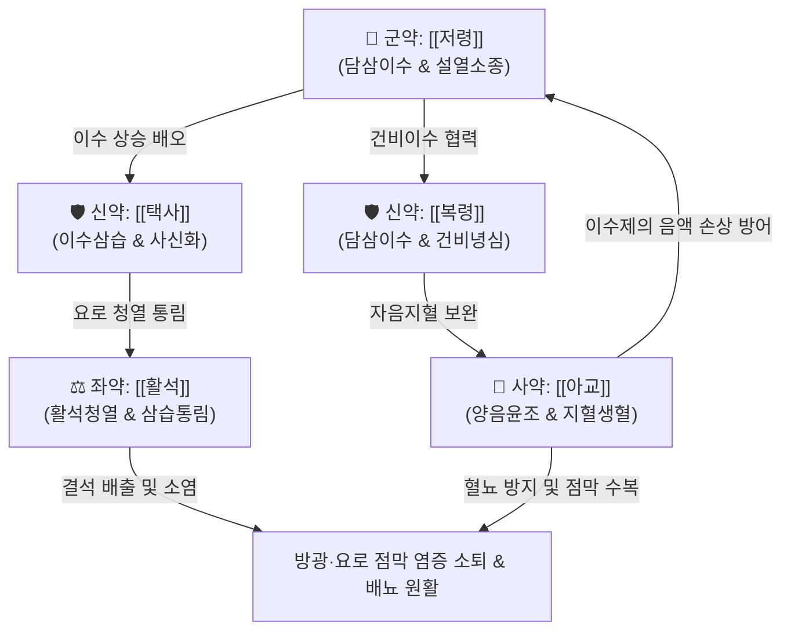

# 🍵 [[저령탕]] (猪苓湯, Zhu-Ling-Tang / Choreito)

> **핵심 3줄 요약 (Key Summary)**:
> - 🌿 기본 구성: [[저령]], [[택사]], [[복령]], [[활석]], [[아교]] (이수약 3미 + 청열통림약 [[활석]] + 자음지혈약 [[아교]]).
> - 🎯 적응증: 요로감염(방광염, 요도염), 혈뇨, 빈뇨, 배뇨통, 잔뇨감, 요로결석, 전립선비대증 증상, 신장염.
> - 🔬 약리 기전: 수산칼슘 결석 형성 및 응집 억제, 요로 상피세포 항염증, 아쿠아포린 조절 삼투성 이뇨, 지혈 및 점막 보호.
> - ⚠️ 주의사항: 한습(寒濕)이나 비신양허(脾腎陽虛)로 인한 부종에는 금기이며, 아교는 탕액을 끓인 후 따로 녹여(융화, 烊化) 복용.

---
## 📌 목차
1. [기본 처방 정보 & 군신좌사 구성](#1-기본-처방-정보--군신좌사-구성)
2. [방제학적 약재 상호작용 & 시너지 네트워크](#2-방제학적-약재-상호작용--시너지-네트워크)
3. [현대 분자약리학적 효능 & 작용 기전](#3-현대-분자약리학적-효능--작용-기전)
4. [적응 병증 및 체질별 감별 (Sweet Spot vs 금기)](#4-적응-병증-및-체질별-감별-sweet-spot-vs-금기)
5. [유사 처방군 감별 매트릭스](#5-유사-처방군-감별-매트릭스)
6. [임상 가감례 & 현대 질환별 응용](#6-임상-가감례--현대-질환별-응용)
7. [💡 사용자 진료실 핵심 필기 & 임상 팁 (원문 보존)](#7--사용자-진료실-핵심-필기--임상-팁-원문-보존)
8. [출처 및 학술 참고 문헌 (References)](#8-출처-및-학술-참고-문헌-references)

---
## 1. 기본 처방 정보 & 군신좌사 구성
* **출전**: 장중경(張仲景) 『[[상한론]]』, 『[[금궤요략]]』
* **치법**: 이수청열(利水淸熱), 양음윤조(養陰潤燥), 통림지혈(通淋止血)

| 구분 | 약재명 | 표준 용량 | 본초 효능 & 방제 내 역할 |
| :--- | :--- | :--- | :--- |
| **군약 (君藥)** | [[저령]] | 6~10g | 이수삼습(利水滲濕), 설열소종(泄熱消腫), 수습(水濕)을 소변으로 이끌어 배출 |
| **신약 (臣藥)** | [[택사]] | 6~10g | 청열이습(淸熱利濕), 설신화(泄腎火), 신방광의 습열을 신속히 배설 |
| **신약 (臣藥)** | [[복령]] | 6~10g | 담삼이습(淡滲利濕), 건비영심(健脾寧心), 삼습하여 군약을 보조하고 비기를 보양 |
| **좌약 (佐藥)** | [[활석]] | 6~10g | 청열이습(淸熱利濕), 해서통림(解暑通淋), 요로 요도 점막의 마찰열을 식히고 통림 |
| **사약 (使藥)** | [[아교]] | 6~10g | 자음윤조(滋陰潤燥), 보혈지혈(補血止血), 이수약의 상음(傷陰)을 방어하고 혈뇨 지혈 (양화) |

> **배오 특징**: [[오령산]]([[저령]]·[[택사]]·[[복령]]·[[백출]]·[[계지]])에서 온열(溫熱) 조열(燥熱) 성질의 [[백출]]과 [[계지]]를 빼고, 찬 성질로 열을 끄는 [[활석]]과 음혈을 보하며 피를 멎게 하는 [[아교]]를 배합한 절묘한 처방입니다. "이수하되 음을 상하지 않고(利水而不傷陰), 음을 기르되 사기를 머물게 하지 않는(滋陰而不戀邪)" 방제학적 명표본입니다.

---
## 2. 방제학적 약재 상호작용 & 시너지 네트워크

* [[저령]] + [[택사]] + [[복령]] 배오: 삼습이수(滲濕利水)의 삼총사로, 신장 세뇨관에서 수분 재흡수를 억제하여 요량을 즉각적으로 늘리고 요로 내 찌꺼기를 세척합니다.
* [[활석]] + [[아교]] 배오: 활석의 활리(滑利) 통림 및 소염 작용으로 요로 점막의 통증을 멎게 하고, 아교의 콜라겐 성분이 손상된 방광·요로 점막을 피복하며 미세 출혈(혈뇨)을 지혈합니다.

---
## 3. 현대 분자약리학적 효능 & 작용 기전

### 1) 요로 결석 형성 억제 및 배출 촉진
* **수산칼슘(Calcium Oxalate) 결정화 저해**:
  * 소변 내 옥살산칼슘 결정의 핵형성(Nucleation), 성장(Growth), 응집(Aggregation)을 유의하게 억제합니다.
  * 요로 상피세포 표면에 결석 결정이 부착되는 것을 차단하고, 요량 증가를 통해 미세 결석의 자연 배출을 촉진합니다.

### 2) 항염증 및 요로 상피 점막 보호
* **염증성 전사인자 억제**:
  * 방광 및 신장 조직 내 NF-κB 활성화를 차단하고, 염증성 사이토카인(TNF-α, IL-1β, IL-6) 및 COX-2, iNOS 발현을 억제합니다.
  * [[아교]]의 펩타이드 및 젤라틴 성분이 요로 상피의 글리코사미노글리칸(GAG) 층을 보호하여 요로 자극 증상을 즉시 완화합니다.

### 3) 신장 세포 보호 및 항사구체신염 작용
* **세뇨관 손상 방어**:
  * 신장 세뇨관 상피세포의 산화 스트레스를 감소시키고 지질과산화를 억제합니다.
  * 단백뇨 감소 및 신기능(BUN, 크레아티닌) 안정화에 기여합니다.

---
## 4. 적응 병증 및 체질별 감별 (Sweet Spot vs 금기)

### 1) 진료실 핵심 적응증 (Sweet Spot)
* **급만성 방광염 및 요로감염(UTI)**: 배뇨 시 요도가 화끈거리고 따가우며(배뇨통), 소변을 자주 보고(빈뇨), 보고 나서도 시원하지 않은(잔뇨감) 증상.
* **혈뇨(Hematuria)**: 요로 감염이나 결석으로 소변에 붉은 피가 비치거나 현미경적 혈뇨가 지속되는 경우.
* **요로결석(Urolithiasis)**: 결석으로 인한 경미한 산통, 잔뇨감, 모래알 같은 소변 배출 시.
* **전립선비대증 및 만성 전립선염**: 하복부 불쾌감, 배뇨지연, 야간뇨가 동반된 습열음허형 증상.

### 2) 금기 및 신중 투여 (Caution)
* **비신양허(脾腎陽虛)성 한증 부종**: 몸이 차고 사지가 차가우며 소변이 맑고 양이 많은 환자에게는 절대 금기 (이 경우 [[진무탕]] 또는 [[오령산]] 사용).
* **음허화왕(陰虛火旺)으로 열만 심하고 습(濕)이 없는 경우**: 진액만 마른 상태에서는 이수약 복용 시 구갈이 심해질 수 있음.

---
## 5. 유사 처방군 감별 매트릭스

| 처방명 | 핵심 구성 차이 | 주치 및 임상 차별점 | 맥진/설진 차이 |
| :--- | :--- | :--- | :--- |
| [[저령탕]] | [[저령]], [[택사]], [[복령]], [[활석]], [[아교]] | 수열호결, 음허유열, 배뇨통, 빈뇨, 혈뇨, 요로결석 | 설홍소태 또는 박황태, 맥세삭 |
| [[오령산]] | [[백출]], [[계지]], [[복령]], [[저령]], [[택사]] | 방광기화불리, 수습내정, 구갈, 부종, 소변불리, 수역 | 설담반 백태, 맥부 또는 활 |
| [[팔정산]] | [[목통]], [[차전자]], [[구맥]], [[편축]], [[활석]], [[대황]] 등 | 습열하주 실증, 극심한 요도 작열통, 뇨적, 농뇨 | 설홍 태황후니, 맥활삭유력 |
| [[도적산]] | [[생지황]], [[목통]], [[죽엽]], [[감초]] | 심화하이지소장, 심번구갈, 구설생창, 소변적삽 | 설첨홍 궤양, 맥삭 |
| [[비해분청음]] | [[비해]], [[오약]], [[익지인]], [[석창포]] | 하초허한, 고창, 소변백탁, 요미응지(뿌연 소변) | 설담태백, 맥침완 |

---
## 6. 임상 가감례 & 현대 질환별 응용

* **혈뇨가 심할 때**: [[백모근]], [[소계]], [[한련초]]를 가미하여 지혈 작용 강화.
* **배뇨 시 작열감 및 요통이 심할 때**: [[금전초]], [[해금사]]를 가미하여 청열통림 및 배석(排石) 효과 배가.
* **만성 방광염으로 기허(氣虛)가 겹쳤을 때**: [[황기]], [[당삼]]을 합방하여 면역력 및 방광 수축력 개선.
* **불면과 심번(心煩)이 심할 때**: [[산조인]], [[지모]]를 가미하여 양음안신.

---
## 7. 💡 사용자 진료실 핵심 필기 & 임상 팁 (원문 보존)

> [!tip] **진료실 실전 노하우 (User Clinical Insight)**
> - **구성**: [[저령]], [[택사]], [[복령]], [[아교]], [[활석]]
> - **적응증**:
>   - 빈뇨, 잔뇨감, 배뇨통과 같은 배뇨장애, 요로 부정수소가 있는 경우에 사용.
>   - 방광염, 요로감염, 전립선비대증 증상 개선에 활용.
> - **약리 작용**:
>   - 이뇨, 결석형성 억제, 항신장염증.
> - **조제 실전 팁**:
>   - [[아교]]는 다른 약재들과 함께 넣고 달이면 냄비 바닥에 눌어붙고 타기 쉬우므로, 나머지 약재를 먼저 전탕하여 찌꺼기를 걸러낸 뜨거운 탕액에 아교 분말(또는 절편)을 넣고 저어서 녹여(烊化) 복용하도록 복약 지도해야 함.

---
## 8. 출처 및 학술 참고 문헌 (References)

* 장중경(張仲景), 『[[상한론]](傷寒論)』·『[[금궤요략]](金匱要略)』
* * **Wang YN et al. (2021)**. Polyporus Umbellatus Protects Against Renal Fibrosis by Regulating Intrarenal Fatty Acyl Metabolites. *Frontiers in pharmacology*, 12: 633566. [PMID: 33679418](https://pubmed.ncbi.nlm.nih.gov/33679418/)
